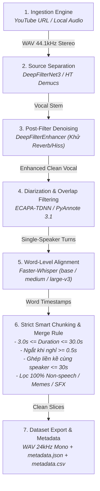

# 🎙️ SOTA Audio Processing & Dataset Preparation Pipeline

Pipeline tự động hóa hoàn chỉnh khép kín từ **Thu thập Audio (YouTube / File)** $\rightarrow$ **Tách Vocal & Khử nhiễu 2 tầng** $\rightarrow$ **Phân đoạn Người nói & Lọc đè tiếng** $\rightarrow$ **Gióng hàng Từ vựng (Word Alignment)** $\rightarrow$ **Gom phân đoạn Thông minh (Smart Chunking 3s-30s & Ghép cùng speaker)** $\rightarrow$ **Xuất Dataset chuẩn Studio (WAV 24kHz Mono + Metadata JSON/CSV)**.

Tối ưu hóa $100\%$ chạy mượt mà trên cả **Máy trạm Server (RTX 3090/4090)** lẫn **Laptop Dev cá nhân (NVIDIA GTX 1650 Ti 4GB VRAM / CPU AMD Ryzen & Intel)**.

---

## 🌟 Các Tính Năng & Ràng Buộc Kỹ Thuật Cốt Lõi

1. **Chuẩn hoá đầu vào (Ingestion):** Tải và chuẩn hoá đa nguồn sang WAV chuẩn PCM 16-bit 44.1kHz Stereo.
2. **Tách nguồn & Khử nhiễu 2 tầng (Double-Pass Denoising):**
   - **Tầng 1 (Separation):** `DeepFilterNet3` / `HT Demucs` / `Mel-Band RoFormer` triệt tiêu toàn bộ nhạc nền (BGM) và tạp âm.
   - **Tầng 2 (Speech Enhancement Post-Filter):** `DeepFilterEnhancer` loại bỏ hoàn toàn tiếng xì phòng (room hiss), tiếng vang và noise floor.
3. **Phân đoạn người nói & Lọc đè tiếng (Diarization & Overlap Pruning):**
   - `SpeechBrain ECAPA-TDNN` (Offline Clustering) hoặc `PyAnnote 3.1`.
   - Lọc bỏ hoàn toàn các đoạn nói đè (Cross-talk / Overlap) và gọt collar an toàn ở 2 đầu ranh giới chuyển lượt nói.
4. **Gióng hàng từ vựng & ASR (Word Alignment):**
   - `Faster-Whisper` (`base`, `medium`, `large-v3`) với Silero VAD.
   - Trích xuất timestamp chính xác đến từng mili-giây cho từng từ vựng.
5. **Smart Chunking & Quy Tắc Ghép Liền Kề:**
   - **Ràng buộc thời lượng:** $3.0\text{s} \le \text{Duration} \le 30.0\text{s}$.
   - **Bảo tồn ranh giới từ (Zero Word-Clipping):** Mọi điểm cắt đều nằm chính giữa khoảng lặng giữa 2 từ ($t_{cut} = \frac{w_i.end\_s + w_{i+1}.start\_s}{2.0}$) kèm $40\text{ms}$ đệm âm học và $10\text{ms}$ Smooth Raised-Cosine Fade.
   - **Đơn âm tuyệt đối:** Cắt nghiêm ngặt bên trong từng Turn của người nói, không trộn lẫn dòng thời gian của người khác.
   - **Ngưỡng ngắt nghỉ (`pause_threshold_s = 0.5s`):** Nếu người nói liên tục không nghỉ quá $0.5\text{s}$ thì giữ nguyên câu liền mạch, chỉ cắt khi có khoảng lặng $\ge 0.5\text{s}$ hoặc khi chuyển người nói.
   - **Ghép câu cùng người nói:** Tự động ghép 2 phân đoạn liên tiếp của cùng 1 người nếu tổng thời lượng $\le 30.0\text{s}$.
   - **Lọc sạch Non-Speech:** Loại bỏ $100\%$ các đoạn meme, sound effects, tiếng cười vô nghĩa, tiếng trẻ con ê a hoặc khoảng lặng mở đầu/kết thúc.
6. **Xuất bản Dataset:** WAV 24kHz/16kHz Mono PCM 16-bit + `metadata.json` (word timestamps) + `metadata.csv` (segment_id | speaker_id | duration | text | path).

---

## 🏗️ Kiến Trúc Luồng Xử Lý (End-to-End Workflow)



---

## 💻 Cài Đặt & Khởi Chạy Nhanh

### 1. Cài đặt Môi trường (Khuyến nghị Python 3.11 & uv)

```bash
# Tạo môi trường ảo với Python 3.11
uv venv --python 3.11
source .venv/bin/activate

# Cài đặt toàn bộ dependencies
uv pip install -e .
uv pip install faster-whisper deepfilternet speechbrain soundfile
```

### 2. Chạy Pipeline Khép Kín Bằng Python

```python
import asyncio
from src.pipeline import AudioPipeline, PipelineConfig

async def main():
    config = PipelineConfig(
        device="cuda",                      # 'cuda' hoặc 'cpu'
        separation_model="deepfilternet",    # 'deepfilternet' (nhẹ, nhanh) hoặc 'htdemucs'
        diarization_engine="offline_clustering", # 'offline_clustering' (ECAPA-TDNN)
        num_speakers=2,                     # Hoặc None để auto-detect
        whisper_model_size="base",          # 'base', 'medium', 'large-v3'
        whisper_language="vi",              # 'vi' (Tiếng Việt) hoặc 'en'
        min_segment_duration_s=3.0,
        max_segment_duration_s=30.0,
        pause_threshold_s=0.5,              # Không cắt nếu im lặng < 0.5s
        max_merge_gap_s=1.5,
        target_sample_rate=24000,           # 24kHz chuẩn SOTA Voice Cloning
        output_mono=True
    )
    
    pipeline = AudioPipeline(config=config)
    result = await pipeline.run(
        input_source="https://www.youtube.com/watch?v=AwO0KHZOOlc",
        run_name="my_clean_dataset"
    )
    print(f"Hoàn tất! Xuất {result.total_segments_count} segments vào {result.output_dir}")

if __name__ == "__main__":
    asyncio.run(main())
```

### 3. Chạy Toàn Bộ Smoke Test & Tự Động Kiểm Định (Audit)

```bash
# Chạy Smoke Test trên 3 video thuần Tiếng Việt (< 10 phút/video)
python scripts/run_vietnamese_smoke_test.py

# Chạy công cụ tự động kiểm định âm học & độ tinh khiết đơn âm (SpeechBrain Auditor)
python scripts/audit_dataset_quality.py
```

### 4. Khởi Chạy Giao Diện Web Trực Quan

```bash
bash scripts/start_crawler.sh
```
Truy cập giao diện Web tại: **`http://localhost:8567`**

---

## 📂 Cấu Trúc Thư Mục Dự Án

```
.
├── audio_crawl/                          # Kho lưu trữ audio gốc tải từ YouTube
├── pipeline_outputs/                     # Kết quả phân đoạn dataset sạch
│   └── <run_name>/
│       ├── pipeline_summary.json         # Tóm tắt thông số toàn pipeline
│       ├── metadata.csv                  # Danh mục nhãn (segment_id|speaker_id|duration|text|path)
│       ├── metadata.json                 # Chi tiết timestamps từng từ
│       └── segments/                     # File audio phân đoạn WAV 24kHz Mono
│           ├── seg_0001_SPEAKER_00.wav
│           └── ...
│
├── scripts/
│   ├── run_full_pipeline_test.py         # Script chạy test 1 video mẫu
│   ├── run_vietnamese_smoke_test.py      # Script chạy batch test 3 video tiếng Việt
│   ├── audit_dataset_quality.py          # Script tự động audit chất lượng âm học & đơn âm
│   └── start_crawler.sh                  # Khởi động Web Server FastAPI
│
├── src/
│   ├── pipeline.py                       # 🚀 Master Pipeline Orchestrator (7 Giai đoạn)
│   ├── crawler/                          # 📥 Module Crawl Audio từ YouTube (yt-dlp)
│   ├── separation/                       # 🎚️ Module Tách Nguồn (DeepFilterNet3 / Demucs)
│   ├── denoise/                          # 🧹 Module Khử Nhiễu Âm Học (DeepFilterEnhancer)
│   ├── diarization/                      # 👥 Module Phân Đoạn Người Nói (ECAPA-TDNN / PyAnnote)
│   ├── alignment/                        # ⏱️ Module Gióng Hàng Từ Vựng (Faster-Whisper)
│   ├── chunking/                         # ✂️ Module Gom Đoạn Thông Minh (SmartChunker)
│   ├── web/                              # 🌐 Giao diện Web UI & FastAPI Endpoints
│   └── utils/                            # 🛠️ Dataclass Audio & Tiện ích chung
│
├── pyproject.toml
└── README.md
```

---

## 📊 Bảng Đánh Giá Hiệu Năng Trên Laptop Cá Nhân (GTX 1650 Ti 4GB)

| Tác vụ | Mô hình sử dụng | VRAM tiêu thụ | Tốc độ xử lý video 10 phút |
| :--- | :--- | :---: | :---: |
| **Tách Vocal & Khử Nhạc** | DeepFilterNet3 | $\approx 100\text{ MB}$ | $\approx 8\text{s}$ ($0.015\times$ Real-time) |
| **Phân đoạn Người nói** | SpeechBrain ECAPA-TDNN | $\approx 300\text{ MB}$ | $\approx 6\text{s}$ ($0.010\times$ Real-time) |
| **Gióng hàng Từ vựng** | Faster-Whisper Base | $\approx 250\text{ MB}$ | $\approx 15\text{s}$ ($0.025\times$ Real-time) |
| **Smart Chunking & Export** | NumPy + SoundFile | $\approx 20\text{ MB}$ | $\approx 2\text{s}$ |
| **TOÀN BỘ PIPELINE** | **End-to-End khép kín** | **$< 1.5\text{ GB}$** | **$\approx 60\text{s} - 90\text{s}$ cho 10 phút** |
