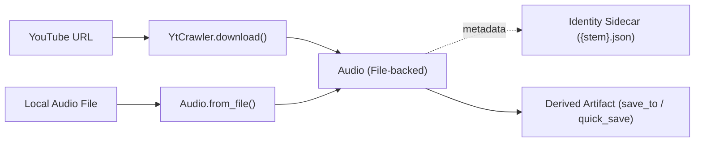

# 01. Audio Representation & Ingestion

[← Docs Index](README.md) | [Next: 02. Source Separation →](02_source_separation.md)

---

This module documents the core **`Audio`** abstraction, shared audio utility functions, and the **`YtCrawler`** ingestion engine.



---

## 1. The `Audio` Dataclass

**Defined in:** [`src/utils/AudioClass.py`](file:///home/nguyenlt/Documents/tts-data-pipeline/audio-prepare-pipeline-redo/src/utils/AudioClass.py)

`Audio` is a file-backed identity container. In-memory waveforms are never passed across public pipeline interfaces. Identity is anchored to a concrete path on disk accompanied by metadata and step history.

### Field Contract

| Field | Type | Description |
|---|---|---|
| `path` | `Path` | Absolute or relative path to the current audio artifact on disk. |
| `source_id` | `str` | Video/source identity. For YouTube videos, this remains the stable 11-character video ID across all downstream transformations. |
| `title` | `str \| None` | Human-readable title of the file or video. |
| `source_url` | `str \| None` | Original source URL (e.g. `https://www.youtube.com/watch?v=...`). |
| `channel_id` | `str \| None` | YouTube channel ID (e.g. `UC...`). |
| `channel_name` | `str \| None` | Human-readable YouTube channel or uploader name. |
| `channel_url` | `str \| None` | Canonical YouTube channel URL. |
| `sample_rate` | `int \| None` | Sampling rate (Hz) of the current file on disk. |
| `native_sample_rate` | `int \| None` | Original sampling rate captured at source prior to normalization/resampling. |
| `duration_s` | `float \| None` | Duration of the audio file in seconds. |
| `channels` | `int \| None` | Number of audio channels (typically `1` for mono). |
| `format` | `str` | File extension/container format (default `"wav"`). |
| `history` | `tuple[str, ...]` | Immutable sequence of transformation step tags (e.g. `("yt_download", "demucs_vocals", "cut_001")`). |

### Identity Sidecar (`{stem}.json`)

Whenever `save_to()`, `quick_save()`, or `write_sidecar()` is called, an identity sidecar JSON file is written directly adjacent to the audio file (`<filename_stem>.json`). This sidecar preserves metadata across sessions, server restarts, and data syncs. When `Audio.from_file()` loads an audio file, it automatically hydrates from this sidecar if present.

---

## 2. Public Methods of `Audio`

### `Audio.from_file(...) -> Audio`

```python
@classmethod
def from_file(
    cls,
    path: str | Path,
    *,
    source_id: str | None = None,
    title: str | None = None,
    source_url: str | None = None,
    channel_id: str | None = None,
    channel_name: str | None = None,
    channel_url: str | None = None,
    native_sample_rate: int | None = None,
    history: Sequence[str] | None = None,
) -> Audio:
```

Creates an `Audio` object for an existing audio file on disk.

- Resolves `path` to an absolute path.
- Checks for `{stem}.json` next to the audio file; if found, restores `source_id`, `title`, `source_url`, channel metadata, `native_sample_rate`, and `history`. Explicit arguments override sidecar contents.
- Uses the file stem as fallback for `source_id` and `title` when no sidecar exists.
- Probes WAV files via `soundfile` for `sample_rate`, `duration_s`, and `channels` (probed values supersede sidecar snapshots).
- **Raises:** `FileNotFoundError` if `path` does not exist on disk.

### `Audio.metadata(*, target_sample_rate: int | None = None) -> dict`

Returns a JSON-serializable dictionary containing all `Audio` fields (with `path` as a string and `history` as a list). When `target_sample_rate` is specified, includes `resample_action` (`"upscale"`, `"downscale"`, or `"keep"`).

### `Audio.resample_action(target_sample_rate: int) -> "upscale" | "downscale" | "keep"`

Compares the current file `sample_rate` against a target model's expected rate to inform callers if resampling is necessary:
- Returns `"upscale"` if `target_sample_rate > sample_rate`.
- Returns `"downscale"` if `target_sample_rate < sample_rate`.
- Returns `"keep"` if `target_sample_rate == sample_rate`.

> [!NOTE]
> This comparison uses the current file rate (`sample_rate`), not `native_sample_rate`.

### `Audio.add_step(step_tag: str) -> Audio`

Returns a **new** `Audio` instance with the sanitized `step_tag` appended to `history`. The original `Audio` instance remains unchanged.

### `Audio.fingerprint -> str`

Computes a compact, human-readable fingerprint summarizing the audio's lineage:
```text
<source_id>__<history_steps>__<duration_s>s_<sample_rate>hz_<channels>ch
```

### `Audio.save_to(dest: str | Path) -> Audio`

Copies the underlying audio file to `dest` and mutates `self.path` to point to the new location. Destinations without a suffix default to `.wav`. Creates parent directories as needed and writes `{stem}.json` sidecar.
- **Returns:** The **same** mutated `Audio` instance.
- **Raises:** `FileNotFoundError` if the current file does not exist.

### `Audio.quick_save(...) -> Audio`

```python
def quick_save(
    self,
    output_dir: str | Path | None = None,
    *,
    name: str | None = None,
    prefix: str | None = None,
    suffix: str | None = None,
    tag: str | None = None,
) -> Audio:
```

Saves the audio file to `<project_root>/.data/quick_save/` (or a custom `output_dir`) with an automatically generated filename based on `self.fingerprint`. Writes sidecar metadata and logs the target path to stdout.

### `Audio.write_sidecar() -> Audio`

Writes or updates the `{stem}.json` sidecar next to `self.path` without copying or modifying the audio file. Returns `self`.

### `Audio.notebook_display(dest: str | Path | None = None) -> None`

Interactive display helper for Jupyter/IPython notebooks. Optionally copies to `dest` first, then renders an interactive HTML5 audio player widget. Returns `None` to prevent duplicate Jupyter rendering. `Audio.display` is an alias.

### `Audio.show_mel_spectrogram(...) -> None`

Computes and plots a log-mel spectrogram using Librosa and Matplotlib. Automatically calls `plt.show()` and closes the figure. Returns `None`.

---

## 3. Audio Ingestion API (`YtCrawler`)

**Defined in:** [`src/yt_crawler/YtCrawlerClass.py`](file:///home/nguyenlt/Documents/tts-data-pipeline/audio-prepare-pipeline-redo/src/yt_crawler/YtCrawlerClass.py)

`YtCrawler` manages downloading audio from YouTube URLs using `yt-dlp` and normalizing the resulting file with `ffmpeg`.

### `YtCrawler.ingest(...) -> Audio`

```python
@classmethod
def ingest(
    cls,
    link: str,
    *,
    output_dir: str | Path | None = None,
    work_dir: str | Path | None = None,
    format: str = "wav",
    sample_rate: int | None = 44100,
    channels: int = 1,
    **kwargs: Any,
) -> Audio:
```

Convenience class method that instantiates `YtCrawler` and invokes `download()`.
- `link`: YouTube video URL.
- `sample_rate`: Target rate in Hz (default `44100`). Pass `sample_rate=None` to preserve source rate.
- `channels`: Output channel count (default `1` mono).
- `**kwargs`: Forwarded crawler options (e.g. cookies, proxy).

### `YtCrawler.download(url: str) -> Audio`

Executes the download process:
1. Creates an isolated temporary session workspace under `.data/yt_crawler/work/`.
2. Executes `yt-dlp` with `--newline` to extract single-video metadata (`.info.json`).
3. Discovers the downloaded audio stream (ignoring video streams).
4. Records `native_sample_rate` from source metadata.
5. Normalizes the audio via `ffmpeg` to the requested channel count (default mono) and sample rate.
6. Saves the artifact under `.data/yt_crawler/downloads/<channel_id-or-name>/<sanitized_title>__<source_id>.<format>`.
7. Generates companion identity sidecar `<stem>.json`.
8. Reaps the temporary session workspace even if processing encounters an error.
9. Returns the normalized `Audio` instance.

**Raises:** `DownloadError` if `yt-dlp`, metadata parsing, audio stream selection, or `ffmpeg` fails.

### `parse_crawl_sample_rate(value, *, default=44100) -> int | None`

Parses user or API sample-rate choices:
- Accepts `"native"`, `0`, or empty/missing values → returns `None` (preserving source rate).
- Accepts positive Hz integer or string (e.g. `44100`, `"48000"`) → returns `int`.

### `YtCrawler.build_command(url: str, target_work_dir: Path) -> list[str]`

Constructs the exact `yt-dlp` CLI command tokens without executing. Configures system CA certificates, extraction arguments (`-ac N`), and progress reporting. `YtCrawler.cancel()` terminates an active download process group.

---

## 4. Shared Audio Utility Functions

**Defined in:** [`src/utils/audio_utils.py`](file:///home/nguyenlt/Documents/tts-data-pipeline/audio-prepare-pipeline-redo/src/utils/audio_utils.py)

Low-level audio utility routines supporting the pipeline:

| Function | Signature | Return | Description |
|---|---|---|---|
| `probe_wav` | `probe_wav(path: str \| Path)` | `tuple[int, float, int]` | Probes WAV headers for `(sample_rate, duration_s, channels)`. Fast header read without full decode. |
| `normalize_wav` | `normalize_wav(src, dest, *, sample_rate=None, channels=1)` | `None` | Converts/resamples audio using `ffmpeg` CLI. Raises `AudioConvertError` on failure. |

---

## 5. Storage Conventions & `.data/` Layout

Runtime audio files default to the `.data/` directory anchored at repository root:

```text
.data/
├── yt_crawler/
│   ├── downloads/       # Completed, normalized ingest files
│   └── work/            # Temporary session workdirs (cleaned up automatically)
├── separation/
│   ├── out/             # Separated stems (vocals, accompaniment)
│   └── work/            # Intermediate separation chunks
├── diarization/
│   ├── results/         # Canonical DiarizationResult JSON
│   ├── annotations/     # Ground-truth reference JSON
│   └── verifications/   # Purity verification reports
├── quick_save/          # Audio.quick_save() artifacts
└── pipeline/
    ├── dataset_registry.json
    └── imports/         # External files imported into portable pipeline registry
```
