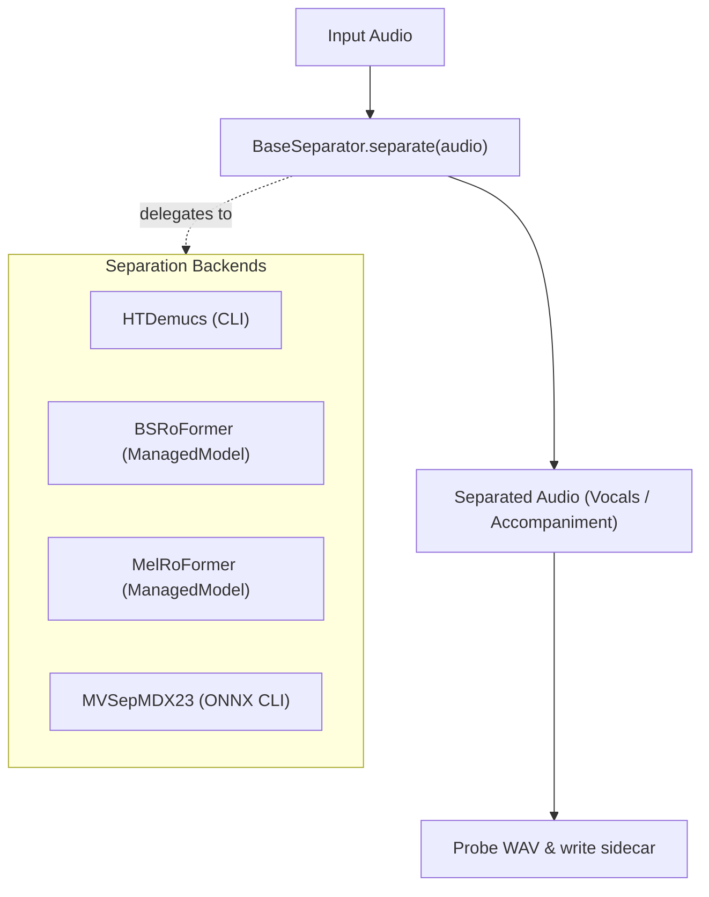

# 02. Source Separation & Managed Model Lifecycle

[← 01. Audio & Ingestion](01_audio_and_ingestion.md) | [Docs Index](README.md) | [Next: 03. Speaker Diarization →](03_speaker_diarization.md)

---

This module covers the source separation interfaces, supported stem-separation backends (Demucs, BS-RoFormer, Mel-RoFormer, MVSEP), and the shared **`ManagedModel`** lifecycle pattern.



---

## 1. The `BaseSeparator` Interface

**Defined in:** [`src/separation/BaseSeparator.py`](file:///home/nguyenlt/Documents/tts-data-pipeline/audio-prepare-pipeline-redo/src/separation/BaseSeparator.py)

Every source separator subclasses `BaseSeparator` and implements the single public entrypoint:

```python
def separate(self, audio: Audio) -> Audio:
```

### Common Contract & Invariants

1. **Path Validation:** Verifies that `audio.path` exists before starting inference.
2. **Identity Preservation:** Automatically copies `source_id`, `title`, and `native_sample_rate` from input to output.
3. **History Step Tracking:** Appends a sanitized transformation tag (e.g. `htdemucs_vocals`, `mvsep_kim_vocal`) to `audio.history`.
4. **Format Normalization:** Normalizes the output stem to the separator's target sample rate (default 44,100 Hz), mono channel layout, and PCM WAV container (`format="wav"`).
5. **Output Verification:** Probes the final WAV file on disk to guarantee valid duration and channel metadata.
6. **Error Granularity:** Raises backend-specific custom exceptions instead of generic `Exception`.

### Resource Teardown (`close()`)

```python
def close(self) -> None:
```

Default no-op teardown method. Backends override `close()` to clean up:
- `BSRoFormer` & `MelRoFormer`: Delegates to `self.unload()`.
- `HTDemucs`: Cancels and reaps any active Demucs process group.
- `MVSepMDX23`: Terminates active CLI subprocesses and cleans up scratch files.

---

## 2. Concrete Separation Backends

| Backend Class | Stem Options | Lifecycle Requirement | Compute Device | Notes |
|---|---|---|---|---|
| **`HTDemucs`** | `vocals`, `drums`, `bass`, `other` | No explicit `load()`. Subprocess CLI. | `auto`, `cuda`, `cpu` | Streams CLI stdout; supports `progress_callback` and `cancel()`. |
| **`BSRoFormer`** | `vocals`, `instrumental` | Requires `load()` or `with model:`. | `cuda`, `cpu`, `mps` | Sub-band RoFormer architecture for high-fidelity vocal isolation. |
| **`MelRoFormer`** | `vocals`, `instrumental` | Requires `load()` or `with model:`. | `cuda`, `cpu`, `mps` | Mel-band RoFormer architecture. |
| **`MVSepMDX23`** | `vocals`, `instrumental` | Standalone CLI runner with ONNX models. | `cuda:N`, `cpu` | Fast Kim ONNX default; supports full ensemble. Requires `onnxruntime-gpu`. |

---

### `HTDemucs`

**Defined in:** [`src/separation/HTDemucs.py`](file:///home/nguyenlt/Documents/tts-data-pipeline/audio-prepare-pipeline-redo/src/separation/HTDemucs.py)

Wraps the Facebook Demucs CLI:
- Exposes `progress_callback(message: str)` receiving live progress lines from Demucs.
- Translates tqdm percent lines to clean progress telemetry.
- `cancel()` terminates the active Demucs process group immediately.
- Raises `DemucsError` on failure.

---

### `BSRoFormer` & `MelRoFormer`

**Defined in:**
- [`src/separation/BSRoFormer.py`](file:///home/nguyenlt/Documents/tts-data-pipeline/audio-prepare-pipeline-redo/src/separation/BSRoFormer.py)
- [`src/separation/MelRoFormer.py`](file:///home/nguyenlt/Documents/tts-data-pipeline/audio-prepare-pipeline-redo/src/separation/MelRoFormer.py)

Neural stem separators implementing the `ManagedModel` contract:
- Pre-trained checkpoints are loaded on demand via `model.load()` or context manager `with model:`.
- Automatically moves model weights to the target GPU and clears VRAM on `unload()`.
- Supports FP16 inference on CUDA to optimize memory usage.
- Raises `BSRoFormerError` or `MelRoFormerError` if invoked prior to `load()` or if inference fails.

---

### `MVSepMDX23`

**Defined in:** [`src/separation/MVSepMDX23.py`](file:///home/nguyenlt/Documents/tts-data-pipeline/audio-prepare-pipeline-redo/src/separation/MVSepMDX23.py)

High-performance MDX23 vocal separator runner:
- **Defaults:** Configured with a resource-conscious single Kim ONNX model (`single_onnx=True`) and `0.25` overlap for high speed and low VRAM footprint.
- **Ensemble Mode:** High-quality vocal separation can be enabled by passing `single_onnx=False`, `overlap_large=0.6`, and `overlap_small=0.5`.
- **Chunked Processing:** Long audio files are split into bounded 10-minute WAV chunks (`max_segment_seconds=600`) to prevent OOM errors, with the separated stem concatenated afterward.
- **Progress Tracking:** The internal CLI prints `PROGRESS: N%` lines, allowing the web task queue to report smooth percentage updates.
- **Subprocess Isolation:** Device selection (e.g. `device="cuda:1"`) is isolated using `CUDA_VISIBLE_DEVICES` so child processes strictly execute on the specified physical GPU.
- Raises `MVSepMDX23Error` if `onnxruntime-gpu` is missing when CUDA is requested, or if the subprocess exits non-zero.

---

## 3. Managed Model Lifecycle API (`ManagedModel`)

**Defined in:** [`src/base/model.py`](file:///home/nguyenlt/Documents/tts-data-pipeline/audio-prepare-pipeline-redo/src/base/model.py)

Heavy neural models inherit `ManagedModel` to guarantee explicit, predictable memory management. Used by `BSRoFormer`, `MelRoFormer`, `PyannoteDiarizer`, `SortformerDiarizer`, `DiariZenDiarizer`, `ThreeDSpeakerDiarizer`, `ClusteringDiarizer`, and `SpeakerVerifier`.

### Properties & Methods

#### `is_loaded -> bool`
Read-only boolean property indicating whether model weights and accelerators are actively loaded in memory.

#### `load() -> None`
Executes subclass `_load()` once. Repeated calls while already loaded are no-ops.

#### `unload() -> None`
Releases neural weights and executes subclass `_unload()` once. Triggers `gc.collect()` and accelerator cache clearing (e.g. `torch.cuda.empty_cache()`). Repeated calls while unloaded are no-ops.

#### Context Manager Protocol
```python
with BSRoFormer(device="cuda:0") as separator:
    vocal_audio = separator.separate(raw_audio)
# Model is automatically unloaded, freeing VRAM immediately
```

- `__enter__()`: Invokes `self.load()` and returns `self`.
- `__exit__()`: Invokes `self.unload()`, even if an unhandled exception occurred during processing.

---

## 4. Usage Example

```python
from src.utils.AudioClass import Audio
from src.separation import MVSepMDX23, BSRoFormer

input_audio = Audio.from_file(".data/yt_crawler/downloads/sample.wav")

# Example A: High-speed separation with MVSepMDX23
separator = MVSepMDX23(device="cuda:0")
vocals = separator.separate(input_audio)
print("Vocals saved at:", vocals.path)
print("History:", vocals.history)

# Example B: Managed BSRoFormer with context manager
with BSRoFormer(device="cuda:0") as bs_sep:
    bs_vocals = bs_sep.separate(input_audio)
    bs_vocals.save_to(".data/separation/out/bs_vocals.wav")
```
