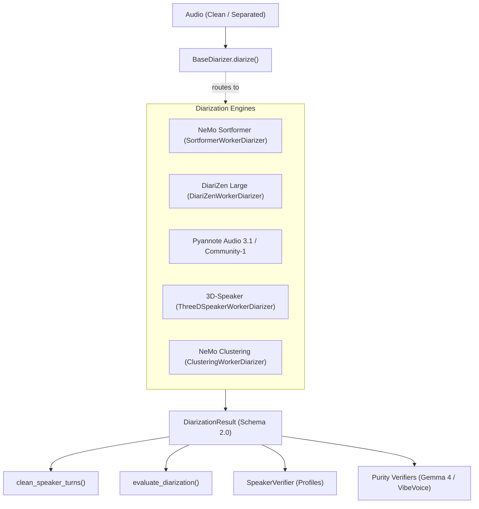

# 03. Speaker Diarization, Evaluation & Verification

[← 02. Source Separation](02_source_separation.md) | [Docs Index](README.md) | [Next: 04. Zero-Contamination Diarization →](04_zero_contamination_diarization.md)

---

This module documents the **`BaseDiarizer`** interface, the five concrete diarization engines and their isolated worker processes, turn cleanup utilities, evaluation metrics, global speaker profile enrollment, and LLM-based purity verifiers.



---

## 1. Core Diarizer Interface (`BaseDiarizer`)

**Defined in:** [`src/diarization/BaseDiarizer.py`](file:///home/nguyenlt/Documents/tts-data-pipeline/audio-prepare-pipeline-redo/src/diarization/BaseDiarizer.py)

Every diarization backend implements the single abstract method:

```python
def diarize(self, audio: Audio) -> DiarizationResult:
```

### Schema 2.0 Result Contract
All backends return canonical **`DiarizationResult`** schema 2.0:
- Contains `audio_id` (must equal `source_audio.source_id`), a `result_id` (`diar_<hex>`), a `created_at` Unix-epoch float, and a snapshot of the source `Audio` under `source_audio` (required for schema 2.x).
- Records normalized `Speaker` entries (`speaker_id="spk_00"`, `"spk_01"`, etc.) in a **list**, with `turns` as a chronological **list** of `SpeakerTurn` intervals (`start_s`, `end_s`, `speaker_id`, optional `confidence`, and `overlaps_other_speaker` auto-normalized in `__post_init__`).
- Preserves YouTube video and channel provenance from the input `Audio` (missing result-level channel fields are backfilled from `source_audio`; mismatches raise).
- Validates that turn timestamps are within `[0, audio.duration_s + 0.05]`.

---

## 2. Diarization Backends & Worker Architectures

To prevent severe library version collisions (e.g. NVIDIA NeMo pinning specific Lightning and Hugging Face Hub releases, or 3D-Speaker requiring ModelScope), backends are implemented in isolated virtual environments and invoked from the primary runtime via worker processes.

| Backend | Core Model / Checkpoint | License | Isolated Worker | Primary Capabilities |
|---|---|---|---|---|
| **`SortformerDiarizer`** | `nvidia/diar_sortformer_4spk-v1` | Apache 2.0 | `SortformerWorkerDiarizer` (`.venv-sortformer`) | Streaming transformer architecture, 4-speaker simultaneous output, genuine pre-inference enrollment anchoring. |
| **`DiariZenDiarizer`** | `BUT-FIT/diarizen-wavlm-large-s80-md-v2` | CC BY-NC 4.0 | `DiariZenWorkerDiarizer` (`.venv-diarizen`) | WavLM Large + WeSpeaker + VBx clustering. SOTA overlap detection. |
| **`PyannoteDiarizer`** | `pyannote/speaker-diarization-community-1` | MIT / Community | In-process (`.venv`) | Standard Pyannote pipeline. Supports speaker count bounds and Pyannote hooks. |
| **`ThreeDSpeakerDiarizer`** | FSMN VAD + CAM++ (`speech_campplus_sv_zh_en_16k-common_advanced`) | Apache 2.0 | `ThreeDSpeakerWorkerDiarizer` (`.venv-3dspeaker`) | ModelScope 3D-Speaker audio-only pipeline; optional pyannote overlap refinement. |
| **`ClusteringDiarizer`** | MarbleNet VAD + TitaNet Large | Apache 2.0 | `ClusteringWorkerDiarizer` (`.venv-sortformer`) | Cascaded NeMo VAD, multi-scale speaker embedding, and spectral clustering. |

---

### `SortformerDiarizer` & `SortformerWorkerDiarizer`

**Defined in:**
- [`src/diarization/SortformerDiarizer.py`](file:///home/nguyenlt/Documents/tts-data-pipeline/audio-prepare-pipeline-redo/src/diarization/SortformerDiarizer.py)
- [`src/diarization/SortformerWorkerDiarizer.py`](file:///home/nguyenlt/Documents/tts-data-pipeline/audio-prepare-pipeline-redo/src/diarization/SortformerWorkerDiarizer.py)

NVIDIA NeMo Sortformer model:
- **Input Normalization:** Automatically resamples and downmixes input audio to mono 16 kHz WAV (raises if normalization does not yield mono).
- **Windowed Inference:** Processes up to 6 minutes per window (`window_duration_s=360.0`) with a 1-minute overlap (`overlap_duration_s=60.0`) between adjacent windows. Automatic fallback to 3-minute windows (`oom_retry_window_s=180.0`) if GPU OOM occurs.
- **Hysteresis Post-Processing:** Configurable `onset=0.74`, `offset=0.64`, `pad_onset_s=0.12`, `pad_offset_s=0.20`.
- **Pre-Inference Enrollment:** `diarize()` (not the constructor) accepts `enrollment_name` and `enrollment_clips`. Embeds clean reference clips with TitaNet before target inference; seeds global speaker 0 during window stitching.
- **Worker Isolation:** `SortformerWorkerDiarizer` launches `.venv-sortformer/bin/python -m src.diarization.sortformer_worker` to keep NeMo out of the web server runtime. Supports `cancel()`.

---

### `DiariZenDiarizer` & `DiariZenWorkerDiarizer`

**Defined in:**
- [`src/diarization/DiariZenDiarizer.py`](file:///home/nguyenlt/Documents/tts-data-pipeline/audio-prepare-pipeline-redo/src/diarization/DiariZenDiarizer.py)
- [`src/diarization/DiariZenWorkerDiarizer.py`](file:///home/nguyenlt/Documents/tts-data-pipeline/audio-prepare-pipeline-redo/src/diarization/DiariZenWorkerDiarizer.py)

DiariZen overlap-aware diarization system:
- Utilizes WavLM Large representation with WeSpeaker embeddings and VBx clustering.
- Preserves concurrent turns during multi-speaker overlapping segments.
- Clamps timestamps to `audio.duration_s` to eliminate boundary overshoot errors.
- `DiariZenWorkerDiarizer` runs `.venv-diarizen/bin/python -m src.diarization.diarizen_worker`, isolating GPU assignments via `CUDA_VISIBLE_DEVICES`.

---

### `PyannoteDiarizer`

**Defined in:** [`src/diarization/PyannoteDiarizer.py`](file:///home/nguyenlt/Documents/tts-data-pipeline/audio-prepare-pipeline-redo/src/diarization/PyannoteDiarizer.py)

Hugging Face Pyannote Audio pipeline (`pyannote/speaker-diarization-community-1`):
- Decodes with `soundfile` (`float32`, `always_2d=True`); raises `ValueError` on empty audio; requires `load()` first.
- `diarize()` (not just the constructor) accepts per-call `num_speakers`, `min_speakers`, `max_speakers`, and a progress `hook`.
- Automatically handles both Pyannote 3.1 `Annotation` objects and Pyannote 3.3/4.0 `output.speaker_diarization`.

---

### `ThreeDSpeakerDiarizer` & `ThreeDSpeakerWorkerDiarizer`

**Defined in:**
- [`src/diarization/ThreeDSpeakerDiarizer.py`](file:///home/nguyenlt/Documents/tts-data-pipeline/audio-prepare-pipeline-redo/src/diarization/ThreeDSpeakerDiarizer.py)
- [`src/diarization/ThreeDSpeakerWorkerDiarizer.py`](file:///home/nguyenlt/Documents/tts-data-pipeline/audio-prepare-pipeline-redo/src/diarization/ThreeDSpeakerWorkerDiarizer.py)

ModelScope 3D-Speaker pipeline:
- Shallow-clones the 3D-Speaker repo into `.data/3d-speaker` on initial load.
- Executes FSMN VAD + CAM++ embeddings + spectral clustering.
- Optional Pyannote `segmentation-3.0` overlap refinement (`include_overlap=True`).

---

### `ClusteringDiarizer` & `ClusteringWorkerDiarizer`

**Defined in:**
- [`src/diarization/ClusteringDiarizer.py`](file:///home/nguyenlt/Documents/tts-data-pipeline/audio-prepare-pipeline-redo/src/diarization/ClusteringDiarizer.py)
- [`src/diarization/ClusteringWorkerDiarizer.py`](file:///home/nguyenlt/Documents/tts-data-pipeline/audio-prepare-pipeline-redo/src/diarization/ClusteringWorkerDiarizer.py)

Cascaded NeMo clustering pipeline:
- Combines `vad_multilingual_marblenet` for voice activity with `titanet_large` speaker embeddings.
- Formats dynamic single-file manifests and parses generated RTTM output.
- **Key Parameters:**
  - `vad_onset` (`0.50`, range `[0.0, 1.0]`): Probability to detect speech start. Increasing (+) filters room noise/breath; decreasing (-) captures faint speech/whispering.
  - `vad_offset` (`0.30`, range `[0.0, 1.0]`): Probability to close speech segment. Increasing (+) closes turns faster; decreasing (-) keeps turns open through unvoiced codas.
  - `vad_pad_onset_s` (`0.20s`) & `vad_pad_offset_s` (`0.20s`): Inward/outward boundary cushions preserving pre-voicing consonants and vocal reverb tails.
  - `vad_min_duration_on_s` (`0.50s`): Shorter speech bursts are purged to eliminate transient clicks.
  - `vad_min_duration_off_s` (`0.50s`): Shorter pauses between words are bridged into continuous segments for stable TitaNet embeddings.
  - `max_num_speakers` (`8`, range `[1, 32]`): Constrains upper bound of spectral clustering eigenvalues.

---

## 3. Turn Cleanup & Padding Utilities

**Defined in:** [`src/diarization/turn_cleanup.py`](file:///home/nguyenlt/Documents/tts-data-pipeline/audio-prepare-pipeline-redo/src/diarization/turn_cleanup.py)

### `clean_speaker_turns(...) -> list[SpeakerTurn]`

```python
def clean_speaker_turns(
    turns: Sequence[SpeakerTurn],
    *,
    min_turn_duration_s: float = 0.5,
    merge_same_speaker_gap_s: float = 1.0,
    boundary_collar_s: float = 0.04,
    jitter_max_duration_s: float = 3.0,
) -> list[SpeakerTurn]:
```

Generates a derived, cleaned view of turns without mutating canonical raw results:
1. **Jitter Removal:** Resolves rapid non-overlapping `A-B-A` speaker switching under `jitter_max_duration_s`.
2. **Boundary Trimming:** Shaves `boundary_collar_s` (40 ms) from each side of adjacent different-speaker transitions.
3. **Gap Merging:** Merges consecutive turns of the same speaker separated by less than `merge_same_speaker_gap_s`.
4. **Short Turn Dropping:** Drops residual turns shorter than `min_turn_duration_s`.

### `pad_and_merge_intervals(...) -> list[tuple[float, float]]`

Expands turn intervals by `pre_roll_s` and `post_roll_s` (e.g. for audio extraction), clamps them to audio bounds, and halts expansion at `blocker_intervals` (neighboring other-speaker turns) to prevent cross-speaker audio contamination.

---

## 4. Diarization Evaluation (`evaluate_diarization`)

**Defined in:** [`src/diarization/evaluation.py`](file:///home/nguyenlt/Documents/tts-data-pipeline/audio-prepare-pipeline-redo/src/diarization/evaluation.py)

```python
def evaluate_diarization(
    reference_turns: Sequence[SpeakerTurn],
    hypothesis_turns: Sequence[SpeakerTurn],
    *,
    duration_s: float,
    collar_s: float = 0.0,
    skip_overlap: bool = False,
) -> dict[str, Any]:
```

Calculates exact interval-based Diarization Error Rate (DER) and Jaccard Error Rate (JER) without time bin discretization:
- Maps hypothesis speakers to reference speakers using the **Hungarian bipartite matching algorithm** (`_maximum_weight_assignment`).
- Reports DER, JER, missed speech duration/percentage, false alarm duration/percentage, speaker confusion duration/percentage, and per-speaker recall/coverage.
- **Evaluation Parameters:**
  - `collar_s` (`float`, range `[0.0, 1.0s]`, default `0.0s`): Symmetrical exclusion collar $[t - \text{collar}, t + \text{collar}]$ around reference turn boundaries. Increasing (+) collar (e.g. NIST standard `0.25s`) forgives human annotator timing variance and onset/offset inaccuracies, significantly lowering reported DER. Decreasing (-) collar to `0.0s` evaluates strict boundary precision required for clean audio segment extraction.
  - `skip_overlap` (`bool`, default `False`): When `True`, ignores reference intervals with concurrent multi-speaker speech. When `False`, penalizes systems for failing to detect cross-talk.

---

## 5. Speaker Profile Enrollment & Verification (`SpeakerVerifier`)

**Defined in:** [`src/diarization/SpeakerVerifier.py`](file:///home/nguyenlt/Documents/tts-data-pipeline/audio-prepare-pipeline-redo/src/diarization/SpeakerVerifier.py)

Manages persistent speaker identity profiles and embedding verification:
- **Enrollment:** `enroll(name, clips, *, overwrite=False, channel_id=None, channel_name=None, channel_url=None)` copies clips to `.data/speaker_profiles/<name>/clips/clip_<NN>.<ext>` with a `profile.json` manifest (`schema_version="2.0"`, keys: `name`, `created_at`, `updated_at`, `clips`, channel provenance). Reference clips are the ground truth; embeddings are computed on demand. Raises `SpeakerVerifierError` when clips are empty or the profile exists without `overwrite=True`.
- **Profile Lifecycle:** `load_profile()`, `list_profiles()`, `delete_profile()`, `add_clips()`, `remove_clip()`.
- **Embedding Extraction:** `extract_embedding(audio, start_s, end_s)` computes L2-normalized 1D embeddings using `pyannote/wespeaker-voxceleb-resnet34-LM`. Turns shorter than `MIN_EMBEDDING_DURATION_S` (0.15 s) score `-1.0` (never selected).
- **Scoring & Filtering:**
  - `score(audio, result, profile) -> TargetSpeakerResult`: Computes cosine similarity of all turns against the enrolled profile centroid. Requires `load()`/`with`. Returns schema `"1.0"` with per-turn `ScoredSegment`s.
  - `filter(scored, *, threshold, min_duration_s=1.5, exclude_overlap=True) -> TargetSpeakerResult`: Pure post-processing filter yielding qualified target-speaker turns (note: `threshold` is keyword-only and required).
  - `verify_purity(source, profile, *, candidates=None, similarity_threshold, min_candidate_duration_s=1.5, max_overlap_duration_s=0.05, window_duration_s=2.0, window_hop_s=0.75)`: Sliding-window purity analysis (`similarity_threshold` is required). `source` is a `DiarizationResult` (turns = candidates, result = overlap authority) or a whole-file `Audio` (no overlap authority). Unembeddable candidates return `decision="error"` (never pass).

---

## 6. Direct-Audio & LLM Purity Verifiers

**Defined in:**
- [`src/diarization/OverlapVerifier.py`](file:///home/nguyenlt/Documents/tts-data-pipeline/audio-prepare-pipeline-redo/src/diarization/OverlapVerifier.py)
- [`src/diarization/VibeVoicePurityVerifier.py`](file:///home/nguyenlt/Documents/tts-data-pipeline/audio-prepare-pipeline-redo/src/diarization/VibeVoicePurityVerifier.py)

In addition to acoustic embeddings, the pipeline provides direct-audio foundation model verifiers to ensure candidates contain zero overlapping speech:

### `OverlapVerifier` (Gemma 4 & Gemini)
Sends candidate audio directly to multimodal foundation models. Both verifiers return the `OverlapVerificationResult` TypedDict (`{"overlap": bool, "reason": str}`) via `verify(audio)`:
- **`Gemma4OverlapVerifier`:** Queries an OpenAI-compatible Unsloth Studio endpoint. Endpoint resolves as explicit arg → `UNSLOTH_ENDPOINT` → `http://<UNSLOTH_HOST=localhost>:<UNSLOTH_PORT=8888>/v1/chat/completions`; model resolves as arg → `UNSLOTH_MODEL` → `unsloth/gemma-4-12b-it-GGUF`. `check_ready()` probes `/v1/models`; default prompt asks whether two or more speakers overlap at the same time.
- **`GeminiOverlapVerifier`:** Sends audio directly to Google Gemini (default `gemini-3.1-pro-preview` via `GEMINI_MODEL`; flash-lite `gemini-3.1-flash-lite` also supported) via structured JSON output. Requires `GEMINI_API_KEY`.

### `VibeVoicePurityVerifier`
Uses Microsoft VibeVoice-ASR (default checkpoint `microsoft/VibeVoice-ASR-HF`; verified quantized choices include INT8/NF4; the zero-contamination default is `Dubedo/VibeVoice-ASR-HF-INT8`):
- Analyzes candidate audio with autoregressive speaker tokens across the full clip context (`verify(audio)` / `verify_batch(audios)`; quantized checkpoints require CUDA).
- Classifies turns (`classify_vibevoice_segments`):
  - Exactly 1 speaker → `pass` (`single_speaker`).
  - Secondary speaker duration `>= min_secondary_speech_s` (default 0.25s) → `reject` (`multiple_speakers`).
  - Empty output (no segments/speaker labels) or sub-threshold secondary speech → `uncertain` (`empty_output` / `no_speaker_labels` / tiny-secondary).
- `VibeVoicePurityWorkerVerifier` runs in `.venv-vibevoice` to isolate dependencies.
