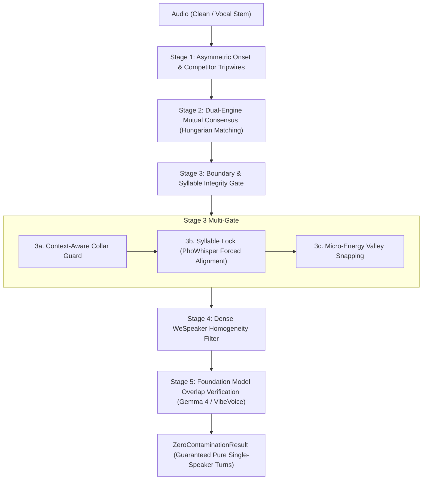

# 04. Zero-Contamination Diarization Pipeline

[← 03. Speaker Diarization](03_speaker_diarization.md) | [Docs Index](README.md) | [Next: 05. Benchmark & Mixing →](05_benchmark_and_mixing.md)

---

This module documents the **Zero-Contamination Diarization Pipeline** ([`src/diarization/zero_contamination.py`](file:///home/nguyenlt/Documents/tts-data-pipeline/audio-prepare-pipeline-redo/src/diarization/zero_contamination.py)).



---

## 1. Objective & Philosophy

Traditional diarization optimizes for **Diarization Error Rate (DER)**, balancing missed speech (false negatives) against false alarms and speaker confusion.

In contrast, **zero-contamination diarization** is designed specifically for **clean TTS voice dataset harvesting**:
- **Missed speech carries zero penalty:** It is completely acceptable to discard 40–60% of an audio track if the discarded portions contain ambiguous, noisy, or borderline speech.
- **Multi-speaker contamination is fatal:** Even 50 ms of a secondary speaker's voice in a training clip can contaminate acoustic tokenizers and voice cloning models.
- **Chopped syllable boundaries are unacceptable:** Truncating Vietnamese tonal contours or syllable codas ($-p, -t, -k, -m, -n, -ng$) ruins speech synthesis naturalness.

---

## 2. The 5-Stage Attrition Funnel

### Stage 1: Asymmetric Detection & Competitor Tripwires
Runs the primary diarizer (e.g. `Sortformer`, `DiariZen`, or `Pyannote 3.1`) with asymmetric thresholds:
- **`target_onset` (default `0.80`):** Requires high model confidence before acknowledging target speech onset.
- **`competitor_onset` (default `0.20`):** Extremely sensitive tripwire threshold. If any competing speaker is detected above 20% activation, the candidate segment is immediately vetoed.

### Stage 2: Dual-Engine Mutual Consensus
When `enable_consensus=True`, an orthogonal secondary diarization engine (e.g. DiariZen or Pyannote) processes the audio concurrently on `secondary_device` (e.g. `cuda:1`).
- Uses the **Hungarian maximum-weight bipartite matching algorithm** to establish optimal 1-to-1 speaker correspondence.
- Keeps an interval **if and only if both engines unanimously agree** on speaker identity and neither detects concurrent speech.
- Eliminates single-model hallucinations and boundary drift.

### Stage 3: Boundary & Syllable Integrity Gate
Guarantees clean turn transitions without truncating words:
1. **Context-Aware Collar Guard (`enable_context_collar`):**
   - If another speaker speaks within `handoff_risk_distance_s` (default 0.80s), an inward safety collar is shaved.
   - If the turn transitions into natural silence, inward shaving is suspended and a gentle `silence_tail_buffer_s` (default +0.15s) is granted to preserve delicate syllable codas and trailing phonemes.
2. **Forced Alignment Syllable Lock (`enable_syllable_alignment`):**
   - Utilizes `whisper_timestamped` with fine-tuned checkpoints such as `vinai/PhoWhisper-small` (or PyTorch MMS-FA / remote Whisper endpoints).
   - Snaps candidate boundaries outward to word/syllable bounds, preventing slicing through active syllables.
   - Automatically pre-configures PyTorch Hub non-interactively to trust Silero VAD (`snakers4/silero-vad`), with graceful fallback to `vad=False` if network/download hurdles occur.
   - Transparently recovers from CUDA OOM errors by clearing VRAM cache and retrying on CPU.
3. **Micro-Acoustic Energy Valley Snapping (`enable_energy_snapping`):**
   - Analyzes waveform energy in a `±energy_search_window_s` (default ±150ms) window with 2ms hop.
   - Snaps the boundary timestamp to the nearest vocal cord closure valley (zero-crossing/energy trough) below `energy_valley_floor_db` (default -30 dB).

### Stage 4: Dense Sliding WeSpeaker Homogeneity Filter
When `enable_homogeneity=True`, slides short sub-windows (`homogeneity_window_s=1.0s`, `hop_s=0.25s`) across each candidate turn using `pyannote/wespeaker-voxceleb-resnet34-LM`.
- Computes cosine similarity between each sub-window and the global turn centroid.
- Drops any turn where similarity dips below `min_homogeneity_similarity` (default `0.75`), catching subtle unsegmented speaker handoffs.

### Stage 5: In-Loop Foundation Model Verification
Candidate turns passing acoustic gates are verified by multimodal foundation models:
- **Microsoft VibeVoice-ASR:** Detects secondary speech duration across full clip context. Drops turns if secondary speech exceeds `max_secondary_speech_s` (default `0.0s`).
- **Gemma 4 Direct Audio:** Sends candidate audio directly to Gemma 4 via OpenAI-compatible endpoint. Drops turns if simultaneous speakers are audible.

---

## 3. Public API

### `run_zero_contamination_pipeline(...) -> ZeroContaminationResult`

```python
def run_zero_contamination_pipeline(
    audio: Audio,
    config: ZeroContaminationConfig,
    progress_callback: Callable[[str, float], None] | None = None,
) -> ZeroContaminationResult:
```

Executes the complete multi-stage pipeline, streaming monotonic progress updates and returning an audit-backed `ZeroContaminationResult`.

### Modular Building Blocks

The pipeline exposes standalone helper functions for custom composition:

```python
# Stage 2: Dual-engine Hungarian consensus
compute_consensus_turns(primary_turns, secondary_turns, audio_duration_s) -> tuple[list[SpeakerTurn], dict[str, str]]

# Stage 3a: Context-aware collar guard
apply_context_aware_collar(turns, collar_s=0.35, handoff_risk_s=0.80, silence_tail_s=0.15, ...) -> tuple[list[SpeakerTurn], list[dict]]

# Stage 3b: Syllable forced alignment
align_and_lock_syllable_boundaries(audio, turns, aligner_engine="whisper_timestamped", aligner_model="vinai/PhoWhisper-small", ...) -> tuple[list[SpeakerTurn], list[dict]]

# Stage 3c: Acoustic energy valley snapping
snap_boundaries_to_acoustic_valleys(audio, turns, search_window_s=0.15, energy_floor_db=-30.0, ...) -> tuple[list[SpeakerTurn], list[dict]]

# Stage 4: WeSpeaker sliding window homogeneity
filter_by_embedding_homogeneity(audio, turns, window_s=1.0, hop_s=0.25, min_similarity=0.75, ...) -> tuple[list[SpeakerTurn], list[tuple]]

# Stage 5: Foundation model verification
filter_by_foundation_models(audio, turns, config, progress_callback=None) -> tuple[list[SpeakerTurn], list[tuple]]
```

---

## 4. Configuration Schema (`ZeroContaminationConfig`)

```python
@dataclass
class ZeroContaminationConfig:
    # Stage 1: Primary Diarizer
    primary_backend: str = "sortformer"      # "sortformer", "diarizen", "pyannote"
    primary_device: str | None = None        # "cuda:0", "cpu", etc.
    target_onset: float = 0.80
    target_offset: float = 0.65
    competitor_onset: float = 0.20

    # Stage 2: Dual-Engine Consensus
    enable_consensus: bool = True
    secondary_backend: str = "diarizen"      # "diarizen", "sortformer", "pyannote"
    secondary_device: str | None = None      # "cuda:1", etc.

    # Stage 3a: Context-Aware Collar
    enable_context_collar: bool = True
    boundary_collar_s: float = 0.35
    handoff_risk_distance_s: float = 0.80
    silence_tail_buffer_s: float = 0.15
    min_turn_duration_s: float = 0.80
    transition_exclusion_s: float = 0.50

    # Stage 3b: Syllable Forced Alignment Lock
    enable_syllable_alignment: bool = True
    aligner_engine: str = "whisper_timestamped" # "whisper_timestamped", "mms_fa", "remote_whisper"
    aligner_model: str = "vinai/PhoWhisper-small"
    aligner_language: str = "vi"
    aligner_endpoint: str | None = None
    aligner_device: str = "cpu"

    # Stage 3c: Energy Valley Snapping
    enable_energy_snapping: bool = True
    energy_search_window_s: float = 0.15
    energy_valley_floor_db: float = -30.0

    # Stage 4: WeSpeaker Homogeneity
    enable_homogeneity: bool = True
    homogeneity_device: str | None = None
    homogeneity_window_s: float = 1.00
    homogeneity_hop_s: float = 0.25
    min_homogeneity_similarity: float = 0.75

    # Stage 5: Foundation Models
    enable_gemma: bool = False
    gemma_endpoint: str = "http://localhost:8888/v1/chat/completions"
    gemma_model: str = "unsloth/gemma-4-12b-it-GGUF"
    gemma_api_key: str | None = None
    gemma_timeout_s: float = 30.0

    enable_vibevoice: bool = False
    vibevoice_device: str | None = "cuda:1"
    vibevoice_endpoint: str | None = None
    max_secondary_speech_s: float = 0.0
```

---

## 5. Result Schema (`ZeroContaminationResult`)

`ZeroContaminationResult` encapsulates outputs and complete audit traceability:

| Field | Type | Description |
|---|---|---|
| `diarization` | `DiarizationResult` | Canonical schema 2.0 diarization containing verified single-speaker turns. Directly compatible with Turns Inspector, stem extraction, and RTTM export. |
| `audit_records` | `list[TurnAuditRecord]` | Detailed step-by-step audit records for every turn, tracking original timestamps, trimmed timestamps, survival/rejection reason, rescued codas, transcripts, WeSpeaker similarity scores, and foundation model decisions. |
| `funnel_stats` | `dict` | Step-by-step attrition metrics (turn counts and retained duration) across Primary, Consensus, Collar Erosion, Homogeneity, and Foundation Model stages. |
| `stage_log` | `list[str]` | Monotonic log with timestamps for each completed processing phase. |
| `config` | `dict` | Serialized configuration used during execution. |

---

## 6. Python Usage Example

```python
from src.utils.AudioClass import Audio
from src.diarization.zero_contamination import (
    ZeroContaminationConfig,
    run_zero_contamination_pipeline,
)

vocal_audio = Audio.from_file(".data/separation/out/clean_vocals.wav")

config = ZeroContaminationConfig(
    primary_backend="sortformer",
    primary_device="cuda:0",
    enable_consensus=True,
    secondary_backend="diarizen",
    secondary_device="cuda:1",
    enable_syllable_alignment=True,
    aligner_model="vinai/PhoWhisper-small",
    aligner_language="vi",
    aligner_device="cpu",
    enable_homogeneity=True,
    min_homogeneity_similarity=0.75,
)

result = run_zero_contamination_pipeline(
    audio=vocal_audio,
    config=config,
    progress_callback=lambda msg, pct: print(f"[{pct:5.1f}%] {msg}"),
)

print(f"Retained {len(result.diarization.turns)} pure turns ({result.funnel_stats['final_pure_speech_duration_s']:.1f}s)")
result.diarization.save(".data/diarization/results/pure_result.json")
```
