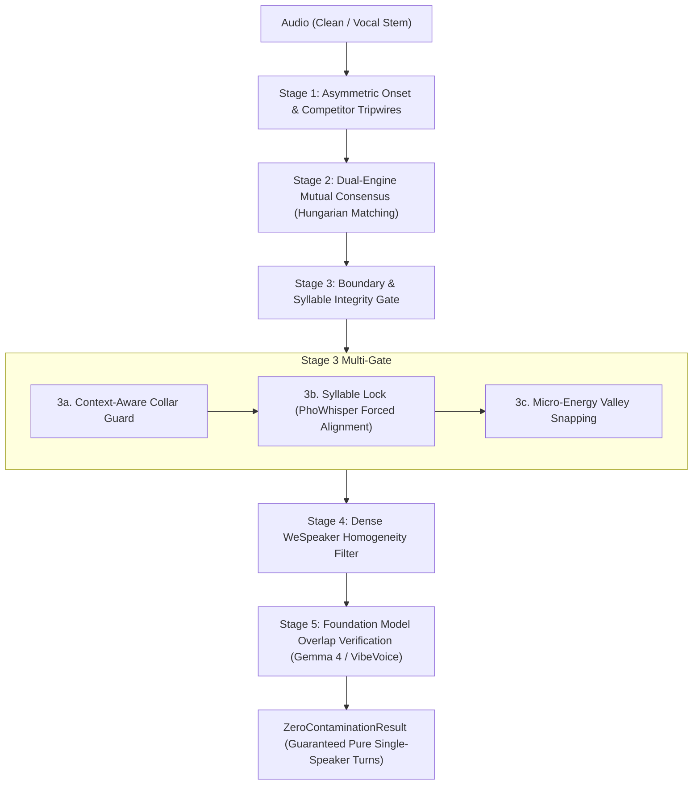

# 04. Zero-Contamination Diarization Pipeline

[← 03. Speaker Diarization](03_speaker_diarization.md) | [Docs Index](README.md) | [Next: 05. Benchmark & Mixing →](05_benchmark_and_mixing.md)

---

This module documents the **Zero-Contamination Diarization Pipeline** ([`src/diarization/zero_contamination.py`](../src/diarization/zero_contamination.py)).



---

## 1. Objective & Philosophy

Traditional diarization optimizes for **Diarization Error Rate (DER)**, balancing missed speech (false negatives) against false alarms and speaker confusion.

In contrast, **zero-contamination diarization** is designed specifically for **clean TTS voice dataset harvesting**:
- **Missed speech carries zero penalty:** It is completely acceptable to discard 40–60% of an audio track if the discarded portions contain ambiguous, noisy, or borderline speech.
- **Multi-speaker contamination is fatal:** Even 50 ms of a secondary speaker's voice in a training clip can contaminate acoustic tokenizers and voice cloning models.
- **Chopped syllable boundaries are unacceptable:** Truncating Vietnamese tonal contours or syllable codas ($-p, -t, -k, -m, -n, -ng$) ruins speech synthesis naturalness.

---

## 2. The 5-Stage Attrition Funnel

### Stage 1: Asymmetric Detection & Competitor Tripwires
Runs the primary diarizer (e.g. `Sortformer`, `DiariZen`, or `Pyannote 3.1`) with asymmetric thresholds:
- **`target_onset` (default `0.80`):** Requires high model confidence before acknowledging target speech onset.
- **`competitor_onset` (default `0.20`):** Extremely sensitive tripwire threshold. If any competing speaker is detected above 20% activation, the candidate segment is immediately vetoed.

### Stage 2: Dual-Engine Mutual Consensus
When `enable_consensus=True`, an orthogonal secondary diarization engine (e.g. DiariZen or Pyannote) processes the audio concurrently on `secondary_device` (e.g. `cuda:1`).
- Uses the **Hungarian maximum-weight bipartite matching algorithm** to establish optimal 1-to-1 speaker correspondence.
- Keeps an interval **if and only if both engines unanimously agree** on speaker identity and neither detects concurrent speech.
- Eliminates single-model hallucinations and boundary drift.

### Stage 3: Boundary & Syllable Integrity Gate
Guarantees clean turn transitions without truncating words:
1. **Context-Aware Collar Guard (`enable_context_collar`):**
   - If another speaker speaks within `handoff_risk_distance_s` (default 0.80s), an inward safety collar is shaved.
   - If the turn transitions into natural silence, inward shaving is suspended and a gentle `silence_tail_buffer_s` (default +0.15s) is granted to preserve delicate syllable codas and trailing phonemes.
2. **Forced Alignment Syllable Lock (`enable_syllable_alignment`):**
   - Utilizes `whisper_timestamped` with fine-tuned checkpoints such as `vinai/PhoWhisper-small` (or PyTorch MMS-FA / remote Whisper endpoints).
   - Snaps candidate boundaries outward to word/syllable bounds, preventing slicing through active syllables.
   - Automatically pre-configures PyTorch Hub non-interactively to trust Silero VAD (`snakers4/silero-vad`), with graceful fallback to `vad=False` if network/download hurdles occur.
   - Transparently recovers from CUDA OOM errors by clearing VRAM cache and retrying on CPU.
3. **Micro-Acoustic Energy Valley Snapping (`enable_energy_snapping`):**
   - Analyzes waveform energy in a `±energy_search_window_s` (default ±150ms) window with 2ms hop.
   - Snaps the boundary timestamp to the nearest vocal cord closure valley (zero-crossing/energy trough) below `energy_valley_floor_db` (default -30 dB).

### Stage 4: Dense Sliding WeSpeaker Homogeneity Filter
When `enable_homogeneity=True`, slides short sub-windows (`homogeneity_window_s=1.0s`, `hop_s=0.25s`) across each candidate turn using `pyannote/wespeaker-voxceleb-resnet34-LM`.
- Computes cosine similarity between each sub-window and the global turn centroid.
- Drops any turn where similarity dips below `min_homogeneity_similarity` (default `0.75`), catching subtle unsegmented speaker handoffs.

### Stage 5: In-Loop Foundation Model Verification
Candidate turns passing acoustic gates are verified by multimodal foundation models:
- **Microsoft VibeVoice-ASR:** Detects secondary speech duration across full clip context. Drops turns if secondary speech exceeds `max_secondary_speech_s` (default `0.0s`).
- **Gemma 4 Direct Audio:** Sends candidate audio directly to Gemma 4 via OpenAI-compatible endpoint. Drops turns if simultaneous speakers are audible.

---

## 3. Public API

### `run_zero_contamination_pipeline(...) -> ZeroContaminationResult`

```python
def run_zero_contamination_pipeline(
    audio: Audio,
    config: ZeroContaminationConfig,
    progress_callback: Callable[[float, str], None] | None = None,
) -> ZeroContaminationResult:
```

Executes the complete multi-stage pipeline, streaming monotonic progress updates as `(progress_0_to_1, message)` and returning an audit-backed `ZeroContaminationResult`.

### Modular Building Blocks

The pipeline exposes standalone helper functions for custom composition:

```python
# Stage 2: Dual-engine Hungarian consensus
compute_consensus_turns(primary_turns, secondary_turns, audio_duration_s) -> tuple[list[SpeakerTurn], dict[str, str]]

# Stage 3a: Context-aware collar guard
apply_context_aware_collar(turns, collar_s=0.35, handoff_risk_s=0.80, silence_tail_s=0.15, ...) -> tuple[list[SpeakerTurn], list[dict]]

# Stage 3b: Syllable forced alignment
align_and_lock_syllable_boundaries(audio, turns, aligner_engine="whisper_timestamped", aligner_model="vinai/PhoWhisper-small", ...) -> tuple[list[SpeakerTurn], list[dict]]

# Stage 3c: Acoustic energy valley snapping
snap_boundaries_to_acoustic_valleys(audio, turns, search_window_s=0.15, energy_floor_db=-30.0, ...) -> tuple[list[SpeakerTurn], list[dict]]

# Stage 4: WeSpeaker sliding window homogeneity
filter_by_embedding_homogeneity(audio, turns, window_s=1.0, hop_s=0.25, min_similarity=0.75, ...) -> tuple[list[SpeakerTurn], list[tuple]]

# Stage 5: Foundation model verification
filter_by_foundation_models(audio, turns, config, progress_callback=None) -> tuple[list[SpeakerTurn], list[tuple]]
```

---

## 4. Configuration Schema (`ZeroContaminationConfig`)

```python
@dataclass
class ZeroContaminationConfig:
    # Stage 1: Primary Diarizer
    primary_backend: str = "sortformer"      # "sortformer", "diarizen", "pyannote"
    primary_device: str | None = None        # "cuda:0", "cpu", None (= general device)
    target_onset: float = 0.80
    target_offset: float = 0.65
    competitor_onset: float = 0.20

    # Stage 2: Dual-Engine Consensus
    enable_consensus: bool = True
    secondary_backend: str = "diarizen"      # "diarizen", "sortformer", "pyannote"
    secondary_device: str | None = None      # "same", "cuda:1", "cpu"

    # Stage 3: Boundary & Syllable Integrity Gate
    enable_collar_erosion: bool = True
    boundary_collar_s: float = 0.35
    min_turn_duration_s: float = 0.80
    transition_exclusion_s: float = 0.50
    allow_gap_merge: bool = False

    # Stage 3a: Context-Aware Collar
    enable_context_collar: bool = True
    handoff_risk_distance_s: float = 0.80
    silence_tail_buffer_s: float = 0.15

    # Stage 3b: Energy Valley Snapping (OFF by default)
    enable_energy_snapping: bool = False
    energy_search_window_s: float = 0.15
    energy_valley_floor_db: float = -30.0

    # Stage 3c: Syllable Forced Alignment Lock (OFF by default)
    enable_syllable_alignment: bool = False
    aligner_engine: str = "whisper_timestamped" # "whisper_timestamped", "mms_fa", "remote_whisper"
    aligner_model: str = "vinai/PhoWhisper-small"
    aligner_language: str = "vi"
    aligner_endpoint: str | None = None      # required for remote_whisper
    aligner_device: str | None = "cpu"       # CPU recommended to avoid VRAM exhaustion

    # Stage 4: WeSpeaker Homogeneity (OFF by default)
    enable_homogeneity: bool = False
    homogeneity_device: str | None = None    # "same", "cuda:0", "cpu"
    homogeneity_window_s: float = 1.00
    homogeneity_hop_s: float = 0.25
    min_homogeneity_similarity: float = 0.75

    # Stage 5a: Gemma Overlap Verifier (OFF by default)
    enable_gemma: bool = False
    gemma_endpoint: str | None = None        # else UNSLOTH_ENDPOINT / localhost:8888
    gemma_model: str | None = None           # else UNSLOTH_MODEL / unsloth/gemma-4-12b-it-GGUF
    gemma_prompt: str | None = None
    gemma_api_key: str | None = None
    gemma_timeout_s: float = 120.0

    # Stage 5b: VibeVoice Speaker-Count Verifier (OFF by default)
    enable_vibevoice: bool = False
    vibevoice_model_id: str = "Dubedo/VibeVoice-ASR-HF-INT8"
    vibevoice_device: str | None = None      # e.g. "cuda:1"; "same" = general device
    vibevoice_endpoint: str | None = None    # optional remote HTTP endpoint
    max_secondary_speech_s: float = 0.0

    # General compute
    device: str = "auto"
    token: str | None = None                 # HF token fallback (HF_TOKEN env)
```

### Parameter Reference & Directional Tuning Guide

The following tables break down every parameter controlling the pipeline attrition funnel, including valid ranges, default settings, behavioral shifts when increasing or decreasing values, and the underlying engineering trade-offs.

#### Stage 1: Asymmetric Detection & Tripwires

| Parameter | Type & Range | Default | Increasing (+) Value | Decreasing (-) Value | The Core Trade-off |
|---|---|---|---|---|---|
| **`target_onset`** | `float` `[0.01, 0.99]` | `0.80` | Demands higher neural probability before opening a turn. Suppresses false activations from breath, coughing, or room acoustic reflections. | Opens turns on softer evidence. Captures quiet sentence attacks and whispering, but risks triggering on room noise or faint crosstalk. | **Target Onset Purity vs. Speech Recall.** High values ensure every retained turn starts with decisive target speech. |
| **`target_offset`** | `float` `[0.01, target_onset]` | `0.65` | Closes the turn immediately as speech energy drops. Prevents tail bleed into subsequent speaker turns. | Keeps the turn open through intra-sentence pauses and fading acoustic tails. Rescues delicate trailing phonemes and nasals. | **Turn Boundary Cleanliness vs. Coda Completeness.** If set too high, syllable codas ($-p, -t, -k, -m, -n, -ng$) get clipped. |
| **`competitor_onset`** | `float` `[0.01, 0.99]` | `0.20` | More forgiving of secondary activations. Diarizer ignores faint competing speaker probabilities unless they reach higher confidence. | Hair-trigger sensitivity. Vetoes the candidate turn if any competing speaker shows even a faint probability blip (e.g. `0.10`). | **Multi-Speaker Rejection Strictness vs. Yield.** Extremely low values guarantee zero foreign speaker leakage at the cost of discarding turns in lively rooms. |
| **`primary_backend`** | `str` `{"sortformer", "diarizen", "pyannote"}` | `"sortformer"` | N/A | N/A | **Architecture Selection.** `sortformer` provides streaming 4-speaker capability with pre-inference enrollment; `diarizen` provides SOTA overlap resolution via WavLM Large; `pyannote` offers standard community baseline. |

#### Stage 2: Dual-Engine Mutual Consensus

| Parameter | Type & Range | Default | When `True` / Higher | When `False` / Lower | The Core Trade-off |
|---|---|---|---|---|---|
| **`enable_consensus`** | `bool` `{True, False}` | `True` | Runs two orthogonal diarizers and keeps an interval **only if both engines agree** via Hungarian maximum-weight matching and neither detects overlap. | Bypasses secondary validation; trusts primary backend completely. Saves GPU compute time and VRAM. | **Mathematical Hallucination Elimination vs. Compute Latency.** Consensus drops ~20–35% of disputed boundary regions, ensuring unmatched purity. |
| **`secondary_backend`** | `str` `{"diarizen", "sortformer", "pyannote"}` | `"diarizen"` | N/A | N/A | **Orthogonality Selection.** Pairing transformer-based `sortformer` with WavLM-based `diarizen` yields complementary acoustic perspectives, catching model-specific blind spots. |

#### Stage 3: Boundary & Syllable Integrity Gate

| Parameter | Type & Range | Default | Increasing (+) Value | Decreasing (-) Value | The Core Trade-off |
|---|---|---|---|---|---|
| **`enable_collar_erosion`** | `bool` `{True, False}` | `True` | Enables boundary trimming logic (including context-aware collar guard). | Retains raw diarizer boundary timestamps without any inward safety margins. | **Boundary Bleed Protection vs. Turn Length.** Essential for eliminating transition cross-talk in multi-speaker audio. |
| **`boundary_collar_s`** | `float` `[0.0, 5.0s]` | `0.35s` (350ms) | Shaves a thicker protective buffer inward from turn boundaries. Absolutely guarantees zero transition bleed. | Shaves less audio. Preserves shorter words and closer turn margins, but increases the risk of edge contamination. | **Transition Safety Margin vs. Speech Retention.** If collar is larger than turn duration, the entire turn is eliminated. |
| **`min_turn_duration_s`** | `float` `[0.1, 30.0s]` | `0.80s` | Discards turns shorter than this duration after shaving. Purges micro-flutter, backchannel murmurs ("uh-huh"), and brief coughs. | Retains short monosyllabic utterances ("yes", "no", "hi"). Admits brief transient acoustic artifacts and unstable short turns. | **Acoustic Sentence Stability vs. Monosyllabic Dialogue Yield.** For TTS dataset generation, turns $<0.8s$ rarely contain full phonemic context. |
| **`transition_exclusion_s`** | `float` `[0.0, 5.0s]` | `0.50s` | If the gap between two different speakers is less than this threshold, applies additional collar shaving: $\frac{\text{exclusion} - \text{gap}}{2}$. | Only penalizes speaker handoffs that occur nearly instantaneously. Tolerates tight back-and-forth exchanges. | **Speaker Switch Isolation vs. Rapid Dialogue Retention.** Higher values aggressively erode turns surrounding fast speaker transitions. |
| **`allow_gap_merge`** | `bool` `{True, False}` | `False` | Merges consecutive turns of the same speaker across silent pauses into longer paragraph chunks. | Treats every utterance as an isolated turn bounded by silence. Prevents inter-sentence silence or breath from being baked into clips. | **Long-Form Paragraph Continuity vs. Granular Audio-Sentence Isolation.** Always keep `False` for single-sentence TTS voice dataset creation. |

#### Stage 3a: Context-Aware Collar Guard

| Parameter | Type & Range | Default | Increasing (+) Value | Decreasing (-) Value | The Core Trade-off |
|---|---|---|---|---|---|
| **`enable_context_collar`** | `bool` `{True, False}` | `True` | Dynamically distinguishes dangerous speaker handoffs from safe transitions into natural monologue silence. | Reverts to blunt, uniform collar shaving, slicing off trailing word codas even when silence follows the turn. | **Syllable Coda Rescue vs. Uniform Shaving.** Drastically improves TTS naturalness by preserving trailing phonemes during monologues. |
| **`handoff_risk_distance_s`** | `float` `[0.05, 5.0s]` | `0.80s` | Extends the lookahead distance for competitor speakers. Turns farther away from competitors will still trigger defensive inward shaving. | Only triggers defensive collar shaving if the competing speaker starts immediately after the current turn ($< \text{distance}$). | **Handoff Safety Horizon vs. Monologue Detection.** Higher values treat moderate pauses between speakers as risky transitions. |
| **`silence_tail_buffer_s`** | `float` `[0.0, 2.0s]` | `0.15s` (150ms) | Appends a generous acoustic decay cushion (+150ms) into natural trailing silence, preserving delicate room tone and fading vowels. | Clamps boundaries tightly to the raw offset timestamp. Prevents capturing room tone or breathing. | **Trailing Coda & Reverb Naturalness vs. Clip Tightness.** Crucial for Vietnamese tonal decay and unvoiced codas ($-p, -t, -k$). |

#### Stage 3b: Micro-Acoustic Energy Valley Snapping

| Parameter | Type & Range | Default | Increasing (+) Value | Decreasing (-) Value | The Core Trade-off |
|---|---|---|---|---|---|
| **`enable_energy_snapping`** | `bool` `{True, False}` | `False` | Walks boundaries to the nearest vocal cord closure zero-crossing / RMS energy trough in the waveform. | Keeps mathematical collar timestamps without waveform-level micro-alignment. | **Zero-Discontinuity Audio Slicing vs. Minor CPU Compute.** Eliminates audible clicks and pops when slicing audio files. |
| **`energy_search_window_s`** | `float` `[0.01, 1.0s]` | `0.15s` (±150ms) | Expands the temporal search radius to find a deeper silence valley. Higher chance of finding true vocal cord closure. | Restricts search to immediate vicinity of the boundary. Prevents boundary drift from shifting the turn start/end too far. | **Silence Valley Depth vs. Boundary Drift.** A window $>0.25s$ risks snapping to an unrelated pause inside the sentence. |
| **`energy_valley_floor_db`** | `float` `[-80.0, -10.0 dB]` | `-30.0 dB` | Accepts higher-energy troughs as valid snapping points (more permissive). | Demands near-complete acoustic silence ($<-40\text{ dB}$) before accepting a snapping point. | **Snapping Permissiveness vs. Valley Silence Purity.** In noisy recordings, high noise floors require $-25\text{ dB}$ to find valleys. |

#### Stage 3c: Forced Alignment Syllable Lock

| Parameter | Type & Range | Default | Increasing / Selected Value | Decreasing / Selected Value | The Core Trade-off |
|---|---|---|---|---|---|
| **`enable_syllable_alignment`** | `bool` `{True, False}` | `False` | Transcribes audio and snaps diarization boundaries outward to phoneme/word token bounds via CTC / cross-attention timestamps. | Leaves boundaries at acoustic/collar locations. Runs significantly faster without ASR inference. | **Guaranteed Syllable Completeness vs. Heavy Compute Footprint.** Ensures boundaries never slice through an active vocal syllable. |
| **`aligner_engine`** | `str` `{"whisper_timestamped", "mms_fa", "remote_whisper"}` | `"whisper_timestamped"` | N/A | N/A | **Aligner Architecture.** `whisper_timestamped` uses Dynamic Time Warping (DTW) on Whisper cross-attention matrices; `mms_fa` uses PyTorch CTC forced alignment; `remote_whisper` offloads to an external HTTP service. |
| **`aligner_model`** | `str` (HF Hub ID / path) | `"vinai/PhoWhisper-small"` | Checkpoints with higher parameter counts (e.g. `PhoWhisper-large`, `whisper-large-v3`) offer better ASR accuracy on noisy audio. | Smaller models (`tiny`, `base`, `small`) run faster with minimal memory consumption. | **Alignment Precision on Accented Speech vs. Inference Latency.** `vinai/PhoWhisper-small` is optimized for Vietnamese tonality. |
| **`aligner_device`** | `str` `{"cpu", "cuda:0", ...}` | `"cpu"` | Offloading to GPU accelerates transcription. | Running on CPU keeps 100% of GPU VRAM free for the primary and secondary diarizers. | **Alignment Speed vs. GPU VRAM Safety.** CPU is strongly recommended on single-GPU setups to prevent CUDA OOM. |

#### Stage 4: Dense Sliding WeSpeaker Homogeneity Filter

| Parameter | Type & Range | Default | Increasing (+) Value | Decreasing (-) Value | The Core Trade-off |
|---|---|---|---|---|---|
| **`enable_homogeneity`** | `bool` `{True, False}` | `False` | Extracts dense ResNet-34 embeddings across sliding sub-windows to verify that speaker timbre remains uniform throughout the turn. | Skips sliding-window speaker verification. Faster processing; relies entirely on upstream diarizers. | **Internal Purity Guarantee vs. Computational Cost.** Catches unsegmented conversational handoffs that slipped past Stage 1 & 2. |
| **`homogeneity_window_s`** | `float` `[0.25, 5.0s]` | `1.00s` | Longer sub-windows yield richer acoustic context and more stable embedding vectors. | Shorter sub-windows provide higher temporal resolution, detecting brief (0.5s) secondary speaker voice insertions. | **Embedding Vector Stability vs. Short Intrusion Detection.** Sub-windows $<0.6s$ suffer from high cosine noise and false rejections. |
| **`homogeneity_hop_s`** | `float` `[0.05, 2.0s]` | `0.25s` (250ms) | Faster processing with fewer forward passes. May step over momentary speaker handoffs. | Dense temporal sampling (e.g. 100ms hop). Catches instantaneous foreign vocal blips at linearly higher runtime. | **Temporal Probe Density vs. Forward Pass Latency.** A 0.25s hop provides an optimal balance for conversational speech. |
| **`min_homogeneity_similarity`** | `float` `[-1.0, 1.0]` | `0.75` | Demands near-identical vocal timbre throughout the turn. Rejects turns with pitch changes, emotional shifts, shouting, or whispering. | Accommodates natural expressive variance, laughing, and emotional inflection within the target speaker's monologue. | **Vocal Monotony Strictness vs. Expressive Yield.** Setting $>0.82$ discards highly expressive or dramatic speech. |

#### Stage 5: In-Loop Foundation Model Verification

| Parameter | Type & Range | Default | Increasing (+) Value | Decreasing (-) Value | The Core Trade-off |
|---|---|---|---|---|---|
| **`enable_gemma`** | `bool` `{True, False}` | `False` | Passes candidate audio directly into Gemma 4 / Gemini via multimodal direct-audio endpoint for semantic overlap audit. | Bypasses LLM evaluation. Eliminates network dependency and LLM latency. | **Multimodal Human-Level Cross-Talk Detection vs. External Latency.** Catches overlapping background voices and subtle TV bleed. |
| **`gemma_timeout_s`** | `float` `[5.0, 600.0s]` | `120.0s` | Allows remote LLM ample time to generate tokens and recover from high server load. | Fails quickly on unresponsive endpoints, preventing pipeline queue stalls. | **Request Resilience vs. Pipeline Latency.** |
| **`enable_vibevoice`** | `bool` `{True, False}` | `False` | Uses Microsoft VibeVoice-ASR token stream to measure total duration of any secondary non-dominant speaker in the audio. | Bypasses VibeVoice verification. | **Token-Level Speaker Count Verification vs. Dedicated VRAM / Endpoint Requirement.** |
| **`max_secondary_speech_s`** | `float` `[0.0, 10.0s]` | `0.0s` | Tolerates brief background vocal sounds, far-field murmur, or brief confirmations up to the threshold duration. | Absolute zero-tolerance policy. Rejects the candidate if VibeVoice detects a single secondary speaker token. | **Dataset Cleanliness vs. Monologue Yield.** Keep at `0.0s` for ultra-pure single-speaker TTS datasets. |

---

### Practical Tuning Presets

Depending on your downstream objective, select one of the following validated configuration presets:

#### Preset A: Ultra-Pure Single-Speaker TTS Voice Harvesting (Zero Bleed)
> **Goal:** High-fidelity TTS acoustic tokenizer training where even 50ms of background voice or clipped codas ruin voice cloning models.

```python
config = ZeroContaminationConfig(
    primary_backend="sortformer",
    target_onset=0.82,
    target_offset=0.62,
    competitor_onset=0.15,               # Extremely sensitive competitor tripwire
    enable_consensus=True,               # Dual-engine Hungarian agreement required
    secondary_backend="diarizen",
    secondary_device="cuda:1",           # Run secondary engine concurrently on GPU 1
    enable_collar_erosion=True,
    boundary_collar_s=0.40,
    min_turn_duration_s=1.00,            # Reject short sentence fragments
    transition_exclusion_s=0.60,
    enable_context_collar=True,
    handoff_risk_distance_s=1.00,
    silence_tail_buffer_s=0.20,          # Generous room tone and coda protection
    enable_syllable_alignment=True,      # Syllable lock via PhoWhisper
    aligner_model="vinai/PhoWhisper-small",
    aligner_device="cpu",
    enable_homogeneity=True,             # WeSpeaker sliding window check
    min_homogeneity_similarity=0.78,
    enable_vibevoice=True,
    max_secondary_speech_s=0.0,          # Zero tolerance for secondary speakers
)
```

#### Preset B: Balanced Audiobook & Monologue Harvester (High Yield & Natural Cadence)
> **Goal:** Solo narrations and audiobooks where speaker identity is stable, but expressive inflections and trailing consonant codas must not be clipped.

```python
config = ZeroContaminationConfig(
    primary_backend="sortformer",
    target_onset=0.76,
    target_offset=0.65,
    competitor_onset=0.25,
    enable_consensus=False,              # Single engine is sufficient for solo recordings
    enable_collar_erosion=True,
    boundary_collar_s=0.25,
    min_turn_duration_s=0.60,
    enable_context_collar=True,
    handoff_risk_distance_s=0.50,
    silence_tail_buffer_s=0.25,          # Maximally protect breathing and sentence decay
    enable_energy_snapping=True,         # Snap boundaries cleanly to silence troughs
    energy_search_window_s=0.15,
    energy_valley_floor_db=-30.0,
    enable_homogeneity=False,
)
```

#### Preset C: Fast Multi-Speaker Dialogue Triage (Exploratory / Low Latency)
> **Goal:** Rapid conversational diarization screening without heavy secondary models or ASR overhead.

```python
config = ZeroContaminationConfig(
    primary_backend="sortformer",
    target_onset=0.74,
    target_offset=0.64,
    competitor_onset=0.30,
    enable_consensus=False,
    enable_collar_erosion=True,
    boundary_collar_s=0.20,
    min_turn_duration_s=0.50,
    enable_context_collar=False,         # Standard blunt collar
    enable_energy_snapping=False,
    enable_syllable_alignment=False,
    enable_homogeneity=False,
    enable_gemma=False,
    enable_vibevoice=False,
)
```

---

## 5. Result Schema (`ZeroContaminationResult`)

`ZeroContaminationResult` encapsulates outputs and complete audit traceability:

| Field | Type | Description |
|---|---|---|
| `diarization` | `DiarizationResult` | Canonical schema 2.0 diarization containing verified single-speaker turns. Directly compatible with Turns Inspector, stem extraction, and RTTM export. |
| `audit_records` | `list[TurnAuditRecord]` | Detailed step-by-step audit records for every turn, tracking original timestamps, trimmed timestamps, survival/rejection reason, rescued codas, transcripts, WeSpeaker similarity scores, and foundation model decisions. |
| `funnel_stats` | `dict` | Step-by-step attrition metrics (turn counts and retained duration) across Primary, Consensus, Collar Erosion, Homogeneity, and Foundation Model stages. |
| `stage_log` | `list[str]` | Monotonic log with timestamps for each completed processing phase. |
| `config` | `dict` | Serialized configuration used during execution. |

---

## 6. Python Usage Example

```python
from src.utils.AudioClass import Audio
from src.diarization.zero_contamination import (
    ZeroContaminationConfig,
    run_zero_contamination_pipeline,
)

vocal_audio = Audio.from_file(".data/mvsep_mdx23/out/clean_vocals.wav")

config = ZeroContaminationConfig(
    primary_backend="sortformer",
    primary_device="cuda:0",
    enable_consensus=True,
    secondary_backend="diarizen",
    secondary_device="cuda:1",
    enable_syllable_alignment=True,
    aligner_model="vinai/PhoWhisper-small",
    aligner_language="vi",
    aligner_device="cpu",
    enable_homogeneity=True,
    min_homogeneity_similarity=0.75,
)

result = run_zero_contamination_pipeline(
    audio=vocal_audio,
    config=config,
    progress_callback=lambda progress, message: print(f"[{progress * 100:5.1f}%] {message}"),
)

print(f"Retained {len(result.diarization.turns)} pure turns ({result.funnel_stats['final_pure_speech_duration_s']:.1f}s)")
result.diarization.save(".data/diarization/results/pure_result.json")
```
