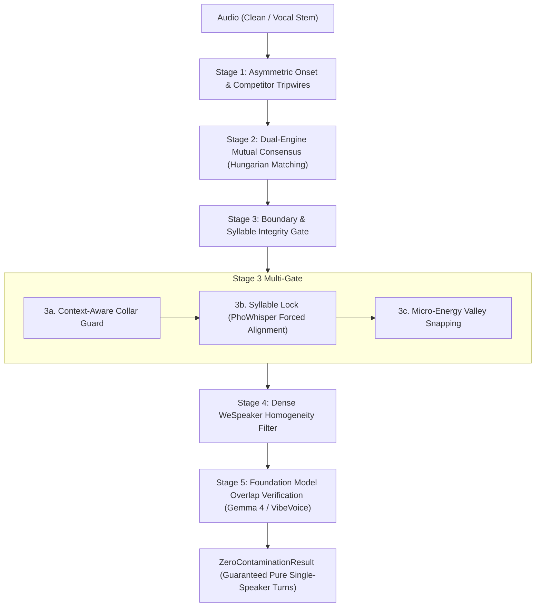

# 04. Zero-Contamination Diarization Pipeline

[← 03. Speaker Diarization](03_speaker_diarization.md) | [Docs Index](README.md) | [Next: 05. Benchmark & Mixing →](05_benchmark_and_mixing.md)

---

This module documents the **Zero-Contamination Diarization Pipeline** ([`src/diarization/zero_contamination.py`](../src/diarization/zero_contamination.py)).



---

## 1. Objective & Philosophy

Traditional diarization optimizes for **Diarization Error Rate (DER)**, balancing missed speech (false negatives) against false alarms and speaker confusion.

In contrast, **zero-contamination diarization** is designed specifically for **clean TTS voice dataset harvesting**:
- **Missed speech carries zero penalty:** It is completely acceptable to discard 40–60% of an audio track if the discarded portions contain ambiguous, noisy, or borderline speech.
- **Multi-speaker contamination is fatal:** Even 50 ms of a secondary speaker's voice in a training clip can contaminate acoustic tokenizers and voice cloning models.
- **Chopped syllable boundaries are unacceptable:** Truncating Vietnamese tonal contours or syllable codas ($-p, -t, -k, -m, -n, -ng$) ruins speech synthesis naturalness.

### Experiment-tab recipe: prioritize complete Vietnamese words (không bị lẹm chữ)

The control that directly spends additional compute to protect complete words is
**Stage 3 → Option B: Syllable & Word Forced Alignment Lock**. Gemma 4,
VibeVoice, and WeSpeaker validate speaker purity; they do not repair clipped word
boundaries.

The Experiment UI highlights this panel with a **COMPUTE → WORD COMPLETENESS**
callout and bolds its engine, model, device, and language controls. Stage 1 is
separately labeled as boundary tuning because changing its thresholds does not
add inference compute.

Use this as the starting configuration in the Experiment tab:

| UI step | Control | Recommended value | Why |
|---|---|---|---|
| Input | Primary Diarizer | `Sortformer` | The Experiment pipeline applies `target_onset` and `target_offset` to this backend. |
| Stage 1 | Target Speaker Onset | `0.70` | Opens the turn on softer evidence than the `0.80` default, helping retain initial consonants. |
| Stage 1 | Target Speaker Offset | `0.50` | Holds the turn open longer than the `0.65` default, helping retain final codas and fading syllables. |
| Stage 2 | Dual-Engine Consensus | Enabled; secondary `DiariZen` | Spends additional compute to reject boundaries on which two different diarizers disagree. |
| Stage 3 | Base Collar Inward Shave | `0.20s` | Reduces deterministic inward trimming from the `0.35s` default. Increase it again if speaker bleed appears. |
| Stage 3, Option A | Context-Aware Handoff Guard | Enabled | Shaves near another speaker but extends into silence when a handoff is not nearby. |
| Stage 3, Option A | Handoff Risk Distance | `0.85s` | Retains the normal speaker-transition safety horizon. |
| Stage 3, Option A | Silence Tail Release | `0.25s` | Adds more trailing room for Vietnamese tones and codas when silence follows. |
| Stage 3, Option B | Forced Alignment Lock | Enabled | Moves a boundary outward when it falls inside a recognized word. |
| Stage 3, Option B | Engine | `whisper_timestamped` | Produces word timestamps used by the boundary lock. |
| Stage 3, Option B | Model | `vinai/PhoWhisper-large` | High-precision Vietnamese checkpoint; use `vinai/PhoWhisper-small` if memory or latency is limiting. |
| Stage 3, Option B | Language | `vi` | Prevents unnecessary language auto-detection. |
| Stage 3, Option B | Device | `"same"` (or dedicated GPU / CPU) | Sequential execution with automatic memory clearing on single-GPU servers. |
| Stage 3, Option C | Energy/RMS Valley Snapping | **Disabled** | It runs after word locking and may move a protected boundary inward again. It is primarily a click-removal tool. |

The equivalent core configuration is:

```python
config = ZeroContaminationConfig(
    primary_backend="sortformer",
    target_onset=0.70,
    target_offset=0.50,
    enable_consensus=True,
    secondary_backend="diarizen",
    secondary_device="same",
    enable_collar_erosion=True,
    boundary_collar_s=0.20,
    min_turn_duration_s=0.60,
    enable_context_collar=True,
    handoff_risk_distance_s=0.85,
    silence_tail_buffer_s=0.25,
    enable_syllable_alignment=True,
    aligner_engine="whisper_timestamped",
    aligner_model="vinai/PhoWhisper-large",
    aligner_language="vi",
    aligner_device="same",
    enable_energy_snapping=False,
    enable_homogeneity=True,
    homogeneity_device="same",
    homogeneity_window_s=0.80,
    homogeneity_hop_s=0.10,
    min_homogeneity_similarity=0.74,
    enable_gemma=True,
    gemma_backend="gemini",
    gemma_model="gemini-3.8-flash",
)
```

This preset prioritizes word completeness, but it cannot make complete-word and
zero-other-speaker guarantees simultaneously at an overlapping or immediate
speaker handoff. Inspect those boundaries and prefer rejecting the entire turn
when purity is more important than yield.

Forced alignment is also **fail-open**: if its model cannot load or inference
fails, the pipeline logs the error and retains the incoming candidate boundaries.
Confirm the task's stage log and boundary audit before treating an output as
word-locked.

### Experiment-tab recipe: trade compute and yield for speaker purity

The Experiment UI marks genuine additional inference passes with
**COMPUTE → SPEAKER PURITY**. Enabling these gates does not create more clean
audio: each gate can only retain or reject candidates from the preceding stage.
The intended trade is therefore **more compute, higher expected speaker purity,
less retained audio, and normally fewer usable extracted samples**.

Apply the gates in this order according to the available compute budget:

| Priority | UI step and parameter | Purity setting | Compute and extraction trade-off |
|---|---|---|---|
| 1 | Stage 2: `enable_consensus` | Enabled; use Sortformer + DiariZen | Runs a complete second diarization pass. Mutual intersection removes disputed audio, so retained duration cannot increase and usable sample yield normally falls. |
| 2 | Stage 4: `enable_homogeneity` | Enabled | Adds WeSpeaker embedding inference over many overlapping sub-windows. Inconsistent-timbre turns are rejected, normally producing fewer samples. |
| 3 | Stage 4: `homogeneity_hop_s` | Lower from `0.25s` toward `0.10s` | Creates more overlapping embedding forward passes. Brief speaker intrusions are less likely to fall between probes, at higher runtime and with potentially more rejected turns. |
| 4 | Stage 4: `min_homogeneity_similarity` | Raise cautiously from `0.75` toward `0.78–0.82` | Does not add forward passes, but rejects more turns. Higher values may falsely reject expressive, laughing, whispered, or emotional target speech. |
| 5 | Stage 5a: `enable_gemma` | Enabled when the selected backend is ready | Adds one direct-audio request per candidate. A second speaker, overlap, clipped boundary, uncertain result, or verifier failure rejects the sample. Gemini adds metered API cost. |
| 6 | Stage 5b: `enable_vibevoice` | Enabled | Adds autoregressive ASR to each surviving candidate. This is a heavy verification pass and may reject additional samples containing secondary-speaker tokens. |
| 7 | Stage 5b: `max_secondary_speech_s` | `0.0s` for strict purity | Does not change inference compute; it makes the completed VibeVoice check maximally strict and therefore minimizes yield. |

A high-compute speaker-purity configuration is:

```python
config = ZeroContaminationConfig(
    primary_backend="sortformer",
    enable_consensus=True,
    secondary_backend="diarizen",
    enable_homogeneity=True,
    homogeneity_window_s=1.0,
    homogeneity_hop_s=0.10,
    min_homogeneity_similarity=0.78,
    enable_gemma=True,
    enable_vibevoice=True,
    max_secondary_speech_s=0.0,
)
```

This is an attrition funnel, not a purity proof. Model mistakes remain possible,
and Stage 5 verifier exceptions are recorded without automatically rejecting the
candidate. Review the stage log, audit records, and verifier metadata whenever a
strict dataset claim matters.

---

## 2. The 5-Stage Attrition Funnel

### Stage 1: Asymmetric Detection & Competitor Tripwires
Runs the primary diarizer (e.g. `Sortformer`, `DiariZen`, or `Pyannote 3.1`) with asymmetric thresholds:
- **`target_onset` (default `0.80`):** Requires high model confidence before acknowledging target speech onset.
- **`target_offset` (default `0.65`):** Keeps Sortformer's turn open below the onset threshold to reduce boundary fragmentation.
- **`competitor_onset` (default `0.20`):** Reserved configuration field. The current backend path does not consume it, so changing it has no output effect.

### Stage 2: Dual-Engine Mutual Consensus
When `enable_consensus=True`, an orthogonal secondary diarization engine (e.g. DiariZen or Pyannote) processes the audio concurrently on `secondary_device` (e.g. `cuda:1`).
- Uses the **Hungarian maximum-weight bipartite matching algorithm** to establish optimal 1-to-1 speaker correspondence.
- Keeps an interval **if and only if both engines unanimously agree** on speaker identity and neither detects concurrent speech.
- Eliminates single-model hallucinations and boundary drift.

### Stage 3: Boundary & Syllable Integrity Gate
Aims for clean turn transitions without truncating recognized words:
1. **Context-Aware Collar Guard (`enable_context_collar`):**
   - If another speaker speaks within `handoff_risk_distance_s` (default 0.80s), an inward safety collar is shaved.
   - If the turn transitions into natural silence, inward shaving is suspended and a gentle `silence_tail_buffer_s` (default +0.15s) is granted to preserve delicate syllable codas and trailing phonemes.
2. **Forced Alignment Syllable Lock (`enable_syllable_alignment`):**
   - Utilizes `whisper_timestamped` with fine-tuned checkpoints such as `vinai/PhoWhisper-small` (or PyTorch MMS-FA / remote Whisper endpoints).
   - Snaps candidate boundaries outward to word/syllable bounds, preventing slicing through active syllables.
   - Automatically pre-configures PyTorch Hub non-interactively to trust Silero VAD (`snakers4/silero-vad`), with graceful fallback to `vad=False` if network/download hurdles occur.
   - Transparently recovers from CUDA OOM errors by clearing VRAM cache and retrying on CPU.
3. **Micro-Acoustic Energy Valley Snapping (`enable_energy_snapping`):**
   - Analyzes waveform energy in a `±energy_search_window_s` (default ±150ms) window with 2ms hop.
   - Snaps the boundary timestamp to a nearby local energy minimum and then to a zero crossing. The current implementation does not enforce `energy_valley_floor_db`; changing that value currently has no effect.
   - Runs **after** forced alignment. Leave it disabled when word completeness is the overriding goal because its bidirectional search can move a word-locked boundary inward.

### Stage 4: Dense Sliding WeSpeaker Homogeneity Filter
When `enable_homogeneity=True`, slides short sub-windows (`homogeneity_window_s=1.0s`, `hop_s=0.25s`) across each candidate turn using `pyannote/wespeaker-voxceleb-resnet34-LM`.
- Computes cosine similarity between each sub-window and the global turn centroid.
- Drops any turn where similarity dips below `min_homogeneity_similarity` (default `0.75`), catching subtle unsegmented speaker handoffs.

### Stage 5: In-Loop Foundation Model Verification
Candidate turns passing acoustic gates are verified by multimodal foundation models:
- **Microsoft VibeVoice-ASR:** Detects secondary speech duration across full clip context. Drops turns if secondary speech exceeds `max_secondary_speech_s` (default `0.0s`).
- **Direct-Audio Quality Verifier:** Sends candidate audio directly to local
  Gemma 4 or Google Gemini. It rejects a second speaker (simultaneous or
  sequential), clipped initial/final speech (“lẹm chữ”), tail intrusions, uncertainty,
  and request/schema failures. It does not transcribe.

  #### Prompt Steering & Structured Output Extraction:
  - **Structured JSON Schema Extraction:** The verifier does not rely on regex or loose text generation. For Gemini, it enforces `generationConfig.responseMimeType` plus `responseJsonSchema` (`_OVERLAP_SCHEMA`). For Gemma 4 (Unsloth), it enforces `response_format: {"type": "json_schema", "strict": True}`. Both constrain model token sampling to guaranteed valid JSON matching `_OVERLAP_SCHEMA`.
  - **Targeted Tail Intrusion Guard:** A major failure mode in dialogue harvesting is a secondary speaker cutting in, whispering, laughing, or offering a backchannel ("vâng", "dạ", "ừ", "yeah", "uh-huh") during the final 200–500ms of a turn. The prompt explicitly directs the model to scrutinize the final 500ms with heightened sensitivity, triggering rejection code `tail_speaker_intrusion` or `secondary_speaker` upon detecting any foreign vocalization.
  - **Acoustic Word Completeness (Anti-Lẹm Chữ):** The prompt distinguishes acoustic completeness from grammatical completeness. Grammatically incomplete excerpts are preserved, but turns cutting in abruptly mid-vowel/consonant (`clipped_word_start`) or cutting off sharply during vocal fold vibration or tonal coda release (`clipped_word_end`) are rejected.
  - **Supported Failure Codes:** `overlapping_speech`, `secondary_speaker`, `tail_speaker_intrusion`, `clipped_word_start`, `clipped_word_end`, `unintelligible_boundary`, `insufficient_evidence`. Only turns with `speaker_purity="pure"` and `word_completeness="complete"` receive `decision="pass"`.

Gemini cost records use response `usageMetadata` and the paid Standard USD
rate card dated 2026-09-04. The configured per-million-token input/output rates
are: Gemini 3.8/3.7/3.6 Flash `$0.75/$3.75` (the 2026 introductory rate),
Gemini 3.5 Flash `$1.50/$9.00`, Gemini 3.5 Flash-Lite `$0.30/$2.50`, Gemini
3.1 Pro Preview `$2.00/$12.00`, and Gemini 3.1 Flash-Lite `$0.25 text or $0.50
audio/$1.50`. Thinking tokens use the output rate. Records are estimates, not
Google invoices, and include the rate-card date for auditability.

---

## 3. Public API

### `run_zero_contamination_pipeline(...) -> ZeroContaminationResult`

```python
def run_zero_contamination_pipeline(
    audio: Audio,
    config: ZeroContaminationConfig,
    progress_callback: Callable[[float, str], None] | None = None,
) -> ZeroContaminationResult:
```

Executes the complete multi-stage pipeline, streaming monotonic progress updates as `(progress_0_to_1, message)` and returning an audit-backed `ZeroContaminationResult`.

### Modular Building Blocks

The pipeline exposes standalone helper functions for custom composition:

```python
# Stage 2: Dual-engine Hungarian consensus
compute_consensus_turns(primary_turns, secondary_turns, audio_duration_s) -> tuple[list[SpeakerTurn], dict[str, str]]

# Stage 3a: Context-aware collar guard
apply_context_aware_collar(turns, collar_s=0.35, handoff_risk_s=0.80, silence_tail_s=0.15, ...) -> tuple[list[SpeakerTurn], list[dict]]

# Stage 3b: Syllable forced alignment
align_and_lock_syllable_boundaries(audio, turns, aligner_engine="whisper_timestamped", aligner_model="vinai/PhoWhisper-small", ...) -> tuple[list[SpeakerTurn], list[dict]]

# Stage 3c: Acoustic energy valley snapping
snap_boundaries_to_acoustic_valleys(audio, turns, search_window_s=0.15, energy_floor_db=-30.0, ...) -> tuple[list[SpeakerTurn], list[dict]]

# Stage 4: WeSpeaker sliding window homogeneity
filter_by_embedding_homogeneity(audio, turns, window_s=1.0, hop_s=0.25, min_similarity=0.75, ...) -> tuple[list[SpeakerTurn], list[tuple]]

# Stage 5: Foundation model verification
filter_by_foundation_models(audio, turns, config, progress_callback=None) -> tuple[list[SpeakerTurn], list[tuple]]
```

---

## 4. Configuration Schema (`ZeroContaminationConfig`)

```python
@dataclass
class ZeroContaminationConfig:
    # Stage 1: Primary Diarizer
    primary_backend: str = "sortformer"      # "sortformer", "diarizen", "pyannote"
    primary_device: str | None = None        # "cuda:0", "cpu", None (= general device)
    target_onset: float = 0.80
    target_offset: float = 0.65
    competitor_onset: float = 0.20

    # Stage 2: Dual-Engine Consensus
    enable_consensus: bool = True
    secondary_backend: str = "diarizen"      # "diarizen", "sortformer", "pyannote"
    secondary_device: str | None = "same"    # "same", "cuda:1", "cpu"

    # Stage 3: Boundary & Syllable Integrity Gate
    enable_collar_erosion: bool = True
    boundary_collar_s: float = 0.35
    min_turn_duration_s: float = 0.80
    transition_exclusion_s: float = 0.50
    allow_gap_merge: bool = False

    # Stage 3a: Option A - Context-Aware Collar Guard
    enable_context_collar: bool = True
    handoff_risk_distance_s: float = 0.80
    silence_tail_buffer_s: float = 0.15

    # Stage 3b: Option B - Syllable Forced Alignment Lock (OFF by default)
    enable_syllable_alignment: bool = False
    aligner_engine: str = "whisper_timestamped" # "whisper_timestamped", "mms_fa", "remote_whisper"
    aligner_model: str = "vinai/PhoWhisper-small"
    aligner_language: str = "vi"
    aligner_endpoint: str | None = None      # required for remote_whisper
    aligner_device: str | None = "cpu"       # CPU recommended to prevent GPU VRAM exhaustion

    # Stage 3c: Option C - Acoustic Energy Valley Snapping (OFF by default)
    enable_energy_snapping: bool = False
    energy_search_window_s: float = 0.15
    energy_valley_floor_db: float = -30.0  # Currently not enforced.
    energy_frame_len_ms: float = 2.0
    energy_hop_len_ms: float = 0.5

    # Stage 4: Dense WeSpeaker Homogeneity (OFF by default)
    enable_homogeneity: bool = False
    homogeneity_device: str | None = "same"  # "same", "cuda:0", "cpu"
    homogeneity_window_s: float = 1.00
    homogeneity_hop_s: float = 0.25
    min_homogeneity_similarity: float = 0.75

    # Stage 5a: Direct-Audio Quality Verifier (OFF by default)
    enable_gemma: bool = False
    gemma_backend: str = "gemini"            # "gemini" or "gemma4"
    gemma_endpoint: str | None = None        # else UNSLOTH_ENDPOINT / localhost:8888
    gemma_model: str | None = "gemini-3.8-flash" # else UNSLOTH_MODEL / unsloth/gemma-4-12b-it-GGUF
    gemma_prompt: str | None = None
    gemma_api_key: str | None = None
    gemma_timeout_s: float = 120.0
    gemma_max_output_tokens: int = 1024

    # Stage 5b: VibeVoice Speaker-Count Verifier (OFF by default)
    enable_vibevoice: bool = False
    vibevoice_model_id: str = "Dubedo/VibeVoice-ASR-HF-INT8"
    vibevoice_device: str | None = None      # e.g. "cuda:1"; "same" = general device
    vibevoice_endpoint: str | None = None    # optional remote HTTP endpoint
    max_secondary_speech_s: float = 0.0

    # General compute
    device: str = "auto"
    token: str | None = None                 # HF token fallback (HF_TOKEN env)
```

### Parameter Reference & Directional Tuning Guide

The following tables break down every parameter controlling the pipeline attrition funnel, including valid ranges, default settings, behavioral shifts when increasing or decreasing values, and the underlying engineering trade-offs.

#### Stage 1: Asymmetric Detection & Tripwires

| Parameter | Type & Range | Default | Increasing (+) Value | Decreasing (-) Value | The Core Trade-off |
|---|---|---|---|---|---|
| **`target_onset`** | `float` `[0.01, 0.99]` | `0.80` | Demands higher neural probability before opening a turn. Suppresses false activations from breath, coughing, or room acoustic reflections. | Opens turns on softer evidence. Captures quiet sentence attacks and whispering, but risks triggering on room noise or faint crosstalk. | **Target Onset Purity vs. Speech Recall.** High values ensure every retained turn starts with decisive target speech. |
| **`target_offset`** | `float` `[0.01, target_onset]` | `0.65` | Closes the turn immediately as speech energy drops. Prevents tail bleed into subsequent speaker turns. | Keeps the turn open through intra-sentence pauses and fading acoustic tails. Rescues delicate trailing phonemes and nasals. | **Turn Boundary Cleanliness vs. Coda Completeness.** If set too high, syllable codas ($-p, -t, -k, -m, -n, -ng$) get clipped. |
| **`competitor_onset`** | `float` `[0.01, 0.99]` | `0.20` | Intended to tolerate more secondary activation. | Intended to provide a more sensitive competitor veto. | **Currently configuration-only:** `_run_backend` does not consume this value, so it has no output effect. |
| **`primary_backend`** | `str` `{"sortformer", "diarizen", "pyannote"}` | `"sortformer"` | N/A | N/A | **Architecture Selection.** `sortformer` provides streaming 4-speaker capability with pre-inference enrollment; `diarizen` provides SOTA overlap resolution via WavLM Large; `pyannote` offers standard community baseline. |

Current runtime limitation: `target_onset` and `target_offset` are forwarded only
to Sortformer. `competitor_onset` is exposed in the config and UI but is not yet
consumed by `_run_backend`, so changing it currently does not affect output.

#### Stage 2: Dual-Engine Mutual Consensus

| Parameter | Type & Range | Default | When `True` / Higher | When `False` / Lower | The Core Trade-off |
|---|---|---|---|---|---|
| **`enable_consensus`** | `bool` `{True, False}` | `True` | Runs two orthogonal diarizers and keeps an interval **only if both engines agree** via Hungarian maximum-weight matching and neither detects overlap. | Bypasses secondary validation; trusts primary backend completely. Saves GPU compute time and VRAM. | **Mathematical Hallucination Elimination vs. Compute Latency.** Consensus drops ~20–35% of disputed boundary regions, ensuring unmatched purity. |
| **`secondary_backend`** | `str` `{"diarizen", "sortformer", "pyannote"}` | `"diarizen"` | N/A | N/A | **Orthogonality Selection.** Pairing transformer-based `sortformer` with WavLM-based `diarizen` yields complementary acoustic perspectives, catching model-specific blind spots. |

#### Stage 3: Boundary & Syllable Integrity Gate

| Parameter | Type & Range | Default | Increasing (+) Value | Decreasing (-) Value | The Core Trade-off |
|---|---|---|---|---|---|
| **`enable_collar_erosion`** | `bool` `{True, False}` | `True` | Enables boundary trimming logic (including context-aware collar guard). | Retains raw diarizer boundary timestamps without any inward safety margins. | **Boundary Bleed Protection vs. Turn Length.** Essential for eliminating transition cross-talk in multi-speaker audio. |
| **`boundary_collar_s`** | `float` `[0.0, 5.0s]` | `0.35s` (350ms) | Shaves a thicker protective buffer inward from turn boundaries. Absolutely guarantees zero transition bleed. | Shaves less audio. Preserves shorter words and closer turn margins, but increases the risk of edge contamination. | **Transition Safety Margin vs. Speech Retention.** If collar is larger than turn duration, the entire turn is eliminated. |
| **`min_turn_duration_s`** | `float` `[0.1, 30.0s]` | `0.80s` | Discards turns shorter than this duration after shaving. Purges micro-flutter, backchannel murmurs ("uh-huh"), and brief coughs. | Retains short monosyllabic utterances ("yes", "no", "hi"). Admits brief transient acoustic artifacts and unstable short turns. | **Acoustic Sentence Stability vs. Monosyllabic Dialogue Yield.** For TTS dataset generation, turns $<0.8s$ rarely contain full phonemic context. |
| **`transition_exclusion_s`** | `float` `[0.0, 5.0s]` | `0.50s` | If the gap between two different speakers is less than this threshold, applies additional collar shaving: $\frac{\text{exclusion} - \text{gap}}{2}$. | Only penalizes speaker handoffs that occur nearly instantaneously. Tolerates tight back-and-forth exchanges. | **Speaker Switch Isolation vs. Rapid Dialogue Retention.** Higher values aggressively erode turns surrounding fast speaker transitions. |
| **`allow_gap_merge`** | `bool` `{True, False}` | `False` | Merges consecutive turns of the same speaker across silent pauses into longer paragraph chunks. | Treats every utterance as an isolated turn bounded by silence. Prevents inter-sentence silence or breath from being baked into clips. | **Long-Form Paragraph Continuity vs. Granular Audio-Sentence Isolation.** Always keep `False` for single-sentence TTS voice dataset creation. |

#### Stage 3a: Option A — Context-Aware Collar Guard

| Parameter | Type & Range | Default | Increasing (+) Value | Decreasing (-) Value | The Core Trade-off |
|---|---|---|---|---|---|
| **`enable_context_collar`** | `bool` `{True, False}` | `True` | Dynamically distinguishes dangerous speaker handoffs from safe transitions into natural monologue silence. | Reverts to blunt, uniform collar shaving, slicing off trailing word codas even when silence follows the turn. | **Syllable Coda Rescue vs. Uniform Shaving.** Drastically improves TTS naturalness by preserving trailing phonemes during monologues. |
| **`handoff_risk_distance_s`** | `float` `[0.05, 5.0s]` | `0.80s` | Extends the lookahead distance for competitor speakers. Turns farther away from competitors will still trigger defensive inward shaving. | Only triggers defensive collar shaving if the competing speaker starts immediately after the current turn ($< \text{distance}$). | **Handoff Safety Horizon vs. Monologue Detection.** Higher values treat moderate pauses between speakers as risky transitions. |
| **`silence_tail_buffer_s`** | `float` `[0.0, 2.0s]` | `0.15s` (150ms) | Appends a generous acoustic decay cushion (+150ms) into natural trailing silence, preserving delicate room tone and fading vowels. | Clamps boundaries tightly to the raw offset timestamp. Prevents capturing room tone or breathing. | **Trailing Coda & Reverb Naturalness vs. Clip Tightness.** Crucial for Vietnamese tonal decay and unvoiced codas ($-p, -t, -k$). |

#### Stage 3b: Option B — Syllable & Word Forced Alignment Lock

This is the compute-heavy step to enable when complete Vietnamese words are the
priority. It runs before energy snapping.

| Parameter | Type & Range | Default | Increasing / Selected Value | Decreasing / Selected Value | The Core Trade-off |
|---|---|---|---|---|---|
| **`enable_syllable_alignment`** | `bool` `{True, False}` | `False` | Transcribes audio and snaps diarization boundaries outward to recognized word bounds. | Leaves boundaries at acoustic/collar locations and avoids ASR compute. | **Recognized-Word Completeness vs. Heavy Compute Footprint.** |
| **`aligner_engine`** | `str` `{"whisper_timestamped", "mms_fa", "remote_whisper"}` | `"whisper_timestamped"` | Selects timestamped Whisper, MMS CTC emissions, or a remote ASR endpoint. | N/A | **Alignment architecture and deployment choice.** |
| **`aligner_model`** | `str` (HF Hub ID / path) | `"vinai/PhoWhisper-small"` | For Vietnamese, use `vinai/PhoWhisper-large` to spend more compute for high recognition accuracy and timestamps. | Use `vinai/PhoWhisper-small` when memory or latency is limiting. | **Alignment Precision vs. Inference Latency.** |
| **`aligner_device`** | `str` `{"same", "cpu", "cuda:0", ...}` | `"cpu"` | `"same"` shares primary device sequentially with automatic memory cleanup; a dedicated GPU runs in parallel. | CPU avoids GPU OOM but takes longer. | **Alignment Speed vs. GPU Allocation Complexity.** |

Forced alignment is fail-open: a loading or inference failure retains the incoming
turn boundaries. Verify the stage log or audit before treating the result as
word-locked.

#### Stage 3c: Option C — Micro-Acoustic Energy & RMS Valley Snapping

This step runs after forced alignment to eliminate slicing clicks and waveform pops without
destroying aligned words.

| Parameter | Type & Range | Default | Increasing (+) Value | Decreasing (-) Value | The Core Trade-off |
|---|---|---|---|---|---|
| **`enable_energy_snapping`** | `bool` `{True, False}` | `False` | Moves boundaries to nearby local energy minima and zero crossings, eliminating cut clicks. | Cuts strictly at collar/alignment boundaries without micro-waveform alignment. | **Click Elimination vs. Pure Geometric Timestamps.** |
| **`energy_search_window_s`** | `float` `[0.002, 1.0s]` | `0.15s` (±150ms) | Expands the search radius to locate deeper vocal tract closure troughs. | Restricts search to immediate boundary vicinity to prevent boundary drift. | **Silence Valley Depth vs. Boundary Drift.** |
| **`energy_frame_len_ms`** | `float` `[0.5, 10.0 ms]` | `2.0 ms` | Smoother RMS energy envelope averaging over multiple pitch periods. | Fine-grained micro-acoustic resolution detecting momentary vocal tract closure minima. | **Energy Envelope Smoothness vs. Temporal Resolution.** |
| **`energy_hop_len_ms`** | `float` `[0.1, 5.0 ms]` | `0.5 ms` | Faster search stride with fewer frame RMS calculations. | Dense sub-millisecond stride locating exact troughs prior to zero-crossing search. | **Search Latency vs. Valley Precision.** |
| **`energy_valley_floor_db`** | `float` `[-80.0, -10.0 dB]` | `-30.0 dB` | Intended RMS acceptance threshold. | Intended stricter silence requirement. | **Currently not enforced; changing this value does not affect output.** |

#### Stage 4: Dense Sliding WeSpeaker Homogeneity Filter

| Parameter | Type & Range | Default | Increasing (+) Value | Decreasing (-) Value | The Core Trade-off |
|---|---|---|---|---|---|
| **`enable_homogeneity`** | `bool` `{True, False}` | `False` | Extracts dense ResNet-34 embeddings across sliding sub-windows to verify that speaker timbre remains uniform throughout the turn. | Skips sliding-window speaker verification. Faster processing; relies entirely on upstream diarizers. | **Internal Purity Guarantee vs. Computational Cost.** Catches unsegmented conversational handoffs that slipped past Stage 1 & 2. |
| **`homogeneity_window_s`** | `float` `[0.25, 5.0s]` | `1.00s` | Longer sub-windows yield richer acoustic context and more stable embedding vectors. | Shorter sub-windows provide higher temporal resolution, detecting brief secondary speaker voice insertions. | **Embedding Vector Stability vs. Short Intrusion Detection.** Sub-windows $<0.6s$ suffer from high cosine noise and false rejections. |
| **`homogeneity_hop_s`** | `float` `[0.05, 2.0s]` | `0.25s` (250ms) | Faster processing with fewer forward passes. May step over momentary speaker handoffs. | Dense temporal sampling (100ms hop). Catches instantaneous foreign vocal blips at linearly higher runtime. | **Temporal Probe Density vs. Forward Pass Latency.** A 0.25s hop provides an optimal balance for conversational speech. |
| **`min_homogeneity_similarity`** | `float` `[-1.0, 1.0]` | `0.75` | Demands near-identical vocal timbre throughout the turn. Rejects turns with pitch changes, emotional shifts, shouting, or whispering. | Accommodates natural expressive variance, laughing, and emotional inflection within the target speaker's monologue. | **Vocal Monotony Strictness vs. Expressive Yield.** Setting $>0.82$ discards highly expressive or dramatic speech. |

#### Stage 5: In-Loop Foundation Model Verification

| Parameter | Type & Range | Default | Increasing (+) Value | Decreasing (-) Value | The Core Trade-off |
|---|---|---|---|---|---|
| **`enable_gemma`** | `bool` `{True, False}` | `False` | Runs Gemini or local Gemma on direct audio for speaker purity, tail intrusion detection, and complete word boundaries. | Bypasses LLM evaluation and its latency/cost. | **Acoustic Quality vs. Latency, API Cost, and Yield.** |
| **`gemma_backend`** | `str` `{"gemini", "gemma4"}` | `"gemini"` | Selects Google Gemini with server-side `GEMINI_API_KEY` or local OpenAI-compatible Gemma. | — | **Metered API vs. Local compute.** |
| **`gemma_timeout_s`** | `float` `[5.0, 600.0s]` | `120.0s` | Allows remote LLM ample time to generate tokens and recover from high server load. | Fails quickly on unresponsive endpoints, preventing pipeline queue stalls. | **Request Resilience vs. Pipeline Latency.** |
| **`enable_vibevoice`** | `bool` `{True, False}` | `False` | Uses Microsoft VibeVoice-ASR token stream to measure total duration of any secondary non-dominant speaker in the audio. | Bypasses VibeVoice verification. | **Token-Level Speaker Count Verification vs. Dedicated VRAM / Endpoint Requirement.** |
| **`max_secondary_speech_s`** | `float` `[0.0, 10.0s]` | `0.0s` | Tolerates brief background vocal sounds, far-field murmur, or brief confirmations up to the threshold duration. | Absolute zero-tolerance policy. Rejects the candidate if VibeVoice detects a single secondary speaker token. | **Dataset Cleanliness vs. Monologue Yield.** Keep at `0.0s` for ultra-pure single-speaker TTS datasets. |

---

### Practical Tuning Presets

Depending on your downstream objective, select one of the following validated configuration presets:

#### Preset A: Ultra-Pure Single-Speaker TTS Voice Harvesting (Zero Bleed)
> **Goal:** High-fidelity TTS acoustic tokenizer training where even 50ms of background voice or clipped codas ruin voice cloning models.

```python
config = ZeroContaminationConfig(
    primary_backend="sortformer",
    target_onset=0.82,
    target_offset=0.62,
    competitor_onset=0.15,               # Reserved; currently has no runtime effect
    enable_consensus=True,               # Dual-engine Hungarian agreement required
    secondary_backend="diarizen",
    secondary_device="cuda:1",           # Run secondary engine concurrently on GPU 1
    enable_collar_erosion=True,
    boundary_collar_s=0.40,
    min_turn_duration_s=1.00,            # Reject short sentence fragments
    transition_exclusion_s=0.60,
    enable_context_collar=True,
    handoff_risk_distance_s=1.00,
    silence_tail_buffer_s=0.20,          # Generous room tone and coda protection
    enable_syllable_alignment=True,      # Syllable lock via PhoWhisper
    aligner_model="vinai/PhoWhisper-small",
    aligner_device="cpu",
    enable_homogeneity=True,             # WeSpeaker sliding window check
    min_homogeneity_similarity=0.78,
    enable_vibevoice=True,
    max_secondary_speech_s=0.0,          # Zero tolerance for secondary speakers
)
```

#### Preset B: Balanced Audiobook & Monologue Harvester (High Yield & Natural Cadence)
> **Goal:** Solo narrations and audiobooks where speaker identity is stable, but expressive inflections and trailing consonant codas must not be clipped.

```python
config = ZeroContaminationConfig(
    primary_backend="sortformer",
    target_onset=0.76,
    target_offset=0.65,
    competitor_onset=0.25,
    enable_consensus=False,              # Single engine is sufficient for solo recordings
    enable_collar_erosion=True,
    boundary_collar_s=0.25,
    min_turn_duration_s=0.60,
    enable_context_collar=True,
    handoff_risk_distance_s=0.50,
    silence_tail_buffer_s=0.25,          # Maximally protect breathing and sentence decay
    enable_energy_snapping=True,         # Snap boundaries cleanly to silence troughs
    energy_search_window_s=0.15,
    energy_valley_floor_db=-30.0,
    enable_homogeneity=False,
)
```

#### Preset C: Fast Multi-Speaker Dialogue Triage (Exploratory / Low Latency)
> **Goal:** Rapid conversational diarization screening without heavy secondary models or ASR overhead.

```python
config = ZeroContaminationConfig(
    primary_backend="sortformer",
    target_onset=0.74,
    target_offset=0.64,
    competitor_onset=0.30,
    enable_consensus=False,
    enable_collar_erosion=True,
    boundary_collar_s=0.20,
    min_turn_duration_s=0.50,
    enable_context_collar=False,         # Standard blunt collar
    enable_energy_snapping=False,
    enable_syllable_alignment=False,
    enable_homogeneity=False,
    enable_gemma=False,
    enable_vibevoice=False,
)
```

---

## 5. Result Schema (`ZeroContaminationResult`)

`ZeroContaminationResult` encapsulates outputs and complete audit traceability:

| Field | Type | Description |
|---|---|---|
| `diarization` | `DiarizationResult` | Canonical schema 2.0 diarization containing verified single-speaker turns. Directly compatible with Turns Inspector, stem extraction, and RTTM export. |
| `audit_records` | `list[TurnAuditRecord]` | Detailed step-by-step audit records for every turn, tracking original timestamps, trimmed timestamps, survival/rejection reason, rescued codas, transcripts, WeSpeaker similarity scores, and foundation model decisions. |
| `funnel_stats` | `dict` | Step-by-step attrition metrics (turn counts and retained duration) across Primary, Consensus, Collar Erosion, Homogeneity, and Foundation Model stages. |
| `foundation_audits` | `list[dict]` | Per-turn foundation model audit logs (Gemma 4 / VibeVoice decisions, token usage, and cost). |
| `boundary_audits` | `list[dict]` | Boundary refinement metadata for each turn across context collar, syllable alignment, and energy snapping. |
| `stage_log` | `list[str]` | Monotonic log with timestamps for each completed processing phase. |
| `config` | `dict` | Serialized configuration used during execution. |

---

## 6. Python Usage Example

```python
from src.utils.AudioClass import Audio
from src.diarization.zero_contamination import (
    ZeroContaminationConfig,
    run_zero_contamination_pipeline,
)

vocal_audio = Audio.from_file(".data/mvsep_mdx23/out/clean_vocals.wav")

config = ZeroContaminationConfig(
    primary_backend="sortformer",
    primary_device="cuda:0",
    enable_consensus=True,
    secondary_backend="diarizen",
    secondary_device="cuda:1",
    enable_syllable_alignment=True,
    aligner_model="vinai/PhoWhisper-small",
    aligner_language="vi",
    aligner_device="cpu",
    enable_homogeneity=True,
    min_homogeneity_similarity=0.75,
)

result = run_zero_contamination_pipeline(
    audio=vocal_audio,
    config=config,
    progress_callback=lambda progress, message: print(f"[{progress * 100:5.1f}%] {message}"),
)

print(f"Retained {len(result.diarization.turns)} pure turns ({result.funnel_stats['final_pure_speech_duration_s']:.1f}s)")
result.diarization.save(".data/diarization/results/pure_result.json")
```
