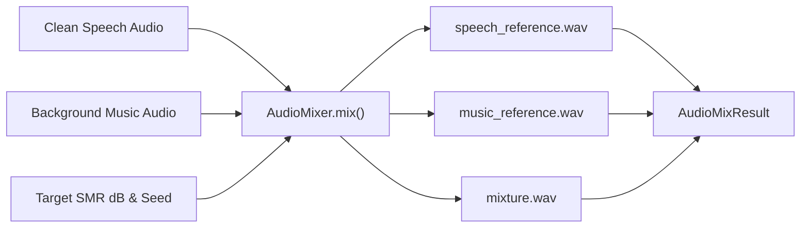

# 05. Benchmark Separation & Audio Mixing

[← 04. Zero Contamination](04_zero_contamination_diarization.md) | [Docs Index](README.md) | [Next: 06. Web Applications →](06_web_applications.md)

---

This module covers the **Separation Benchmark Mixing API** ([`src/benchmark/separation/mixer.py`](file:///home/nguyenlt/Documents/tts-data-pipeline/audio-prepare-pipeline-redo/src/benchmark/separation/mixer.py)) and reference benchmark datasets.



---

## 1. The `AudioMixer` API

**Defined in:** [`src/benchmark/separation/mixer.py`](file:///home/nguyenlt/Documents/tts-data-pipeline/audio-prepare-pipeline-redo/src/benchmark/separation/mixer.py)

`AudioMixer` combines isolated speech stems with musical accompaniment under controlled, repeatable Signal-to-Music Ratio (SMR / SNR dB) levels to evaluate source separators.

### `AudioMixer.mix(...) -> AudioMixResult`

```python
def mix(
    self,
    speech: Audio,
    music: Audio,
    *,
    target_smr_db: float,
    seed: int = 42,
    output_dir: str | Path | None = None,
) -> AudioMixResult:
```

### Mixing Contract & Step-by-Step Execution

1. **Waveform Ingestion:** Decodes both `speech` and `music` files as floating-point numpy waveforms.
2. **Channel Standardization:** Normalizes both tracks to the mixer's configured channel count (default mono).
3. **Time Alignment & Looping:** Crops or seamlessly loops the music track to match the duration of the speech track. Uses `seed` for deterministic pseudo-random cropping offsets.
4. **RMS Level Calibration:** Calculates root-mean-square energy of both sources and computes the exact gain offset required to achieve `target_smr_db`:
   $$\text{Gain}_{\text{music}} = \text{RMS}_{\text{speech}} \cdot 10^{-\frac{\text{target\_smr\_db}}{20}}$$
5. **Peak Ceiling Protection:** If the combined peak amplitude exceeds the ceiling (default -0.5 dBFS), a common attenuation gain is applied equally to both stems and the mixture to prevent digital clipping.
6. **Artifact Generation:** Writes three pristine 44.1 kHz WAV files into `output_dir`:
   - `speech_reference.wav`: Clean speech target with applied global gain.
   - `music_reference.wav`: Time-aligned accompaniment target.
   - `mixture.wav`: Mixed audio track.
7. **Sidecar Generation:** Writes identity sidecar JSON metadata alongside each generated WAV artifact.
8. **Returns:** One `AudioMixResult` dataclass instance.

**Raises:** `ValueError` if either input is effectively silent, if mixer parameters are invalid, or if `output_dir` would overwrite an input file.

---

## 2. Benchmark Dataclasses

**Defined in:** [`src/benchmark/separation/schemas.py`](file:///home/nguyenlt/Documents/tts-data-pipeline/audio-prepare-pipeline-redo/src/benchmark/separation/schemas.py)

### `MixingParameters`
```python
@dataclass
class MixingParameters:
    target_smr_db: float
    seed: int
    speech_gain_linear: float
    music_gain_linear: float
    peak_limited: bool
```

### `AudioMixResult`
```python
@dataclass
class AudioMixResult:
    speech_reference: Audio
    music_reference: Audio
    mixture: Audio
    parameters: MixingParameters
```

### `BenchmarkDefinition`
Defines an evaluation suite specifying speech audio items, background music pools, SMR ranges (e.g. `[-5.0, 0.0, 5.0, 10.0]`), seed matrices, and output stems.

---

## 3. Literature Benchmark Comparison (DER Reference)

For public diarization benchmarks on standard datasets (AISHELL-4, AliMeeting, AMI SDM, VoxConverse, DIHARD 3, ViYT-Diar), see:

👉 [**Diarization Benchmark Paper Reference (`bench-paper-diarize.md`)**](bench-paper-diarize.md)

---

## 4. Usage Example

```python
from src.utils.AudioClass import Audio
from src.benchmark.separation import AudioMixer

speech = Audio.from_file(".data/quick_save/speech_track.wav")
music = Audio.from_file(".data/quick_save/bg_music.wav")

mixer = AudioMixer(sample_rate=44100, channels=1)
result = mixer.mix(
    speech=speech,
    music=music,
    target_smr_db=6.0,  # Speech is 6 dB louder than music
    seed=1337,
    output_dir=".data/benchmark/mix_001",
)

print("Mixture created at:", result.mixture.path)
print("Speech reference:", result.speech_reference.path)
print("Music reference:", result.music_reference.path)
```
