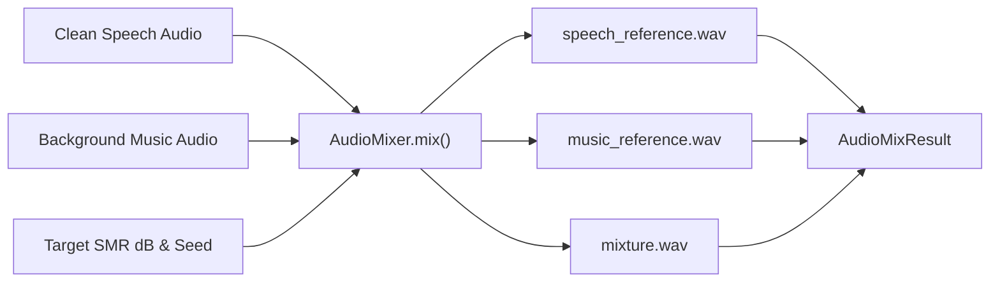

# 05. Benchmark Separation & Audio Mixing

[← 04. Zero Contamination](04_zero_contamination_diarization.md) | [Docs Index](README.md) | [Next: 06. Web Applications →](06_web_applications.md)

---

This module covers the **Separation Benchmark Mixing API** ([`src/benchmark/separation/mixer.py`](file:///home/nguyenlt/Documents/tts-data-pipeline/audio-prepare-pipeline-redo/src/benchmark/separation/mixer.py)) and reference benchmark datasets.



---

## 1. The `AudioMixer` API

**Defined in:** [`src/benchmark/separation/mixer.py`](file:///home/nguyenlt/Documents/tts-data-pipeline/audio-prepare-pipeline-redo/src/benchmark/separation/mixer.py)

`AudioMixer` combines isolated speech stems with musical accompaniment under controlled, repeatable Signal-to-Music Ratio (SMR / SNR dB) levels to evaluate source separators. Constructor: `AudioMixer(sample_rate=44100, channels=2, peak_ceiling_dbfs=-1.0)`.

### `AudioMixer.mix(...) -> AudioMixResult`

```python
def mix(
    self,
    speech: Audio,
    music: Audio,
    *,
    target_smr_db: float,
    seed: int,
    output_dir: str | Path,
) -> AudioMixResult:
```

`target_smr_db`, `seed`, and `output_dir` are all **required** keyword arguments (no defaults).

### Mixing Contract & Step-by-Step Execution

1. **Waveform Ingestion:** Decodes both `speech` and `music` files as `float64` waveforms via `soundfile` (`always_2d=True`), resampling with `librosa` when source rates differ from the mixer rate.
2. **Channel Standardization:** Normalizes both tracks to the mixer's configured channel count (default stereo `channels=2`; mono folds via mean, mono→stereo duplicates).
3. **Time Alignment & Looping:** Crops or seamlessly loops the music track to match the duration of the speech track. Uses `seed` for deterministic pseudo-random cropping offsets (`np.random.default_rng(seed)`; wrap-around looping when music is shorter).
4. **RMS Level Calibration:** Calculates root-mean-square energy of both sources and computes the exact gain offset required to achieve `target_smr_db` (`music_gain = RMS_speech / (RMS_music * 10^(target_smr_db/20))`; speech gain stays 0 dB):
   $$\text{Gain}_{\text{music}} = \frac{\text{RMS}_{\text{speech}}}{\text{RMS}_{\text{music}} \cdot 10^{\frac{\text{target\_smr\_db}}{20}}}$$
5. **Peak Ceiling Protection:** If the combined peak amplitude exceeds the ceiling (`peak_ceiling_dbfs`, default -1.0 dBFS), a common attenuation gain is applied equally to both stems and the mixture to prevent digital clipping (SMR is preserved; the applied gain is recorded as `common_output_gain_db`, and the realized post-limiting SMR as `realized_rms_smr_db`).
6. **Artifact Generation:** Writes three 32-bit-float WAV files (`subtype="FLOAT"`) at the mixer sample rate into `output_dir`:
   - `speech_reference.wav`: Clean speech target with applied global gain (`source_id="<speech>__speech_reference"`, history `+ "speech_ref"`).
   - `music_reference.wav`: Time-aligned accompaniment target (`source_id="<music>__music_reference"`, history `+ "music_ref"`).
   - `mixture.wav`: Mixed audio track (`source_id="<speech>__<music>__mixture"`, history `("mixed_speech_music", "smr_<X.X>dB")`).
7. **Sidecar Generation:** Writes identity sidecar JSON metadata alongside each generated WAV artifact (via `Audio.from_file`, which probes the written files).
8. **Returns:** One `AudioMixResult` dataclass instance.

**Raises:** `ValueError` if either input is effectively silent (RMS ≤ 1e-12), if mixer parameters are invalid (`sample_rate <= 0`, `channels not in (1,2)`, `peak_ceiling_dbfs > 0`), or if `output_dir` would overwrite an input file.

### Mixer Parameter Reference & Behavioral Tuning

| Parameter | Scope | Type & Range | Default | Increasing (+) Value | Decreasing (-) Value | The Core Trade-off |
|---|---|---|---|---|---|---|
| **`target_smr_db`** | `mix()` | `float` `[-30.0, +30.0 dB]` | *Required* | Speech dominates mixture; music is substantially attenuated. Easier separation benchmark. | Music overpowers speech; extreme stress-test for separation models (replicates club music or loud café ambiance). | **Benchmark Difficulty Level.** `+6 dB` represents typical podcast/video with soft background music; `-5 dB` represents heavy audio bleed stress-testing. |
| **`seed`** | `mix()` | `int` | *Required* | N/A | N/A | **Bit-Exact Reproducibility.** Deterministically sets crop offset of background music track via `np.random.default_rng(seed)`. |
| **`peak_ceiling_dbfs`** | Constructor | `float` `[-20.0, 0.0 dBFS]` | `-1.0 dBFS` | Allows higher peak output volume. Less headroom for inter-sample peaks or lossy encoding (MP3/AAC). | Lowers master volume; guarantees large safety headroom against DAC reconstruction clipping. | **Master Volume vs. Digital Inter-Sample Headroom.** |
| **`sample_rate`** | Constructor | `int` `[8000, 96000 Hz]` | `44100 Hz` | Higher acoustic bandwidth up to Nyquist limit; larger WAV files on disk. | Smaller file size; limits frequency spectrum to Nyquist frequency ($\frac{\text{SR}}{2}$). | **Acoustic Bandwidth Fidelity vs. Memory Footprint.** |
| **`channels`** | Constructor | `int` `{1, 2}` | `2` (Stereo) | Emits stereo mixtures preserving spatial panning. | Emits mono mixtures (folds channels via mean); halves file size and memory footprint. | **Spatial Panning Representation vs. Processing Memory.** |

---

## 2. Benchmark Dataclasses

**Defined in:** [`src/benchmark/separation/schemas.py`](file:///home/nguyenlt/Documents/tts-data-pipeline/audio-prepare-pipeline-redo/src/benchmark/separation/schemas.py)

### `MixingParameters`
```python
@dataclass
class MixingParameters:
    target_smr_db: float
    sample_rate: int
    channels: int
    seed: int
    music_start_sample: int
    speech_gain_db: float            # always 0.0 (speech is the reference)
    music_gain_db: float
    common_output_gain_db: float     # peak-limiting attenuation (0.0 when untouched)
    peak_ceiling_dbfs: float
    mixer_version: str               # "2"
    speech_lufs_before: float | None = None
    music_lufs_before: float | None = None
    realized_rms_smr_db: float | None = None
```

### `AudioMixResult`
```python
@dataclass
class AudioMixResult:
    speech_reference: Audio
    music_reference: Audio
    mixture: Audio
    parameters: MixingParameters
```

### `BenchmarkDefinition`
One planned mixture *before* it is rendered:
```python
@dataclass
class BenchmarkDefinition:
    sample_id: str
    speech_path: str
    music_path: str
    music_category: MusicCategory   # ACOUSTIC | ORCHESTRAL | TRADITIONAL
    difficulty: Difficulty           # EASY | MEDIUM | HARD
    target_smr_db: float
    seed: int
```
(A fully rendered sample is a `SeparationBenchmarkSample`: planned definition + speech/music sources + the three rendered `AudioMixResult` files + mixing parameters.)

---

## 3. Literature Benchmark Comparison (DER Reference)

For public diarization benchmarks on standard datasets (AISHELL-4, AliMeeting, AMI SDM, VoxConverse, DIHARD 3, ViYT-Diar), see:

👉 [**Diarization Benchmark Paper Reference (`bench-paper-diarize.md`)**](bench-paper-diarize.md)

---

## 4. Usage Example

```python
from src.utils.AudioClass import Audio
from src.benchmark.separation import AudioMixer

speech = Audio.from_file(".data/quick_save/speech_track.wav")
music = Audio.from_file(".data/quick_save/bg_music.wav")

mixer = AudioMixer(sample_rate=44100, channels=1)
result = mixer.mix(
    speech=speech,
    music=music,
    target_smr_db=6.0,  # Speech is 6 dB louder than music
    seed=1337,
    output_dir=".data/benchmark/mix_001",
)

print("Mixture created at:", result.mixture.path)
print("Speech reference:", result.speech_reference.path)
print("Music reference:", result.music_reference.path)
```
