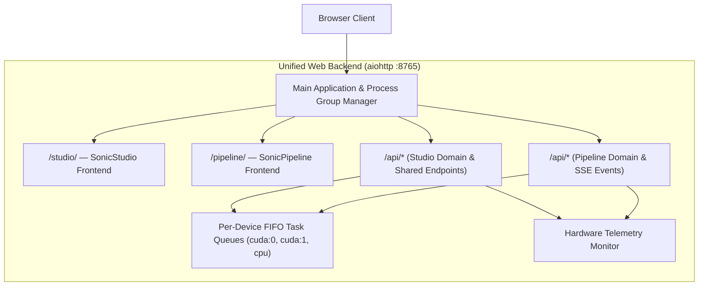

# 06. Web Applications (SonicStudio & SonicPipeline)

[← 05. Benchmark & Mixing](05_benchmark_and_mixing.md) | [Docs Index](README.md) | [Next: 07. Data Contracts →](07_data_contracts.md)

---

This module documents the shared backend server architecture and the two independent web interfaces: **SonicStudio** (interactive exploration workbench) and **SonicPipeline** (large-scale channel-oriented batch processing engine).



---

## 1. Unified Web Server Architecture

**Defined in:** [`src/web_backend/server.py`](file:///home/nguyenlt/Documents/tts-data-pipeline/audio-prepare-pipeline-redo/src/web_backend/server.py)

A single asynchronous `aiohttp` web server serves both user interfaces and route domains on port `8765`.

### Launching the Backend
```bash
./scripts/start_web.sh [port] [host]
# or
uv run python scripts/start_web.py --host 127.0.0.1 --port 8765
```
- **SonicStudio URL:** `http://127.0.0.1:8765/studio/`
- **SonicPipeline URL:** `http://127.0.0.1:8765/pipeline/`
- **Root Redirect:** Visiting `/` automatically redirects to `/studio/`.
- **Health Check:** `GET /api/health` returns status and frontend mount points.

### Process & Shutdown Management
- **Dedicated Process Group:** On startup, `_ensure_own_process_group()` isolates the server so child processes can be terminated cleanly.
- **Graceful Shutdown Watchdog:** When the server stops, pending and running jobs in both Studio and Pipeline are cancelled, and all descendant CLI processes (`yt-dlp`, `ffmpeg`, Demucs, MVSEP) are forcefully reaped via `terminate_descendant_processes()`.

---

## 2. SonicStudio (`src/web_studio/`)

**Frontend:** Flat vanilla HTML/CSS/JS (`static/index.html`, `app.js`, `style.css`, `experiment.js`, `experiment.css`).

Designed for single-track interactive inspection, A/B audio comparison, manual cutting, known-speaker enrollment, and zero-contamination experimentation.

### Workbench Tabs
1. **Workspace:** Audio file ingestion, playback, interactive multi-channel waveform view, and timeline scrubbing.
2. **Separation:** Single-model vocal/instrumental separation with live progress reporting.
3. **Diarization:** Multi-engine diarization, interactive turn inspector, and speaker stem extraction.
4. **Annotate & Evaluate:** Ground-truth manual reference annotation and DER/JER benchmark evaluation.
5. **Speaker Purity:** Direct-audio multimodal verification (Gemma 4, Gemini, VibeVoice-ASR) of candidate turns.
6. **Audition:** Multi-track A/B comparison player for comparing raw vs clean or different separator stems.
7. **Library:** Global file explorer scanning `.data/`, `benchmarks/`, `temp/`, and `data/`.
8. **Experiment (Zero Contamination):** Single-speaker TTS harvesting interface with attrition funnel visualization.

### Key Studio Endpoints

#### Audio Visualization & Waveforms
- `GET /api/audio/{id}/waveform?start_s=&end_s=&bins=`: Computes min/max waveform envelope arrays for sample-accurate linear rendering. Preserves separate channels without destructive downmixing.
- `GET /api/audio/{id}/spectrogram?start_s=&end_s=&width=&height=`: Generates marginless linear-frequency PNG spectrograms.
- `GET /api/audio/{id}/segment?start=&end=&inline=1`: Streams or downloads a bounded sub-segment of an audio track without registering a cut.
- `POST /api/audio/{id}/segments.zip`: Packs up to 2,000 turn cuts into a single ZIP archive on demand.

#### Known Speaker Profiles
- `GET /api/speaker-profiles`: Lists enrolled global speaker identities.
- `POST /api/speaker-profiles`: Enrolls a new profile from session clips.
- `GET/DELETE /api/speaker-profiles/{name}`: Inspects or deletes a profile.
- `POST /api/speaker-profiles/{name}/clips`: Appends additional clean reference audio clips.

#### Diarization Results & Annotations
- `GET /api/diarization/results`: Lists durable schema-2.0 results saved in `.data/diarization/results/`.
- `GET /api/diarization/results/{result_id}`: Retrieves complete result and re-registers source audio into the session.
- `POST /api/diarization/clean-turns`: Computes non-mutating derived turns (jitter correction, collar trimming, gap merging).
- `POST /api/diarization/extract-speaker`: Cuts and extracts speaker-specific vocal stems with optional pre/post-roll.
- `POST /api/diarization/annotations`: Creates or revision-updates manual ground-truth reference annotations.
- `POST /api/diarization/evaluate`: Runs Hungarian-matched DER/JER evaluation comparing hypotheses against reference.

#### Experiment Tab (Zero Contamination)
- `GET /api/experiment/status`: Probes available diarization backends and compute accelerators.
- `POST /api/experiment/run`: Enqueues an asynchronous `experiment_zero_contamination` job. Streams stage-by-stage SSE progress.
- `POST /api/experiment/gemma/probe`: Probes Unsloth/Gemma 4 endpoint readiness.
- `POST /api/experiment/gemma/test`: Auditions live Gemma 4 overlap classification on the selected track.

---

## 3. SonicPipeline (`src/web_pipeline/`)

**Frontend:** Flat vanilla HTML/CSS/JS (`static/index.html`, `app.js`, `style.css`). Real-time telemetry and queue updates powered by Server-Sent Events (`GET /api/events`).

Designed for high-throughput batch operations: channel ingestion, bulk separation, batch diarization, dataset tagging, and ML manifest bundling.

### Architecture Components
- **Per-Device Task Queue (`queue_manager.py`):**
  - Independent FIFO lanes for `cuda:0`, `cuda:1`, `cpu`, etc.
  - Configurable worker concurrency per device (1–8).
  - CPU-bound tasks (e.g. YouTube metadata ingest) never compete for GPU slots.
- **Dataset Manager (`dataset_manager.py`):**
  - Durable audio catalog persisted in `.data/pipeline/dataset_registry.json`.
  - Groups items into `Channel · <name>` collections.
  - Tag namespaces: pipeline-managed `system_tags` (`type:`, `stage:`, `speaker:`, `profile:`, `verification:`) and user-editable `custom_tags`.
  - ML manifest exports: JSONL, CSV, and full ZIP bundles with relative paths.
- **Hardware Telemetry Monitor (`hardware_monitor.py`):**
  - Real-time polling of CPU utilization, RAM usage, and disk space.
  - Per-GPU metrics: VRAM allocation, host VRAM usage, temperature, power draw, and real-time processing speedup factor ($N\times$ Realtime).

### Key Pipeline Endpoints
- `GET /api/events`: Server-Sent Events (SSE) streaming live job queue updates and hardware telemetry heartbeats.
- `GET /api/channels`: Aggregates duration, separation, and diarization coverage per channel.
- `GET /api/items`: Filterable item registry querying by dataset, channel, tags, stage, format, and duration.
- `POST /api/jobs/batch_separation`: Enqueues bulk vocal/instrumental separation across channels or dataset queries.
- `POST /api/jobs/batch_diarization`: Enqueues multi-file diarization with configurable Sortformer hysteresis parameters.
- `POST /api/jobs/target_speaker_filter`: Scores candidate diarization turns against an enrolled speaker profile, exporting qualified cuts and updating target-speaker metadata summaries.
- `POST /api/queue/controls`: Dynamically alters workers-per-device concurrency or pauses queue lanes.

---

## 4. Complete Endpoint Catalog

| Method | Endpoint | Domain | Description |
|---|---|---|---|
| `GET` | `/api/health` | Shared | Server health check and mounted frontends status. |
| `GET` | `/api/telemetry` | Shared | Real-time CPU, RAM, disk, and GPU hardware metrics. |
| `GET` | `/api/queue/shared` | Shared | Unified cross-platform task queue status. |
| `DELETE` | `/api/queue/shared/{id}` | Shared | Cancels a queued or running task in either application. |
| `GET` | `/api/library` | Studio | Scans filesystem audio files and returns category counts. |
| `POST` | `/api/library/load` | Studio | Registers an existing file into the active audio session. |
| `GET` | `/api/audio/{id}/waveform` | Studio | Generates min/max envelope points for interactive waveform rendering. |
| `GET` | `/api/audio/{id}/spectrogram` | Studio | Generates linear-frequency PNG spectrogram. |
| `GET` | `/api/audio/{id}/segment` | Studio | Fast HTTP stream / download of bounded audio cuts. |
| `POST` | `/api/audio/{id}/segments.zip` | Studio | ZIP export of multiple turn audio cuts. |
| `GET/POST`| `/api/speaker-profiles` | Studio | Lists or enrolls global speaker profiles. |
| `GET` | `/api/diarization/results` | Studio | Lists persisted diarization results catalog. |
| `POST` | `/api/diarization/clean-turns` | Studio | Derives cleaned, non-overlapping turns from raw intervals. |
| `POST` | `/api/diarization/extract-speaker` | Studio | Slices and exports speaker vocal stems. |
| `POST` | `/api/diarization/evaluate` | Studio | Computes Hungarian-matched DER/JER against manual ground truth. |
| `POST` | `/api/diarization/results/verify` | Studio | Batch direct-audio overlap verification of candidate turns. |
| `GET` | `/api/experiment/status` | Studio | Probes engines and GPUs for zero-contamination pipeline. |
| `POST` | `/api/experiment/run` | Studio | Launches zero-contamination extreme-precision diarization job. |
| `GET` | `/api/events` | Pipeline | Server-Sent Events (SSE) telemetry and job status stream. |
| `GET` | `/api/channels` | Pipeline | Channel-level summary statistics and coverage metrics. |
| `GET` | `/api/items` | Pipeline | Filtered dataset audio item query. |
| `POST` | `/api/jobs/batch_separation` | Pipeline | Bulk stem separation job launcher. |
| `POST` | `/api/jobs/batch_diarization` | Pipeline | Bulk multi-file diarization job launcher. |
| `POST` | `/api/jobs/target_speaker_filter` | Pipeline | Target speaker profile scoring and cut exporter job. |
