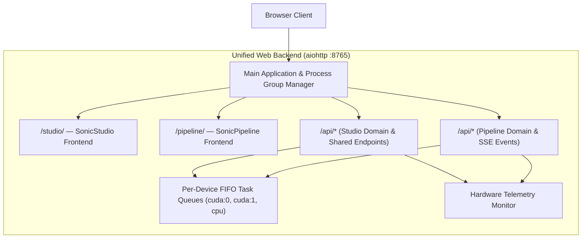

# 06. Web Applications (SonicStudio & SonicPipeline)

[← 05. Benchmark & Mixing](05_benchmark_and_mixing.md) | [Docs Index](README.md) | [Next: 07. Data Contracts →](07_data_contracts.md)

---

This module documents the shared backend server architecture and the two independent web interfaces: **SonicStudio** (interactive exploration workbench) and **SonicPipeline** (large-scale channel-oriented batch processing engine).



---

## 1. Unified Web Server Architecture

**Defined in:** [`src/web_backend/server.py`](../src/web_backend/server.py)

A single asynchronous `aiohttp` web server serves both user interfaces and route domains on port `8765`.

### Launching the Backend
```bash
./scripts/start_web.sh [port] [host]
# or
uv run python scripts/start_web.py --host 127.0.0.1 --port 8765
```
- **SonicStudio URL:** `http://127.0.0.1:8765/studio/`
- **SonicPipeline URL:** `http://127.0.0.1:8765/pipeline/`
- **Root Redirect:** Visiting `/` automatically redirects to `/studio/`.
- **Health Check:** `GET /api/health` returns status and frontend mount points.

### Process & Shutdown Management
- **Dedicated Process Group:** On startup, `_ensure_own_process_group()` isolates the server so child processes can be terminated cleanly.
- **Graceful Shutdown Watchdog:** When the server stops, pending and running jobs in both Studio and Pipeline are cancelled, and all descendant CLI processes (`yt-dlp`, `ffmpeg`, Demucs, MVSEP) are forcefully reaped via `terminate_descendant_processes()`.

---

## 2. SonicStudio (`src/web_studio/`)

**Frontend:** Flat vanilla HTML/CSS/JS (`static/index.html`, `app.js`, `style.css`, `experiment.js`, `experiment.css`).

Designed for single-track interactive inspection, A/B audio comparison, manual cutting, known-speaker enrollment, and zero-contamination experimentation.

### Workbench Tabs
1. **Workspace:** Audio file ingestion, playback, interactive multi-channel waveform view, and timeline scrubbing.
2. **Separation:** Single-model vocal/instrumental separation with live progress reporting.
3. **Diarization:** Multi-engine diarization, interactive turn inspector, and speaker stem extraction.
4. **Annotate & Evaluate:** Ground-truth manual reference annotation and DER/JER benchmark evaluation.
5. **Speaker Purity:** Direct-audio multimodal verification (Gemma 4, Gemini, VibeVoice-ASR) of candidate turns.
6. **Sample Labeler:** Interactive quality inspection and hand-labeling of DiarizationResult turns (`Accept`, `Contain background noise`, `Contain more than 1 speaker`, `Word being chopped off`) with rapid keyboard shortcuts, draft persistence, and physically decoupled dataset export with train/val/test splits.
7. **Experiment (Zero Contamination):** Single-speaker TTS harvesting interface with attrition funnel visualization.
8. **Audition:** Multi-track A/B comparison player for comparing raw vs clean or different separator stems.
9. **Library:** Global file explorer scanning `.data/`, `benchmarks/`, `temp/`, and `data/`.

### Key Studio Endpoints

#### Audio Visualization & Waveforms
- `GET /api/audio/{id}/waveform?start_s=&end_s=&bins=`: Computes min/max waveform envelope arrays for sample-accurate linear rendering. Preserves separate channels without destructive downmixing.
- `GET /api/audio/{id}/spectrogram?start_s=&end_s=&width=&height=`: Generates marginless linear-frequency PNG spectrograms.
- `GET /api/audio/{id}/segment?start=&end=&inline=1`: Streams or downloads a bounded sub-segment of an audio track without registering a cut.
- `POST /api/audio/{id}/segments.zip`: Packs up to 2,000 turn cuts into a single ZIP archive on demand.

#### Known Speaker Profiles
- `GET /api/speaker-profiles`: Lists enrolled global speaker identities.
- `POST /api/speaker-profiles`: Enrolls a new profile from session clips.
- `GET/DELETE /api/speaker-profiles/{name}`: Inspects or deletes a profile.
- `POST /api/speaker-profiles/{name}/clips`: Appends additional clean reference audio clips.

#### Diarization Results & Annotations
- `GET /api/diarization/results`: Lists durable schema-2.0 results saved in `.data/diarization/results/`.
- `GET /api/diarization/results/{result_id}`: Retrieves complete result and re-registers source audio into the session.
- `POST /api/diarization/clean-turns`: Computes non-mutating derived turns (jitter correction, collar trimming, gap merging).
- `POST /api/diarization/extract-speaker`: Cuts and extracts speaker-specific vocal stems with optional pre/post-roll.
- `POST /api/diarization/annotations`: Creates or revision-updates manual ground-truth reference annotations.
- `POST /api/diarization/evaluate`: Runs Hungarian-matched DER/JER evaluation comparing hypotheses against reference.

#### Sample Quality Labeler & Classifier Workbench
The **Sample Labeler** tab provides a clean multi-stage curation environment modeled after the Experiment tab's structured workflow:
- **Quality Criteria Legend:** Direct guidance on hand-labeling categories (`[1] Accept`, `[2] Noise`, `[3] >1 Speaker`, `[4] Chopped / lẹm chữ`).
- **Stage 1 (Session & Ingestion):** Diarization run loader with audio stream readiness preview chip.
- **Stage 2 (AI Classifier Trainer & Monitor):** Collapsible stage box featuring boundary-aware tri-scale pooling, multi-label BCE fine-tuning, and real-time W&B telemetry with interactive canvas curves.
- **Dataset Quality Overview:** Real-time attrition-style metric scorecards (`Total Turns`, `Labeled Progress`, `Accept`, `Noise`, `>1 Speaker`, `Word Chopped`).
- **Speech Turns Annotation Stream:** High-density, keyboard-driven workstation (`1`–`4`, `Space`, `J`/`K`) with streamlined turn cards, audio scrubbers, speaker chips, and per-sample WAV downloads from the selected source or stem.

API endpoints:
- `GET /api/labeler/results`: Lists durable DiarizationResults with labeling progress counts.
- `GET /api/labeler/session/{result_id}`: Loads complete DiarizationResult data with current draft labels.
- `POST /api/labeler/session/{result_id}/labels`: Autosaves/updates in-progress labeling draft to `.data/diarization/labels/<result_id>.json`.
- `GET /api/labeler/results/{result_id}/turns/{turn_index}/audio`: Cuts and streams audio for an individual turn.
- `POST /api/labeler/export-dataset`: Extracts all labeled audio turns into physically independent 16-bit WAV files under `.data/labeled_datasets/<name>/`, partitions into train/val/test splits (source-grouped to prevent data leakage, stratified, or random), and generates `manifest.json`, `dataset.jsonl`, `train.csv`, `val.csv`, `test.csv`, and `train_classifier.py`.
- `GET /api/labeler/datasets`: Lists exported datasets with sample distribution statistics.
- `GET /api/labeler/datasets/{name}/download`: Packages and streams dataset folder as a ZIP archive.
- `POST /api/labeler/train`: Enqueues an end-to-end multi-label quality defect classifier training job. Supports differential learning rates (`lr_backbone=1e-5`, `lr_head=5e-4`), boundary-aware tri-scale pooling $[H_{\text{onset}}, H_{\text{global}}, H_{\text{offset}}]$, multi-label `BCEWithLogitsLoss`, fine-tuning modes (`full`, `top_layers`, `frozen`), and native Weights & Biases cloud telemetry.
- `GET /api/labeler/train/status/{task_id}`: Polls live epoch progress, loss, clean speech accept accuracy, defect F1s (`has_noise`, `has_multi_speaker`, `is_chopped`), batch step loss trajectory, live `wandb_url`, history table, and console logs.
- `POST /api/labeler/train/cancel/{task_id}`: Cooperatively aborts an active training run and finishes any active WandB run.
- `GET /api/labeler/models`: Catalogs trained classifier checkpoints in `.data/diarization/models/` with best validation metrics and weights paths.
- `GET /api/labeler/wandb/status`: Detects `WANDB_API_KEY` from `.env` on server and returns project/entity defaults.
- **W&B Live Telemetry & Interactive Charts:** Renders hardware-accelerated HTML5 Canvas curves for Loss Trajectory (`train/loss` vs `val/loss`), Defect & Accept F1s (`clean_accept_accuracy`, `noise_f1`, `multi_speaker_f1`, `chopped_f1`), and Batch Step Loss. Features hover crosshair cursors, floating tooltip inspection, legend metric toggles, and direct `Open in Weights & Biases ↗` cloud dashboard linking.

#### Experiment Tab (Zero Contamination)
- Section 5a exposes one **Direct-audio model** selector containing Local Gemma
  and every supported Google Gemini audio model. Choosing Gemini automatically
  routes through the server-side API key; choosing Local Gemma reveals the
  OpenAI-compatible endpoint and checkpoint controls. Its configuration,
  readiness probe, prompt editor, and live-selection verifier stay visible while
  the gate is disabled; the **Enable** toggle controls only whether the full
  experiment runs per-candidate verification.
- `GET /api/experiment/status`: Probes available diarization backends and compute accelerators.
- `POST /api/experiment/run`: Enqueues an asynchronous `experiment_zero_contamination` job. Streams stage-by-stage SSE progress.
- `POST /api/experiment/direct-audio/probe`: Reports local Gemma or server-side Gemini API readiness.
- `POST /api/experiment/direct-audio/test`: Auditions the selected verifier and returns purity, word completeness, failure evidence, and optional Gemini usage/cost. Legacy `/gemma/probe` and `/gemma/test` aliases remain mounted.

---

## 3. SonicPipeline (`src/web_pipeline/`)

**Frontend:** Flat vanilla HTML/CSS/JS (`static/index.html`, `app.js`, `style.css`). Real-time telemetry and queue updates powered by Server-Sent Events (`GET /api/events`).

Designed for high-throughput batch operations: channel ingestion, bulk separation, batch diarization, dataset tagging, and ML manifest bundling.

### Architecture Components
- **Per-Device Task Queue (`queue_manager.py`):**
  - Independent FIFO lanes for `cuda:0`, `cuda:1`, `cpu`, etc.
  - Configurable worker concurrency per device (1–8).
  - CPU-bound tasks (e.g. YouTube metadata ingest) never compete for GPU slots.
- **Dataset Manager (`dataset_manager.py`):**
  - Durable audio catalog persisted in `.data/pipeline/dataset_registry.json`.
  - Groups items into `Channel · <name>` collections.
  - Tag namespaces: pipeline-managed `system_tags` (`type:`, `stage:`, `speaker:`, `profile:`, `verification:`) and user-editable `custom_tags`.
  - ML manifest exports: JSONL, CSV, and full ZIP bundles with relative paths.
- **Hardware Telemetry Monitor (`hardware_monitor.py`):**
  - Real-time polling of CPU utilization, RAM usage, and disk space.
  - Per-GPU metrics: VRAM allocation, host VRAM usage, temperature, power draw, and real-time processing speedup factor ($N\times$ Realtime).

### Key Pipeline Endpoints
- `GET /api/events`: Server-Sent Events (SSE) streaming live job queue updates and hardware telemetry heartbeats.
- `GET /api/channels`: Aggregates duration, separation, and diarization coverage per channel.
- `GET /api/items`: Filterable item registry querying by dataset, channel, tags, stage, format, and duration.
- `POST /api/jobs/batch_separation`: Enqueues bulk vocal/instrumental separation across channels or dataset queries.
- `POST /api/jobs/batch_diarization`: Enqueues multi-file diarization with configurable Sortformer hysteresis parameters.
- `POST /api/jobs/target_speaker_filter`: Scores candidate diarization turns against an enrolled speaker profile, exporting qualified cuts and updating target-speaker metadata summaries.
- `POST /api/queue/controls`: Dynamically alters workers-per-device concurrency or pauses queue lanes.

---

## 4. Key Endpoint Catalog

Representative routes (see `register_api_routes` in `src/web_studio/server.py`, `register_experiment_routes` in `src/web_studio/experiment_handler.py`, and the route table in `src/web_pipeline/server.py` for the exhaustive list):

| Method | Endpoint | Domain | Description |
|---|---|---|---|
| `GET` | `/api/health` | Shared | Server health check and mounted frontends status. |
| `GET` | `/api/telemetry` | Shared | Real-time CPU, RAM, disk, and GPU hardware metrics. |
| `GET` | `/api/queue/shared` | Shared | Unified cross-platform task queue status. |
| `DELETE` | `/api/queue/shared/{id}` | Shared | Cancels a queued or running task in either application. |
| `GET` | `/api/library` | Studio | Scans filesystem audio files (roots: `.data/`, `data/`, `temp/`, `benchmarks/`) and returns category counts. |
| `POST` | `/api/library/load` | Studio | Registers an existing file into the active audio session. |
| `GET` | `/api/audio/{id}/waveform` | Studio | Generates min/max envelope points for interactive waveform rendering. |
| `GET` | `/api/audio/{id}/spectrogram` | Studio | Generates linear-frequency PNG spectrogram. |
| `GET` | `/api/audio/{id}/segment` | Studio | Fast HTTP stream / download of bounded audio cuts. |
| `POST` | `/api/audio/{id}/cut` | Studio | Registers a bounded cut as a new session audio. |
| `POST` | `/api/audio/{id}/quick-save` | Studio | Persists to `.data/quick_save/` with fingerprint filename. |
| `POST` | `/api/audio/{id}/save-to` | Studio | Copies to an explicit destination + sidecar. |
| `POST` | `/api/audio/upload` | Studio | Uploads audio (500 MB max) into the session. |
| `POST` | `/api/audio/youtube` | Studio | Ingests a YouTube URL via `YtCrawler`. |
| `POST` | `/api/audio/{id}/segments.zip` | Studio | ZIP export of up to 2,000 (`MAX_SEGMENT_ZIP_ITEMS`) turn audio cuts. |
| `POST` | `/api/separation/run` | Studio | Single-model separation job. |
| `POST` | `/api/separation/batch-compare` | Studio | Multi-backend comparison job. |
| `POST` | `/api/diarization/run` | Studio | Multi-engine diarization job. |
| `GET/POST`| `/api/speaker-profiles` | Studio | Lists or enrolls global speaker profiles. |
| `GET` | `/api/diarization/results` | Studio | Lists persisted diarization results catalog. |
| `POST` | `/api/diarization/clean-turns` | Studio | Derives cleaned, non-overlapping turns from raw intervals. |
| `POST` | `/api/diarization/extract-speaker` | Studio | Slices and exports speaker vocal stems. |
| `POST` | `/api/diarization/extract-all-speakers` | Studio | Batch-extracts every speaker's stems. |
| `POST` | `/api/diarization/evaluate` | Studio | Computes Hungarian-matched DER/JER against manual ground truth. |
| `POST` | `/api/diarization/results/verify` | Studio | Batch direct-audio overlap verification of candidate turns. |
| `GET` | `/api/diarization/results/{result_id}/turns/{turn_index}/audio` | Studio | Previews a single turn's audio. |
| `GET/POST/DELETE` | `/api/diarization/annotations...` | Studio | Lists, saves (revision-checked), fetches, deletes manual annotations. |
| `POST` | `/api/diarization/target-speaker-score` | Studio | Scores turns against an enrolled profile. |
| `GET/POST` | `/api/purity/config`, `/api/purity/verify`, `/api/purity/export-audio` | Studio | Purity verifier config, verification, audio export. |
| `GET/POST/DELETE` | `/api/tasks`, `/api/tasks/{id}` | Studio | Task queue listing, clearing, cancellation. |
| `GET` | `/api/queue/shared` | Shared | Unified cross-platform task queue status. |
| `DELETE` | `/api/queue/shared/{id}` | Shared | Cancels a queued or running task in either application. |
| `GET` | `/api/telemetry` | Shared | Real-time CPU, RAM, disk, and GPU hardware metrics. |
| `GET` | `/api/experiment/status` | Studio | Probes engines and GPUs for zero-contamination pipeline. |
| `POST` | `/api/experiment/run` | Studio | Launches zero-contamination extreme-precision diarization job. |
| `GET` | `/api/events` | Pipeline | Server-Sent Events (SSE) telemetry and job status stream. |
| `GET/POST/DELETE` | `/api/datasets`, `/api/datasets/{name}` | Pipeline | Dataset collection CRUD. |
| `GET` | `/api/channels` | Pipeline | Channel-level summary statistics and coverage metrics. |
| `GET` | `/api/items` | Pipeline | Filtered dataset audio item query. |
| `GET/PATCH/POST` | `/api/items/{id}`, `/api/items/delete`, `/api/items/bulk_tag`, `/api/items/bulk_dataset` | Pipeline | Item fetch/update/delete, bulk tagging and dataset moves. |
| `GET` | `/api/items/{id}/stream`, `/api/items/{id}/download` | Pipeline | Audio streaming and download. |
| `GET/POST/DELETE` | `/api/jobs`, `/api/jobs/{id}`, `/api/jobs/{id}/cancel` | Pipeline | Job listing, fetch, cancel, delete. |
| `POST` | `/api/jobs/batch_ingest_yt`, `/api/jobs/batch_ingest_files`, `/api/jobs/batch_upload` | Pipeline | Bulk ingestion job launchers. |
| `POST` | `/api/jobs/batch_separation` | Pipeline | Bulk stem separation job launcher. |
| `POST` | `/api/jobs/batch_diarization` | Pipeline | Bulk multi-file diarization job launcher. |
| `POST` | `/api/jobs/target_speaker_filter` | Pipeline | Target speaker profile scoring and cut exporter job. |
| `POST` | `/api/jobs/batch_benchmark` | Pipeline | Benchmark-matrix generation job launcher. |
| `POST` | `/api/queue/controls` | Pipeline | Alters workers-per-device concurrency or pauses lanes. |
| `POST` | `/api/manifests/generate` | Pipeline | ML manifest export (JSONL/CSV). |
| `POST/GET` | `/api/exports/create`, `/api/exports/download/{filename}` | Pipeline | ZIP bundle export creation and download. |
| `GET` | `/api/benchmarks`, `/api/benchmarks/{id}` | Pipeline | Benchmark suite listing and fetch. |
