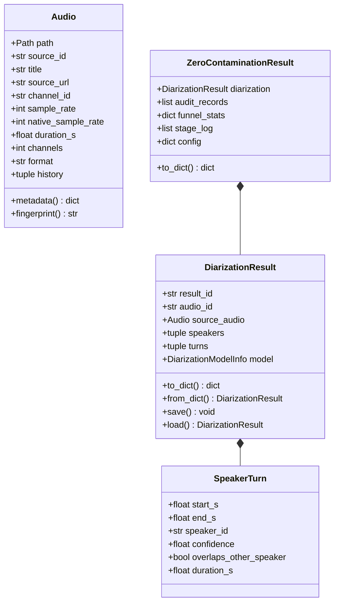

# 07. Data Contracts & Serialization Schemas

[← 06. Web Applications](06_web_applications.md) | [Docs Index](README.md)

---

This module documents the canonical data schemas, serialization models, and persistence formats across the audio preparation pipeline.



---

## 1. `Audio` Contract

**Defined in:** [`src/utils/AudioClass.py`](file:///home/nguyenlt/Documents/tts-data-pipeline/audio-prepare-pipeline-redo/src/utils/AudioClass.py)

`Audio` is a file-backed identity dataclass.

| Field | Type | Description |
|---|---|---|
| `path` | `Path` | Concrete audio artifact path on disk. |
| `source_id` | `str` | Video or audio identifier (e.g. YouTube 11-char ID). Stable across all derived stems and cuts. |
| `title` | `str \| None` | Display title of the recording. |
| `source_url` | `str \| None` | Original URL (e.g. YouTube watch link). |
| `channel_id` | `str \| None` | Uploader / channel identifier. |
| `channel_name` | `str \| None` | Human-readable uploader / channel name. |
| `channel_url` | `str \| None` | Canonical channel URL. |
| `sample_rate` | `int \| None` | Current file sample rate (Hz). |
| `native_sample_rate` | `int \| None` | Original capture rate prior to any resampling. |
| `duration_s` | `float \| None` | Duration in seconds. |
| `channels` | `int \| None` | Channel count (typically `1` for mono). |
| `format` | `str` | File extension/container format (default `"wav"`). |
| `history` | `tuple[str, ...]` | Ordered sequence of transformation tags. |

### Companion Identity Sidecar (`{stem}.json`)
Whenever an `Audio` object is saved, an adjacent JSON sidecar is written:
```json
{
  "source_id": "dQw4w9WgXcQ",
  "title": "Rick Astley - Never Gonna Give You Up",
  "source_url": "https://www.youtube.com/watch?v=dQw4w9WgXcQ",
  "channel_id": "UCuAXFkgsw1L7xaCfnd5JJOw",
  "channel_name": "Rick Astley",
  "channel_url": "https://www.youtube.com/channel/UCuAXFkgsw1L7xaCfnd5JJOw",
  "sample_rate": 44100,
  "native_sample_rate": 48000,
  "duration_s": 213.25,
  "channels": 1,
  "format": "wav",
  "history": ["yt_download", "demucs_vocals"]
}
```

---

## 2. Diarization Schemas (Schema 2.0)

**Defined in:** [`src/diarization/schemas.py`](file:///home/nguyenlt/Documents/tts-data-pipeline/audio-prepare-pipeline-redo/src/diarization/schemas.py)

`DiarizationResult` is the universal, backend-independent representation of speaker segmentation.

### `DiarizationResult`
- **Fields:**
  - `result_id`: Unique stable UUID string.
  - `audio_id`: Identifier matching `source_audio.source_id`.
  - `source_audio`: Complete embedded `Audio` snapshot.
  - `created_at`: ISO-8601 creation timestamp.
  - `speakers`: Tuple of distinct `Speaker` records.
  - `turns`: Tuple of chronological `SpeakerTurn` records.
  - `model`: `DiarizationModelInfo` (backend name, model ID, parameters).
  - `channel_id`, `channel_name`, `channel_url`: Provenance copied from `source_audio`.
- **Derived Properties:**
  - `speaker_count`: Number of distinct speakers.
  - `turn_count`: Total number of turns.
  - `total_speech_duration_s`: Sum of turn durations.
  - `duration_per_speaker_s`: Mapping of `speaker_id` to total duration.
  - `turns_by_speaker`: Mapping of `speaker_id` to list of turns.
- **Serialization & Persistence:**
  - `to_dict()`: Exports schema 2.0 dictionary.
  - `from_dict(d)`: Reconstructs object with backwards-tolerant parsing (clamps overshoot timestamps, restores missing speakers).
  - `save(path)`: Atomic write with `.tmp` swap to prevent corrupt files on crash.
  - `load(path)`: Restores from JSON file on disk.

### `SpeakerTurn`
Represents an individual continuous speech segment:
```python
@dataclass(frozen=True)
class SpeakerTurn:
    start_s: float
    end_s: float
    speaker_id: str
    confidence: float = 1.0
    overlaps_other_speaker: bool = False
```

### `Speaker`
Represents a distinct speaker identity:
```python
@dataclass(frozen=True)
class Speaker:
    speaker_id: str                 # Local ID, e.g. "spk_00"
    label: str                      # Display label
    global_speaker_id: str | None   # Profile link if enrolled
```

---

## 3. Manual Ground-Truth Annotations

**Schema:** `kind: "diarization.annotation"`, version `1.0`.

Stored under `.data/diarization/annotations/<id>.json`:
- `annotation_id`, `revision`, `created_at`, `updated_at`, `name`.
- `audio_id` and complete `source_audio` metadata snapshot.
- `speakers`: Array of speaker definitions with custom colors and labels.
- `turns`: Array of `{turn_id, speaker_id, start_s, end_s}` preserved to microsecond precision. Same-speaker overlaps are merged; cross-speaker overlaps are retained on separate lanes.
- `seed`: Optional provenance metadata (`result_id`, `model`, `created_at`) when initialized from an AI diarization run.
- **Concurrency Control:** Updates require matching `revision` numbers (HTTP 409 Conflict returned on stale edits).

---

## 4. Speaker Profile Schema (`SpeakerProfile`)

Stored under `.data/speaker_profiles/<name>/profile.json`:
```json
{
  "schema_version": "1.0",
  "name": "narrator_01",
  "clip_names": ["clip_00.wav", "clip_01.wav"],
  "clip_paths": [
    ".data/speaker_profiles/narrator_01/clips/clip_00.wav",
    ".data/speaker_profiles/narrator_01/clips/clip_01.wav"
  ],
  "created_at": "2026-09-01T12:00:00Z",
  "updated_at": "2026-09-01T12:30:00Z",
  "channel_id": "UC...",
  "channel_name": "Channel Name"
}
```

---

## 5. Purity Verification Schemas

### `SpeakerPurityResult` (Embedding Purity)
```python
@dataclass
class SpeakerPurityResult:
    audio_id: str
    speaker_id: str
    start_s: float
    end_s: float
    profile_name: str
    decision: str                      # "pass", "reject", "error"
    reason: str                        # "single_speaker", "overlap_detected", etc.
    overlap_duration_s: float = 0.0
    overlap_ratio: float = 0.0
    windows: list[dict] = field(default_factory=list)
    min_target_similarity: float | None = None
    error_message: str | None = None
```

### `VibeVoicePurityResult` (Foundation ASR Purity)
```python
@dataclass
class VibeVoicePurityResult:
    schema_version: str = "1.0"
    audio_id: str
    decision: str                      # "pass", "reject", "uncertain"
    reason: str                        # "single_speaker", "multiple_speakers", etc.
    num_speakers: int = 1
    secondary_speech_s: float = 0.0
    speaker_turns: tuple[VibeVoiceSpeakerTurn, ...] = ()
    dominant_speaker_id: int | None = None
    model: DiarizationModelInfo | None = None
    error: str | None = None
```

### `OverlapVerificationResult` (Multimodal LLM Purity)
Returned by Gemma 4 and Gemini overlap verifiers:
```python
@dataclass
class OverlapVerificationResult:
    overlap: bool
    reason: str
```

---

## 6. Zero-Contamination Schemas (`ZeroContaminationResult`)

Defined in [`src/diarization/zero_contamination.py`](file:///home/nguyenlt/Documents/tts-data-pipeline/audio-prepare-pipeline-redo/src/diarization/zero_contamination.py):

```json
{
  "diarization": { ... },
  "audit_records": [
    {
      "turn_id": "pure_turn_0000",
      "speaker_id": "spk_00",
      "original_start_s": 1.25,
      "original_end_s": 5.40,
      "start_s": 1.60,
      "end_s": 5.05,
      "duration_s": 3.45,
      "status": "passed",
      "rejection_reason": "Pure single-speaker guaranteed",
      "transcript": "chào các bạn",
      "min_similarity": 0.882,
      "gemma_decision": { "overlap": false, "reason": "Single speaker clear speech" },
      "vibevoice_decision": null
    }
  ],
  "funnel_stats": {
    "audio_duration_s": 120.5,
    "initial_turns_count": 28,
    "initial_speech_duration_s": 78.4,
    "consensus_turns_count": 22,
    "consensus_speech_duration_s": 64.2,
    "eroded_turns_count": 18,
    "eroded_speech_duration_s": 49.8,
    "syllables_rescued_count": 14,
    "homogeneity_turns_count": 16,
    "final_pure_turns_count": 15,
    "final_pure_speech_duration_s": 42.6,
    "total_elapsed_s": 8.42,
    "contamination_risk_rating": "NEGLIGIBLE (<0.1% estimated 2-speaker leakage)"
  },
  "stage_log": [ ... ],
  "config": { ... }
}
```

---

## 7. Pipeline `AudioItem` Schema

Stored in `.data/pipeline/dataset_registry.json`:
- Contains `Audio` fields directly (`source_id`, `title`, `sample_rate`, etc.).
- `custom_tags`: User-editable tags (e.g. `podcast`, `favorite`).
- `system_tags`: Machine-managed namespaced tags (`type:speech`, `stage:diarized`, `speaker:narrator`, `profile:verified`, `turns:clean`).
- `stems`: Mapping of stem names to relative file paths.
- `metadata["target_speakers"]`: Target speaker filtering summaries per profile, including qualified segment count and duration percentages.

---

## 8. Persistence & Synchronization Conventions

1. **Repository-Relative Paths:** Persisted JSON files store repository-relative paths (e.g. `.data/pipeline/ingest/video.wav`) so data folders can be synced across machines (`tungnl5@VF-TUNGNL5-L` and `vsf@vsf-242`) without broken paths.
2. **Atomic Writes:** All schema saves write to `<path>.tmp` first, flushing to disk before an atomic POSIX rename.
3. **Data Sync Script (`scripts/sync/sync_data_to_server.sh`):** Synchronizes `.data/` using `rsync`, excluding host-local package caches and virtual environments listed in `scripts/sync/data_excludes.txt`.
