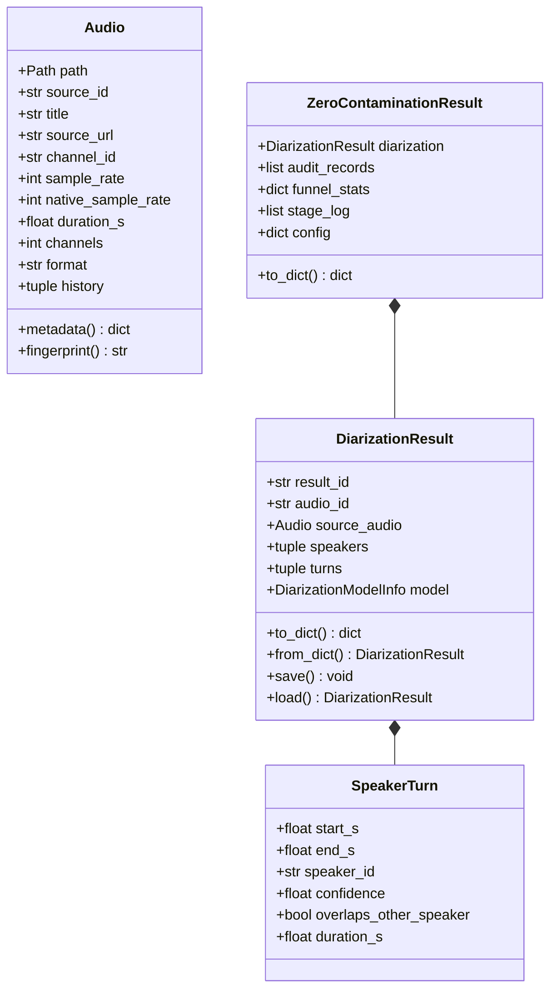

# 07. Data Contracts & Serialization Schemas

[← 06. Web Applications](06_web_applications.md) | [Docs Index](README.md)

---

This module documents the canonical data schemas, serialization models, and persistence formats across the audio preparation pipeline.



---

## 1. `Audio` Contract

**Defined in:** [`src/utils/AudioClass.py`](../src/utils/AudioClass.py)

`Audio` is a file-backed identity dataclass.

| Field | Type | Description |
|---|---|---|
| `path` | `Path` | Concrete audio artifact path on disk. |
| `source_id` | `str` | Video or audio identifier (e.g. YouTube 11-char ID). Stable across all derived stems and cuts. |
| `title` | `str \| None` | Display title of the recording. |
| `source_url` | `str \| None` | Original URL (e.g. YouTube watch link). |
| `channel_id` | `str \| None` | Uploader / channel identifier. |
| `channel_name` | `str \| None` | Human-readable uploader / channel name. |
| `channel_url` | `str \| None` | Canonical channel URL. |
| `sample_rate` | `int \| None` | Current file sample rate (Hz). |
| `native_sample_rate` | `int \| None` | Original capture rate prior to any resampling. |
| `duration_s` | `float \| None` | Duration in seconds. |
| `channels` | `int \| None` | Channel count (typically `1` for mono). |
| `format` | `str` | File extension/container format (default `"wav"`). |
| `history` | `tuple[str, ...]` | Ordered sequence of transformation tags. |

### Companion Identity Sidecar (`{stem}.json`)
Whenever an `Audio` object is saved, an adjacent JSON sidecar is written:
```json
{
  "kind": "audio.sidecar",
  "source_id": "dQw4w9WgXcQ",
  "title": "Rick Astley - Never Gonna Give You Up",
  "source_url": "https://www.youtube.com/watch?v=dQw4w9WgXcQ",
  "channel_id": "UCuAXFkgsw1L7xaCfnd5JJOw",
  "channel_name": "Rick Astley",
  "channel_url": "https://www.youtube.com/channel/UCuAXFkgsw1L7xaCfnd5JJOw",
  "sample_rate": 44100,
  "duration_s": 213.25,
  "channels": 1,
  "format": "wav",
  "native_sample_rate": 48000,
  "history": ["yt_download", "demucs_vocals"]
}
```
(Sidecars without `"kind": "audio.sidecar"` are ignored on load; only WAV files are re-probed.)

---

## 2. Diarization Schemas (Schema 2.0)

**Defined in:** [`src/diarization/schemas.py`](../src/diarization/schemas.py)

`DiarizationResult` is the universal, backend-independent representation of speaker segmentation.

### `DiarizationResult`
- **Fields:**
  - `schema_version`: `"2.0"`.
  - `audio_id`: Identifier matching `source_audio.source_id` (enforced).
  - `speakers`: **List** of distinct `Speaker` records (duplicate IDs rejected).
  - `turns`: **List** of chronological `SpeakerTurn` records.
  - `source_audio`: Complete embedded `Audio` snapshot (**required** for schema 2.x; `None` accepted only to migrate schema-1.0 payloads).
  - `model`: `DiarizationModelInfo` (backend name, model ID, optional revision).
  - `result_id`: Unique ID, default `diar_<hex>`.
  - `created_at`: Unix-epoch **float** (`time.time()`), not an ISO string.
  - `channel_id`, `channel_name`, `channel_url`: Provenance backfilled from `source_audio` when missing; mismatches raise.
  - `overlaps_other_speaker` is auto-normalized in `__post_init__` (any cross-speaker interval intersection sets it), and turns ending beyond `duration_s + 0.05` are rejected.
- **Derived Properties:**
  - `speaker_count`: Number of distinct speakers.
  - `turn_count`: Total number of turns.
  - `total_speech_duration_s`: Sum of turn durations.
  - `duration_per_speaker_s`: Mapping of `speaker_id` to total duration.
  - `turns_by_speaker`: Mapping of `speaker_id` to list of turns.
- **Transformations & Filtering (Non-mutating):**
  - `with_turns(turns)`: Returns new `DiarizationResult` updating turns and pruning/restoring `Speaker` entries.
  - `clean(...)`: Returns cleaned copy via `clean_speaker_turns()` (A-B-A jitter, collar trimming, gap merge).
  - `filter(...)`: Filters turns by `speakers`, `exclude_speakers`, `min_duration_s`, `max_duration_s`, `exclude_overlap`, `only_overlap`, `min_confidence`, `start_s`/`end_s`, or `predicate`.
  - `for_speaker(speaker_id)`: Quick single-speaker isolation returning new `DiarizationResult`.
  - `filter_with(diar_filter)`: Applies pre-configured `DiarizationFilter`.
- **Visualization & Notebook Inspection:**
  - `plot(title=None, figsize=None, show=True)`: Matplotlib timeline Gantt chart with per-speaker color lanes and overlap highlights.
  - `plot_turn(turn_or_index, context_padding_s=0.20, show=True)`: Audio waveform plot around turn boundaries with raw vs refined spans.
  - `notebook_display(output_dir=None)` / `display()`: Interactive Jupyter widget viewer with speaker dropdown, search filter, and per-turn audio playback.
- **Serialization & Persistence:**
  - `to_dict()`: Exports schema 2.0 dictionary.
  - `from_dict(d)`: Reconstructs object with backwards-tolerant parsing (clamps overshoot timestamps, restores missing speakers).
  - `save(path)`: Atomic write with `.tmp` swap to prevent corrupt files on crash.
  - `load(path)`: Restores from JSON file on disk.

### `SpeakerTurn`
Represents an individual continuous speech segment:
```python
@dataclass
class SpeakerTurn:
    speaker_id: str
    start_s: float
    end_s: float                        # must be > start_s
    confidence: float | None = None     # 0..1 when the backend reports it
    overlaps_other_speaker: bool = False
```
`duration_s` is a derived property (`end_s - start_s`).

### `Speaker`
Represents a distinct speaker identity (no display-label field):
```python
@dataclass
class Speaker:
    speaker_id: str                 # Local ID, e.g. "spk_00"
    global_speaker_id: str | None   # Profile link if enrolled
```

---

## 3. Manual Ground-Truth Annotations

**Schema:** `kind: "diarization.annotation"`, version `1.0`.

Stored under `.data/diarization/annotations/<id>.json`:
- `annotation_id`, `revision`, `created_at`, `updated_at`, `name`.
- `audio_id` and complete `source_audio` metadata snapshot.
- `speakers`: Array of speaker definitions with custom colors and labels.
- `turns`: Array of `{turn_id, speaker_id, start_s, end_s}` preserved to microsecond precision. Same-speaker overlaps are merged; cross-speaker overlaps are retained on separate lanes.
- `seed`: Optional provenance metadata (`result_id`, `model`, `created_at`) when initialized from an AI diarization run.
- **Concurrency Control:** Updates require matching `revision` numbers (HTTP 409 Conflict returned on stale edits).

---

## 4. Speaker Profile Schema (`SpeakerProfile`)

**Defined in:** [`src/diarization/SpeakerVerifier.py`](../src/diarization/SpeakerVerifier.py) (not `schemas.py`). Profiles live under `.data/speaker_profiles/<sanitized_name>/` with reference clips at `clips/clip_<NN>.<ext>`.

`profile.json` manifest (written by `enroll`, `schema_version="2.0"`):
```json
{
  "schema_version": "2.0",
  "name": "narrator_01",
  "created_at": "2026-09-01T12:00:00+00:00",
  "updated_at": "2026-09-01T12:30:00+00:00",
  "clips": ["clip_00.wav", "clip_01.wav"],
  "channel_id": "UC...",
  "channel_name": "Channel Name",
  "channel_url": null
}
```
(`clips` is the clip filename list; the runtime `SpeakerProfile` object additionally exposes resolved `clip_paths`, `profile_dir`, and timestamps.)

---

## 5. Purity Verification Schemas

### `SpeakerPurityResult` (Embedding Purity)
Frozen dataclass in `src/diarization/schemas.py`:
```python
@dataclass(frozen=True)
class SpeakerPurityResult:
    schema_version: str              # e.g. "1.0"
    audio_id: str
    profile_name: str
    speaker_id: str
    start_s: float
    end_s: float
    decision: Literal["pass", "reject", "error"]
    overlap_duration_s: float
    overlap_ratio: float              # 0..1
    windows: tuple[SpeakerSimilarityWindow, ...]
    reason: str | None = None         # required unless pass; pass carries no reason
    model: DiarizationModelInfo | None = None
    error: str | None = None          # required for error; forbidden otherwise
```
Derived: `passed` (`decision == "pass"`), `duration_s`, `min_target_similarity` (min window similarity, `None` when no windows).

### `VibeVoicePurityResult` (Foundation ASR Purity)
```python
@dataclass
class VibeVoicePurityResult:
    schema_version: str = "1.0"
    audio_id: str
    decision: str                      # "pass", "reject", "uncertain"
    reason: str                        # "single_speaker", "multiple_speakers", etc.
    num_speakers: int = 1
    secondary_speech_s: float = 0.0
    speaker_turns: tuple[VibeVoiceSpeakerTurn, ...] = ()
    dominant_speaker_id: int | None = None
    model: DiarizationModelInfo | None = None
    error: str | None = None
```

### `OverlapVerificationResult` (Multimodal LLM Purity)
A `TypedDict` (not a dataclass) returned by `Gemma4OverlapVerifier.verify()` and `GeminiOverlapVerifier.verify()`:
```python
class OverlapVerificationResult(TypedDict):
    overlap: bool                       # simultaneous-overlap compatibility flag
    speaker_purity: str                 # pure/impure/uncertain
    word_completeness: str              # complete/incomplete/uncertain
    boundary_issue: str                 # none/clipped_start/clipped_end/clipped_both/uncertain
    failure_codes: list[str]
    decision: str                       # pass/reject/uncertain, derived by code
    reason: str
    usage: dict | None                  # Gemini token metadata; None for local Gemma
    cost: dict | None                   # estimated paid-Standard USD or None
```

Only `pure` plus `complete` passes. Either failed dimension rejects and every
other combination is uncertain. Failure codes are `overlapping_speech`,
`secondary_speaker`, `tail_speaker_intrusion`, `clipped_word_start`,
`clipped_word_end`, `unintelligible_boundary`, and `insufficient_evidence`. The
verifier listens to audio directly and never requests or returns a transcript.

---

## 6. Zero-Contamination Schemas (`ZeroContaminationResult`)

Defined in [`src/diarization/zero_contamination.py`](../src/diarization/zero_contamination.py):

```json
{
  "diarization": { ... },
  "audit_records": [
    {
      "turn_id": "pure_turn_0000",
      "speaker_id": "spk_00",
      "original_start_s": 1.25,
      "original_end_s": 5.40,
      "start_s": 1.60,
      "end_s": 5.05,
      "duration_s": 3.45,
      "status": "passed",
      "rejection_reason": "Pure single-speaker guaranteed",
      "transcript": "chào các bạn",
      "min_similarity": 0.882,
      "gemma_decision": { "speaker_purity": "pure", "word_completeness": "complete", "boundary_issue": "none", "failure_codes": [], "decision": "pass", "reason": "One speaker with intact word boundaries" },
      "vibevoice_decision": null
    }
  ],
  "funnel_stats": {
    "audio_duration_s": 120.5,
    "initial_turns_count": 28,
    "initial_speech_duration_s": 78.4,
    "consensus_turns_count": 22,
    "consensus_speech_duration_s": 64.2,
    "eroded_turns_count": 18,
    "eroded_speech_duration_s": 49.8,
    "syllables_rescued_count": 14,
    "homogeneity_turns_count": 16,
    "final_pure_turns_count": 15,
    "final_pure_speech_duration_s": 42.6,
    "total_elapsed_s": 8.42,
    "contamination_risk_rating": "NEGLIGIBLE (<0.1% estimated 2-speaker leakage)"
  },
  "stage_log": [ ... ],
  "config": { ... },
  "foundation_audits": [
    { "start_s": 1.6, "end_s": 5.05, "passed": true, "reason": "Passed foundation audit", "direct_audio": { ... } }
  ],
  "boundary_audits": [
    { "raw_start_s": 1.25, "raw_end_s": 5.40, "start_s": 1.60, "end_s": 5.05, "policy": "whisper_lock_PhoWhisper-large", "tail_rescued": true }
  ],
  "segment_audits": [
    { "original_start_s": 1.25, "original_end_s": 25.40, "chunks_count": 3, "cut_points_s": [8.40, 16.95], "reason": "Split into 3 chunks (ASR punctuation/pause)" }
  ]
}
```

`foundation_audits` includes accepted and rejected Stage 5 candidates so the UI
can explain every failure. `funnel_stats.direct_audio_usage` contains summed
Gemini tokens and `funnel_stats.direct_audio_cost` contains the estimated run
total.

---

## 7. Pipeline `AudioItem` Schema

**Defined in:** [`src/web_pipeline/dataset_manager.py`](../src/web_pipeline/dataset_manager.py). Stored in `.data/pipeline/dataset_registry.json` (`REGISTRY_FILE`; sibling `datasets.json`, `exports/`, `imports/`, `stems/`):
- Identity: `id`, `source_id`, `title`, `path` (repo-relative), `dataset` (default `"Default"`), `duration`, `sample_rate`, `channels`, `native_sample_rate`, `format`, `source_url`, channel fields.
- `custom_tags`: User-editable tags; `system_tags`: machine-managed namespaced tags (`type:`, `stage:`, `speaker:`, `profile:`, `verification:`; legacy `tags` migrated on load). `tags` property returns both combined.
- `stems`: Mapping of model → `{stem_name: path}`.
- `diarization`: Optional embedded canonical `DiarizationResult` JSON (presence implies `stage:diarized` + `verification:unverified` when no `verification:` tag).
- `metadata["target_speakers"]`: Target speaker filtering summaries per profile, including qualified segment count and duration percentages.
- `created_at`: Unix-epoch float.

---

## 8. Decoupled Labeled Quality Dataset Schema

**Defined in:** [`src/web_studio/labeler_handler.py`](../src/web_studio/labeler_handler.py). Stored in `.data/labeled_datasets/<dataset_name>/`:
- **Audio Directory (`audio/`):** Contains standalone 16-bit PCM `.wav` cuts (`<source_id>_<speaker_id>_<start_ms>_<end_ms>.wav`) sliced directly from source recordings. The audio files are physically independent of any original crawler or diarization results.
- **Manifest (`manifest.json`):**
  ```json
  {
    "dataset_name": "tts_quality_v1",
    "created_at": 1788512986.0,
    "total_samples": 350,
    "split_strategy": "grouped_by_source",
    "split_ratios": { "train": 0.8, "val": 0.1, "test": 0.1 },
    "classes": ["accept", "noise", "multi_speaker", "chopped"],
    "split_summary": {
      "train": { "total": 280, "accept": 180, "noise": 50, "multi_speaker": 30, "chopped": 20 },
      "val": { "total": 35, "accept": 22, "noise": 6, "multi_speaker": 4, "chopped": 3 },
      "test": { "total": 35, "accept": 22, "noise": 6, "multi_speaker": 4, "chopped": 3 }
    },
    "samples": [ ... ]
  }
  ```
- **Tabular Splits (`train.csv`, `val.csv`, `test.csv`):** Standard CSV tables with binary indicator columns (`has_noise`, `has_multi_speaker`, `is_chopped`, `is_clean_accept`) and `audio_path`.
- **JSON Lines (`dataset.jsonl`):** Line-by-line format ready for HuggingFace `datasets.load_dataset('json', ...)`.
- **Training Template (`train_classifier.py`):** Self-contained PyTorch training script with multi-scale boundary-aware pooling, multi-label `BCEWithLogitsLoss`, and differential learning rates for end-to-end backbone fine-tuning or LoRA.

---

## 9. Quality Classifier Checkpoint & Metrics Schema

**Defined in:** [`src/web_studio/labeler_handler.py`](../src/web_studio/labeler_handler.py). Stored in `.data/diarization/models/<dataset_name>_<run_id>/`:
- **Model Weights (`best_head.pt`, `best_backbone.pt`):**
  - `best_head.pt`: PyTorch state dict of the boundary-aware MLP projection head and LayerNorm layers.
  - `best_backbone.pt`: PyTorch state dict of fine-tuned backbone transformer layers (saved during `full` or `top_layers` training).
- **Configuration (`config.json`):**
  ```json
  {
    "backbone_id": "microsoft/wavlm-base",
    "boundary_frames": 15,
    "hidden_dim": 256,
    "num_classes": 3,
    "dropout": 0.25,
    "finetune_mode": "full",
    "input_dim": 2304,
    "lr_backbone": 1e-05,
    "lr_head": 0.0005,
    "epochs": 15,
    "batch_size": 8,
    "pooling": "tri_scale_boundary_pooling"
  }
  ```
- **Validation Metrics (`metrics.json`):**
  ```json
  {
    "best_epoch": 12,
    "best_loss": 0.1824,
    "clean_accept": { "accuracy": 0.942 },
    "has_noise": { "precision": 0.912, "recall": 0.885, "f1": 0.898 },
    "has_multi_speaker": { "precision": 0.941, "recall": 0.903, "f1": 0.922 },
    "is_chopped": { "precision": 0.875, "recall": 0.840, "f1": 0.857 },
    "history": [ ... ]
  }
  ```

---

## 10. Persistence & Synchronization Conventions

1. **Repository-Relative Paths:** Persisted JSON files store repository-relative paths (e.g. `.data/pipeline/ingest/video.wav`) so data folders can be synced across machines (`tungnl5@VF-TUNGNL5-L` and `vsf@vsf-242`) without broken paths.
2. **Atomic Writes:** All schema saves write to `<path>.tmp` first, flushing to disk before an atomic POSIX rename.
3. **Data Sync Script (`scripts/sync/sync_data_to_server.sh`):** Synchronizes `.data/` using `rsync`, excluding host-local package caches and virtual environments listed in `scripts/sync/data_excludes.txt`.
