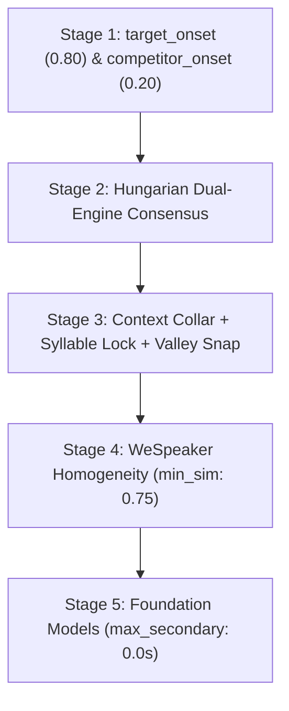

# 08. Model Parameters, Behavioral Effects & Tuning Trade-offs

[← 07. Data Contracts](07_data_contracts.md) | [Docs Index](README.md)

---

This document provides a comprehensive reference for **every model parameter across the pipeline that directly affects the audio or diarization output** (excluding pure throughput/infrastructure options such as batch size, device IDs, or worker subprocess counts).

For each parameter, this guide details:
- **What it is:** The mathematical or algorithmic mechanism.
- **Increasing it (+):** Exact behavioral impact on the output.
- **Decreasing it (-):** Exact behavioral impact on the output.
- **The Core Trade-off:** What is gained versus what is sacrificed.
- **Certainty Rating:** Whether the trade-off is **Guaranteed** (deterministic math/code constraint) or **Empirical** (statistical acoustic tendency).

---

## 📑 Quick Navigation

1. [Source Separation Models (MVSEP, RoFormer, Demucs)](#1-source-separation-models)
2. [Speaker Diarization Engines (Sortformer, DiariZen, Pyannote, 3D-Speaker, Clustering)](#2-speaker-diarization-engines)
3. [Post-Diarization Boundary Cleanup & Expansion](#3-post-diarization-boundary-cleanup--expansion)
4. [Speaker Verification & Purity Models (WeSpeaker, VibeVoice, Gemma 4)](#4-speaker-verification--purity-models)
5. [Zero-Contamination Pipeline Parameters](#5-zero-contamination-pipeline-parameters)
6. [Benchmark Mixer Parameters](#6-benchmark-mixer-parameters)

---

# 1. Source Separation Models

### 1.1 `MVSepMDX23` (Kim ONNX & MDX23 Ensemble)

**Defined in:** [`src/separation/MVSepMDX23.py`](file:///home/nguyenlt/Documents/tts-data-pipeline/audio-prepare-pipeline-redo/src/separation/MVSepMDX23.py)

#### `single_onnx` (`bool`, default: `True`)
- **What it is:** Selects whether to execute only a single fast Kim ONNX vocal model or the full multi-model MDX23 ensemble (MDX23 + both Kim checkpoints).
- **`True`:** Runs 1 model. Dramatic reduction in execution time and peak memory footprint.
- **`False`:** Runs the full ensemble with weighted model averaging.
- **The Trade-off:** Single ONNX yields ~0.5–1.2 dB lower Signal-to-Distortion Ratio (SDR) compared to the ensemble, but runs 4–6× faster.
- **Certainty:** **Empirical**. On complex orchestral music with heavy reverb and chorus, the ensemble visibly suppresses more musical bleed; on dry speech over acoustic guitar, the single model is virtually indistinguishable.

#### `overlap_large` & `overlap_small` (`float`, range `0.0–0.99`, default: `0.25`)
- **What it is:** Fractional overlap between consecutive Short-Time Fourier Transform (STFT) sliding inference windows (Hann window cross-fade).
- **Increasing (e.g. `0.60` / `0.50`):** The model performs more redundant forward passes over the same samples, blending predictions smoothly.
- **Decreasing (e.g. `0.10`):** Fewer overlapping passes; faster execution.
- **The Trade-off:** Higher overlap suppresses phase cancellation artifacts, boundary clicks, and transient smearing at chunk borders at the cost of linearly increased runtime ($O(\frac{1}{1 - \text{overlap}})$).
- **Certainty:** **Empirical**. While blending mathematically guarantees smooth amplitude transitions, whether an audible click occurs at a boundary depends on the frequency dynamics at that split point.

#### `use_kim_model_1` (`bool`, default: `False`)
- **What it is:** Toggles between Kim Checkpoint 1 and Kim Checkpoint 2 when `single_onnx=True`.
- **`True` (Model 1):** Preserves slightly more high-frequency vocal air/breath.
- **`False` (Model 2):** Applies slightly more aggressive vocal band-pass filtering, attenuating high-frequency hi-hat and cymbal bleed.
- **The Trade-off:** High-frequency vocal presence vs. High-frequency instrumental bleed rejection.
- **Certainty:** **Empirical**. Dependent on vocal pitch register and mastering brightness.

#### `max_segment_seconds` (`float | None`, default: `600.0` = 10 mins)
- **What it is:** Maximum WAV chunk duration sliced before passing audio to the upstream CLI.
- **Increasing / `None`:** Processes the entire file in one continuous pass.
- **Decreasing (e.g. `300.0`):** Slices audio into smaller temporal sub-files and concatenates separated stems.
- **The Trade-off:** Smaller values guarantee protection against GPU VRAM / Host RAM exhaustion on 2+ hour recordings. However, sub-file splits introduce a theoretical risk of micro-level phase discontinuities at splice points.
- **Certainty:** **Guaranteed** memory bound; **Empirical** audio boundary artifact risk.

---

### 1.2 `BSRoFormer` & `MelRoFormer`

**Defined in:**
- [`src/separation/BSRoFormer.py`](file:///home/nguyenlt/Documents/tts-data-pipeline/audio-prepare-pipeline-redo/src/separation/BSRoFormer.py)
- [`src/separation/MelRoFormer.py`](file:///home/nguyenlt/Documents/tts-data-pipeline/audio-prepare-pipeline-redo/src/separation/MelRoFormer.py)

#### `model` (Checkpoint selector)
- **What it is:** Pretrained weights architecture:
  - **BS-RoFormer (Band-Split):** Decomposes linear frequency bins into non-overlapping sub-bands with transformer self-attention applied per band.
  - **Mel-RoFormer (Mel-Band):** Decomposes frequencies along psychoacoustic mel-scale bins.
- **The Trade-off:** BS-RoFormer better preserves harmonic resonance and formant overtones on speech fundamentals; Mel-RoFormer is slightly more aggressive at eradicating high-frequency percussive bleed.
- **Certainty:** **Empirical**.

#### `two_stems` (`"vocals"` vs. `"instrumental"`, default: `"vocals"`)
- **What it is:** Selects whether to emit the primary neural prediction (vocals $V$) or the residual accompaniment ($I = \text{Mix} - V$).
- **The Trade-off:** The residual instrumental stem is computed by phase cancellation ($I = \text{Mix} - V$). Any vocal separation error (under-estimation or phase drift) results in "ghost" vocal artifacts in the instrumental stem.
- **Certainty:** **Guaranteed** mathematical identity.

---

# 2. Speaker Diarization Engines

### 2.1 `SortformerDiarizer` (NVIDIA NeMo)

**Defined in:** [`src/diarization/SortformerDiarizer.py`](file:///home/nguyenlt/Documents/tts-data-pipeline/audio-prepare-pipeline-redo/src/diarization/SortformerDiarizer.py)

Sortformer outputs an 80ms multi-speaker activity probability matrix for up to 4 simultaneous speakers. Post-processing parameters govern how probabilities become discrete turns.

| Parameter | Default | Mechanism | Increasing (+) Effect | Decreasing (-) Effect | Trade-off | Certainty |
|---|---|---|---|---|---|---|
| **`onset`** | `0.74` | Probability threshold to initiate a speech turn. | Requires high neural confidence to start a turn. Eliminates false alarms from laughter, breathing, and room noise. | Starts turns on faint evidence. Captures soft speech and early consonant attacks. | Speech Onset Precision vs. Recall | **Guaranteed** thresholding; **Empirical** DER effect. |
| **`offset`** | `0.64` | Probability threshold to close an active speech turn (hysteresis: `offset <= onset`). | Closes turns immediately as energy drops. Prevents tail bleed into subsequent speakers. | Keeps turn open through pauses. Preserves unvoiced plosives ($-p, -t, -k$) and nasal codas. | Turn Termination Precision vs. Syllable Completeness | **Guaranteed** hysteresis; **Empirical** coda capture. |
| **`pad_onset_s`** | `0.12s` | Deterministic duration (seconds) prepended to the detected onset. | Extends speech start into preceding audio. Rescues unvoiced pre-voicing consonants ($s-, f-, h-$). | Starts closer to the neural trigger point. Prevents capturing preceding noise. | Consonant Onset Preservation vs. Preceding Speaker Bleed | **Guaranteed** expansion; **Empirical** bleed risk. |
| **`pad_offset_s`** | `0.20s` | Deterministic duration (seconds) appended to the detected offset. | Preserves lingering vocal resonance and trailing syllable tails. | Cuts immediately when neural activity subsides. | Coda Preservation vs. Subsequent Speaker Contamination | **Guaranteed** expansion; **Empirical** bleed risk. |
| **`min_duration_on_s`** | `0.10s` | Minimum speech duration required to retain a turn. Shorter segments are dropped. | Filters out transient coughs, microphone thumps, and micro-hallucinations. | Retains very brief interjections ("uh", "yeah", "hm"). | Spurious Artifact Filtering vs. Short Interjection Recall | **Guaranteed** monotonic filtering. |
| **`min_duration_off_s`** | `0.15s` | Minimum silence duration required to keep two turns of the **same speaker** separate. | Bridges intra-sentence breath pauses and consonant closures into continuous turns. | Fragments speech into isolated words separated by micro-stops. | Contiguous Utterance Flow vs. Intra-Sentence Pause Separation | **Guaranteed** gap merging. |
| **`window_duration_s`** | `360.0s` | Sliding window duration fed into Sortformer. | Fewer window splits; lower risk of speaker permutation swaps across stitches. | Reduces peak GPU VRAM consumption. | Global Speaker Identity Consistency vs. Peak VRAM Footprint | **Guaranteed** VRAM bound; **Empirical** stitch stability. |
| **`overlap_duration_s`** | `60.0s` | Temporal overlap between consecutive sliding windows. | Provides longer shared context to match speaker tracks across window boundaries. | Faster processing; less redundant inference. | Cross-Window Speaker Tracking Accuracy vs. Processing Redundancy | **Guaranteed** compute cost; **Empirical** tracking accuracy. |
| **`embedding_similarity_threshold`** | `0.70` | TitaNet cosine similarity threshold for re-identifying speakers absent from the overlap. | Prevents different speakers from being mistakenly merged into one identity. | Links speakers across long silences even if vocal tone fluctuates. | Over-Clustering (Fragmentation) vs. Under-Clustering (Speaker Confusion) | **Guaranteed** thresholding; **Empirical** clustering accuracy. |
| **`overlap_match_threshold`** | `0.35` | Activity intersection fraction in the overlap required to pair speaker tracks across windows. | Requires strong temporal alignment to consider two tracks the same speaker. | Aggressively stitches tracks across seams even with minor timing variance. | Permutation Alignment Strictness vs. Spurious New Speaker Creation | **Guaranteed** thresholding; **Empirical** seam continuity. |

---

### 2.2 `DiariZenDiarizer` & `PyannoteDiarizer`

**Defined in:**
- [`src/diarization/DiariZenDiarizer.py`](file:///home/nguyenlt/Documents/tts-data-pipeline/audio-prepare-pipeline-redo/src/diarization/DiariZenDiarizer.py)
- [`src/diarization/PyannoteDiarizer.py`](file:///home/nguyenlt/Documents/tts-data-pipeline/audio-prepare-pipeline-redo/src/diarization/PyannoteDiarizer.py)

#### `num_speakers` (`int | None`, default: `None`)
- **What it is:** Oracle constraint fixing the exact number of clusters in VBx / Spectral clustering.
- **Specifying an exact count (e.g. `2`):** Forces the clustering algorithm to partition all speech frames into exactly $N$ speakers.
- **Leaving as `None`:** The clustering algorithm estimates the number of speakers automatically.
- **The Trade-off:** Providing the true oracle count eliminates over-clustering (splitting one person into two) and under-clustering (merging two people into one). However, if an incorrect number is provided (e.g. specifying `2` when a 3rd person speaks for 5 seconds), the model is forced to misattribute the 3rd person's speech to one of the two main speakers.
- **Certainty:** **Guaranteed** mathematical cluster count constraint.

#### `min_speakers` & `max_speakers` (`int | None`, default: `None`)
- **What it is:** Lower and upper bounds constraining the automatic eigenvalue/Bayesian speaker estimation.
- **Increasing `min_speakers`:** Prevents the model from collapsing multiple speakers into a single monologue.
- **Decreasing `max_speakers`:** Prevents the model from creating spurious phantom speakers out of background vocal reverberation.
- **The Trade-off:** Constrains search space against degenerate clustering solutions at the risk of misclassifying recordings outside the bounds.
- **Certainty:** **Guaranteed** boundary constraint.

---

### 2.3 `ThreeDSpeakerDiarizer` (ModelScope FSMN + CAM++)

**Defined in:** [`src/diarization/ThreeDSpeakerDiarizer.py`](file:///home/nguyenlt/Documents/tts-data-pipeline/audio-prepare-pipeline-redo/src/diarization/ThreeDSpeakerDiarizer.py)

#### `include_overlap` (`bool`, default: `False`)
- **What it is:** Enables Pyannote `segmentation-3.0` neural overlap refinement on top of CAM++ spectral clustering.
- **`True`:** Detects simultaneous multi-speaker turns and emits overlapping intervals.
- **`False`:** Produces strictly non-overlapping single-speaker partitions.
- **The Trade-off:** Essential for detecting cross-talk and overlapping speech; increases processing time and requires downloading Pyannote segmentation weights.
- **Certainty:** **Guaranteed** overlap modeling capability.

#### `chunk_duration_s` (`float`, default: `1.5s`) & `chunk_step_s` (`float`, default: `0.75s`)
- **What it is:** Temporal window and hop size used to slice speech segments for CAM++ embedding extraction.
- **Increasing `chunk_duration_s` (e.g. `2.5s`):** Yields richer acoustic context per embedding vector, increasing speaker discrimination stability.
  - *Risk:* Fails on rapid back-and-forth dialogue where speaker turns are shorter than the window.
- **Decreasing `chunk_duration_s` (e.g. `0.8s`):** Enables fine temporal resolution during fast-paced conversations.
  - *Risk:* Short embeddings are noisier and suffer from lower cosine separation, increasing speaker confusion.
- **Decreasing `chunk_step_s` (e.g. `0.25s`):** Higher embedding density improves boundary precision at the expense of higher compute time.
- **The Trade-off:** Embedding Stability vs. Temporal Resolution on Short Turns.
- **Certainty:** **Guaranteed** window slicing; **Empirical** embedding quality.

---

# 3. Post-Diarization Boundary Cleanup & Expansion

### 3.1 `clean_speaker_turns`

**Defined in:** [`src/diarization/turn_cleanup.py`](file:///home/nguyenlt/Documents/tts-data-pipeline/audio-prepare-pipeline-redo/src/diarization/turn_cleanup.py)

This function operates on raw diarization turns to produce a refined, high-precision view:

```python
clean_speaker_turns(
    turns,
    min_turn_duration_s=0.5,
    merge_same_speaker_gap_s=1.0,
    boundary_collar_s=0.04,
    jitter_max_duration_s=3.0,
)
```

| Parameter | Default | Increasing (+) Effect | Decreasing (-) Effect | The Trade-off | Certainty |
|---|---|---|---|---|---|
| **`min_turn_duration_s`** | `0.50s` | Discards short turns under the threshold. Purges coughs, brief acknowledgments, and diarizer boundary flutter. | Preserves short monosyllabic replies ("yes", "no", "hi"). | Artifact/Noise Rejection vs. Monosyllabic Dialogue Yield | **Guaranteed** |
| **`merge_same_speaker_gap_s`** | `1.00s` | Merges turns belonging to the same speaker across longer pauses. Creates coherent, paragraph-length speech chunks for TTS. | Keeps short pauses as turn boundaries, breaking speech into individual phrases or sentence clauses. | Coherent Sentence Flow vs. Granular Segment Isolation | **Guaranteed** |
| **`boundary_collar_s`** | `0.04s` (40ms) | Trims safety margins inward from both sides of adjacent speaker transitions. Eliminates transition cross-talk. | Preserves audio right up to the diarizer boundary. Avoids cutting off early plosive bursts or trailing nasals. | Transition Bleed Immunity vs. Syllable Boundary Truncation | **Guaranteed** duration erosion; **Empirical** bleed elimination. |
| **`jitter_max_duration_s`** | `3.00s` | Corrects rapid `A-B-A` speaker switching anomalies where Speaker B interrupts for less than this duration without overlap. Absorbs false-switch blips. | Strictly respects raw model speaker assignments; treats even 0.2s interjections as genuine speaker switches. | Spurious Diarizer Flutter Correction vs. True Interjection Suppression | **Guaranteed** relabeling logic; **Empirical** correctness. |

---

### 3.2 `pad_and_merge_intervals`

**Defined in:** [`src/diarization/turn_cleanup.py`](file:///home/nguyenlt/Documents/tts-data-pipeline/audio-prepare-pipeline-redo/src/diarization/turn_cleanup.py)

Controls audio expansion during WAV cutting and stem export:
- **`pre_roll_s` & `post_roll_s` (`float`, function defaults: `0.0` / `0.0`):** Expands window boundaries outward into surrounding room tone/silence. Captures natural acoustic decay and reverbs. The Studio stem-export path (`extraction_settings`) defaults them to `0.12s` / `0.20s` (Sortformer pad values) but applies them only when `add_extra=True` (otherwise forced to `0.0`).
- **`blocker_intervals` (`list` of other-speaker intervals):** The Studio path wires these from neighboring turns only when `add_extra=True` **and** `stop_at_other_speakers=True`; outward expansion then stops immediately at neighboring other-speaker bounds.
- **The Trade-off:** Reverb/Decay Preservation vs. Other-Speaker Contamination.
- **Certainty:** **Guaranteed** mathematical clamping.

---

# 4. Speaker Verification & Purity Models

### 4.1 `SpeakerVerifier` (`wespeaker-voxceleb-resnet34-LM`)

**Defined in:** [`src/diarization/SpeakerVerifier.py`](file:///home/nguyenlt/Documents/tts-data-pipeline/audio-prepare-pipeline-redo/src/diarization/SpeakerVerifier.py)

#### `threshold` / `similarity_threshold` (`float`, range `-1.0 to 1.0`, typical: `0.70–0.80`)
- **What it is:** Cosine similarity threshold between a candidate turn's embedding vector and the enrolled speaker's profile centroid:
  $$\text{sim}(\mathbf{u}, \mathbf{v}) = \frac{\mathbf{u} \cdot \mathbf{v}}{\|\mathbf{u}\|_2 \|\mathbf{v}\|_2} \ge \text{threshold}$$
- **Increasing (e.g. `0.85`):** Demands near-identical vocal timbre and pitch register.
  - *Effect:* Completely excludes foreign speakers, guest voices, and background noise.
  - *Risk:* Rejects genuine target speech when the speaker laughs, whispers, shouts, or speaks with emotional variance.
- **Decreasing (e.g. `0.60`):** Accommodates vocal inflection, emotional range, and room acoustic differences.
  - *Effect:* High yield of target speaker speech.
  - *Risk:* Admits acoustically similar speakers (e.g. siblings, co-hosts of similar pitch).
- **The Trade-off:** Target Identity Purity (False Acceptance Rate) vs. Speech Yield (False Rejection Rate).
- **Certainty:** **Guaranteed** thresholding math; **Empirical** speaker identity separation.

#### `min_candidate_duration_s` (`float`, default: `1.5s`)
- **What it is:** Minimum turn duration required before running embedding verification. Turns shorter than this are rejected with `candidate_too_short`.
- **The Trade-off:** Short audio segments (<1.0s) lack sufficient phonemic variability to produce stable 256-dimensional embeddings (often clustering near arbitrary acoustic artifacts). Enforcing $\ge 1.5s$ guarantees embedding reliability at the expense of discarding valid short utterances.
- **Certainty:** **Guaranteed** filter; **Empirical** embedding stability limit.

#### `max_overlap_duration_s` (`float`, default: `0.05s` = 50ms)
- **What it is:** Maximum allowable duration of intersection with any other speaker's turn. Exceeding this triggers an immediate `overlap_detected` rejection.
- **Increasing (e.g. `0.50s`):** Tolerates brief conversational overlaps or laughter.
- **Decreasing (e.g. `0.00s`):** Zero-tolerance veto. Drops candidate if another speaker is detected for even 1 millisecond.
- **The Trade-off:** Dataset Volume vs. Absolute Single-Speaker Purity.
- **Certainty:** **Guaranteed** intersection calculation.

#### `window_duration_s` (`float`, default: `2.0s`) & `window_hop_s` (`float`, default: `0.75s`)
- **What it is:** Sliding sub-window parameters used in `verify_purity()` to verify that an extended turn (e.g. 10s) maintains speaker purity across its entire duration.
- **Decreasing `window_hop_s` (e.g. `0.25s`):** Dense temporal probing catches momentary 0.5s voice intrusions from background speakers. Linearly increases compute time.
- **The Trade-off:** Intrusion Detection Sensitivity vs. Inference Latency.
- **Certainty:** **Guaranteed** temporal coverage; **Empirical** intrusion detection.

---

### 4.2 `VibeVoicePurityVerifier` (`microsoft/VibeVoice-ASR-HF`)

**Defined in:** [`src/diarization/VibeVoicePurityVerifier.py`](file:///home/nguyenlt/Documents/tts-data-pipeline/audio-prepare-pipeline-redo/src/diarization/VibeVoicePurityVerifier.py)

#### `min_secondary_speech_s` (`float`, seconds, default: `0.25s`)
- **What it is:** Duration threshold for secondary non-dominant speakers detected by VibeVoice's autoregressive speaker tokens:
  - Non-dominant speech $\ge \text{min\_secondary\_speech\_s} \implies \text{reject}$ (`multiple_speakers`)
  - Non-dominant speech $== 0.0s \implies \text{pass}$ (`single_speaker`)
  - $0 < \text{speech} < \text{min\_secondary\_speech\_s} \implies \text{uncertain}$ (`tiny_secondary_speaker`)
- **Increasing (e.g. `0.60s`):** Tolerates minor background vocal utterances, laughter, or brief confirmations.
- **Decreasing (to `0.0s`):** Rejects candidates if VibeVoice detects a single secondary speaker frame.
- **The Trade-off:** Speech Retention vs. Zero-Leakage Guarantee.
- **Certainty:** **Guaranteed** decision classification boundary.

---

### 4.3 `OverlapVerifier` (Gemma 4 & Gemini)

**Defined in:** [`src/diarization/OverlapVerifier.py`](file:///home/nguyenlt/Documents/tts-data-pipeline/audio-prepare-pipeline-redo/src/diarization/OverlapVerifier.py)

#### `prompt` (`str`)
- **What it is:** Multimodal instruction passed to the LLM alongside the raw audio stream.
- **Strict Instruction (e.g. *"Reject if any faint secondary speaker, background voice, or whispering is audible"*):** Maximizes LLM paranoia; flags even subtle TV or room bleed.
- **Lenient Instruction (e.g. *"Reject only if two clear foreground speakers talk at the same time"*):** Focuses strictly on conversational cross-talk, tolerating distant room ambiance.
- **The Trade-off:** Sensitivity to Distant Ambiance vs. Candidate Pass Rate.
- **Certainty:** **Empirical**. LLM instruction adherence is non-deterministic.

#### `failure_policy` (`"fail_closed"` vs. `"fail_open"`, default: `"fail_closed"`)
- **What it is:** Studio batch-verification setting (`handle_verify_diarization_batch` overlap config) determining the candidate decision when the remote LLM endpoint times out or returns HTTP 5xx. It is **not** a `Gemma4OverlapVerifier`/`GeminiOverlapVerifier` constructor argument (those take `endpoint`, `model`, `api_key`, `timeout_s=120.0`, `prompt`, `max_output_tokens`).
- **`fail_closed`:** Marks candidate as `error` (excluded from dataset).
- **`fail_open`:** Keeps candidate as `pass` while logging the warning.
- **The Trade-off:** Zero-Risk Data Integrity vs. Pipeline Robustness to Network Glitches.
- **Certainty:** **Guaranteed** error handling contract.

---

# 5. Zero-Contamination Pipeline Parameters

**Defined in:** [`src/diarization/zero_contamination.py`](file:///home/nguyenlt/Documents/tts-data-pipeline/audio-prepare-pipeline-redo/src/diarization/zero_contamination.py)

The Zero-Contamination Pipeline ([`04_zero_contamination_diarization.md`](04_zero_contamination_diarization.md)) integrates these mechanisms into a 5-stage attrition funnel.



### Stage 1: Asymmetric Detection & Tripwires
- **`target_onset` (default `0.80`):** Requires strong confidence before asserting target speech.
- **`competitor_onset` (default `0.20`):** Tripwire threshold. If any competing speaker reaches even 20% activation, the candidate is discarded.
  - *Trade-off:* Eliminates borderline cross-talk at the cost of dropping speech in multi-speaker rooms.
  - *Certainty:* **Guaranteed** frame veto.

### Stage 2: Dual-Engine Mutual Consensus
- **`enable_consensus` (`bool`, default: `True`):** Keeps turns if and only if both primary and secondary diarizers unanimously agree on speaker boundaries via Hungarian matching.
  - *Trade-off:* Discards ~20–35% of disputed audio duration, but mathematically eliminates single-model hallucination.
  - *Certainty:* **Guaranteed** intersection constraint.

### Stage 3a: Context-Aware Collar Guard
- **`handoff_risk_distance_s` (default `0.80s`):** Distance to the nearest other-speaker turn that triggers inward collar shaving.
- **`silence_tail_buffer_s` (default `+0.15s`):** Extension granted when an utterance transitions into natural silence.
  - *Trade-off:* Selectively protects Vietnamese codas ($-p, -t, -k, -m, -n, -ng$) in monologue silence while aggressively shaving borders near speaker handoffs.
  - *Certainty:* **Guaranteed** conditional interval math.

### Stage 3b: Syllable Forced Alignment Lock
- **`aligner_engine` (`"whisper_timestamped"`, `"mms_fa"`, `"remote_whisper"`):** Snaps candidate boundaries outward to word/syllable bounds. Disabled by default (`enable_syllable_alignment=False`); `remote_whisper` requires `aligner_endpoint`.
  - *Trade-off:* Guarantees boundaries never slice through an active vocal syllable. May pull in up to 100ms of surrounding silence to achieve alignment.
  - *Certainty:* **Guaranteed** word-boundary snapping.

### Stage 3c: Acoustic Energy Valley Snapping
- **`energy_search_window_s` (default `±0.15s`) & `energy_valley_floor_db` (default `-30 dB`):**
  - Scans micro-waveform energy (2ms hop) and snaps the boundary to the nearest vocal closure zero-crossing.
  - *Trade-off:* Eliminates audible clicks and waveform discontinuity pops when cutting WAV files.
  - *Certainty:* **Guaranteed** local minimum search.

### Stage 4: WeSpeaker Homogeneity Filter
- **`min_homogeneity_similarity` (default `0.75`):** Minimum cosine similarity between any 1.0s sub-window and the turn centroid.
  - *Trade-off:* Catches unsegmented speaker transitions missed by prior stages. Rejects genuine turns with extreme emotional pitch swings.
  - *Certainty:* **Guaranteed** cosine floor; **Empirical** speaker shift detection.

---

# 6. Benchmark Mixer Parameters

**Defined in:** [`src/benchmark/separation/mixer.py`](file:///home/nguyenlt/Documents/tts-data-pipeline/audio-prepare-pipeline-redo/src/benchmark/separation/mixer.py)

#### `target_smr_db` (`float`, dB)
- **What it is:** Calibrated Speech-to-Music Ratio in decibels:
  $$\text{SMR}_{\text{dB}} = 20 \log_{10}\left(\frac{\text{RMS}_{\text{speech}}}{\text{RMS}_{\text{music}}}\right)$$
- **Increasing (e.g. `+10.0 dB`):** Speech is substantially louder than background music. Easy separation task.
- **Decreasing (e.g. `-5.0 dB`):** Music overpowers speech. Extreme stress-test for separation models.
- **The Trade-off:** Difficulty level of the separation benchmark.
- **Certainty:** **Guaranteed** RMS linear scaling.

#### `seed` (`int`, required — no default)
- **What it is:** Pseudorandom seed controlling the temporal crop offset of the background music file. Callers pass it explicitly (e.g. `seed=42`).
- **The Trade-off:** Guarantees 100% bit-exact reproducibility across benchmark runs on different machines.
- **Certainty:** **Guaranteed**.
