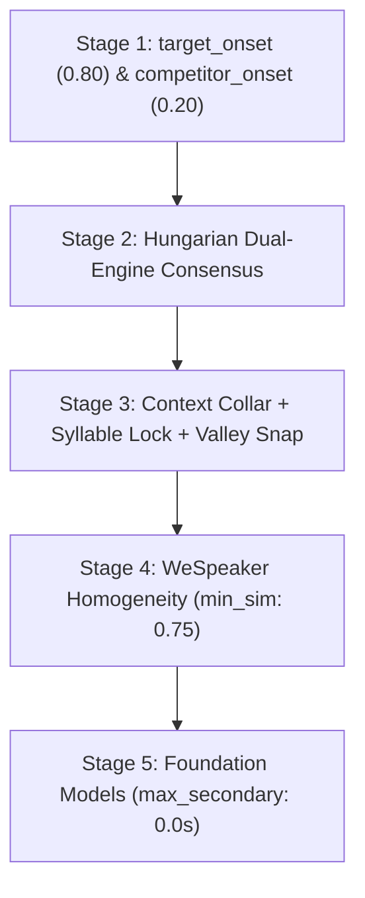

# 08. Model Parameters, Behavioral Effects & Tuning Trade-offs

[← 07. Data Contracts](07_data_contracts.md) | [Docs Index](README.md)

---

This document provides a comprehensive reference for **every model parameter across the pipeline that directly affects the audio or diarization output** (excluding pure throughput/infrastructure options such as batch size, device IDs, or worker subprocess counts).

For each parameter, this guide details:
- **What it is:** The mathematical or algorithmic mechanism.
- **Increasing it (+):** Exact behavioral impact on the output.
- **Decreasing it (-):** Exact behavioral impact on the output.
- **The Core Trade-off:** What is gained versus what is sacrificed.
- **Certainty Rating:** Whether the trade-off is **Guaranteed** (deterministic math/code constraint) or **Empirical** (statistical acoustic tendency).

---

## 📑 Quick Navigation

1. [Source Separation Models (MVSEP, RoFormer, Demucs)](#1-source-separation-models)
2. [Speaker Diarization Engines (Sortformer, DiariZen, Pyannote, 3D-Speaker, Clustering)](#2-speaker-diarization-engines)
3. [Post-Diarization Boundary Cleanup & Expansion](#3-post-diarization-boundary-cleanup--expansion)
4. [Speaker Verification & Purity Models (WeSpeaker, VibeVoice, Gemma 4)](#4-speaker-verification--purity-models)
5. [Zero-Contamination Pipeline Parameters](#5-zero-contamination-pipeline-parameters)
6. [Benchmark Mixer Parameters](#6-benchmark-mixer-parameters)

---

# 1. Source Separation Models

### 1.1 `MVSepMDX23` (Kim ONNX & MDX23 Ensemble)

**Defined in:** [`src/separation/MVSepMDX23.py`](../src/separation/MVSepMDX23.py)

#### `single_onnx` (`bool`, default: `True`)
- **What it is:** Selects whether to execute only a single fast Kim ONNX vocal model or the full multi-model MDX23 ensemble (MDX23 + both Kim checkpoints).
- **`True`:** Runs 1 model. Dramatic reduction in execution time and peak memory footprint.
- **`False`:** Runs the full ensemble with weighted model averaging.
- **The Trade-off:** Single ONNX yields ~0.5–1.2 dB lower Signal-to-Distortion Ratio (SDR) compared to the ensemble, but runs 4–6× faster.
- **Certainty:** **Empirical**. On complex orchestral music with heavy reverb and chorus, the ensemble visibly suppresses more musical bleed; on dry speech over acoustic guitar, the single model is virtually indistinguishable.

#### `overlap_large` & `overlap_small` (`float`, range `0.0–0.99`, default: `0.25`)
- **What it is:** Fractional overlap between consecutive Short-Time Fourier Transform (STFT) sliding inference windows (Hann window cross-fade).
- **Increasing (e.g. `0.60` / `0.50`):** The model performs more redundant forward passes over the same samples, blending predictions smoothly.
- **Decreasing (e.g. `0.10`):** Fewer overlapping passes; faster execution.
- **The Trade-off:** Higher overlap suppresses phase cancellation artifacts, boundary clicks, and transient smearing at chunk borders at the cost of linearly increased runtime ($O(\frac{1}{1 - \text{overlap}})$).
- **Certainty:** **Empirical**. While blending mathematically guarantees smooth amplitude transitions, whether an audible click occurs at a boundary depends on the frequency dynamics at that split point.

#### `use_kim_model_1` (`bool`, default: `False`)
- **What it is:** Toggles between Kim Checkpoint 1 and Kim Checkpoint 2 when `single_onnx=True`.
- **`True` (Model 1):** Preserves slightly more high-frequency vocal air/breath.
- **`False` (Model 2):** Applies slightly more aggressive vocal band-pass filtering, attenuating high-frequency hi-hat and cymbal bleed.
- **The Trade-off:** High-frequency vocal presence vs. High-frequency instrumental bleed rejection.
- **Certainty:** **Empirical**. Dependent on vocal pitch register and mastering brightness.

#### `max_segment_seconds` (`float | None`, default: `600.0` = 10 mins)
- **What it is:** Maximum WAV chunk duration sliced before passing audio to the upstream CLI.
- **Increasing / `None`:** Processes the entire file in one continuous pass.
- **Decreasing (e.g. `300.0`):** Slices audio into smaller temporal sub-files and concatenates separated stems.
- **The Trade-off:** Smaller values guarantee protection against GPU VRAM / Host RAM exhaustion on 2+ hour recordings. However, sub-file splits introduce a theoretical risk of micro-level phase discontinuities at splice points.
- **Certainty:** **Guaranteed** memory bound; **Empirical** audio boundary artifact risk.

#### `large_gpu` (`bool`, default: `False`)
- **What it is:** Toggles higher-memory batching flags inside the upstream MDX23 CLI.
- **`True`:** Accelerates separation throughput by processing larger inference batches simultaneously. Recommended on GPUs with $\ge 16\text{ GB}$ VRAM.
- **`False`:** Keeps conservative batch buffers to fit within standard $8\text{ GB}$ GPUs without triggering CUDA out-of-memory errors.
- **The Trade-off:** Processing Throughput vs. Peak GPU VRAM Footprint.
- **Certainty:** **Guaranteed** memory allocation behavior.

#### `chunk_size` (`int | None`, default: `None`)
- **What it is:** Temporal sample size per inference chunk passed to MDX23 ONNX sessions.
- **Increasing (e.g. `485100`):** Larger chunk size reduces STFT window boundary seams and accelerates execution.
- **Decreasing (e.g. `261144`):** Slices input into tighter frames, reducing peak ONNX workspace memory.
- **The Trade-off:** Peak VRAM Ceiling vs. Window Boundary Stitching Frequency.
- **Certainty:** **Guaranteed** execution memory bound.

---

### 1.2 `BSRoFormer` & `MelRoFormer`

**Defined in:**
- [`src/separation/BSRoFormer.py`](../src/separation/BSRoFormer.py)
- [`src/separation/MelRoFormer.py`](../src/separation/MelRoFormer.py)

#### `model` (Checkpoint selector)
- **What it is:** Pretrained weights architecture:
  - **BS-RoFormer (Band-Split):** Decomposes linear frequency bins into non-overlapping sub-bands with transformer self-attention applied per band.
  - **Mel-RoFormer (Mel-Band):** Decomposes frequencies along psychoacoustic mel-scale bins.
- **The Trade-off:** BS-RoFormer better preserves harmonic resonance and formant overtones on speech fundamentals; Mel-RoFormer is slightly more aggressive at eradicating high-frequency percussive bleed.
- **Certainty:** **Empirical**.

#### `two_stems` (`"vocals"` vs. `"instrumental"`, default: `"vocals"`)
- **What it is:** Selects whether to emit the primary neural prediction (vocals $V$) or the residual accompaniment ($I = \text{Mix} - V$).
- **The Trade-off:** The residual instrumental stem is computed by phase cancellation ($I = \text{Mix} - V$). Any vocal separation error (under-estimation or phase drift) results in "ghost" vocal artifacts in the instrumental stem.
- **Certainty:** **Guaranteed** mathematical identity.

---

### 1.3 `HTDemucs` (Facebook Hybrid Transformer Demucs)

**Defined in:** [`src/separation/HTDemucs.py`](../src/separation/HTDemucs.py)

#### `two_stems` (`"vocals"`, `"drums"`, `"bass"`, `"other"`, default: `"vocals"`)
- **What it is:** Target stem extracted from the 4-source Demucs architecture. When isolating a single stem, the residual is computed by subtracting the predicted stem from the mixture.
- **The Trade-off:** Extracting `"vocals"` yields clean speech; extracting other stems isolates rhythm/accompaniment components.
- **Certainty:** **Guaranteed**.

#### `model` (default: `"htdemucs"`)
- **What it is:** Checkpoint architecture (e.g. `htdemucs`, `htdemucs_ft`, `htdemucs_6s`). Fine-tuned variants (`_ft`) offer slightly higher SDR at the cost of 4× training-fold inference passes.
- **The Trade-off:** Separation Signal-to-Distortion Ratio vs. Inference Compute Latency.
- **Certainty:** **Empirical**.

---

# 2. Speaker Diarization Engines

### 2.1 `SortformerDiarizer` (NVIDIA NeMo)

**Defined in:** [`src/diarization/SortformerDiarizer.py`](../src/diarization/SortformerDiarizer.py)

Sortformer outputs an 80ms multi-speaker activity probability matrix for up to 4 simultaneous speakers. Post-processing parameters govern how probabilities become discrete turns.

| Parameter | Default | Mechanism | Increasing (+) Effect | Decreasing (-) Effect | Trade-off | Certainty |
|---|---|---|---|---|---|---|
| **`onset`** | `0.74` | Probability threshold to initiate a speech turn. | Requires high neural confidence to start a turn. Eliminates false alarms from laughter, breathing, and room noise. | Starts turns on faint evidence. Captures soft speech and early consonant attacks. | Speech Onset Precision vs. Recall | **Guaranteed** thresholding; **Empirical** DER effect. |
| **`offset`** | `0.64` | Probability threshold to close an active speech turn (hysteresis: `offset <= onset`). | Closes turns immediately as energy drops. Prevents tail bleed into subsequent speakers. | Keeps turn open through pauses. Preserves unvoiced plosives ($-p, -t, -k$) and nasal codas. | Turn Termination Precision vs. Syllable Completeness | **Guaranteed** hysteresis; **Empirical** coda capture. |
| **`pad_onset_s`** | `0.12s` | Deterministic duration (seconds) prepended to the detected onset. | Extends speech start into preceding audio. Rescues unvoiced pre-voicing consonants ($s-, f-, h-$). | Starts closer to the neural trigger point. Prevents capturing preceding noise. | Consonant Onset Preservation vs. Preceding Speaker Bleed | **Guaranteed** expansion; **Empirical** bleed risk. |
| **`pad_offset_s`** | `0.20s` | Deterministic duration (seconds) appended to the detected offset. | Preserves lingering vocal resonance and trailing syllable tails. | Cuts immediately when neural activity subsides. | Coda Preservation vs. Subsequent Speaker Contamination | **Guaranteed** expansion; **Empirical** bleed risk. |
| **`min_duration_on_s`** | `0.10s` | Minimum speech duration required to retain a turn. Shorter segments are dropped. | Filters out transient coughs, microphone thumps, and micro-hallucinations. | Retains very brief interjections ("uh", "yeah", "hm"). | Spurious Artifact Filtering vs. Short Interjection Recall | **Guaranteed** monotonic filtering. |
| **`min_duration_off_s`** | `0.15s` | Minimum silence duration required to keep two turns of the **same speaker** separate. | Bridges intra-sentence breath pauses and consonant closures into continuous turns. | Fragments speech into isolated words separated by micro-stops. | Contiguous Utterance Flow vs. Intra-Sentence Pause Separation | **Guaranteed** gap merging. |
| **`window_duration_s`** | `360.0s` | Sliding window duration fed into Sortformer. | Fewer window splits; lower risk of speaker permutation swaps across stitches. | Reduces peak GPU VRAM consumption. | Global Speaker Identity Consistency vs. Peak VRAM Footprint | **Guaranteed** VRAM bound; **Empirical** stitch stability. |
| **`overlap_duration_s`** | `60.0s` | Temporal overlap between consecutive sliding windows. | Provides longer shared context to match speaker tracks across window boundaries. | Faster processing; less redundant inference. | Cross-Window Speaker Tracking Accuracy vs. Processing Redundancy | **Guaranteed** compute cost; **Empirical** tracking accuracy. |
| **`embedding_similarity_threshold`** | `0.70` | TitaNet cosine similarity threshold for re-identifying speakers absent from the overlap. | Prevents different speakers from being mistakenly merged into one identity. | Links speakers across long silences even if vocal tone fluctuates. | Over-Clustering (Fragmentation) vs. Under-Clustering (Speaker Confusion) | **Guaranteed** thresholding; **Empirical** clustering accuracy. |
| **`overlap_match_threshold`** | `0.35` | Activity intersection fraction in the overlap required to pair speaker tracks across windows. | Requires strong temporal alignment to consider two tracks the same speaker. | Aggressively stitches tracks across seams even with minor timing variance. | Permutation Alignment Strictness vs. Spurious New Speaker Creation | **Guaranteed** thresholding; **Empirical** seam continuity. |

---

### 2.2 `DiariZenDiarizer` & `PyannoteDiarizer`

**Defined in:**
- [`src/diarization/DiariZenDiarizer.py`](../src/diarization/DiariZenDiarizer.py)
- [`src/diarization/PyannoteDiarizer.py`](../src/diarization/PyannoteDiarizer.py)

#### `num_speakers` (`int | None`, default: `None`)
- **What it is:** Oracle constraint fixing the exact number of clusters in VBx / Spectral clustering.
- **Specifying an exact count (e.g. `2`):** Forces the clustering algorithm to partition all speech frames into exactly $N$ speakers.
- **Leaving as `None`:** The clustering algorithm estimates the number of speakers automatically.
- **The Trade-off:** Providing the true oracle count eliminates over-clustering (splitting one person into two) and under-clustering (merging two people into one). However, if an incorrect number is provided (e.g. specifying `2` when a 3rd person speaks for 5 seconds), the model is forced to misattribute the 3rd person's speech to one of the two main speakers.
- **Certainty:** **Guaranteed** mathematical cluster count constraint.

#### `min_speakers` & `max_speakers` (`int | None`, default: `None`)
- **What it is:** Lower and upper bounds constraining the automatic eigenvalue/Bayesian speaker estimation.
- **Increasing `min_speakers`:** Prevents the model from collapsing multiple speakers into a single monologue.
- **Decreasing `max_speakers`:** Prevents the model from creating spurious phantom speakers out of background vocal reverberation.
- **The Trade-off:** Constrains search space against degenerate clustering solutions at the risk of misclassifying recordings outside the bounds.
- **Certainty:** **Guaranteed** boundary constraint.

---

### 2.3 `ThreeDSpeakerDiarizer` (ModelScope FSMN + CAM++)

**Defined in:** [`src/diarization/ThreeDSpeakerDiarizer.py`](../src/diarization/ThreeDSpeakerDiarizer.py)

#### `include_overlap` (`bool`, default: `False`)
- **What it is:** Enables Pyannote `segmentation-3.0` neural overlap refinement on top of CAM++ spectral clustering.
- **`True`:** Detects simultaneous multi-speaker turns and emits overlapping intervals.
- **`False`:** Produces strictly non-overlapping single-speaker partitions.
- **The Trade-off:** Essential for detecting cross-talk and overlapping speech; increases processing time and requires downloading Pyannote segmentation weights.
- **Certainty:** **Guaranteed** overlap modeling capability.

#### `chunk_duration_s` (`float`, default: `1.5s`) & `chunk_step_s` (`float`, default: `0.75s`)
- **What it is:** Temporal window and hop size used to slice speech segments for CAM++ embedding extraction.
- **Increasing `chunk_duration_s` (e.g. `2.5s`):** Yields richer acoustic context per embedding vector, increasing speaker discrimination stability.
  - *Risk:* Fails on rapid back-and-forth dialogue where speaker turns are shorter than the window.
- **Decreasing `chunk_duration_s` (e.g. `0.8s`):** Enables fine temporal resolution during fast-paced conversations.
  - *Risk:* Short embeddings are noisier and suffer from lower cosine separation, increasing speaker confusion.
- **Decreasing `chunk_step_s` (e.g. `0.25s`):** Higher embedding density improves boundary precision at the expense of higher compute time.
- **The Trade-off:** Embedding Stability vs. Temporal Resolution on Short Turns.
- **Certainty:** **Guaranteed** window slicing; **Empirical** embedding quality.

---

### 2.4 `ClusteringDiarizer` (NVIDIA NeMo MarbleNet VAD + TitaNet Large)

**Defined in:** [`src/diarization/ClusteringDiarizer.py`](../src/diarization/ClusteringDiarizer.py)

Operates as a cascaded diarization pipeline: MarbleNet detects speech activity segments, TitaNet extracts speaker embeddings across those segments, and spectral clustering partitions embeddings into speaker clusters.

| Parameter | Type & Range | Default | Increasing (+) Effect | Decreasing (-) Effect | The Trade-off | Certainty |
|---|---|---|---|---|---|---|
| **`vad_onset`** | `float` `[0.0, 1.0]` | `0.50` | Demands higher acoustic speech probability to trigger voice activity. Suppresses breathing, HVAC rumble, and paper rustling. | Triggers voice activity on faint phonemes. Captures whispers and quiet sentence starts, but risks false alarms on ambient noise. | **Speech Activity Precision vs. Recall.** High values ensure clean speech segments at the cost of dropping faint utterances. | **Guaranteed** thresholding. |
| **`vad_offset`** | `float` `[0.0, 1.0]` | `0.30` | Closes the voice activity window sooner as vocal energy declines. Prevents trailing room tone from entering embedding windows. | Holds the VAD window open across trailing consonant decays and faint nasal codas. | **VAD Boundary Cleanliness vs. Syllable Coda Retention.** | **Guaranteed** hysteresis. |
| **`vad_pad_onset_s`** | `float` `[0.0, 2.0s]` | `0.20s` | Extends VAD boundaries earlier into preceding audio, ensuring pre-voicing consonants ($s-, f-, h-$) are fully captured. | Tighter cuts at detected onset point. Prevents capturing preceding noise. | **Consonant Onset Completeness vs. Preceding Bleed.** | **Guaranteed** padding. |
| **`vad_pad_offset_s`** | `float` `[0.0, 2.0s]` | `0.20s` | Extends VAD boundaries later, capturing lingering vocal decay and room reverb tails. | Cuts immediately when speech subsides. Prevents capturing trailing background sound. | **Vocal Decay Capture vs. Trailing Contamination.** | **Guaranteed** padding. |
| **`vad_min_duration_on_s`** | `float` `[0.0, 10.0s]` | `0.50s` | Filters out brief transient sounds (coughs, microphone clicks, short laughs). | Retains short conversational tokens ("oh", "ah", "hm"). Admits micro-acoustic transients. | **Spurious Noise Elimination vs. Brief Utterance Recall.** | **Guaranteed** filter. |
| **`vad_min_duration_off_s`** | `float` `[0.0, 10.0s]` | `0.50s` | Bridges intra-sentence pauses into continuous speech regions, giving TitaNet longer audio segments for stable embeddings. | Keeps brief pauses separated, fragmenting speech into short word-level chunks. | **Segment Context for Embedding Extraction vs. Pause Granularity.** | **Guaranteed** bridging. |
| **`max_num_speakers`** | `int` `[1, 32]` | `8` | Allows spectral clustering to discover up to $N$ speaker clusters. Prevents collapsing distinct background speakers into primary tracks. | Forces clustering to collapse speakers into a smaller palette. Prevents over-segmentation on vocal timbre shifts. | **Speaker Over-Clustering vs. Under-Clustering.** | **Guaranteed** spectral eigenvalue limit. |
| **`num_speakers`** | `int \| None` | `None` | Exact oracle cluster count constraint. Eliminates speaker count estimation variance. | Lets the algorithm automatically estimate speaker count based on spectral eigenvalue gaps. | **Oracle Precision vs. General Unsupervised Robustness.** | **Guaranteed** cluster partition count. |

---

### 2.5 Diarization Evaluation Parameters (`evaluate_diarization`)

**Defined in:** [`src/diarization/evaluation.py`](../src/diarization/evaluation.py)

| Parameter | Type & Range | Default | Increasing (+) Effect | Decreasing (-) Effect | The Trade-off | Certainty |
|---|---|---|---|---|---|---|
| **`collar_s`** | `float` `[0.0, 1.0s]` | `0.0s` (strict DER) | Places an exclusion collar around each reference boundary $[t - \text{collar}, t + \text{collar}]$. Forgives human annotation jitter and VAD onset/offset discrepancies, lowering DER. | Penalizes even millisecond-level boundary misalignment against ground truth. Essential for evaluating boundary precision for TTS audio cutting. | **Annotator Forgiveness vs. Boundary Precision Strictness.** `collar_s=0.25s` is standard NIST protocol; `collar_s=0.0s` is strict TTS cutting protocol. | **Guaranteed** mathematical exclusion zone. |
| **`skip_overlap`** | `bool` `{True, False}` | `False` | Excludes reference multi-speaker overlapping segments from evaluation. Reflects classic single-speaker DER. | Scores overlapping speech strictly, heavily penalizing models that fail to identify simultaneous cross-talk. | **Overlap Evaluation Forgiveness vs. Multi-Speaker Strictness.** | **Guaranteed** interval intersection exclusion. |

---

# 3. Post-Diarization Boundary Cleanup & Expansion

### 3.1 `clean_speaker_turns`

**Defined in:** [`src/diarization/turn_cleanup.py`](../src/diarization/turn_cleanup.py)

This function operates on raw diarization turns to produce a refined, high-precision view:

```python
clean_speaker_turns(
    turns,
    min_turn_duration_s=0.5,
    merge_same_speaker_gap_s=1.0,
    boundary_collar_s=0.04,
    jitter_max_duration_s=3.0,
)
```

| Parameter | Default | Increasing (+) Effect | Decreasing (-) Effect | The Trade-off | Certainty |
|---|---|---|---|---|---|
| **`min_turn_duration_s`** | `0.50s` | Discards short turns under the threshold. Purges coughs, brief acknowledgments, and diarizer boundary flutter. | Preserves short monosyllabic replies ("yes", "no", "hi"). | Artifact/Noise Rejection vs. Monosyllabic Dialogue Yield | **Guaranteed** |
| **`merge_same_speaker_gap_s`** | `1.00s` | Merges turns belonging to the same speaker across longer pauses. Creates coherent, paragraph-length speech chunks for TTS. | Keeps short pauses as turn boundaries, breaking speech into individual phrases or sentence clauses. | Coherent Sentence Flow vs. Granular Segment Isolation | **Guaranteed** |
| **`boundary_collar_s`** | `0.04s` (40ms) | Trims safety margins inward from both sides of adjacent speaker transitions. Eliminates transition cross-talk. | Preserves audio right up to the diarizer boundary. Avoids cutting off early plosive bursts or trailing nasals. | Transition Bleed Immunity vs. Syllable Boundary Truncation | **Guaranteed** duration erosion; **Empirical** bleed elimination. |
| **`jitter_max_duration_s`** | `3.00s` | Corrects rapid `A-B-A` speaker switching anomalies where Speaker B interrupts for less than this duration without overlap. Absorbs false-switch blips. | Strictly respects raw model speaker assignments; treats even 0.2s interjections as genuine speaker switches. | Spurious Diarizer Flutter Correction vs. True Interjection Suppression | **Guaranteed** relabeling logic; **Empirical** correctness. |

---

### 3.2 `pad_and_merge_intervals`

**Defined in:** [`src/diarization/turn_cleanup.py`](../src/diarization/turn_cleanup.py)

Controls audio expansion during WAV cutting and stem export:
- **`pre_roll_s` & `post_roll_s` (`float`, function defaults: `0.0` / `0.0`):** Expands window boundaries outward into surrounding room tone/silence. Captures natural acoustic decay and reverbs. The Studio stem-export path (`extraction_settings`) defaults them to `0.12s` / `0.20s` (Sortformer pad values) but applies them only when `add_extra=True` (otherwise forced to `0.0`).
- **`blocker_intervals` (`list` of other-speaker intervals):** The Studio path wires these from neighboring turns only when `add_extra=True` **and** `stop_at_other_speakers=True`; outward expansion then stops immediately at neighboring other-speaker bounds.
- **The Trade-off:** Reverb/Decay Preservation vs. Other-Speaker Contamination.
- **Certainty:** **Guaranteed** mathematical clamping.

---

# 4. Speaker Verification & Purity Models

### 4.1 `SpeakerVerifier` (`wespeaker-voxceleb-resnet34-LM`)

**Defined in:** [`src/diarization/SpeakerVerifier.py`](../src/diarization/SpeakerVerifier.py)

#### `threshold` / `similarity_threshold` (`float`, range `-1.0 to 1.0`, typical: `0.70–0.80`)
- **What it is:** Cosine similarity threshold between a candidate turn's embedding vector and the enrolled speaker's profile centroid:
  $$\text{sim}(\mathbf{u}, \mathbf{v}) = \frac{\mathbf{u} \cdot \mathbf{v}}{\|\mathbf{u}\|_2 \|\mathbf{v}\|_2} \ge \text{threshold}$$
- **Increasing (e.g. `0.85`):** Demands near-identical vocal timbre and pitch register.
  - *Effect:* Completely excludes foreign speakers, guest voices, and background noise.
  - *Risk:* Rejects genuine target speech when the speaker laughs, whispers, shouts, or speaks with emotional variance.
- **Decreasing (e.g. `0.60`):** Accommodates vocal inflection, emotional range, and room acoustic differences.
  - *Effect:* High yield of target speaker speech.
  - *Risk:* Admits acoustically similar speakers (e.g. siblings, co-hosts of similar pitch).
- **The Trade-off:** Target Identity Purity (False Acceptance Rate) vs. Speech Yield (False Rejection Rate).
- **Certainty:** **Guaranteed** thresholding math; **Empirical** speaker identity separation.

#### `min_candidate_duration_s` (`float`, default: `1.5s`)
- **What it is:** Minimum turn duration required before running embedding verification. Turns shorter than this are rejected with `candidate_too_short`.
- **The Trade-off:** Short audio segments (<1.0s) lack sufficient phonemic variability to produce stable 256-dimensional embeddings (often clustering near arbitrary acoustic artifacts). Enforcing $\ge 1.5s$ guarantees embedding reliability at the expense of discarding valid short utterances.
- **Certainty:** **Guaranteed** filter; **Empirical** embedding stability limit.

#### `max_overlap_duration_s` (`float`, default: `0.05s` = 50ms)
- **What it is:** Maximum allowable duration of intersection with any other speaker's turn. Exceeding this triggers an immediate `overlap_detected` rejection.
- **Increasing (e.g. `0.50s`):** Tolerates brief conversational overlaps or laughter.
- **Decreasing (e.g. `0.00s`):** Zero-tolerance veto. Drops candidate if another speaker is detected for even 1 millisecond.
- **The Trade-off:** Dataset Volume vs. Absolute Single-Speaker Purity.
- **Certainty:** **Guaranteed** intersection calculation.

#### `window_duration_s` (`float`, default: `2.0s`) & `window_hop_s` (`float`, default: `0.75s`)
- **What it is:** Sliding sub-window parameters used in `verify_purity()` to verify that an extended turn (e.g. 10s) maintains speaker purity across its entire duration.
- **Decreasing `window_hop_s` (e.g. `0.25s`):** Dense temporal probing catches momentary 0.5s voice intrusions from background speakers. Linearly increases compute time.
- **The Trade-off:** Intrusion Detection Sensitivity vs. Inference Latency.
- **Certainty:** **Guaranteed** temporal coverage; **Empirical** intrusion detection.

---

### 4.2 `VibeVoicePurityVerifier` (`microsoft/VibeVoice-ASR-HF`)

**Defined in:** [`src/diarization/VibeVoicePurityVerifier.py`](../src/diarization/VibeVoicePurityVerifier.py)

#### `min_secondary_speech_s` (`float`, seconds, default: `0.25s`)
- **What it is:** Duration threshold for secondary non-dominant speakers detected by VibeVoice's autoregressive speaker tokens:
  - Non-dominant speech $\ge \text{min\_secondary\_speech\_s} \implies \text{reject}$ (`multiple_speakers`)
  - Non-dominant speech $== 0.0s \implies \text{pass}$ (`single_speaker`)
  - $0 < \text{speech} < \text{min\_secondary\_speech\_s} \implies \text{uncertain}$ (`tiny_secondary_speaker`)
- **Increasing (e.g. `0.60s`):** Tolerates minor background vocal utterances, laughter, or brief confirmations.
- **Decreasing (to `0.0s`):** Rejects candidates if VibeVoice detects a single secondary speaker frame.
- **The Trade-off:** Speech Retention vs. Zero-Leakage Guarantee.
- **Certainty:** **Guaranteed** decision classification boundary.

---

### 4.3 `OverlapVerifier` (Gemma 4 & Gemini)

**Defined in:** [`src/diarization/OverlapVerifier.py`](../src/diarization/OverlapVerifier.py)

#### `prompt` (`str`)
- **What it is:** Multimodal instruction passed to the LLM alongside the raw audio stream.
- **Strict Instruction (e.g. *"Reject if any faint secondary speaker, background voice, or whispering is audible"*):** Maximizes LLM paranoia; flags even subtle TV or room bleed.
- **Lenient Instruction (e.g. *"Reject only if two clear foreground speakers talk at the same time"*):** Focuses strictly on conversational cross-talk, tolerating distant room ambiance.
- **The Trade-off:** Sensitivity to Distant Ambiance vs. Candidate Pass Rate.
- **Certainty:** **Empirical**. LLM instruction adherence is non-deterministic.

#### `failure_policy` (`"fail_closed"` vs. `"fail_open"`, default: `"fail_closed"`)
- **What it is:** Studio batch-verification setting (`handle_verify_diarization_batch` overlap config) determining the candidate decision when the remote LLM endpoint times out or returns HTTP 5xx. It is **not** a `Gemma4OverlapVerifier`/`GeminiOverlapVerifier` constructor argument (those take `endpoint`, `model`, `api_key`, `timeout_s=120.0`, `prompt`, `max_output_tokens`).
- **`fail_closed`:** Marks candidate as `error` (excluded from dataset).
- **`fail_open`:** Keeps candidate as `pass` while logging the warning.
- **The Trade-off:** Zero-Risk Data Integrity vs. Pipeline Robustness to Network Glitches.
- **Certainty:** **Guaranteed** error handling contract.

---

# 5. Zero-Contamination Pipeline Parameters

**Defined in:** [`src/diarization/zero_contamination.py`](../src/diarization/zero_contamination.py)

The Zero-Contamination Pipeline ([`04_zero_contamination_diarization.md`](04_zero_contamination_diarization.md)) integrates these mechanisms into a 5-stage attrition funnel designed specifically for **clean TTS voice dataset harvesting**:



---

### 5.1 Stage 1: Asymmetric Detection & Competitor Tripwires

Runs the primary diarizer with asymmetric probability thresholds, decoupling speech onset confidence from competitor cross-talk sensitivity.

| Parameter | Type & Range | Default | Mechanism | Increasing (+) Effect | Decreasing (-) Effect | Trade-off | Certainty |
|---|---|---|---|---|---|---|---|
| **`target_onset`** | `float` `[0.01, 0.99]` | `0.80` | Minimum neural activation probability required to acknowledge target speech onset. | Requires decisive model confidence to initiate a turn. Eliminates false alarms from inhalation, coughing, and room reverberation. | Initiates turns on faint acoustic evidence. Captures soft word onsets and quiet speech, but risks false alarms on ambient noise. | Target Speech Precision vs. Speech Recall | **Guaranteed** frame thresholding; **Empirical** speech recall. |
| **`target_offset`** | `float` `[0.01, target_onset]` | `0.65` | Probability threshold below which target speech is closed (hysteresis: `offset <= onset`). | Terminates the turn immediately as vocal energy subsides. Minimizes tail bleed into subsequent speaker turns. | Holds the turn open across trailing vocal pauses. Preserves delicate trailing phonemes and unvoiced syllable codas. | Turn Termination Precision vs. Coda Completeness | **Guaranteed** hysteresis loop; **Empirical** coda survival. |
| **`competitor_onset`** | `float` `[0.01, 0.99]` | `0.20` | Sensitive tripwire threshold for secondary speakers. If any competing speaker reaches this activation, the turn is vetoed. | Tolerates moderate secondary speaker activations. Improves speech yield in multi-speaker rooms or noisy backgrounds. | Extreme hair-trigger sensitivity. Drops the turn if any other speaker shows even a 10% activation spike. | Cross-Talk Rejection Strictness vs. Candidate Yield | **Guaranteed** frame veto; **Empirical** yield in multi-speaker audio. |
| **`primary_backend`** | `str` `{"sortformer", "diarizen", "pyannote"}` | `"sortformer"` | Architecture selection for primary diarization. | N/A | N/A | NeMo Sortformer (streaming 4-speaker with enrollment) vs. BUT-FIT DiariZen (WavLM Large SOTA overlap) vs. Pyannote 3.1. | **Guaranteed** backend delegation. |

---

### 5.2 Stage 2: Dual-Engine Mutual Consensus

Processes audio through an orthogonal secondary diarizer and evaluates mutual agreement using the Hungarian maximum-weight bipartite matching algorithm.

| Parameter | Type & Range | Default | Mechanism | When `True` / Higher | When `False` / Lower | Trade-off | Certainty |
|---|---|---|---|---|---|---|---|
| **`enable_consensus`** | `bool` `{True, False}` | `True` | Dual-engine Hungarian agreement filter. | Keeps candidate intervals **if and only if both engines unanimously agree** on speaker identity and neither detects concurrent speech. | Trusts the primary backend without secondary cross-checking. Saves GPU compute time and VRAM. | Mathematical Hallucination Elimination vs. Compute Latency | **Guaranteed** intersection constraint. |
| **`secondary_backend`** | `str` `{"diarizen", "sortformer", "pyannote"}` | `"diarizen"` | Orthogonal architecture pairing. | Provides complementary acoustic modeling (e.g. Sortformer transformer + DiariZen WavLM Large), catching single-model blind spots. | N/A | Model Diversity vs. Setup Complexity | **Guaranteed** backend delegation. |

---

### 5.3 Stage 3: Boundary & Collar Erosion Gate

| Parameter | Type & Range | Default | Mechanism | Increasing (+) Effect | Decreasing (-) Effect | Trade-off | Certainty |
|---|---|---|---|---|---|---|---|
| **`enable_collar_erosion`** | `bool` `{True, False}` | `True` | Master toggle for boundary shaving logic. | Activates collar erosion and context-aware boundary trimming. | Retains raw diarizer boundary timestamps without safety shaving. | Edge Bleed Protection vs. Turn Length Retention | **Guaranteed** conditional execution. |
| **`boundary_collar_s`** | `float` `[0.0, 5.0s]` | `0.35s` (350ms) | Deterministic safety collar shaved inward from each turn boundary. | Shaves larger safety buffers inward, guaranteeing zero transition bleed even with sloppy diarizer boundaries. | Preserves shorter words and keeps boundaries closer to raw detections, but increases edge bleed risk. | Transition Bleed Immunity vs. Turn Truncation | **Guaranteed** duration erosion. |
| **`min_turn_duration_s`** | `float` `[0.1, 30.0s]` | `0.80s` | Minimum duration required to retain a turn after collar shaving. Shorter turns are dropped. | Discards brief fragments, filler words ("uh", "um"), coughs, and boundary flutter. | Preserves short monosyllabic responses ("yes", "no", "hi"). Admits micro-acoustic transients. | Acoustic Sentence Stability vs. Monosyllabic Dialogue Yield | **Guaranteed** monotonic filtering. |
| **`transition_exclusion_s`** | `float` `[0.0, 5.0s]` | `0.50s` | If the gap between two different speakers is less than this value, applies extra collar shaving: $\frac{\text{exclusion} - \text{gap}}{2}$. | Aggressively erodes boundaries around rapid conversational exchanges. | Only penalizes speaker handoffs that occur nearly instantaneously. | Speaker Switch Isolation vs. Rapid Dialogue Yield | **Guaranteed** mathematical erosion. |
| **`allow_gap_merge`** | `bool` `{True, False}` | `False` | Merges consecutive turns of the same speaker across silent pauses. | Combines adjacent utterances into longer paragraph blocks. | Keeps utterances strictly isolated by pauses. Prevents undetected room noise between clauses from entering clips. | Long-Form Paragraph Flow vs. Isolated Sentence Cleanliness | **Guaranteed** gap bridging. |

---

### 5.4 Stage 3a: Context-Aware Collar Guard

| Parameter | Type & Range | Default | Mechanism | Increasing (+) Effect | Decreasing (-) Effect | Trade-off | Certainty |
|---|---|---|---|---|---|---|---|
| **`enable_context_collar`** | `bool` `{True, False}` | `True` | Intelligent collar guard distinguishing speaker transitions from monologue silence. | Shaves inward only when an adjacent speaker is near; suspends shaving and extends into silence. | Reverts to uniform blunt collar shaving, chopping off trailing word codas even in monologue silence. | Syllable Coda Rescue vs. Uniform Shaving | **Guaranteed** conditional branch logic. |
| **`handoff_risk_distance_s`** | `float` `[0.05, 5.0s]` | `0.80s` | Temporal distance to the nearest other-speaker turn that triggers defensive inward shaving. | Widens the danger zone. Treats even distant competitor turns as risky handoffs, shaving inward aggressively. | Triggers collar shaving only when the competing speaker starts immediately ($< \text{distance}$). | Handoff Safety Margin vs. Monologue Detection Recall | **Guaranteed** distance comparison. |
| **`silence_tail_buffer_s`** | `float` `[0.0, 2.0s]` | `0.15s` (150ms) | Outward acoustic cushion appended to turn offsets that transition into natural silence. | Captures natural room reverberation decay, breathing, and trailing consonant codas. | Clamps boundaries tightly to the raw offset timestamp. | Coda & Reverb Naturalness vs. Clip Tightness | **Guaranteed** interval expansion. |

---

### 5.5 Stage 3b: Micro-Acoustic Energy Valley Snapping

| Parameter | Type & Range | Default | Mechanism | Increasing (+) Effect | Decreasing (-) Effect | Trade-off | Certainty |
|---|---|---|---|---|---|---|---|
| **`enable_energy_snapping`** | `bool` `{True, False}` | `False` | Walks boundaries to the nearest vocal cord closure zero-crossing / RMS energy trough. | Snaps cut points to natural silence valleys in the waveform, eliminating boundary clicks. | Leaves boundaries at mathematical collar timestamps without waveform alignment. | Click-Free Audio Slicing vs. Minor CPU Compute | **Guaranteed** local minimum search. |
| **`energy_search_window_s`** | `float` `[0.01, 1.0s]` | `0.15s` (±150ms) | Temporal search radius around each boundary. | Higher probability of finding a deep acoustic trough, but risks shifting boundary too far from the detected turn. | Restricts search to immediate boundary vicinity. Prevents boundary drift. | Silence Valley Depth vs. Boundary Drift | **Guaranteed** search bounds. |
| **`energy_valley_floor_db`** | `float` `[-80.0, -10.0 dB]` | `-30.0 dB` | RMS energy threshold required to accept a snapping point. | Accepts higher-energy troughs as valid snapping points (more permissive on noisy audio). | Demands deep acoustic silence ($<-40\text{ dB}$) before accepting a snapping point. | Snapping Permissiveness vs. Valley Silence Depth | **Guaranteed** threshold comparison. |

---

### 5.6 Stage 3c: Forced Alignment Syllable Lock

| Parameter | Type & Range | Default | Mechanism | Increasing / Selected Value | Decreasing / Selected Value | Trade-off | Certainty |
|---|---|---|---|---|---|---|---|
| **`enable_syllable_alignment`** | `bool` `{True, False}` | `False` | Transcribes audio and snaps diarization boundaries outward to phoneme/word token bounds. | Guarantees boundaries never slice through an active vocal syllable. May pull in surrounding room tone to achieve token alignment. | Bypasses ASR transcription. Runs significantly faster with lower memory usage. | Syllable Completeness vs. Inference Latency & Compute | **Guaranteed** token boundary clamping; **Empirical** ASR accuracy. |
| **`aligner_engine`** | `str` `{"whisper_timestamped", "mms_fa", "remote_whisper"}` | `"whisper_timestamped"` | ASR forced alignment backend. | `whisper_timestamped` uses DTW on cross-attention matrices; `mms_fa` uses PyTorch CTC forced alignment; `remote_whisper` offloads to HTTP service. | N/A | Alignment Fidelity vs. Resource Footprint | **Guaranteed** engine routing. |
| **`aligner_model`** | `str` | `"vinai/PhoWhisper-small"` | Checkpoint name or HF hub ID. | Larger models offer higher transcription accuracy on noisy audio. | Smaller models (`tiny`, `small`) execute faster with lower memory consumption. | Alignment Accuracy vs. Inference Latency | **Empirical** ASR accuracy. |
| **`aligner_device`** | `str` | `"cpu"` | Compute device for forced alignment. | Running on GPU speeds up transcription passes. | Running on CPU keeps 100% of GPU VRAM free for primary and secondary diarizers, preventing CUDA OOM. | Processing Speed vs. GPU VRAM Safety | **Guaranteed** device placement. |

---

### 5.7 Stage 4: Dense WeSpeaker Homogeneity Filter

| Parameter | Type & Range | Default | Mechanism | Increasing (+) Effect | Decreasing (-) Effect | Trade-off | Certainty |
|---|---|---|---|---|---|---|---|
| **`enable_homogeneity`** | `bool` `{True, False}` | `False` | Dense sliding-window speaker embedding verification across candidate turns. | Evaluates sub-window embedding cosine similarity against global turn centroid. Rejects turns where similarity drops below threshold. | Skips sliding-window verification. Faster processing; relies exclusively on upstream diarizers. | Internal Purity Guarantee vs. Latency | **Guaranteed** sub-window scan; **Empirical** speaker shift detection. |
| **`homogeneity_window_s`** | `float` `[0.25, 5.0s]` | `1.00s` | Sliding sub-window duration for embedding extraction. | Longer windows provide richer acoustic context and more stable embedding vectors. | Shorter windows provide higher temporal resolution, detecting brief (0.5s) intrusions from secondary speakers. | Embedding Vector Stability vs. Short Intrusion Detection | **Guaranteed** window length; **Empirical** embedding noise. |
| **`homogeneity_hop_s`** | `float` `[0.05, 2.0s]` | `0.25s` (250ms) | Temporal step size between consecutive sliding sub-windows. | Faster processing with fewer forward passes. May step over momentary speaker handoffs. | Dense temporal probing (e.g. 100ms hop). Catches instantaneous foreign vocal blips at linearly higher runtime. | Temporal Probe Density vs. Forward Pass Latency | **Guaranteed** step size. |
| **`min_homogeneity_similarity`** | `float` `[-1.0, 1.0]` | `0.75` | Minimum cosine similarity between any sub-window and turn centroid. | Demands near-identical vocal timbre throughout the turn. Rejects turns with pitch changes, emotional shifts, shouting, or whispering. | Accommodates natural expressive variance, laughing, and emotional inflection within the target speaker's monologue. | Vocal Monotony Strictness vs. Expressive Yield | **Guaranteed** cosine floor; **Empirical** rejection of expressive speech. |

---

### 5.8 Stage 5: In-Loop Foundation Model Verification

| Parameter | Type & Range | Default | Mechanism | Increasing (+) Effect | Decreasing (-) Effect | Trade-off | Certainty |
|---|---|---|---|---|---|---|---|
| **`enable_gemma`** | `bool` `{True, False}` | `False` | Direct-audio multimodal overlap verification via Gemma 4 / Gemini API. | Passes audio directly into LLM audio encoders to detect simultaneous speakers and room crosstalk. | Bypasses LLM evaluation. Eliminates network latency and external service dependency. | Multimodal Cross-Talk Auditing vs. Inference Latency | **Empirical** LLM judgment. |
| **`gemma_timeout_s`** | `float` `[5.0, 600.0s]` | `120.0s` | Maximum HTTP request wait time for LLM audio inference. | Allows remote LLM ample time to generate tokens during peak server loads. | Fails quickly on unresponsive endpoints, preventing pipeline queue stalls. | Request Resilience vs. Pipeline Latency | **Guaranteed** HTTP timeout. |
| **`enable_vibevoice`** | `bool` `{True, False}` | `False` | Autoregressive speaker count verification using Microsoft VibeVoice-ASR. | Measures secondary non-dominant speaker token duration across full clip context. | Bypasses VibeVoice verification. | Token-Level Speaker Count Verification vs. Dedicated VRAM / Endpoint Requirement | **Guaranteed** token classification. |
| **`max_secondary_speech_s`** | `float` `[0.0, 10.0s]` | `0.0s` | Maximum allowable secondary speaker speech duration before rejecting candidate. | Tolerates brief background vocal sounds, far-field murmur, or brief confirmations up to the threshold duration. | Absolute zero-tolerance policy. Rejects candidate if VibeVoice detects a single secondary speaker token. | Secondary Speaker Permissiveness vs. Zero-Leakage Guarantee | **Guaranteed** threshold comparison. |

---

# 6. Benchmark Mixer Parameters

**Defined in:** [`src/benchmark/separation/mixer.py`](../src/benchmark/separation/mixer.py)

`AudioMixer` creates calibrated speech+music mixtures for evaluating source separation algorithms. Constructor: `AudioMixer(sample_rate=44100, channels=2, peak_ceiling_dbfs=-1.0)`. Mixing method: `AudioMixer.mix(speech, music, *, target_smr_db, seed, output_dir)`.

| Parameter | Type & Range | Default | Mechanism | Increasing (+) Effect | Decreasing (-) Effect | The Trade-off | Certainty |
|---|---|---|---|---|---|---|---|
| **`target_smr_db`** | `float` `[-30.0, +30.0 dB]` | *Required* | Calibrated Speech-to-Music Ratio: $\text{SMR}_{\text{dB}} = 20 \log_{10}\left(\frac{\text{RMS}_{\text{speech}}}{\text{RMS}_{\text{music}}}\right)$. Speech gain is fixed at $0.0\text{ dB}$; music gain is adjusted to achieve target SMR. | Speech dominates the mix; background music is substantially attenuated. Easier separation benchmark. | Music overpowers speech; extreme stress-test for separation models. Replicates club music or loud café ambiance. | Separation Benchmark Difficulty Level | **Guaranteed** RMS linear gain scaling. |
| **`seed`** | `int` | *Required* | Seed for pseudorandom number generator (`np.random.default_rng(seed)`) controlling temporal crop offset of background music. | N/A | N/A | Bit-Exact Reproducibility across different machines and runs. | **Guaranteed** deterministic PRNG offset. |
| **`peak_ceiling_dbfs`** | `float` `[-20.0, 0.0 dBFS]` | `-1.0 dBFS` | Maximum allowable digital peak amplitude in the mixed output. If mixed peak exceeds ceiling, uniform attenuation gain is applied equally to speech, music, and mixture. | Allows higher master volume and dynamic range; leaves less headroom for inter-sample peaks or lossy codecs (MP3/AAC). | Lowers master output volume; guarantees extensive headroom against DAC reconstruction clipping and inter-sample peaks. | Master Output Loudness vs. Digital Headroom Safety | **Guaranteed** peak-limiting attenuation. |
| **`sample_rate`** | `int` `[8000, 96000 Hz]` | `44100 Hz` | Target sampling rate for references and mixture. Inputs are resampled via `librosa`. | Higher audio bandwidth (up to Nyquist limit $\frac{\text{SR}}{2}$); larger WAV file sizes on disk. | Smaller file footprint; limits frequency bandwidth to Nyquist frequency. | Audio Bandwidth Fidelity vs. Disk Storage & Ingestion Memory | **Guaranteed** resampling rate. |
| **`channels`** | `int` `{1, 2}` | `2` (Stereo) | Output channel layout. Mono input is duplicated across channels when `channels=2`; stereo input is folded via mean when `channels=1`. | Emits stereo mixtures preserving spatial panning. | Emits mono mixtures; halves memory consumption and file size. | Spatial Panning Representation vs. Processing Memory Footprint | **Guaranteed** channel layout normalization. |

