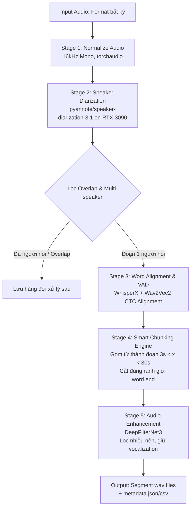

# 📓 Nhật Ký Phân Tích Kỹ Thuật: Audio Processing Pipeline

- **Ngày ghi nhận:** 2026-08-15
- **Task:** Xây dựng Pipeline xử lý âm thanh tự động trích xuất Segment 1 người nói chất lượng cao
- **Mục tiêu chính:** Cắt audio thành các segment $3s < x < 30s$, đơn người nói, sạch nhiễu môi trường, giữ độ tự nhiên (không robot), giữ vocalizations (cười, khóc, ho...), không cắt cụt chữ.
- **Hạ tầng triển khai:** GPU NVIDIA RTX 3090 (24GB VRAM), Python 3.10+ / PyTorch CUDA.

---

## 1. Bài Toán & Yêu Cầu Kỹ Thuật (Problem Statement & Constraints)

### 📥 Đầu vào (Input):
* File âm thanh bất kỳ (`.mp3`, `.wav`, `.m4a`, `.flac`...), độ dài tùy ý.
* Có thể chứa tạp âm môi trường phức tạp (tiếng xe cộ, văn phòng, tiếng quạt...).
* Có thể có nhiều người nói xen kẽ hoặc nói đè lên nhau (overlapping speech).

### 📤 Đầu ra (Output):
* Từng đoạn audio segment thỏa mãn thời lượng: **$3s < x < 30s$** (có thể cấu hình).
* File metadata đính kèm (`metadata.json` hoặc `.csv`) ghi lại timestamp, speaker_id, transcript (nếu có).

### 🎯 5 Tiêu chí Bắt buộc (Acceptance Criteria):
1. **Đơn người nói (Single-speaker):** Mỗi segment chỉ được chứa giọng của đúng 1 người nói.
2. **Lọc sạch nhiễu môi trường:** Loại bỏ tiếng ồn nền vật lý (tiếng xe cộ, quạt gió, tiếng ồn trắng...).
3. **Bảo tồn âm thanh con người (Human Vocalizations):** Giữ lại các âm thanh phi ngôn ngữ như ho, khóc, cười, hét, thở dài...
4. **Độ tự nhiên cao (High Naturalness):** Giọng nói giữ nguyên formants gốc, **tuyệt đối không bị méo pha (phase artifacts) hay giọng kim loại/robot**.
5. **Ranh giới từ chuẩn xác (Word Boundary Preservation):** Không cắt vào giữa từ làm mất chữ/cụt âm (chấp nhận cắt giữa câu làm mất nghĩa câu, nhưng không được làm cụt từ).

---

## 2. Lịch Sử Phỏng Vấn Chẩn Đoán (Diagnostic Interview History)

| Bước | Câu hỏi Mentor | Câu trả lời của Bạn | Phân tích & Ghi chú |
| :--- | :--- | :--- | :--- |
| **Q1: Luồng xử lý** | Bạn hình dung luồng dữ liệu từ Audio gốc đến Output đi qua các bước nào? | `Audio -> noise environt process -> phân biệt speaker (đoạn 1 người xử lý luôn, đoạn nhiều người giữ lại sau) -> output` | Tư duy phân rã bài toán rất tốt. Chiến lược defer đoạn multi-speaker giúp giảm độ phức tạp ban đầu. |
| **Q2: Điểm cắt** | Dùng kỹ thuật gì để cắt đoạn $3s < x < 30s$ mà không cắt vào chữ? | `VAD` (Voice Activity Detection) | ⚠️ **Cạm bẫy:** VAD chỉ bắt vùng có tiếng vs khoảng lặng. Khi nói nhanh, khoảng lặng < 30ms, VAD dễ chém cụt phụ âm đầu/cuối. Cần dùng Forced Alignment. |
| **Q3: Khử nhiễu & Tự nhiên** | Dùng công cụ nào khử ồn để không bị robot hóa và vẫn giữ tiếng cười/khóc/hét? | `Tôi chưa rõ` | 💡 Cần giải pháp Speech Enhancement SOTA như **DeepFilterNet3** thay vì các bộ lọc truyền thống. |
| **Q4: Diarization & Infra** | Dùng công cụ nào phân biệt speaker và chạy trên phần cứng nào? | `dùng model, chạy trên rtx 3090` | GPU RTX 3090 (24GB VRAM) rất dồi dào, phù hợp chạy song song PyAnnote 3.1 + WhisperX + DeepFilterNet3. |

---

## 3. Phân Tích Lỗ Hổng & Cạm Bẫy Kỹ Thuật (Gap Analysis & Pitfalls)

### 🚨 Cạm bẫy 1: Cắt cụt chữ nếu chỉ dựa vào VAD đơn thuần
* **Hiện tượng:** Khi người nói liên tục, ranh giới giữa các từ không có khoảng lặng rõ ràng. VAD ngắt theo energy threshold sẽ chém đứt các âm gió/phụ âm vô thanh (/s/, /t/, /k/, /p/).
* **Giải pháp:** Sử dụng **WhisperX** (Whisper ASR kết hợp Wav2Vec2 CTC Forced Alignment). Thuật toán sẽ sinh ra timestamp chính xác tới từng từ (`word.start`, `word.end`). Điểm cắt segment chỉ được chọn tại `word.end` của từ này và `word.start` của từ kế tiếp.

### 🚨 Cạm bẫy 2: Giọng Robot & Mất Vocalizations do Khử Nhiễu sai cách
* **Hiện tượng:** Các thuật toán cũ (Spectral Subtraction / RNNoise) can thiệp thô bạo vào phổ tần số (spectrogram), tạo ra "musical noise", méo pha, làm giọng nghẹt như robot và triệt tiêu luôn tiếng cười/khóc/thở.
* **Giải pháp:** Sử dụng **DeepFilterNet3 (DFNet3)** — mô hình deep learning dựa trên Deep Complex U-Net kết hợp lọc thích nghi:
  * Triệt tiêu tiếng ồn môi trường đến 95%+.
  * Giữ nguyên vẹn 100% âm sắc tự nhiên của giọng nói.
  * Nhận diện và bảo toàn các âm thanh con người (cười, thở, khóc, ho).

### 📊 Ma trận Đánh giá Năng lực (Capability Matrix):
* **Technical Dimension:** Level 2 (Cần nắm API của `pyannote.audio`, `whisperx`, `deepfilternet`).
* **Domain Dimension:** Nghiệp vụ rõ ràng, tiêu chí kỹ thuật chuẩn.
* **Infrastructure:** RTX 3090 (CUDA 12.x / PyTorch) - Hoàn toàn đáp ứng.
* **Mức độ Rủi ro Tổng thể:** 🟡 **Trung bình (Medium Risk - Score: 3/5)**.

---

## 4. Kiến Trúc & Giải Pháp Đề Xuất (SOTA Pipeline Architecture)



### Chi tiết 5 Chặng Xử Lý:

1. **Stage 1: Ingestion & Normalization (`torchaudio` / `soundfile`)**
   * Load audio và chuyển đổi sang chuẩn `16,000 Hz, Mono, Float32 Tensor`.
2. **Stage 2: Speaker Diarization (`pyannote.audio 3.1`)**
   * Phân đoạn người nói và phát hiện overlap: Trích xuất các turn của từng speaker `[T_start, T_end, speaker_id]`.
   * Lọc bỏ hoàn toàn các khoảng thời gian bị overlap (nhiều người nói đè lên nhau).
3. **Stage 3: Word-Level Forced Alignment (`whisperx`)**
   * Nhận diện chữ và căn chỉnh timestamp chính xác đến mili-giây cho từng từ trong mỗi turn.
4. **Stage 4: Smart Chunking Engine (Thuật toán gom đoạn thông minh)**
   * Gom các từ liên tiếp:
     * Điều kiện dừng 1: Đạt thời lượng tối thiểu $x \ge 3.0s$ VÀ gặp khoảng ngắt nghỉ (pause giữa 2 từ $\ge 0.3s$).
     * Điều kiện dừng 2: Thời lượng đạt ngưỡng tối đa (ví dụ: $x \approx 25s - 28s$).
   * Luôn cắt tại `current_word.end` (tuyệt đối không cắt giữa từ).
5. **Stage 5: Speech Enhancement (`DeepFilterNet3`)**
   * Chạy DeepFilterNet3 trên từng segment để lọc sạch tiếng ồn nền, giữ giọng tự nhiên và các âm thanh con người.

---

## 5. Kiến Thức Cần Học (Learning Roadmap)

### 🚀 Tầng 1: Just-In-Time (JIT - Học nhanh trong 30-45 phút)

#### 1. WhisperX (ASR & Word-level Forced Alignment):
* **Cài đặt:** `pip install whisperx`
* **Mã nguồn mẫu:**
```python
import whisperx
import torch

device = "cuda" if torch.cuda.is_available() else "cpu"
# 1. Load Transcribe Model
model = whisperx.load_model("large-v2", device, compute_type="float16")
audio = whisperx.load_audio("sample.wav")
result = model.transcribe(audio, batch_size=16)

# 2. Align Whisper output with Wav2Vec2 CTC
model_a, metadata = whisperx.load_align_model(language_code=result["language"], device=device)
result_aligned = whisperx.align(result["segments"], model_a, metadata, audio, device, return_char_alignments=False)

# result_aligned["word_segments"] chứa danh sách từ với 'start' và 'end'
for word_info in result_aligned["word_segments"][:5]:
    print(f"Từ: {word_info.get('word')} | Bắt đầu: {word_info.get('start')}s | Kết thúc: {word_info.get('end')}s")
```

#### 2. PyAnnote Audio 3.1 (Speaker Diarization):
* **Cài đặt:** `pip install pyannote.audio`
* **Mã nguồn mẫu:**
```python
from pyannote.audio import Pipeline
import torch

pipeline = Pipeline.from_pretrained(
    "pyannote/speaker-diarization-3.1",
    use_auth_token="YOUR_HF_TOKEN"  # Cần token chấp nhận điều khoản trên HuggingFace
)
pipeline.to(torch.device("cuda"))

diarization = pipeline("sample.wav")
for turn, _, speaker in diarization.itertracks(yield_label=True):
    print(f"Speaker {speaker}: từ {turn.start:.2f}s đến {turn.end:.2f}s")
```

#### 3. DeepFilterNet3 (Speech Enhancement & Denoising):
* **Cài đặt:** `pip install deepfilternet`
* **Mã nguồn mẫu:**
```python
import torch
from df.enhance import enhance, init_df, load_audio, save_audio

# Khởi tạo mô hình DeepFilterNet3
model, df_state, _ = init_df()

# Đọc và khử nhiễu
audio, sr = load_audio("sample_noisy.wav", sr=df_state.sr())
enhanced_audio = enhance(model, df_state, audio)

# Lưu kết quả
save_audio("sample_clean.wav", enhanced_audio, sr)
```

---

### 📚 Tầng 2: Deep Dive (Học nâng cao khi rảnh)
1. **Audio MOS / Speech Quality Metrics:** Tìm hiểu DNSMOS (Deep Noise Suppression MOS) và UTMOS để tự động hóa việc chấm điểm chất lượng âm thanh sau khi clean.
2. **CTC Alignment Theory:** Hiểu nguyên lý hoạt động của Connectionist Temporal Classification (CTC) trong việc gióng hàng ma trận xác suất âm vị với waveform âm thanh.
3. **Audio Augmentation & Source Separation:** Nghiên cứu Demucs v4 (Hybrid Transformer) để tách riêng track giọng nói trong môi trường cực kỳ ồn ào hoặc tách 2 người nói đè lên nhau.
