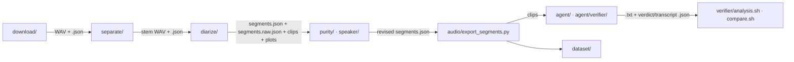

# Documentation index

Standalone, file-backed audio commands: download → separate → diarize → refine
purity → export clips → verify with audio LLMs → curate datasets. Every command
is an independent CLI under `scripts/`; there is no orchestrator, queue, or
shared in-memory state.

| Document | Read it for |
|---|---|
| [commands.md](commands.md) | Environment setup, launcher → venv table, copy-paste command cookbook |
| [cli_contract.md](cli_contract.md) | Global CLI rules and the per-command flag/output matrix |
| [data_contract.md](data_contract.md) | JSON schemas: audio sidecar, `segments.json`, purity manifests, speaker profile, agent/verdict artifacts, analysis and comparison outputs |
| [agent_verifier.md](agent_verifier.md) | Raw audio-model generation (`scripts/agent/`) and hardened verifiers, analysis, comparison (`scripts/agent/verifier/`) |
| [hardware.md](hardware.md) | AMD ROCm / NVIDIA CUDA notes, environment provisioning, known GPU pitfalls |
| [experiments.md](experiments.md) | Historical findings and governing decisions (teacher model, benchmark, verifier results, public DER tables) |

Coding-agent rules live in [`AGENTS.md`](../AGENTS.md) at the repository root.
