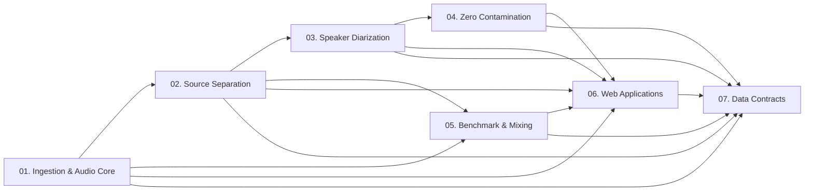

# Documentation Index & Architecture Map

Welcome to the **audio-prepare-pipeline-redo** documentation. This pipeline provides tools for ingesting audio (YouTube or local files), separating musical stems, performing high-precision speaker diarization, verifying speaker purity, running separation benchmarks, and orchestrating batch workflows through unified web platforms.

---

## 🧭 Reading Order & Operational Flow

The documentation is organized modularly to match the natural audio processing lifecycle:

| Order | Module | Description | Key Components |
|---|---|---|---|
| **01** | [**Audio & Ingestion**](01_audio_and_ingestion.md) | File-backed audio representation and YouTube crawling | `Audio`, `YtCrawler`, `probe_wav`, `normalize_wav` |
| **02** | [**Source Separation**](02_source_separation.md) | Vocal/instrumental separation and managed model lifecycle | `BaseSeparator`, `HTDemucs`, `BSRoFormer`, `MelRoFormer`, `MVSepMDX23`, `ManagedModel` |
| **03** | [**Speaker Diarization**](03_speaker_diarization.md) | Diarization backends, turn cleanup, evaluation, and verifiers | `Sortformer`, `DiariZen`, `Pyannote`, `ThreeDSpeaker`, `Clustering`, `SpeakerVerifier`, `OverlapVerifier`, `VibeVoicePurityVerifier` |
| **04** | [**Zero-Contamination Diarization**](04_zero_contamination_diarization.md) | Extreme-precision TTS data harvesting pipeline | `run_zero_contamination_pipeline`, Dual-engine consensus, Whisper syllable lock, Micro-energy snapping, WeSpeaker homogeneity |
| **05** | [**Benchmark & Mixing**](05_benchmark_and_mixing.md) | Speech+music mixture generation and evaluation | `AudioMixer`, `BenchmarkDefinition`, `AudioMixResult`, `bench-paper-diarize` |
| **06** | [**Web Applications**](06_web_applications.md) | SonicStudio & SonicPipeline web platforms | REST backend (port 8765), `/studio/`, `/pipeline/`, FIFO queues, SSE, Hardware monitor |
| **07** | [**Data Contracts & Schemas**](07_data_contracts.md) | Canonical schemas, sidecar specs, and serialization | `DiarizationResult`, `SpeakerProfile`, `ZeroContaminationResult`, `AudioItem`, `.data/` layout |
| **08** | [**Model Parameters & Trade-offs**](08_model_parameters_and_tradeoffs.md) | Parameter mechanics, directional sensitivity, and guaranteed vs empirical trade-offs | All separation, diarization, purity, and zero-contamination parameters |

---

## 📑 Contract Gateways

For direct access to specific contracts:
- [**API Contract Summary**](api_contract.md): High-level method catalog and quick-reference behavior matrix.
- [**Data Contract Summary**](data_contract.md): Field specifications, serialized payloads, and sidecar definitions.
- [**Diarization Benchmark Paper Reference**](bench-paper-diarize.md): Published benchmark comparisons (DER) across Pyannote, 3D-Speaker, NeMo Sortformer, NeMo Clustering, and DiariZen.

---

## 🏛️ System Philosophy & Design Principles

1. **File-Backed State (`Audio`):** Identity is a path plus metadata (`source_id`, `title`, rates, duration, channels, format). In-memory waveforms are never passed across public boundaries.
2. **Identity Preservation:** Transformations preserve `source_id`, `title`, and `native_sample_rate`. Derived files record step history tags.
3. **Managed Model Lifecycles:** Heavy neural models (`BSRoFormer`, `MelRoFormer`, diarizers, verifiers) inherit `ManagedModel` (`load()`, `unload()`, `with model:`).
4. **Isolated Environments:** NeMo, DiariZen, 3D-Speaker, and VibeVoice dependencies are isolated in dedicated worker environments (`.venv-*`) to prevent package version conflicts in the primary runtime.
5. **Precision Over Recall:** Diarization and purity verification prioritize zero multi-speaker leakage over retaining turn volume.
