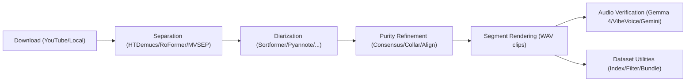

# Documentation Index & Architecture Map

Welcome to the **audio-prepare-pipeline-redo** documentation. This repository
provides standalone, file-backed commands for downloading, separating, diarizing,
verifying, mixing, and preparing audio datasets for speech models.

---

## Active production strategy

For the current E2B fine-tuning experiment, start with the
[saved plan and scaffold](E2B_VERIFIER_EXPERIMENT.md). The 288-clip benchmark
is frozen for final evaluation; development uses separate sources. Synthetic
model targets omit the optional `reason` field.

For the next engineering and experiment work, start with
[Local Vietnamese TTS production strategy](TTS_PRODUCTION_STRATEGY.md) and
[execution and continuation log](TTS_STRATEGY_EXECUTION.md).

## 🧭 System Architecture & Contracts

The architecture is built entirely on independent CLI commands and file contracts:

- [**Command Cookbook & Reference**](../scripts/COMMANDS.md): Full CLI usage and launcher table.
- [**CLI Contract Gateway**](api_contract.md): Command parameters, flags, and execution semantics.
- [**Data & File Contract Gateway**](data_contract.md): File schemas, sidecar JSON, and manifest structures.
- [**Hardware Compatibility**](09_amd_gpu_compatibility.md): Hardware execution breakdown across AMD ROCm and NVIDIA CUDA.
- [**Diarization Benchmark Paper Reference**](bench-paper-diarize.md): Published benchmark comparisons (DER) across diarization backends.

