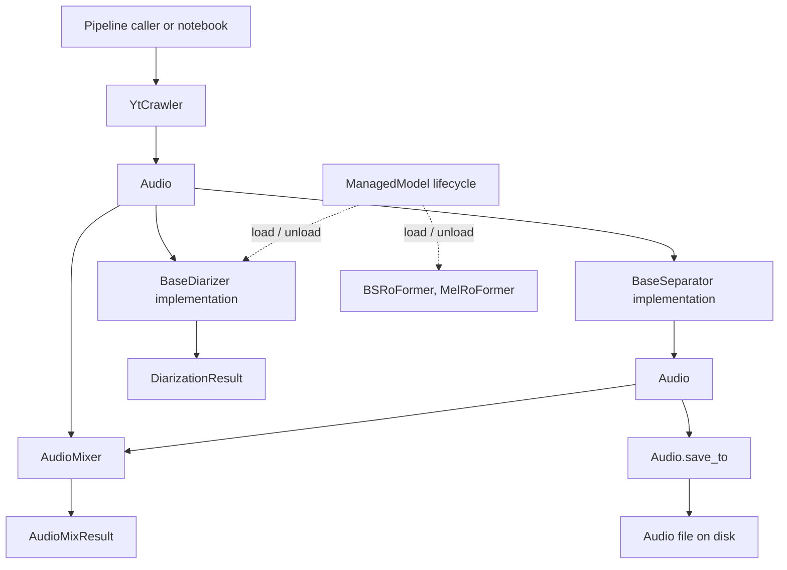

# API contract



This document describes what the public methods do, what they accept and
return, their side effects, and the conditions required to call them. The
field-level shape of returned objects is documented in
[`data_contract.md`](data_contract.md).

## 1. Audio ingestion API

### `YtCrawler.ingest(...) -> Audio`

**Defined in:** `src/yt_crawler/YtCrawlerClass.py`

A convenience class method that creates a crawler and delegates to
`download()`.

**Inputs:**

- `link: str` — YouTube URL.
- Optional output/work directories and normalization settings.
  Default channel count is 1 (mono).
- Additional crawler options through `**kwargs`, such as cookies or proxy.

**Returns:** One `Audio` instance representing the normalized downloaded file.

**Side effects:** Creates output/work directories, invokes `yt-dlp` and possibly
`ffmpeg`, writes the final audio artifact, and removes the temporary download
session directory.

### `YtCrawler.download(url: str) -> Audio`

Downloads one URL and returns an `Audio` object.

**Behavior contract:**

1. Creates an isolated temporary session directory.
2. Runs `yt-dlp` without downloading a playlist.
3. Reads the generated `.info.json` metadata.
4. Selects an audio file rather than a video artifact.
5. Normalizes the file to the crawler's configured format, sample rate, and
   channel count (default 1 / mono), saved as `<sanitized_title>__<source_id>.<format>`.
6. Generates companion identity metadata sidecar JSON (`<stem>.json`) alongside the audio file.
7. Returns an `Audio` object whose `path` points to the final output.
8. Removes the temporary session directory even if processing fails.

**Raises:** `DownloadError` when `yt-dlp`, metadata parsing, audio discovery,
or `ffmpeg` processing fails.

### `YtCrawler.build_command(url: str, target_work_dir: Path) -> list[str]`

Builds, but does not execute, the `yt-dlp` command. The returned value is a
list of command-line tokens, not a data-contract class. The command includes
`--newline` so yt-dlp emits one progress line at a time, uses yt-dlp's
`no-certifi` compatibility option with the system CA bundle when available, and
passes `--postprocessor-args ExtractAudio:-ac N` so extraction matches the
crawler's channel count (default 1). `YtCrawler.cancel()` terminates an active
yt-dlp process group.

## 2. `Audio` API

**Defined in:** `src/utils/AudioClass.py`

`Audio` is a file-backed dataclass. Its fields are documented in
[`data_contract.md`](data_contract.md).

### `Audio.from_file(path, *, source_id=None, title=None, native_sample_rate=None, history=None) -> Audio`

Creates an `Audio` object for an existing file.

**Behavior contract:**

- Resolves `path` to an absolute path.
- If `{stem}.json` exists next to the audio (written by `save_to` /
  `quick_save`), restores `source_id`, `title`, `native_sample_rate`, and
  `history` from it. Explicit keyword arguments override the sidecar.
- Uses the file stem as the default `source_id` and `title` when no sidecar
  is present.
- Detects the extension as `format`.
- Probes WAV files for sample rate, duration, and channel count (these
  probed values win over sidecar snapshots).
- Sets `native_sample_rate` to the sidecar value, else the probed file rate,
  unless the caller passes the original source rate.
- Uses class defaults for metadata that cannot be probed.
- Initializes `history` to the provided sequence, else sidecar history, else
  an empty tuple.

**Raises:** `FileNotFoundError` if the path does not identify a file.

### `Audio.metadata(*, target_sample_rate=None) -> dict`

Returns a serializable snapshot of the `Audio` fields (including `history` as a list). `path` is a string.
When `target_sample_rate` is given, the dict also includes that rate and
`resample_action` (`upscale`, `downscale`, or `keep`).

### `Audio.resample_action(target_sample_rate) -> "upscale" | "downscale" | "keep"`

Compares the current file `sample_rate` with a model's expected rate so the
caller can decide whether to resample. This uses the current file rate, not
`native_sample_rate`. `native_sample_rate` is still useful to detect that the
file was already resampled from the original source.

### `Audio.add_step(step_tag) -> Audio`

Returns a new `Audio` object with the sanitized `step_tag` appended to `history`.

### `Audio.fingerprint -> str`

Returns a formatted string representing the audio's processing fingerprint, combining
the source identifier, step history, and audio specs (`duration_s`, `sample_rate`, `channels`)
using `__` as segment separators.

### `Audio.save_to(dest) -> Audio`

Copies the represented audio file to `dest` and updates the same object's
`path` to the destination. It returns the same `Audio` instance, not a new
independent object. Destinations without a suffix default to `.wav`.

**Side effects:** Creates destination parent directories, copies the file
when the source and destination differ, and writes `{stem}.json` next to
the audio with identity metadata (`source_id`, `title`, `native_sample_rate`,
`history`, and last-known audio specs).

**Raises:** `FileNotFoundError` if the current source file does not exist.

### `Audio.quick_save(output_dir=None, *, name=None, prefix=None, suffix=None, tag=None) -> Audio`

Copies the represented audio file to a quick-save temporary directory (defaulting to
`<project_root>/temp/`) as WAV unless `name` includes another extension, with an
informative filename generated from the `Audio` object's `fingerprint` (or explicit
`name`), prints `Quick saved to: <destination>` to standard output, and updates the
same object's `path` to the destination. It returns the same `Audio` instance.

**Side effects:** Creates the destination directory, copies the file when source
and destination differ, writes `{stem}.json` next to the audio, and prints the
destination path to stdout.

**Raises:** `FileNotFoundError` if the current source file does not exist.

### `Audio.write_sidecar() -> Audio`

Writes identity metadata next to `self.path` as `{stem}.json` without modifying or moving the underlying audio file. It returns the same `Audio` instance.

### `Audio.notebook_display(dest=None) -> None`

Optionally copies the audio file to `dest` via `save_to` and displays it using
an interactive IPython audio player. It returns `None` and is intended for notebooks.
`Audio.display` is provided as an alias.

**Raises:** `FileNotFoundError` if the represented audio path does not exist.

### `Audio.show_mel_spectrogram(...) -> None`

Loads the audio, computes a mel spectrogram, and displays it with Matplotlib.
It does not modify the `Audio` object and returns `None`.

**Raises:** `FileNotFoundError` if the represented path no longer exists.

### `repr(audio) -> str`

Returns a human-readable representation containing the source ID, title, path,
sample rate, native sample rate, duration, channel count, format, and history (if non-empty).

## 3. Source-separation API

### Common interface: `BaseSeparator.separate(audio: Audio) -> Audio`

**Defined in:** `src/separation/BaseSeparator.py`

Every separator consumes one `Audio` object and returns one separated `Audio`
object. The returned object has the same nine-field class contract, while its
`path` points to the normalized separated output and its `history` records the separation step.

### Concrete implementations

| Class | Method | Model lifecycle requirement |
|---|---|---|
| `HTDemucs` | `separate(audio) -> Audio` | No explicit `load()` required. |
| `BSRoFormer` | `separate(audio) -> Audio` | Call `load()` first, or use a context manager. |
| `MelRoFormer` | `separate(audio) -> Audio` | Call `load()` first, or use a context manager. |
| `MVSepMDX23` | `separate(audio) -> Audio` | No `ManagedModel` load step; dependencies/checkpoints may be fetched on first use. Requires `onnxruntime-gpu` for CUDA execution; explicit `device="cuda"` raises `MVSepMDX23Error` if CUDA or ONNX CUDA execution provider is unavailable. Indexed devices such as `cuda:1` isolate the upstream subprocess to that physical GPU. |

**Common behavior:**

- Verifies that the input path exists.
- Runs the backend-specific separation process.
- Normalizes the selected stem to the configured sample rate and channel count.
- Probes the output WAV.
- Preserves the input `source_id`, `title`, and `native_sample_rate`.
- Returns a new `Audio` instance with `format="wav"`.

**Common failure behavior:** Each backend raises its own runtime error type
when the input, external command, model, or expected output is unavailable.

`MVSepMDX23` uses a resource-conscious vocal-separation default of one Kim
ONNX model (`single_onnx=True`) and `0.25` overlap. Callers that need the
upstream maximum-quality ensemble can pass `single_onnx=False`,
`overlap_large=0.6`, and `overlap_small=0.5`. Its optional
`progress_callback(message)` receives unbuffered upstream status lines.
Long inputs are processed as bounded 10-minute WAV segments by default and the
selected output stem is concatenated afterward; `max_segment_seconds=None`
disables this behavior.
`cancel()` requests non-blocking cancellation, while `close()` terminates and
reaps any active upstream process group. The cloned CLI is patched to print
`PROGRESS: N%` lines from the upstream percent callback so the web queue can
show a real progress bar when those lines are present.

`HTDemucs` streams Demucs CLI output, exposes `progress_callback(message)` and
`cancel()`, and terminates its process group on cancel. Tqdm percent lines are
forwarded when Demucs prints them.

### `BaseSeparator.close() -> None`

Default no-op resource cleanup method. `BSRoFormer` and `MelRoFormer` provide a
compatibility implementation that delegates to `unload()`. `MVSepMDX23.close()`
cancels and reaps an active CLI subprocess. `HTDemucs.close()` cancels an
active Demucs process group.

## 4. Managed model lifecycle API

**Defined in:** `src/base/model.py`

`ManagedModel` is used by `PyannoteDiarizer`, `SortformerDiarizer`,
`ClusteringDiarizer`, `ThreeDSpeakerDiarizer`, `BSRoFormer`, and `MelRoFormer`.

### `is_loaded -> bool`

Read-only property indicating whether the underlying resource is currently
loaded.

### `load() -> None`

Loads the resource once by calling the subclass's `_load()` implementation.
Repeated calls while loaded are no-ops.

### `unload() -> None`

Releases the resource once by calling `_unload()`. Repeated calls while already
unloaded are no-ops.

### Context-manager behavior

```python
with model:
    result = model.some_operation()
```

- `__enter__() -> ManagedModel` calls `load()` and returns the model.
- `__exit__(...) -> None` calls `unload()`, including when leaving because of
  an exception.

Subclasses must implement `_load() -> None` and `_unload() -> None`.

## 5. Speaker-diarization API

### `BaseDiarizer.diarize(audio: Audio) -> DiarizationResult`

**Defined in:** `src/diarization/BaseDiarizer.py`

Abstract interface for converting audio into backend-independent speaker
information.

### `PyannoteDiarizer(model_id=..., device=..., token=..., num_speakers=..., min_speakers=..., max_speakers=...)`

**Defined in:** `src/diarization/PyannoteDiarizer.py`

- `model_id`: Hugging Face repository ID. Defaults to `DEFAULT_PYANNOTE_MODEL_ID` (`"pyannote/speaker-diarization-community-1"`).
- `device`: Compute target (`"auto"`, `"cuda"`, `"cpu"`, etc.).
- `token`: Optional Hugging Face authentication token (or reads `HF_TOKEN` from environment).
- `num_speakers`, `min_speakers`, `max_speakers`: Optional speaker-count constraints.

### `PyannoteDiarizer.diarize(audio: Audio, *, num_speakers=None, min_speakers=None, max_speakers=None, hook=None) -> DiarizationResult`

Requires the Pyannote pipeline to be loaded first.

**Behavior contract:**

- Decodes the file with `soundfile` and invokes Pyannote with a float32
  `(channel, time)` waveform tensor plus its sample rate. Downmixes stereo/multi-channel to mono when applicable. This keeps file
  decoding independent of Pyannote's optional `torchcodec` integration.
- Passes `num_speakers`, `min_speakers`, `max_speakers`, and `hook` if specified.
- Extracts speaker turns from both `output.speaker_diarization` (pyannote 3.3/4.0+ and community models) or direct Annotation outputs (pyannote 3.1).
- Converts backend speaker labels into result-local IDs such as `spk_00`.
- Creates one `Speaker` record for each distinct label.
- Creates one `SpeakerTurn` record for each annotated segment.
- Sets `audio_id` to `audio.source_id`.
- Includes `DiarizationModelInfo` with backend `"pyannote"` and the configured
  model ID.

**Raises:** `RuntimeError` if `load()` has not completed or the underlying
pipeline is unavailable; `ValueError` if the decoded audio is empty. Audio
decoder errors are propagated.

### `PyannoteDiarizer._load() -> None` and `_unload() -> None`

These are lifecycle implementations rather than caller-facing processing
methods:

- `_load()` loads the configured Hugging Face/Pyannote pipeline and places it
  on the requested device.
- `_unload()` releases the pipeline and clears CUDA cache when available.

### `SortformerDiarizer.diarize(audio: Audio) -> DiarizationResult`

Requires the dependencies pinned in `requirements-sortformer.txt` and a
completed `load()`. They are intentionally kept out of the primary `uv.lock`
because NeMo constrains shared packages such as Lightning and Hugging Face Hub;
install them in an isolated worker/environment. The default model artifact is
downloaded from
`nvidia/diar_sortformer_4spk-v1` at revision
`f059506485424eb68a90a7af84c8e63e67f381fd`.

Deployment note: model inference is run on the dedicated model server
(`vsf@vsf-242`), not on the development machine (`tungnl5@VF-TUNGNL5-L`). The
server loads `HF_TOKEN` from the repository-root `.env` when the web process
starts. Hugging Face downloads use `.data/huggingface` as the default cache
(`HF_HOME` can override this location).

**Behavior contract:**

- Inspects and normalizes the actual input file to mono, 16 kHz PCM WAV rather
  than trusting `Audio` metadata.
- Processes at most six minutes per inference call by default, with a one-minute
  overlap between adjacent windows.
- Converts the model's 80 ms, four-channel activity probabilities into speaker
  turns with configurable hysteresis and duration post-processing.
- Aligns speaker slots between windows using activity in the shared region.
- Uses TitaNet embeddings as a fallback when a speaker is absent from the
  overlap, unless speaker similarity is disabled.
- Resolves duplicate predictions in shared regions at the overlap midpoint,
  preserves simultaneous speakers, sorts turns chronologically, and emits
  result-local IDs such as `spk_00`.
- May produce more than four speakers in the complete result. The hard limit of
  four distinct speakers applies independently to each inference window.
- Retries with three-minute windows by default when a six-minute inference
  raises an accelerator out-of-memory error.
- Includes `DiarizationModelInfo` with backend `"nemo-sortformer"`, the model
  repository ID, and the pinned revision.

**Device behavior:** `device="auto"` selects CUDA, then MPS, then CPU. MPS is
experimental in NeMo and may use CPU fallbacks when
`PYTORCH_ENABLE_MPS_FALLBACK=1`. An explicitly requested unavailable device
raises `RuntimeError`.

**Raises:** `RuntimeError` when the model is not loaded, optional NeMo support
is unavailable, output is in an unknown format, or the selected device cannot
be initialized. Audio conversion and file errors are propagated.

### `SortformerWorkerDiarizer`

The web applications use `SortformerWorkerDiarizer` from the primary `.venv`.
Its public lifecycle and `diarize(audio) -> DiarizationResult` contract match
`SortformerDiarizer`, but `load()` starts
`.venv-sortformer/bin/python -m src.diarization.sortformer_worker`. The worker
loads NeMo once and is reused across all `diarize()` calls until `unload()` or
`close()`. This keeps NeMo's dependency pins out of the web server process and
allows the unified UI to switch between Sortformer and other utilities without
a server restart. `SORTFORMER_PYTHON` or the `worker_python` constructor option
can point to a non-default isolated interpreter. `cancel()` terminates active
worker inference.

### `SortformerDiarizer._load() -> None` and `_unload() -> None`

- `_load()` downloads the exact `.nemo` artifact (unless `checkpoint_path` is
  supplied), restores it with `strict=False`, and moves it to the selected
  device.
- TitaNet is loaded lazily only when a recording needs multiple windows.
- `_unload()` releases both models and clears available accelerator caches.

### `ClusteringDiarizer.diarize(audio: Audio) -> DiarizationResult`

**Defined in:** `src/diarization/ClusteringDiarizer.py`

NeMo's cascaded clustering pipeline: MarbleNet voice-activity detection,
multi-scale TitaNet speaker embeddings, then spectral clustering. Requires the
same isolated NeMo environment as Sortformer (`requirements-sortformer.txt`).
Default models are `vad_multilingual_marblenet` and `titanet_large`.

**Behavior contract:**

- Inspects and normalizes the actual input file to mono, 16 kHz PCM WAV rather
  than trusting `Audio` metadata.
- Writes a one-file NeMo manifest and runs `ClusteringDiarizer.diarize()`.
- Parses predicted RTTM into result-local IDs such as `spk_00`, preserving
  first-seen speaker order.
- When `num_speakers` is set, or when min and max speaker bounds are equal,
  clustering uses that exact count. Otherwise it estimates the count up to
  `max_num_speakers` (default 8).
- Includes `DiarizationModelInfo` with backend `"nemo-clustering"` and a
  `model_id` of `{vad_model}+{speaker_model}`.

**Device behavior:** `device="auto"` selects CUDA, then MPS, then CPU. An
explicitly requested unavailable device raises `RuntimeError`.

**Raises:** `RuntimeError` when the model is not loaded, optional NeMo support
is unavailable, clustering fails without writing RTTM, or the selected device
cannot be initialized. Audio conversion and file errors are propagated.

### `ClusteringWorkerDiarizer`

The web applications use `ClusteringWorkerDiarizer` from the primary `.venv`.
Its public lifecycle and `diarize(audio) -> DiarizationResult` contract match
`ClusteringDiarizer`, but `load()` starts
`.venv-sortformer/bin/python -m src.diarization.clustering_worker`. The worker
loads MarbleNet and TitaNet once and reuses them until `unload()` or
`close()`. `CLUSTERING_PYTHON`, `SORTFORMER_PYTHON`, or the `worker_python`
constructor option can point to a non-default isolated interpreter.
`cancel()` terminates active worker inference.

### `ClusteringDiarizer._load() -> None` and `_unload() -> None`

- `_load()` constructs NeMo `ClusteringDiarizer` with the configured VAD and
  speaker-embedding models and places them on the selected device.
- `_unload()` releases both models and clears available accelerator caches.

### `ThreeDSpeakerDiarizer.diarize(audio: Audio) -> DiarizationResult`

**Defined in:** `src/diarization/ThreeDSpeakerDiarizer.py`

ModelScope [3D-Speaker](https://github.com/modelscope/3D-Speaker) audio-only
pipeline: FSMN voice-activity detection, CAM++ speaker embeddings, then
spectral clustering, with optional pyannote overlap refinement. Requires the
isolated environment pinned in `requirements-3dspeaker.txt`. The 3D-Speaker
repository is shallow-cloned into `.data/3d-speaker` on first `load()` when
missing (override with `THREEDSPEAKER_ROOT`). Model downloads default to
`.data/modelscope`.

**Behavior contract:**

- Normalizes the input file to mono, 16 kHz PCM WAV rather than trusting
  `Audio` metadata.
- Runs `speakerlab.bin.infer_diarization.Diarization3Dspeaker` and converts
  `[[start, end, speaker_id], ...]` segments into result-local IDs such as
  `spk_00`, preserving first-seen speaker order.
- When `num_speakers` is set, or when min and max speaker bounds are equal,
  clustering uses that exact count. Otherwise it estimates the count.
- When `include_overlap=True`, enables pyannote `segmentation-3.0` overlap
  refinement and requires `token` or `HF_TOKEN`.
- `chunk_duration_s` / `chunk_step_s` control embedding subsegment window and
  hop (upstream defaults `1.5` / `0.75`). Values must satisfy
  `0 < chunk_step_s <= chunk_duration_s`.
- Includes `DiarizationModelInfo` with backend `"3d-speaker"` and a `model_id`
  of `{vad_model}+{embedding_model}`.

**Device behavior:** `device="auto"` selects CUDA, then MPS, then CPU. An
explicitly requested unavailable device raises `RuntimeError`.

**Raises:** `RuntimeError` when the model is not loaded, speakerlab/ModelScope
support is unavailable, the 3D-Speaker checkout cannot be cloned or is
incomplete, inference fails, or the selected device cannot be initialized.
Audio conversion and file errors are propagated.

### `ThreeDSpeakerWorkerDiarizer`

The web applications use `ThreeDSpeakerWorkerDiarizer` from the primary
`.venv`. Its public lifecycle and `diarize(audio) -> DiarizationResult`
contract match `ThreeDSpeakerDiarizer`, but `load()` starts
`.venv-3dspeaker/bin/python -m src.diarization.threed_speaker_worker`. The
worker loads ModelScope/speakerlab models once and reuses them until
`unload()` or `close()`. `THREEDSPEAKER_PYTHON` or the `worker_python`
constructor option can point to a non-default isolated interpreter.
`cancel()` terminates active worker inference.

### `ThreeDSpeakerDiarizer._load() -> None` and `_unload() -> None`

- `_load()` adds the 3D-Speaker checkout to `sys.path` (shallow-cloning
  https://github.com/modelscope/3D-Speaker into `.data/3d-speaker` when
  missing), constructs `Diarization3Dspeaker` with the configured device /
  overlap settings, overrides embedding `chunk(dur, step)` with
  `chunk_duration_s` / `chunk_step_s`, and caches ModelScope weights under
  `.data/modelscope`.
- `_unload()` releases the pipeline and clears available accelerator caches.

## 6. Benchmark mixing API

### `AudioMixer.mix(...) -> AudioMixResult`

**Defined in:** `src/benchmark/separation/mixer.py`

**Inputs:**

- `speech: Audio`
- `music: Audio`
- `target_smr_db: float`
- `seed: int`
- `output_dir: str | Path`

**Behavior contract:**

1. Loads both input files as floating-point waveforms.
2. Converts both inputs to the configured channel layout.
3. Crops or loops music to the speech duration using the supplied seed.
4. Applies music gain to reach the requested speech-to-music ratio.
5. Applies a common output gain when the peak exceeds the configured ceiling.
6. Writes `speech_reference.wav`, `music_reference.wav`, and `mixture.wav`.
7. Returns an `AudioMixResult` containing three `Audio` objects and one
   `MixingParameters` object.

**Raises:** `ValueError` for invalid mixer settings, effectively silent input,
or an output directory that would overwrite an input audio file.

## 7. Shared audio utility API

These functions support the public pipeline methods but return no pipeline
classes.

| Function | Return | Contract |
|---|---|---|
| `probe_wav(path)` | `tuple[int, float, int]` | `(sample_rate, duration_s, channels)`. |
| `normalize_wav(src, dest, ...)` | `None` | Copies or converts audio using `ffmpeg`. |

`normalize_wav` raises `AudioConvertError` when `ffmpeg` conversion fails.

## 8. Dataclass method note

`Speaker`, `SpeakerTurn`, `DiarizationModelInfo`, `DiarizationResult`,
`BenchmarkDefinition`, `MixingParameters`, `AudioMixResult`, and
`SeparationBenchmarkSample` are dataclasses. Apart from validation in the
`Speaker*`, `DiarizationModelInfo`, and `DiarizationResult` constructors, they
do not define additional business methods. Python supplies standard dataclass
methods such as `__init__`, `__repr__`, and `__eq__`.

## 9. Web application platforms

The repository provides two specialized web platforms:

### Shared web backend

- **Entrypoint:** `scripts/start_web.py` / `scripts/start_web.sh` (default port
  `8765`).
- **Frontend mounts:** SonicStudio is served at `/studio/`; SonicPipeline is
  served at `/pipeline/`.
- **Health endpoint:** `GET /api/health` reports backend status and both
  frontend mount points.
- **Shutdown:** Stopping the backend cancels every pending and running
  SonicStudio task and SonicPipeline job, kills job child processes
  (`yt-dlp`, `ffmpeg`, Demucs, MVSEP), and does not resume leftover jobs
  after restart.
- **Compatibility:** The former `start_studio.*` and `start_pipeline.*`
  launchers start the same unified backend.

### `src/web_studio/` (SonicStudio API domain and frontend)
- **Role:** Interactive workbench for upload/YouTube ingest, cutting, stem
  separation, diarization, A/B audition, and library browsing.
- **Frontend layout:** Flat `static/index.html` + `app.js` + `style.css` (no
  HTML partial composer). Tabs: Workspace, Separation, Diarization, Audition,
  Library.
- **Background task queue:** YouTube ingestion, single-model separation,
  diarization, and multi-model comparison use **per-device FIFO queues**.
  Each GPU (`cuda:0`, `cuda:1`, …) and the `cpu`/`mps` lane have independent
  workers so work for one accelerator never blocks another. Default is
  `1` worker per device; `STUDIO_QUEUE_CONCURRENCY` sets workers-per-device
  (1–4). CPU-only jobs (YouTube crawl) always use the `cpu` lane.
  Long-running studio jobs use **polling** via `GET /api/tasks/{id}` (no
  live-reload SSE).
- **Task endpoints:** `GET /api/tasks` lists tasks and queue counts,
  `GET /api/tasks/{id}` returns one task, and `DELETE /api/tasks/{id}` cancels
  a queued or running task. Running CLI backends (yt-dlp, Demucs, MVSEP,
  Sortformer) are force-stopped. In-process models (BS-RoFormer, Mel-RoFormer,
  Pyannote) are marked cancelled; the current forward pass may finish.
- **Queue progress:** Shared queue items expose `progress` as 0–100 and
  `progress_known`. When a backend prints a detectable percent or fraction, or
  a batch job reports item counts, the bar shows that value. Otherwise the UI
  reports that numeric progress is unavailable instead of faking a stub
  percentage.
- **Shared Queue endpoints (registered once by Studio):** `GET /api/queue/shared`
  aggregates hardware telemetry and active/queued workloads across Studio and
  Pipeline, including a `device_queues` map (`running` / `queued` / `workers`
  per lane). `DELETE /api/queue/shared/{id}` and
  `POST /api/queue/shared/{id}/cancel` cancel a workload in either domain.
- **Telemetry:** `GET /api/telemetry` is owned by the Studio route table and
  returns host/GPU metrics from `hardware_monitor`.

### `src/web_pipeline/` (SonicPipeline API domain and frontend)
- **Role:** Large-scale batch engine for high-throughput ingestion, task queue orchestration, dataset curation, bulk separation, batch diarization, separation benchmark matrix evaluation, and ML manifest generation (JSONL/CSV).
- **Frontend layout:** Flat `static/index.html` + `app.js` + `style.css`.
- **Job progress:** Server-Sent Events on `GET /api/events` (queue/job updates
  plus telemetry heartbeats). Initial hydrate still uses `GET /api/jobs`.
- **Per-GPU queues:** Batch jobs are routed by `params.device` onto independent
  lanes (same model as Studio). Ingest/upload jobs use the `cpu` lane.
  `POST /api/queue/controls` `set_concurrency` sets **workers per GPU**
  (default 1), not a single global worker pool.

**Telemetry payload:** The `gpu` object includes `load_percent`, host-level
`used_vram_mb`, `free_vram_mb`, and `total_vram_mb`, plus the current process's
`allocated_vram_mb` and `reserved_vram_mb`. NVIDIA telemetry also includes
`power_w`, `power_limit_w`, and `power_percent`; each entry in `devices` includes
its CUDA logical `index`, NVIDIA `physical_index`, and stable `uuid`. Logical
CUDA devices are matched to NVIDIA sensor readings by UUID because CUDA and
`nvidia-smi` can enumerate the same GPUs in different orders. GPU load, power,
and host VRAM counters are `null` when the active accelerator cannot provide
them (for example, MPS).
