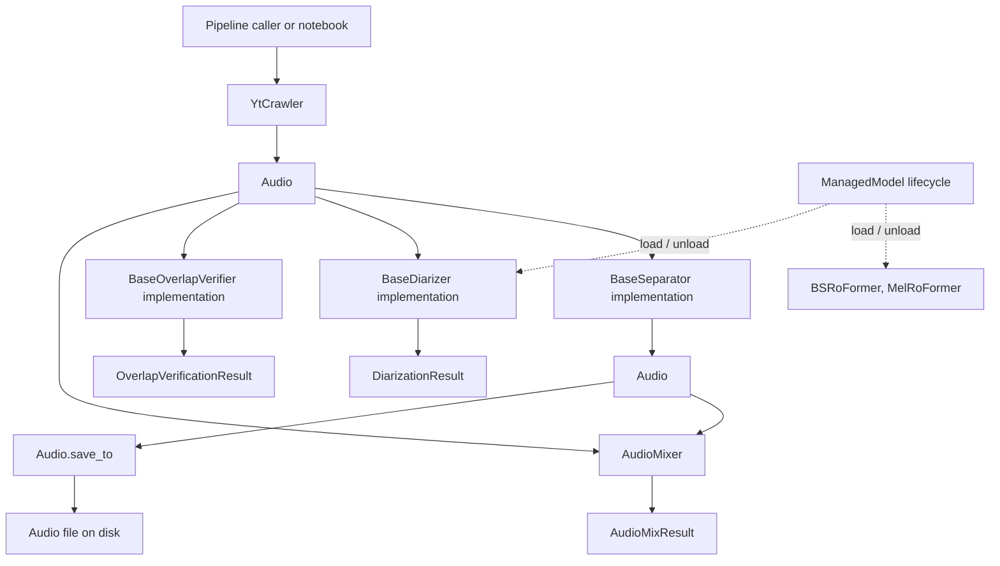

# API contract



This document describes what the public methods do, what they accept and
return, their side effects, and the conditions required to call them. The
field-level shape of returned objects is documented in
[`data_contract.md`](data_contract.md).

## 1. Audio ingestion API

### `YtCrawler.ingest(...) -> Audio`

**Defined in:** `src/yt_crawler/YtCrawlerClass.py`

A convenience class method that creates a crawler and delegates to
`download()`.

**Inputs:**

- `link: str` — YouTube URL.
- Optional output/work directories and normalization settings.
  Default channel count is 1 (mono). Default sample rate is 44,100 Hz.
  Pass `sample_rate=None` to keep the source/native rate (format + mono
  conversion still apply).
- Additional crawler options through `**kwargs`, such as cookies or proxy.

**Returns:** One `Audio` instance representing the normalized downloaded file.

**Side effects:** Creates output/work directories, invokes `yt-dlp` and possibly
`ffmpeg`, writes the final audio artifact, and removes the temporary download
session directory.

### `YtCrawler.download(url: str) -> Audio`

Downloads one URL and returns an `Audio` object.

**Behavior contract:**

1. Creates an isolated temporary session directory.
2. Runs `yt-dlp` without downloading a playlist.
3. Reads the generated `.info.json` metadata.
4. Selects an audio file rather than a video artifact.
5. Records `native_sample_rate` from the pre-normalize source (or yt-dlp
   `asr`), then normalizes to the crawler's configured format and channel
   count (default 1 / mono). When `sample_rate` is an int, ffmpeg resamples
   to that rate; when `sample_rate` is `None`, the source rate is kept.
   Saved as `<channel_id-or-name>/<sanitized_title>__<source_id>.<format>`.
6. Records `source_url`, `channel_id`, `channel_name`, and `channel_url` from
   yt-dlp metadata, then generates a companion identity sidecar JSON
   (`<stem>.json`) alongside the audio file.
7. Returns an `Audio` object whose `path` points to the final output.
8. Removes the temporary session directory even if processing fails.

**Raises:** `DownloadError` when `yt-dlp`, metadata parsing, audio discovery,
or `ffmpeg` processing fails.

### `parse_crawl_sample_rate(value, *, default=44100) -> int | None`

Parses a UI/API sample-rate choice. Accepts `"native"` / `0` / missing empty
values (falls back to `default`), or a positive Hz int/string. Returns
`None` for native-rate crawls.

### `YtCrawler.build_command(url: str, target_work_dir: Path) -> list[str]`

Builds, but does not execute, the `yt-dlp` command. The returned value is a
list of command-line tokens, not a data-contract class. The command includes
`--newline` so yt-dlp emits one progress line at a time, uses yt-dlp's
`no-certifi` compatibility option with the system CA bundle when available, and
passes `--postprocessor-args ExtractAudio:-ac N` so extraction matches the
crawler's channel count (default 1). `YtCrawler.cancel()` terminates an active
yt-dlp process group.

## 2. `Audio` API

**Defined in:** `src/utils/AudioClass.py`

`Audio` is a file-backed dataclass. Its fields are documented in
[`data_contract.md`](data_contract.md).

### `Audio.from_file(path, *, source_id=None, title=None, source_url=None, channel_id=None, channel_name=None, channel_url=None, native_sample_rate=None, history=None) -> Audio`

Creates an `Audio` object for an existing file.

**Behavior contract:**

- Resolves `path` to an absolute path.
- If `{stem}.json` exists next to the audio (written by `save_to` /
  `quick_save`), restores video identity, source/channel URL and identity,
  `native_sample_rate`, and `history` from it. Explicit keyword arguments
  override the sidecar.
- Uses the file stem as the default `source_id` and `title` when no sidecar
  is present.
- Detects the extension as `format`.
- Probes WAV files for sample rate, duration, and channel count (these
  probed values win over sidecar snapshots).
- Sets `native_sample_rate` to the sidecar value, else the probed file rate,
  unless the caller passes the original source rate.
- Uses class defaults for metadata that cannot be probed.
- Initializes `history` to the provided sequence, else sidecar history, else
  an empty tuple.

**Raises:** `FileNotFoundError` if the path does not identify a file.

### `Audio.metadata(*, target_sample_rate=None) -> dict`

Returns a serializable snapshot of the `Audio` fields (including `history` as a list). `path` is a string.
When `target_sample_rate` is given, the dict also includes that rate and
`resample_action` (`upscale`, `downscale`, or `keep`).

### `Audio.resample_action(target_sample_rate) -> "upscale" | "downscale" | "keep"`

Compares the current file `sample_rate` with a model's expected rate so the
caller can decide whether to resample. This uses the current file rate, not
`native_sample_rate`. `native_sample_rate` is still useful to detect that the
file was already resampled from the original source.

### `Audio.add_step(step_tag) -> Audio`

Returns a new `Audio` object with the sanitized `step_tag` appended to `history`.

### `Audio.fingerprint -> str`

Returns a formatted string representing the audio's processing fingerprint, combining
the source identifier, step history, and audio specs (`duration_s`, `sample_rate`, `channels`)
using `__` as segment separators.

### `Audio.save_to(dest) -> Audio`

Copies the represented audio file to `dest` and updates the same object's
`path` to the destination. It returns the same `Audio` instance, not a new
independent object. Destinations without a suffix default to `.wav`.

**Side effects:** Creates destination parent directories, copies the file
when the source and destination differ, and writes `{stem}.json` next to
the audio with identity metadata (`source_id`, `title`, `native_sample_rate`,
`history`, and last-known audio specs).

**Raises:** `FileNotFoundError` if the current source file does not exist.

### `Audio.quick_save(output_dir=None, *, name=None, prefix=None, suffix=None, tag=None) -> Audio`

Copies the represented audio file to a quick-save temporary directory (defaulting to
`<project_root>/temp/`) as WAV unless `name` includes another extension, with an
informative filename generated from the `Audio` object's `fingerprint` (or explicit
`name`), prints `Quick saved to: <destination>` to standard output, and updates the
same object's `path` to the destination. It returns the same `Audio` instance.

**Side effects:** Creates the destination directory, copies the file when source
and destination differ, writes `{stem}.json` next to the audio, and prints the
destination path to stdout.

**Raises:** `FileNotFoundError` if the current source file does not exist.

### `Audio.write_sidecar() -> Audio`

Writes identity metadata next to `self.path` as `{stem}.json` without modifying or moving the underlying audio file. It returns the same `Audio` instance.

### `Audio.notebook_display(dest=None) -> None`

Optionally copies the audio file to `dest` via `save_to` and displays it using
an interactive IPython audio player. It returns `None` and is intended for notebooks.
`Audio.display` is provided as an alias.

**Raises:** `FileNotFoundError` if the represented audio path does not exist.

### `Audio.show_mel_spectrogram(...) -> None`

Loads the audio, computes a mel spectrogram, and displays it with Matplotlib.
It does not modify the `Audio` object and returns `None`.

**Raises:** `FileNotFoundError` if the represented path no longer exists.

### `repr(audio) -> str`

Returns a human-readable representation containing the source ID, title, path,
sample rate, native sample rate, duration, channel count, format, and history (if non-empty).

## 3. Source-separation API

### Common interface: `BaseSeparator.separate(audio: Audio) -> Audio`

**Defined in:** `src/separation/BaseSeparator.py`

Every separator consumes one `Audio` object and returns one separated `Audio`
object. The returned object has the same nine-field class contract, while its
`path` points to the normalized separated output and its `history` records the separation step.

### Concrete implementations

| Class | Method | Model lifecycle requirement |
|---|---|---|
| `HTDemucs` | `separate(audio) -> Audio` | No explicit `load()` required. |
| `BSRoFormer` | `separate(audio) -> Audio` | Call `load()` first, or use a context manager. |
| `MelRoFormer` | `separate(audio) -> Audio` | Call `load()` first, or use a context manager. |
| `MVSepMDX23` | `separate(audio) -> Audio` | No `ManagedModel` load step; dependencies/checkpoints may be fetched on first use. Requires `onnxruntime-gpu` for CUDA execution; explicit `device="cuda"` raises `MVSepMDX23Error` if CUDA or ONNX CUDA execution provider is unavailable. Indexed devices such as `cuda:1` isolate the upstream subprocess to that physical GPU. |

**Common behavior:**

- Verifies that the input path exists.
- Runs the backend-specific separation process.
- Normalizes the selected stem to the configured sample rate and channel count.
- Probes the output WAV.
- Preserves the input `source_id`, `title`, and `native_sample_rate`.
- Returns a new `Audio` instance with `format="wav"`.

**Common failure behavior:** Each backend raises its own runtime error type
when the input, external command, model, or expected output is unavailable.

`MVSepMDX23` uses a resource-conscious vocal-separation default of one Kim
ONNX model (`single_onnx=True`) and `0.25` overlap. Callers that need the
upstream maximum-quality ensemble can pass `single_onnx=False`,
`overlap_large=0.6`, and `overlap_small=0.5`. Its optional
`progress_callback(message)` receives unbuffered upstream status lines.
Long inputs are processed as bounded 10-minute WAV segments by default and the
selected output stem is concatenated afterward; `max_segment_seconds=None`
disables this behavior.
`cancel()` requests non-blocking cancellation, while `close()` terminates and
reaps any active upstream process group. The cloned CLI is patched to print
`PROGRESS: N%` lines from the upstream percent callback so the web queue can
show a real progress bar when those lines are present.

`HTDemucs` streams Demucs CLI output, exposes `progress_callback(message)` and
`cancel()`, and terminates its process group on cancel. Tqdm percent lines are
forwarded when Demucs prints them.

### `BaseSeparator.close() -> None`

Default no-op resource cleanup method. `BSRoFormer` and `MelRoFormer` provide a
compatibility implementation that delegates to `unload()`. `MVSepMDX23.close()`
cancels and reaps an active CLI subprocess. `HTDemucs.close()` cancels an
active Demucs process group.

## 4. Managed model lifecycle API

**Defined in:** `src/base/model.py`

`ManagedModel` is used by `PyannoteDiarizer`, `SortformerDiarizer`,
`ClusteringDiarizer`, `DiariZenDiarizer`, `ThreeDSpeakerDiarizer`, `BSRoFormer`,
and `MelRoFormer`.

### `is_loaded -> bool`

Read-only property indicating whether the underlying resource is currently
loaded.

### `load() -> None`

Loads the resource once by calling the subclass's `_load()` implementation.
Repeated calls while loaded are no-ops.

### `unload() -> None`

Releases the resource once by calling `_unload()`. Repeated calls while already
unloaded are no-ops.

### Context-manager behavior

```python
with model:
    result = model.some_operation()
```

- `__enter__() -> ManagedModel` calls `load()` and returns the model.
- `__exit__(...) -> None` calls `unload()`, including when leaving because of
  an exception.

Subclasses must implement `_load() -> None` and `_unload() -> None`.

## 5. Speaker-diarization API

### `BaseDiarizer.diarize(audio: Audio) -> DiarizationResult`

**Defined in:** `src/diarization/BaseDiarizer.py`

Abstract interface for converting audio into backend-independent speaker
information. Every backend returns schema 2.0, retains the input file-backed
`Audio` as `source_audio`, and copies optional channel identity into the
result. Results validate source identity, declared speakers, turn bounds, and
overlap state before downstream use.

### `evaluate_diarization(reference_turns, hypothesis_turns, *, duration_s, collar_s=0.0, skip_overlap=False) -> dict`

**Defined in:** `src/diarization/evaluation.py`

Computes diarization error from exact interval boundaries without sampled time
bins. A maximum-weight one-to-one assignment maps hypothesis speakers to
reference speakers before DER, JER, missed speech, false alarm, speaker
confusion, and per-speaker coverage are calculated. `collar_s` excludes that
duration on each side of each reference boundary; `skip_overlap=True` excludes
regions containing multiple active reference speakers. Invalid timestamps or
turns outside the shared positive `duration_s` raise `TypeError` / `ValueError`.

### `clean_speaker_turns(turns, *, min_turn_duration_s=0.5, merge_same_speaker_gap_s=1.0, boundary_collar_s=0.04, jitter_max_duration_s=3.0) -> list[SpeakerTurn]`

**Defined in:** `src/diarization/turn_cleanup.py`

Creates a non-mutating, high-precision output view from canonical raw turns.
It corrects bounded, non-overlapping `A-B-A` label jitter; trims 40 ms from
each side of close different-speaker boundaries; merges consecutive
same-speaker turns across gaps up to 1 second; and removes residual turns
shorter than 0.5 seconds. The thresholds are configurable and must be finite,
non-negative numbers. Existing `overlaps_other_speaker` evidence is retained
through relabeling and merging; cleanup does not claim to remove overlapping
speech.

### `pad_and_merge_intervals(intervals, *, pre_roll_s=0.0, post_roll_s=0.0, start_bound_s=0.0, end_bound_s=None) -> list[tuple[float, float]]`

**Defined in:** `src/diarization/turn_cleanup.py`

Expands extraction windows by `pre_roll_s` / `post_roll_s`, clamps them to
`start_bound_s` and optional `end_bound_s` (typically source duration), and
merges windows that overlap or touch. Canonical `start_s` / `end_s` values are
not rewritten. Empty or inverted inputs are dropped. Bounds must be finite
numbers; roll values must be non-negative.

### `PyannoteDiarizer(model_id=..., device=..., token=..., num_speakers=..., min_speakers=..., max_speakers=...)`

**Defined in:** `src/diarization/PyannoteDiarizer.py`

- `model_id`: Hugging Face repository ID. Defaults to `DEFAULT_PYANNOTE_MODEL_ID` (`"pyannote/speaker-diarization-community-1"`).
- `device`: Compute target (`"auto"`, `"cuda"`, `"cpu"`, etc.).
- `token`: Optional Hugging Face authentication token (or reads `HF_TOKEN` from environment).
- `num_speakers`, `min_speakers`, `max_speakers`: Optional speaker-count constraints.

### `PyannoteDiarizer.diarize(audio: Audio, *, num_speakers=None, min_speakers=None, max_speakers=None, hook=None) -> DiarizationResult`

Requires the Pyannote pipeline to be loaded first.

**Behavior contract:**

- Decodes the file with `soundfile` and invokes Pyannote with a float32
  `(channel, time)` waveform tensor plus its sample rate. Downmixes stereo/multi-channel to mono when applicable. This keeps file
  decoding independent of Pyannote's optional `torchcodec` integration.
- Passes `num_speakers`, `min_speakers`, `max_speakers`, and `hook` if specified.
- Extracts speaker turns from both `output.speaker_diarization` (pyannote 3.3/4.0+ and community models) or direct Annotation outputs (pyannote 3.1).
- Skips zero- or negative-duration segments so they cannot fail schema validation.
- Converts backend speaker labels into result-local IDs such as `spk_00`.
- Creates one `Speaker` record for each distinct label.
- Creates one `SpeakerTurn` record for each annotated segment.
- Sets `audio_id` to `audio.source_id`.
- Includes `DiarizationModelInfo` with backend `"pyannote"` and the configured
  model ID.

**Raises:** `RuntimeError` if `load()` has not completed or the underlying
pipeline is unavailable; `ValueError` if the decoded audio is empty. Audio
decoder errors are propagated.

### `PyannoteDiarizer._load() -> None` and `_unload() -> None`

These are lifecycle implementations rather than caller-facing processing
methods:

- `_load()` loads the configured Hugging Face/Pyannote pipeline and places it
  on the requested device.
- `_unload()` releases the pipeline and clears CUDA cache when available.

### `SortformerDiarizer.diarize(audio: Audio, *, enrollment_name=None, enrollment_clips=None) -> DiarizationResult`

Requires the dependencies pinned in `requirements-sortformer.txt` and a
completed `load()`. They are intentionally kept out of the primary `uv.lock`
because NeMo constrains shared packages such as Lightning and Hugging Face Hub;
install them in an isolated worker/environment. The default model artifact is
downloaded from
`nvidia/diar_sortformer_4spk-v1` at revision
`f059506485424eb68a90a7af84c8e63e67f381fd`.

Deployment note: model inference is run on the dedicated model server
(`vsf@vsf-242`), not on the development machine (`tungnl5@VF-TUNGNL5-L`). The
server loads `HF_TOKEN` from the repository-root `.env` when the web process
starts. Hugging Face downloads use `.data/huggingface` as the default cache
(`HF_HOME` can override this location).

**Behavior contract:**

- Inspects and normalizes the actual input file to mono, 16 kHz PCM WAV rather
  than trusting `Audio` metadata.
- Processes at most six minutes per inference call by default, with a one-minute
  overlap between adjacent windows.
- Converts the model's 80 ms, four-channel activity probabilities into speaker
  turns with configurable hysteresis and duration post-processing. Boundary
  defaults are `onset=0.74`, `offset=0.64`, `pad_onset_s=0.12`, and
  `pad_offset_s=0.20`; hysteresis requires `onset >= offset`.
- Aligns speaker slots between windows using activity in the shared region.
- Uses TitaNet embeddings as a fallback when a speaker is absent from the
  overlap, unless speaker similarity is disabled.
- When one enrollment identity is supplied, embeds its clean reference clips
  with the pipeline's own TitaNet encoder before target-audio inference. The
  normalized enrollment centroid seeds global speaker zero during window
  stitching. A matching result speaker carries the profile name in
  `global_speaker_id`; the enrollment anchor is not updated from target-audio
  observations. The enrolled speaker record remains present with zero turns
  when no window clears the identity threshold, making non-detection explicit.
- Resolves duplicate predictions in shared regions at the overlap midpoint,
  preserves simultaneous speakers, sorts turns chronologically, and emits
  result-local IDs such as `spk_00`. Anonymous speaker records are built only
  from speakers that retain at least one turn after overlap ownership clipping.
- May produce more than four speakers in the complete result. The hard limit of
  four distinct speakers applies independently to each inference window.
- Retries with three-minute windows by default when a six-minute inference
  raises an accelerator out-of-memory error.
- Includes `DiarizationModelInfo` with backend `"nemo-sortformer"`, the model
  repository ID, and the pinned revision.

**Device behavior:** `device="auto"` selects CUDA, then MPS, then CPU. MPS is
experimental in NeMo and may use CPU fallbacks when
`PYTORCH_ENABLE_MPS_FALLBACK=1`. An explicitly requested unavailable device
raises `RuntimeError`.

**Raises:** `RuntimeError` when the model is not loaded, optional NeMo support
is unavailable, output is in an unknown format, or the selected device cannot
be initialized. Audio conversion and file errors are propagated.

### `SortformerWorkerDiarizer`

The web applications use `SortformerWorkerDiarizer` from the primary `.venv`.
Its public lifecycle and enrollment-aware `diarize(...) -> DiarizationResult`
contract match `SortformerDiarizer`, but `load()` starts
`.venv-sortformer/bin/python -m src.diarization.sortformer_worker`. The worker
loads NeMo once and is reused across all `diarize()` calls until `unload()` or
`close()`. This keeps NeMo's dependency pins out of the web server process and
allows the unified UI to switch between Sortformer and other utilities without
a server restart. `SORTFORMER_PYTHON` or the `worker_python` constructor option
can point to a non-default isolated interpreter. `cancel()` terminates active
worker inference.

### `SortformerDiarizer._load() -> None` and `_unload() -> None`

- `_load()` downloads the exact `.nemo` artifact (unless `checkpoint_path` is
  supplied), restores it with `strict=False`, and moves it to the selected
  device.
- TitaNet is loaded lazily only when a recording needs multiple windows.
- `_unload()` releases both models and clears available accelerator caches.

### `ClusteringDiarizer.diarize(audio: Audio, *, num_speakers=None) -> DiarizationResult`

**Defined in:** `src/diarization/ClusteringDiarizer.py`

NeMo's cascaded clustering pipeline: MarbleNet voice-activity detection,
multi-scale TitaNet speaker embeddings, then spectral clustering. Requires the
same isolated NeMo environment as Sortformer (`requirements-sortformer.txt`).
Default models are `vad_multilingual_marblenet` and `titanet_large`.

**Behavior contract:**

- Inspects and normalizes the actual input file to mono, 16 kHz PCM WAV rather
  than trusting `Audio` metadata.
- Writes a one-file NeMo manifest and runs `ClusteringDiarizer.diarize()`.
- Parses predicted RTTM into result-local IDs such as `spk_00`, preserving
  first-seen speaker order.
- Per-call `num_speakers` overrides the constructor value for that inference.
  When an oracle count is set (constructor or call), or when min and max
  speaker bounds are equal via `resolve_speaker_settings`, clustering uses
  that exact count. Otherwise it estimates the count up to
  `max_num_speakers` (default 8).
- Includes `DiarizationModelInfo` with backend `"nemo-clustering"` and a
  `model_id` of `{vad_model}+{speaker_model}`.

**Device behavior:** `device="auto"` selects CUDA, then MPS, then CPU. An
explicitly requested unavailable device raises `RuntimeError`.

**Raises:** `RuntimeError` when the model is not loaded, optional NeMo support
is unavailable, clustering fails without writing RTTM, diarization finishes
without an RTTM under `pred_rttms/`, or the selected device cannot be
initialized. Audio conversion and file errors are propagated.

### `ClusteringWorkerDiarizer`

The web applications use `ClusteringWorkerDiarizer` from the primary `.venv`.
Its public lifecycle and `diarize(audio, *, num_speakers=None) -> DiarizationResult`
contract match `ClusteringDiarizer`, but `load()` starts
`.venv-sortformer/bin/python -m src.diarization.clustering_worker`. The worker
loads MarbleNet and TitaNet once and reuses them until `unload()` or
`close()`. `CLUSTERING_PYTHON`, `SORTFORMER_PYTHON`, or the `worker_python`
constructor option can point to a non-default isolated interpreter.
`cancel()` terminates active worker inference.

### `ClusteringDiarizer._load() -> None` and `_unload() -> None`

- `_load()` constructs NeMo `ClusteringDiarizer` with the configured VAD and
  speaker-embedding models and places them on the selected device.
- `_unload()` releases both models and clears available accelerator caches.

### `DiariZenDiarizer(model_id=..., device="auto", token=None, num_speakers=None, min_speakers=None, max_speakers=None, batch_size=1, ffmpeg_bin="ffmpeg")`

**Defined in:** `src/diarization/DiariZenDiarizer.py`

DiariZen's overlap-aware pipeline: WavLM Large neural segmentation, WeSpeaker
speaker embeddings, and VBx clustering. The default checkpoint is
`BUT-FIT/diarizen-wavlm-large-s80-md-v2`. Its weights are CC BY-NC 4.0 and are
limited to research and other non-commercial use. Dependencies are isolated in
`.venv-diarizen` using `requirements-diarizen.txt`.

`batch_size` controls both segmentation and embedding inference. It defaults to
`1` to keep peak VRAM bounded on 10 GiB GPUs; callers may raise it when the
selected device has sufficient free memory.

**Behavior contract:**

- Normalizes input to mono, 16 kHz PCM WAV before inference.
- Converts the returned Pyannote Annotation into result-local `spk_NN` labels,
  preserving simultaneous turns for overlapping speakers. Clamps turn
  timestamps to the source `Audio.duration_s` so last-frame overshoot cannot
  fail schema 2.0 duration validation.
- Constructor speaker bounds are used unless a corresponding per-call override
  is supplied. An exact speaker count sets both clustering bounds for that call.
- Includes `DiarizationModelInfo` with backend `"diarizen"` and the configured
  Hugging Face model ID.

**Device behavior:** `device="auto"` selects CUDA and then CPU. CUDA and CPU
are supported; other device types raise `RuntimeError`.

**Raises:** `RuntimeError` when the model is not loaded, dependencies are
unavailable, model loading fails, or inference fails; `FileNotFoundError` for a
missing source; `ValueError` for invalid speaker bounds or empty audio.

### `DiariZenWorkerDiarizer`

The web applications and benchmark use `DiariZenWorkerDiarizer` from the
primary `.venv`. It starts
`.venv-diarizen/bin/python -m src.diarization.diarizen_worker`, loads the model
once, and reuses it until `unload()` or `close()`. `DIARIZEN_PYTHON` or the
`worker_python` constructor option can select another interpreter. A requested
`cuda:N` is isolated with `CUDA_VISIBLE_DEVICES` so DiariZen's upstream
`cuda:0` initialization runs on the selected physical GPU. `cancel()`
terminates active worker inference.

### `DiariZenDiarizer._load() -> None` and `_unload() -> None`

- `_load()` authenticates from `token` or `HF_TOKEN`, downloads the configured
  checkpoint through the upstream pipeline, and moves it to the selected
  device.
- `_unload()` releases the pipeline and clears available CUDA allocations.

### `ThreeDSpeakerDiarizer.diarize(audio: Audio, *, num_speakers=None) -> DiarizationResult`

**Defined in:** `src/diarization/ThreeDSpeakerDiarizer.py`

ModelScope [3D-Speaker](https://github.com/modelscope/3D-Speaker) audio-only
pipeline: FSMN voice-activity detection, CAM++ speaker embeddings, then
spectral clustering, with optional pyannote overlap refinement. Requires the
isolated environment pinned in `requirements-3dspeaker.txt`. The 3D-Speaker
repository is shallow-cloned into `.data/3d-speaker` on first `load()` when
missing (override with `THREEDSPEAKER_ROOT`). Model downloads default to
`.data/modelscope`.

**Behavior contract:**

- Normalizes the input file to mono, 16 kHz PCM WAV rather than trusting
  `Audio` metadata.
- Runs `speakerlab.bin.infer_diarization.Diarization3Dspeaker` and converts
  `[[start, end, speaker_id], ...]` segments into result-local IDs such as
  `spk_00`, preserving first-seen speaker order.
- Per-call `num_speakers` overrides the constructor value for that inference.
  When an oracle count is set (constructor or call), or when min and max
  speaker bounds are equal via `resolve_speaker_settings`, clustering uses
  that exact count. Otherwise it estimates the count.
- When `include_overlap=True`, enables pyannote `segmentation-3.0` overlap
  refinement and requires `token` or `HF_TOKEN`.
- `chunk_duration_s` / `chunk_step_s` control embedding subsegment window and
  hop (upstream defaults `1.5` / `0.75`). Values must satisfy
  `0 < chunk_step_s <= chunk_duration_s`.
- Includes `DiarizationModelInfo` with backend `"3d-speaker"` and a `model_id`
  of `{vad_model}+{embedding_model}`.

**Device behavior:** `device="auto"` selects CUDA, then MPS, then CPU. An
explicitly requested unavailable device raises `RuntimeError`.

**Raises:** `RuntimeError` when the model is not loaded, speakerlab/ModelScope
support is unavailable, the 3D-Speaker checkout cannot be cloned or is
incomplete, inference fails, or the selected device cannot be initialized.
Audio conversion and file errors are propagated.

### `ThreeDSpeakerWorkerDiarizer`

The web applications use `ThreeDSpeakerWorkerDiarizer` from the primary
`.venv`. Its public lifecycle and
`diarize(audio, *, num_speakers=None) -> DiarizationResult` contract match
`ThreeDSpeakerDiarizer`, but `load()` starts
`.venv-3dspeaker/bin/python -m src.diarization.threed_speaker_worker`. The
worker loads ModelScope/speakerlab models once and reuses them until
`unload()` or `close()`. `THREEDSPEAKER_PYTHON` or the `worker_python`
constructor option can point to a non-default isolated interpreter.
`cancel()` terminates active worker inference.

### `ThreeDSpeakerDiarizer._load() -> None` and `_unload() -> None`

- `_load()` adds the 3D-Speaker checkout to `sys.path` (shallow-cloning
  https://github.com/modelscope/3D-Speaker into `.data/3d-speaker` when
  missing), constructs `Diarization3Dspeaker` with the configured device /
  overlap settings, overrides embedding `chunk(dur, step)` with
  `chunk_duration_s` / `chunk_step_s`, and caches ModelScope weights under
  `.data/modelscope`.
- `_unload()` releases the pipeline and clears available accelerator caches.

### `SpeakerVerifier(*, model_id=..., device=..., token=..., profiles_dir=...)`

**Defined in:** `src/diarization/SpeakerVerifier.py`

Global speaker-profile storage plus compatibility verification-based segment
filtering. Wraps a
pyannote speaker-embedding model (default `DEFAULT_EMBEDDING_MODEL_ID`,
`"pyannote/wespeaker-voxceleb-resnet34-LM"`) behind the `ManagedModel`
lifecycle. Profiles are stored under `profiles_dir` (default
`.data/speaker_profiles/<name>/`) as copied reference clips plus a
`profile.json` manifest; clips are the source of truth and embeddings are
recomputed at scoring time.

### `SpeakerVerifier.enroll(name, clips, *, overwrite=False, channel_id=None, channel_name=None, channel_url=None) -> SpeakerProfile`

Does **not** require the model to be loaded.

**Behavior contract:**

- Sanitizes `name` to a filesystem-safe identifier.
- Copies each clip file into `<profiles_dir>/<name>/clips/clip_NN.<ext>` and
  writes `profile.json` (schema version, name, timestamps, clip names, and
  optional source-channel provenance). Profiles are globally reusable and are
  not restricted to one channel.
- Replaces an existing profile only when `overwrite=True`.

**Raises:** `SpeakerVerifierError` for empty clip lists, invalid names, or an
existing profile without `overwrite`; `FileNotFoundError` for missing clip
files.

### `SpeakerVerifier.load_profile(name) -> SpeakerProfile`, `list_profiles() -> list[str]`, `delete_profile(name) -> None`

Profile management; none of these require the model to be loaded.
`load_profile` and `delete_profile` raise `SpeakerVerifierError` when the
profile or any of its clips is missing.

### `SpeakerVerifier.add_clips(name, clips) -> SpeakerProfile`, `remove_clip(name, clip_name) -> SpeakerProfile`

Append or remove clean source clips without rebuilding the identity. Clips
remain the source of truth; adding or removing one updates the profile
timestamp. Removing the final clip is rejected—delete the speaker profile
instead.

### `SpeakerVerifier.score(audio, result: DiarizationResult, profile) -> TargetSpeakerResult`

Requires `load()` (or a `with` block) first.

**Behavior contract:**

- Computes the profile centroid as the L2-normalized mean of the clip
  embeddings.
- Embeds every diarization turn independently (`Inference.crop` on the file
  slice) and stores the cosine similarity to the centroid.
- Turns shorter than `MIN_EMBEDDING_DURATION_S` (0.15 s) or failing embedding
  get similarity `-1.0` so they can never pass a threshold.
- Sets `overlaps_other_speaker` on turns intersecting a turn of a different
  speaker.
- Returns **all** turns scored; no filtering is applied.
- Includes `DiarizationModelInfo` with backend `"pyannote-embedding"`.
- Copies channel identity from the input `Audio` into the result.

**Raises:** `RuntimeError` if not loaded; `FileNotFoundError` for a missing
audio file; `SpeakerVerifierError` if no profile clip can be embedded.

### `SpeakerVerifier.filter(scored, *, threshold, min_duration_s=1.5, exclude_overlap=True) -> TargetSpeakerResult` (static)

Pure post-processing; no model needed. Returns a new result keeping only
segments with `similarity >= threshold`, duration `>= min_duration_s`, and
(when `exclude_overlap`) no overlap with other speakers' turns. Precision-first:
different thresholds can be tried cheaply on one `score` result. Channel
identity is preserved from the scored result.

### `SpeakerVerifier.verify_purity(source, profile, *, candidates=None, similarity_threshold, min_candidate_duration_s=1.5, max_overlap_duration_s=0.05, window_duration_s=2.0, window_hop_s=0.75) -> list[SpeakerPurityResult]`

Requires `load()` (or a `with` block) first. `source` is
`Audio | DiarizationResult`:

- A schema-2.0 `DiarizationResult` is the canonical input: its embedded
  `source_audio` is the verified file and every turn is one candidate by
  default. `candidates` may select a subset of the result's turns; the
  complete `DiarizationResult` remains the overlap authority. Passing a turn
  that does not belong to the result is rejected.
- A plain `Audio` is verified as a single whole-file candidate attributed to
  the profile's speaker. This path has no overlap authority, so the overlap
  veto cannot fire; the sliding identity windows still apply.

**Behavior contract:**

- Audio/turn identity is structural, never re-checked by string comparison:
  `DiarizationResult` construction already enforces
  `source_audio.source_id == audio_id` and turn bounds against the source
  duration. A result without `source_audio` (legacy schema-1.0 payload) is
  rejected with `ValueError`.
- Rejects candidates shorter than `min_candidate_duration_s` with reason
  `candidate_too_short`.
- Computes the union duration of other-speaker turns intersecting each
  candidate. It rejects when that duration exceeds
  `max_overlap_duration_s`, with reason `overlap_detected`. Callers requiring
  simultaneous-speaker protection must supply results from an overlap-aware
  diarizer.
- Scores the remaining candidate in sliding `window_duration_s` windows at
  `window_hop_s`; the final window is end-anchored so the candidate tail is
  always covered. Candidates shorter than the configured window use one
  whole-candidate window.
- Rejects when any window has cosine similarity below
  `similarity_threshold`, with reason
  `target_similarity_below_threshold`.
- Returns `decision="error"` and reason `embedding_failed` when any required
  identity window cannot be embedded. Error results never pass but remain
  distinguishable from semantic contamination for retry/reporting.
- Short-circuits identity inference after a duration or overlap veto. This
  follows the precision-first rule that one calibrated contamination signal
  is sufficient to reject.
- Stores the decision reason, overlap measurements, every successful window
  score, and embedding model metadata in each `SpeakerPurityResult`. Its
  `passed` property is true only for `decision="pass"`;
  `min_target_similarity` is derived from its window evidence. Callers should
  persist the call thresholds alongside batch results.

The current embedding backend remains
`pyannote/wespeaker-voxceleb-resnet34-LM`. Enrollment clips are still the
model-independent source of truth, so another verified embedding backend can
consume the same profiles without changing their on-disk schema.

### `SpeakerVerifier._load() -> None` and `_unload() -> None`

- `_load()` loads the pyannote embedding model (`Model.from_pretrained` with
  `token` or `HF_TOKEN`) wrapped in `Inference(window="whole")` and moves it to
  the resolved device.
- `_unload()` releases the inference wrapper and clears CUDA cache when
  available.

### Direct-audio overlap verifiers

**Defined in:** `src/diarization/OverlapVerifier.py`

`BaseOverlapVerifier.verify(audio: Audio) -> OverlapVerificationResult` is the
shared interface. Both implementations read the file at `audio.path`, send the
audio bytes directly to the selected multimodal model, and normalize the
structured answer to:

```python
{"overlap": bool, "reason": str}
```

- `Gemma4OverlapVerifier` calls an OpenAI-compatible Unsloth Studio
  `/v1/chat/completions` endpoint with an `input_audio` content block. WAV and
  MP3 are supported. Constructor values fall back to `UNSLOTH_ENDPOINT`,
  `UNSLOTH_MODEL`, and optional `UNSLOTH_API_KEY` environment variables. When
  `UNSLOTH_ENDPOINT` is unset, the URL uses `UNSLOTH_HOST` and `UNSLOTH_PORT`,
  which default to `localhost` and `8888`.
- `GeminiOverlapVerifier` calls Gemini `generateContent` with inline audio and
  a JSON response schema. It requires `GEMINI_API_KEY`; the model defaults to
  `gemini-3.1-pro-preview` and can be changed with `GEMINI_MODEL` or the
  constructor. Web entrypoints load these values from the repository-root
  `.env` before constructing pipeline components.
- Both validate the returned boolean and non-empty reason. Missing files,
  unsupported formats, HTTP failures, and malformed model responses fail
  explicitly rather than returning a guessed result.
- Both constructors accept `prompt` (defaulting to `OVERLAP_PROMPT`) and
  `max_output_tokens` (default `128`) in addition to `model`, `api_key`, and
  `timeout_s`. The prompt is required to be non-empty and the token limit must
  be a positive integer. The JSON response schema is fixed even when callers
  customize the instruction.

`create_overlap_verifier(config)` selects the backend from a flat mapping:

```python
from src.diarization import create_overlap_verifier

verifier = create_overlap_verifier(
    {
        "backend": "gemma4",  # or "gemini"
        "endpoint": "http://localhost:8888/v1/chat/completions",
        "model": "unsloth/gemma-4-12b-it-GGUF",
        "prompt": "Reject if simultaneous speakers are audible.",
        "max_output_tokens": 128,
    }
)
result = verifier.verify(audio_segment)
```

SonicStudio exposes this as an optional second stage in Speaker Purity. It
checks only candidates that pass duration, diarization-overlap, and sliding
identity checks. A positive direct-audio result changes the decision to
`reject` with reason `direct_overlap_detected`. Request failures either become
`error` with reason `direct_overlap_verification_failed` (the default
fail-closed policy) or preserve the stage-one pass when explicitly configured.
The web report records backend, model, endpoint, timeout, token budget, prompt,
and failure policy but never returns the API key.

When the mapping omits `backend`, selection falls back to
`OVERLAP_VERIFIER`. Callers compose this verification step where needed; it is
not automatically chained to crawling, separation, or diarization.

## 6. Benchmark mixing API

### `AudioMixer.mix(...) -> AudioMixResult`

**Defined in:** `src/benchmark/separation/mixer.py`

**Inputs:**

- `speech: Audio`
- `music: Audio`
- `target_smr_db: float`
- `seed: int`
- `output_dir: str | Path`

**Behavior contract:**

1. Loads both input files as floating-point waveforms.
2. Converts both inputs to the configured channel layout.
3. Crops or loops music to the speech duration using the supplied seed.
4. Applies music gain to reach the requested speech-to-music ratio.
5. Applies a common output gain when the peak exceeds the configured ceiling.
6. Writes `speech_reference.wav`, `music_reference.wav`, and `mixture.wav`.
7. Returns an `AudioMixResult` containing three `Audio` objects and one
   `MixingParameters` object.

**Raises:** `ValueError` for invalid mixer settings, effectively silent input,
or an output directory that would overwrite an input audio file.

## 7. Shared audio utility API

These functions support the public pipeline methods but return no pipeline
classes.

| Function | Return | Contract |
|---|---|---|
| `probe_wav(path)` | `tuple[int, float, int]` | `(sample_rate, duration_s, channels)`. |
| `normalize_wav(src, dest, ...)` | `None` | Copies or converts audio using `ffmpeg`. |

`normalize_wav` raises `AudioConvertError` when `ffmpeg` conversion fails.

## 8. Dataclass method note

`Speaker`, `SpeakerTurn`, `DiarizationModelInfo`, `DiarizationResult`,
`ScoredSegment`, `TargetSpeakerResult`, `SpeakerProfile`,
`BenchmarkDefinition`, `MixingParameters`, `AudioMixResult`, and
`SeparationBenchmarkSample` are dataclasses. `DiarizationResult` additionally
defines canonical `to_dict()` / `from_dict()` round-tripping, atomic
`save()` / `load()` persistence, source/turn validation, and derived summary
properties. Python supplies the remaining standard dataclass methods.

## 9. Web application platforms

The repository provides two specialized web platforms:

### Shared web backend

- **Entrypoint:** `scripts/start_web.py` / `scripts/start_web.sh` (default port
  `8765`).
- **Frontend mounts:** SonicStudio is served at `/studio/`; SonicPipeline is
  served at `/pipeline/`.
- **Health endpoint:** `GET /api/health` reports backend status and both
  frontend mount points.
- **Shutdown:** Stopping the backend cancels every pending and running
  SonicStudio task and SonicPipeline job, kills job child processes
  (`yt-dlp`, `ffmpeg`, Demucs, MVSEP), and does not resume leftover jobs
  after restart.
- **Compatibility:** The former `start_studio.*` and `start_pipeline.*`
  launchers start the same unified backend.

### `src/web_studio/` (SonicStudio API domain and frontend)
- **Role:** Interactive audio workbench for ingest, vocal separation, global
  known-speaker management, enrollment-aware diarization, A/B audition, and
  library browsing.
- **Frontend layout:** Flat `static/index.html` + `app.js` + `style.css` (no
  HTML partial composer). Tabs: Workspace, Separation, Diarization, Annotate &
  Evaluate, Speaker Purity, Audition, and Library.
- **Audio selection:** Separation and diarization selectors group active
  in-memory audio objects with persistent project-library files. Selecting a
  library file loads it into the active registry before processing. Repeated
  loads of the same resolved file path reuse its existing audio ID.
- **Library browsing:** `GET /api/library` scans `benchmarks/`, `data/`,
  `temp/`, and `.data/` (skipping caches such as `huggingface/`, `.cache/`,
  and `work/`) and returns `{files, total, category_counts}`. Each file
  includes `category`, a stable `category_id` (`speech`, `music`, `cuts`,
  `stems`, `verified`, `diarized`, `ingest`, `pipeline`, `uploads`, `temp`,
  `data`, `other`), sidecar metadata, and Pipeline registry tags when
  present. `GET /api/library/stream` and `GET /api/library/download` serve
  one permitted file. `POST /api/library/delete` and
  `POST /api/library/bulk-delete` remove audio plus sidecar JSON and drop
  matching Studio session / Pipeline registry entries.
- **Library loading:** `POST /api/library/load` accepts `{"path": "..."}` and
  returns `audio_id`, `metadata`, and `reused`. `reused` is `true` when that
  resolved path was already present in the active registry. The Sample
  Library modal and Library tab share this catalog; processing selectors
  group library files by `category_id` and load a `lib:` path into the
  session before running.
- **Background task queue:** YouTube ingestion, single-model separation,
  diarization, and multi-model comparison use **per-device FIFO queues**.
  Each GPU (`cuda:0`, `cuda:1`, …) and the `cpu`/`mps` lane have independent
  workers so work for one accelerator never blocks another. Default is
  `1` worker per device; `STUDIO_QUEUE_CONCURRENCY` sets workers-per-device
  (1–4). CPU-only jobs (YouTube crawl) always use the `cpu` lane.
  Long-running studio jobs use **polling** via `GET /api/tasks/{id}` (no
  live-reload SSE).
- **Task endpoints:** `GET /api/tasks` lists tasks and queue counts,
  `GET /api/tasks/{id}` returns one task, and `DELETE /api/tasks/{id}` cancels
  a queued or running task. Running CLI backends (yt-dlp, Demucs, MVSEP,
  Sortformer) are force-stopped. In-process models (BS-RoFormer, Mel-RoFormer,
  Pyannote) are marked cancelled; the current forward pass may finish.
- **Queue progress:** Shared queue items expose `progress` as 0–100 and
  `progress_known`. When a backend prints a detectable percent or fraction, or
  a batch job reports item counts, the bar shows that value. Otherwise the UI
  reports that numeric progress is unavailable instead of faking a stub
  percentage.
- **Shared Queue endpoints (registered once by Studio):** `GET /api/queue/shared`
  aggregates hardware telemetry and active/queued workloads across Studio and
  Pipeline, including a `device_queues` map (`running` / `queued` / `workers`
  per lane). `DELETE /api/queue/shared/{id}` and
  `POST /api/queue/shared/{id}/cancel` cancel a workload in either domain.
- **Telemetry:** `GET /api/telemetry` is owned by the Studio route table and
  returns host/GPU metrics from `hardware_monitor`.
- **Known-speaker endpoints (registered once by Studio, shared by both
  frontends):** `GET/POST /api/speaker-profiles` list/create global profiles;
  `GET/DELETE /api/speaker-profiles/{name}` inspect/delete one;
  `POST /api/speaker-profiles/{name}/clips` appends session cuts; and
  `GET/DELETE /api/speaker-profiles/{name}/clips/{clip_name}` auditions/removes
  a stored reference. `POST /api/diarization/run` accepts one optional
  `enrollment_profile`; currently NeMo Sortformer supports this genuine
  pre-inference anchor. Other backends reject enrollment instead of silently
  substituting post-diarization similarity scoring. The legacy
  `POST /api/diarization/target-speaker-score` endpoint remains for Pipeline's
  explicit target-filter jobs, but is not part of Studio's interactive flow.
- **Canonical diarization-result endpoints:**
  `GET /api/diarization/results` lists durable results with source/model
  summaries and verification state;
  `GET /api/diarization/results/{result_id}` returns one complete result and
  re-registers its source audio into the Studio session when the file still
  exists;
  `DELETE /api/diarization/results/{result_id}` removes one persisted result;
  `POST /api/diarization/results/clear` deletes the catalog;
  `GET /api/diarization/results/{result_id}/turns/{turn_index}/audio` lazily
  cuts and streams a turn without registering it; and
  `POST /api/diarization/results/verify` queues filtered turns from one or more
  result IDs as one batch. Filters cover speaker, min/max duration, overlap,
  and prior verification state. Reports persist under
  `.data/diarization/verifications/`. `POST /api/purity/verify` remains the
  separate imported-audio fallback.
- **Manual annotation and evaluation endpoints:**
  `GET /api/diarization/annotations` lists durable ground-truth references;
  `GET /api/diarization/annotations/{annotation_id}` returns a full reference
  and re-registers its source audio when the file remains available;
  `POST /api/diarization/annotations` creates or revision-saves a validated
  reference with atomic file replacement;
  `DELETE /api/diarization/annotations/{annotation_id}` deletes only the
  reference JSON; and `POST /api/diarization/evaluate` compares selected
  compatible durable model results with the reference. Evaluation accepts
  `annotation_id`, `result_ids`, `collar_s` (seconds excluded on each side of
  reference boundaries), and `skip_overlap`. It returns ranked DER/JER reports,
  error components, optimal speaker mappings, and per-speaker coverage. Manual
  references live under `.data/diarization/annotations/`; source audio and model
  results are never rewritten by annotation or evaluation.
- **Clean-turn output policy:** `POST /api/diarization/clean-turns` accepts a
  durable `result_id` or an explicit raw `turns` list plus optional cleanup
  `settings`, and returns derived turns and raw/clean count-duration summaries
  without saving over the result. Studio's **Clean Turns** toggle uses this
  view for timeline preview, active-timeline target/manual-purity review, and
  speaker-stem extraction.
  `POST /api/diarization/extract-speaker` and
  `POST /api/diarization/extract-all-speakers` accept `clean_turns` plus the
  same `settings`. They and `POST /api/purity/export-audio` also accept
  `extraction_settings` with `pre_roll_s` and `post_roll_s` (defaults 0.12 and
  0.20 seconds). Padding is clamped to the source, and padded intervals that
  overlap are merged before concatenated or time-aligned export. Registered
  stems are tagged `turns:clean` or `turns:raw`. Canonical turns and RTTM export
  remain unchanged. Studio exposes boundary detection, cleanup, and extraction
  controls in that workflow order; its cleanup collar defaults to zero to
  avoid removing speech at close boundaries. Turn Inspector **Play** uses the
  same export pre/post-roll so audition matches extracted stems. Purity
  verification preview clips stay tight for speaker identity; purity stem
  export uses the same extraction padding.
- **Persistence:** Studio's diarization history and result-first verifier load
  the server-side canonical result catalog after refresh or restart. The
  history panel waits for that catalog before auto-restoring the selected
  track. Result JSON lives under `.data/diarization/results/`. The Studio
  session audio registry is persisted to `.data/studio/audio_registry.json`
  and restored on backend startup for files that still exist. Reopening a
  result re-registers its source audio when the file is still present.
  Browser storage contains viewer-only speaker labels/colors and verifier
  preferences, not the authoritative turns or source identity.

### `src/web_pipeline/` (SonicPipeline API domain and frontend)
- **Role:** Large-scale channel-oriented batch engine for high-throughput
  ingestion, task queue orchestration, dataset curation, bulk separation,
  batch diarization, target filtering, benchmark evaluation, and manifests.
- **Channel endpoints:** `GET /api/channels` returns per-channel item, duration,
  separation, diarization, and target-filter coverage. `GET /api/items` accepts
  `channel_id` plus `type`, `stage`, `speaker`, `profile`, `verification`,
  `format`, dataset, tag, duration, and free-text filters. YouTube batch ingest
  groups items into `Channel · <name>`
  collections by default while retaining the video `source_id`.
- **Channel-scoped jobs:** `POST /api/jobs/batch_separation` and
  `POST /api/jobs/batch_diarization` accept optional `channel_id` alongside
  `dataset`; when item IDs are omitted, both filters are applied to resolve the
  batch. Batch diarization additionally accepts `sortformer_onset`,
  `sortformer_offset`, `sortformer_pad_onset_s`, and
  `sortformer_pad_offset_s`. Their Pipeline forms expose these settings and the
  same channel selector.
- **Frontend layout:** Flat `static/index.html` + `app.js` + `style.css`.
- **Job progress:** Server-Sent Events on `GET /api/events` (queue/job updates
  plus telemetry heartbeats). Initial hydrate still uses `GET /api/jobs`.
- **Per-GPU queues:** Batch jobs are routed by `params.device` onto independent
  lanes (same model as Studio). Ingest/upload jobs use the `cpu` lane.
  `POST /api/queue/controls` `set_concurrency` sets **workers per GPU**
  (default 1), not a single global worker pool.
- **Target speaker filter job:** `POST /api/jobs/target_speaker_filter`
  (params: `item_ids`/`dataset`/`channel_id`, `profile`, `threshold`, `min_duration_s`,
  `exclude_overlap`, `export_cuts`, `export_pre_roll_s`, `export_post_roll_s`,
  `device`, `hf_token`) scores items with
  attached diarization against an enrolled profile, writes
  `.data/pipeline/target_speaker/<item_id>/target_speaker__<profile>.json` (kept plus all
  scored segments), optionally exports kept segments as padded wav cuts with
  overlapping padded windows merged, and attaches
  a summary (including qualified segment/duration percentages) under both the
  last-result compatibility key `metadata["target_speaker"]` and the
  per-profile map `metadata["target_speakers"]`. Pipeline-owned state is kept
  in namespaced `system_tags`; users edit only `custom_tags`.

**Telemetry payload:** The `gpu` object includes `load_percent`, host-level
`used_vram_mb`, `free_vram_mb`, and `total_vram_mb`, plus the current process's
`allocated_vram_mb` and `reserved_vram_mb`. NVIDIA telemetry also includes
`power_w`, `power_limit_w`, and `power_percent`; each entry in `devices` includes
its CUDA logical `index`, NVIDIA `physical_index`, and stable `uuid`. Logical
CUDA devices are matched to NVIDIA sensor readings by UUID because CUDA and
`nvidia-smi` can enumerate the same GPUs in different orders. GPU load, power,
and host VRAM counters are `null` when the active accelerator cannot provide
them (for example, MPS).
