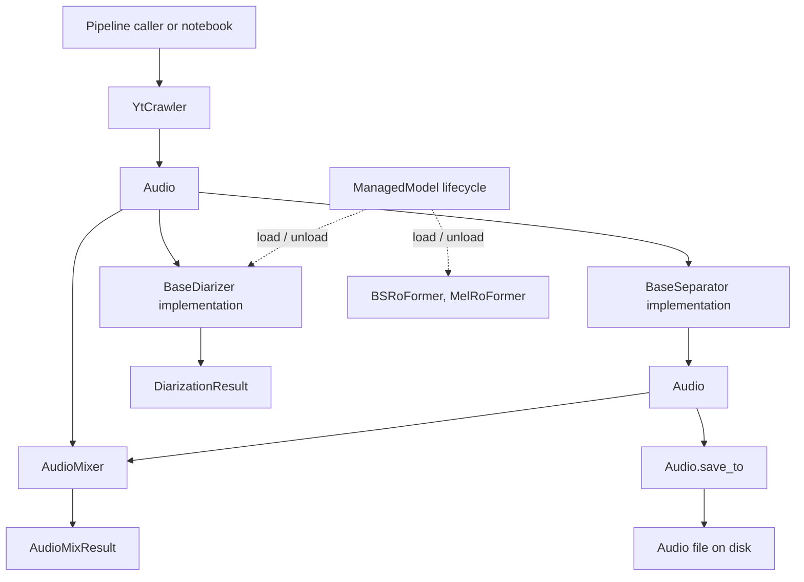

# API contract



This document describes what the public methods do, what they accept and
return, their side effects, and the conditions required to call them. The
field-level shape of returned objects is documented in
[`data_contract.md`](data_contract.md).

## 1. Audio ingestion API

### `YtCrawler.ingest(...) -> Audio`

**Defined in:** `src/yt_crawler/YtCrawlerClass.py`

A convenience class method that creates a crawler and delegates to
`download()`.

**Inputs:**

- `link: str` — YouTube URL.
- Optional output/work directories and normalization settings.
- Additional crawler options through `**kwargs`, such as cookies or proxy.

**Returns:** One `Audio` instance representing the normalized downloaded file.

**Side effects:** Creates output/work directories, invokes `yt-dlp` and possibly
`ffmpeg`, writes the final audio artifact, and removes the temporary download
session directory.

### `YtCrawler.download(url: str) -> Audio`

Downloads one URL and returns an `Audio` object.

**Behavior contract:**

1. Creates an isolated temporary session directory.
2. Runs `yt-dlp` without downloading a playlist.
3. Reads the generated `.info.json` metadata.
4. Selects an audio file rather than a video artifact.
5. Normalizes the file to the crawler's configured format, sample rate, and
   channel count.
6. Returns an `Audio` object whose `path` points to the final output.
7. Removes the temporary session directory even if processing fails.

**Raises:** `DownloadError` when `yt-dlp`, metadata parsing, audio discovery,
or `ffmpeg` processing fails.

### `YtCrawler.build_command(url: str, target_work_dir: Path) -> list[str]`

Builds, but does not execute, the `yt-dlp` command. The returned value is a
list of command-line tokens, not a data-contract class.

## 2. `Audio` API

**Defined in:** `src/utils/AudioClass.py`

`Audio` is a file-backed dataclass. Its fields are documented in
[`data_contract.md`](data_contract.md).

### `Audio.from_file(path, *, source_id=None, title=None, native_sample_rate=None, history=None) -> Audio`

Creates an `Audio` object for an existing file.

**Behavior contract:**

- Resolves `path` to an absolute path.
- Uses the file stem as the default `source_id` and `title`.
- Detects the extension as `format`.
- Probes WAV files for sample rate, duration, and channel count.
- Sets `native_sample_rate` to the probed file rate unless the caller passes
  the original source rate.
- Uses class defaults for metadata that cannot be probed.
- Initializes `history` to the provided sequence of step tags or an empty tuple.

**Raises:** `FileNotFoundError` if the path does not identify a file.

### `Audio.metadata(*, target_sample_rate=None) -> dict`

Returns a serializable snapshot of the `Audio` fields (including `history` as a list). `path` is a string.
When `target_sample_rate` is given, the dict also includes that rate and
`resample_action` (`upscale`, `downscale`, or `keep`).

### `Audio.resample_action(target_sample_rate) -> "upscale" | "downscale" | "keep"`

Compares the current file `sample_rate` with a model's expected rate so the
caller can decide whether to resample. This uses the current file rate, not
`native_sample_rate`. `native_sample_rate` is still useful to detect that the
file was already resampled from the original source.

### `Audio.add_step(step_tag) -> Audio`

Returns a new `Audio` object with the sanitized `step_tag` appended to `history`.

### `Audio.fingerprint -> str`

Returns a formatted string representing the audio's processing fingerprint, combining
the source identifier, step history, and audio specs (`duration_s`, `sample_rate`, `channels`)
using `__` as segment separators.

### `Audio.save_to(dest) -> Audio`

Copies the represented audio file to `dest` and updates the same object's
`path` to the destination. It returns the same `Audio` instance, not a new
independent object.

**Side effects:** Creates destination parent directories and copies the file
when the source and destination differ.

**Raises:** `FileNotFoundError` if the current source file does not exist.

### `Audio.quick_save(output_dir=None, *, name=None, prefix=None, suffix=None, tag=None) -> Audio`

Copies the represented audio file to a quick-save temporary directory (defaulting to
`<project_root>/temp/`) with an informative filename generated from the `Audio` object's
`fingerprint` (or explicit `name`), prints `Quick saved to: <destination>` to standard output,
and updates the same object's `path` to the destination. It returns the same `Audio` instance.

**Side effects:** Creates the destination directory, copies the file when source
and destination differ, and prints the destination path to stdout.

**Raises:** `FileNotFoundError` if the current source file does not exist.


### `Audio.notebook_display(dest=None) -> None`

Optionally copies the audio file to `dest` via `save_to` and displays it using
an interactive IPython audio player. It returns `None` and is intended for notebooks.
`Audio.display` is provided as an alias.

**Raises:** `FileNotFoundError` if the represented audio path does not exist.

### `Audio.show_mel_spectrogram(...) -> None`

Loads the audio, computes a mel spectrogram, and displays it with Matplotlib.
It does not modify the `Audio` object and returns `None`.

**Raises:** `FileNotFoundError` if the represented path no longer exists.

### `repr(audio) -> str`

Returns a human-readable representation containing the source ID, title, path,
sample rate, native sample rate, duration, channel count, format, and history (if non-empty).

## 3. Source-separation API

### Common interface: `BaseSeparator.separate(audio: Audio) -> Audio`

**Defined in:** `src/separation/BaseSeparator.py`

Every separator consumes one `Audio` object and returns one separated `Audio`
object. The returned object has the same nine-field class contract, while its
`path` points to the normalized separated output and its `history` records the separation step.

### Concrete implementations

| Class | Method | Model lifecycle requirement |
|---|---|---|
| `HTDemucs` | `separate(audio) -> Audio` | No explicit `load()` required. |
| `BSRoFormer` | `separate(audio) -> Audio` | Call `load()` first, or use a context manager. |
| `MelRoFormer` | `separate(audio) -> Audio` | Call `load()` first, or use a context manager. |
| `MVSepMDX23` | `separate(audio) -> Audio` | No `ManagedModel` load step; dependencies/checkpoints may be fetched on first use. |

**Common behavior:**

- Verifies that the input path exists.
- Runs the backend-specific separation process.
- Normalizes the selected stem to the configured sample rate and channel count.
- Probes the output WAV.
- Preserves the input `source_id`, `title`, and `native_sample_rate`.
- Returns a new `Audio` instance with `format="wav"`.

**Common failure behavior:** Each backend raises its own runtime error type
when the input, external command, model, or expected output is unavailable.

### `BaseSeparator.close() -> None`

Default no-op resource cleanup method. `BSRoFormer` and `MelRoFormer` provide a
compatibility implementation that delegates to `unload()`.

## 4. Managed model lifecycle API

**Defined in:** `src/base/model.py`

`ManagedModel` is used by `PyannoteDiarizer`, `SortformerDiarizer`, `BSRoFormer`, and `MelRoFormer`.

### `is_loaded -> bool`

Read-only property indicating whether the underlying resource is currently
loaded.

### `load() -> None`

Loads the resource once by calling the subclass's `_load()` implementation.
Repeated calls while loaded are no-ops.

### `unload() -> None`

Releases the resource once by calling `_unload()`. Repeated calls while already
unloaded are no-ops.

### Context-manager behavior

```python
with model:
    result = model.some_operation()
```

- `__enter__() -> ManagedModel` calls `load()` and returns the model.
- `__exit__(...) -> None` calls `unload()`, including when leaving because of
  an exception.

Subclasses must implement `_load() -> None` and `_unload() -> None`.

## 5. Speaker-diarization API

### `BaseDiarizer.diarize(audio: Audio) -> DiarizationResult`

**Defined in:** `src/diarization/BaseDiarizer.py`

Abstract interface for converting audio into backend-independent speaker
information.

### `PyannoteDiarizer.diarize(audio: Audio) -> DiarizationResult`

Requires the Pyannote pipeline to be loaded first.

**Behavior contract:**

- Invokes Pyannote with the input audio path.
- Converts backend speaker labels into result-local IDs such as `spk_00`.
- Creates one `Speaker` record for each distinct label.
- Creates one `SpeakerTurn` record for each annotated segment.
- Sets `audio_id` to `audio.source_id`.
- Includes `DiarizationModelInfo` with backend `"pyannote"` and the configured
  model ID.

**Raises:** `RuntimeError` if `load()` has not completed or the underlying
pipeline is unavailable.

### `PyannoteDiarizer._load() -> None` and `_unload() -> None`

These are lifecycle implementations rather than caller-facing processing
methods:

- `_load()` loads the configured Hugging Face/Pyannote pipeline and places it
  on the requested device.
- `_unload()` releases the pipeline and clears CUDA cache when available.

### `SortformerDiarizer.diarize(audio: Audio) -> DiarizationResult`

Requires the dependencies pinned in `requirements-sortformer.txt` and a
completed `load()`. They are intentionally kept out of the primary `uv.lock`
because NeMo constrains shared packages such as Lightning and Hugging Face Hub;
install them in an isolated worker/environment. The default model artifact is
downloaded from
`nvidia/diar_sortformer_4spk-v1` at revision
`f059506485424eb68a90a7af84c8e63e67f381fd`.

**Behavior contract:**

- Inspects and normalizes the actual input file to mono, 16 kHz PCM WAV rather
  than trusting `Audio` metadata.
- Processes at most six minutes per inference call by default, with a one-minute
  overlap between adjacent windows.
- Converts the model's 80 ms, four-channel activity probabilities into speaker
  turns with configurable hysteresis and duration post-processing.
- Aligns speaker slots between windows using activity in the shared region.
- Uses TitaNet embeddings as a fallback when a speaker is absent from the
  overlap, unless speaker similarity is disabled.
- Resolves duplicate predictions in shared regions at the overlap midpoint,
  preserves simultaneous speakers, sorts turns chronologically, and emits
  result-local IDs such as `spk_00`.
- May produce more than four speakers in the complete result. The hard limit of
  four distinct speakers applies independently to each inference window.
- Retries with three-minute windows by default when a six-minute inference
  raises an accelerator out-of-memory error.
- Includes `DiarizationModelInfo` with backend `"nemo-sortformer"`, the model
  repository ID, and the pinned revision.

**Device behavior:** `device="auto"` selects CUDA, then MPS, then CPU. MPS is
experimental in NeMo and may use CPU fallbacks when
`PYTORCH_ENABLE_MPS_FALLBACK=1`. An explicitly requested unavailable device
raises `RuntimeError`.

**Raises:** `RuntimeError` when the model is not loaded, optional NeMo support
is unavailable, output is in an unknown format, or the selected device cannot
be initialized. Audio conversion and file errors are propagated.

### `SortformerDiarizer._load() -> None` and `_unload() -> None`

- `_load()` downloads the exact `.nemo` artifact (unless `checkpoint_path` is
  supplied), restores it with `strict=False`, and moves it to the selected
  device.
- TitaNet is loaded lazily only when a recording needs multiple windows.
- `_unload()` releases both models and clears available accelerator caches.

## 6. Benchmark mixing API

### `AudioMixer.mix(...) -> AudioMixResult`

**Defined in:** `src/benchmark/separation/mixer.py`

**Inputs:**

- `speech: Audio`
- `music: Audio`
- `target_smr_db: float`
- `seed: int`
- `output_dir: str | Path`

**Behavior contract:**

1. Loads both input files as floating-point waveforms.
2. Converts both inputs to the configured channel layout.
3. Crops or loops music to the speech duration using the supplied seed.
4. Applies music gain to reach the requested speech-to-music ratio.
5. Applies a common output gain when the peak exceeds the configured ceiling.
6. Writes `speech_reference.wav`, `music_reference.wav`, and `mixture.wav`.
7. Returns an `AudioMixResult` containing three `Audio` objects and one
   `MixingParameters` object.

**Raises:** `ValueError` for invalid mixer settings, effectively silent input,
or an output directory that would overwrite an input audio file.

## 7. Shared audio utility API

These functions support the public pipeline methods but return no pipeline
classes.

| Function | Return | Contract |
|---|---|---|
| `probe_wav(path)` | `tuple[int, float, int]` | `(sample_rate, duration_s, channels)`. |
| `normalize_wav(src, dest, ...)` | `None` | Copies or converts audio using `ffmpeg`. |

`normalize_wav` raises `AudioConvertError` when `ffmpeg` conversion fails.

## 8. Dataclass method note

`Speaker`, `SpeakerTurn`, `DiarizationModelInfo`, `DiarizationResult`,
`BenchmarkDefinition`, `MixingParameters`, `AudioMixResult`, and
`SeparationBenchmarkSample` are dataclasses. Apart from validation in the
`Speaker*`, `DiarizationModelInfo`, and `DiarizationResult` constructors, they
do not define additional business methods. Python supplies standard dataclass
methods such as `__init__`, `__repr__`, and `__eq__`.
