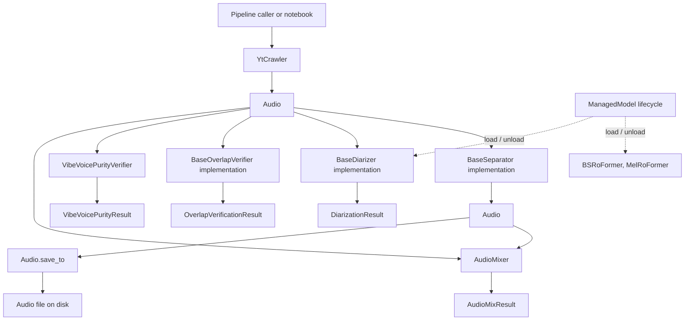

# API Contract (Master Gateway)

[← Docs Index](README.md) | [Data Contract Gateway →](data_contract.md)

---

This document is the master index and gateway for all public APIs in the repository. Detailed specifications, parameters, invariants, error handling, and code examples are organized into dedicated modular documents:

---

## 📚 Modular API Documentation Map

| Module | Core Responsibility | Key Public Classes & Functions |
|---|---|---|
| [**01. Audio Representation & Ingestion**](01_audio_and_ingestion.md) | File-backed audio state, metadata sidecars, and YouTube downloading | `Audio`, `YtCrawler`, `probe_wav`, `normalize_wav` |
| [**02. Source Separation & Model Lifecycle**](02_source_separation.md) | Vocal/instrumental stem isolation and heavy model resource management | `BaseSeparator`, `HTDemucs`, `BSRoFormer`, `MelRoFormer`, `MVSepMDX23`, `ManagedModel` |
| [**03. Speaker Diarization & Verification**](03_speaker_diarization.md) | 5 diarization engines, isolated worker runners, turn cleanup, DER evaluation, and purity verifiers | `SortformerDiarizer`, `DiariZenDiarizer`, `PyannoteDiarizer`, `ThreeDSpeakerDiarizer`, `ClusteringDiarizer`, `SpeakerVerifier`, `OverlapVerifier`, `VibeVoicePurityVerifier` |
| [**04. Zero-Contamination Diarization**](04_zero_contamination_diarization.md) | Extreme-precision TTS voice harvesting pipeline with 5-stage attrition funnel | `run_zero_contamination_pipeline`, Hungarian consensus, context collar, syllable locking, energy snapping, homogeneity |
| [**05. Benchmark & Audio Mixing**](05_benchmark_and_mixing.md) | Calibrated speech+music mixture generation and evaluation | `AudioMixer.mix()`, `BenchmarkDefinition`, `AudioMixResult`, [`bench-paper-diarize.md`](bench-paper-diarize.md) |
| [**06. Web Applications & Platforms**](06_web_applications.md) | Interactive workbench (SonicStudio) and batch pipeline (SonicPipeline) | Unified `aiohttp` server (port 8765), `/studio/`, `/pipeline/`, FIFO queues, SSE events |
| [**07. Data Contracts & Schemas**](07_data_contracts.md) | Field-level object contracts and serialized JSON payloads | `DiarizationResult`, `SpeakerProfile`, `ZeroContaminationResult`, `AudioItem` |
| [**08. Model Parameters & Trade-offs**](08_model_parameters_and_tradeoffs.md) | Comprehensive parameter tuning, directional effects, and trade-off certainties | All separation, diarization, purity, and zero-contamination parameters |

---

## ⚡ Quick API Reference Matrix

### 1. Ingestion & Audio
👉 *Full specification:* [**01. Audio Representation & Ingestion**](01_audio_and_ingestion.md)

- `YtCrawler.ingest(link, output_dir=.data/yt_crawler/downloads, work_dir=.data/yt_crawler/work, audio_format="wav", sample_rate=44100, channels=1, **kwargs) -> Audio`: Downloads and normalizes YouTube audio.
- `YtCrawler.download(url) -> Audio`: Executes download workflow into `.data/yt_crawler/`.
- `Audio.from_file(path, ...) -> Audio`: Instantiates file-backed `Audio`, restoring metadata from sidecar `{stem}.json` if present.
- `Audio.save_to(dest) -> Audio`: Copies audio file and writes `{stem}.json` sidecar. Returns same mutated instance.
- `Audio.quick_save(...) -> Audio`: Saves with timestamped fingerprint to `.data/quick_save/`.
- `Audio.resample_action(target_rate) -> "upscale" | "downscale" | "keep"`: Checks if resampling is needed.
- `probe_wav(path) -> tuple[int, float, int]`: Probes header for `(sample_rate, duration_s, channels)`.

### 2. Source Separation
👉 *Full specification:* [**02. Source Separation & Model Lifecycle**](02_source_separation.md)

- `BaseSeparator.separate(audio: Audio) -> Audio`: Universal interface producing a normalized separated stem (e.g. vocals).
- `ManagedModel.load() / unload() / with model:`: Explicit neural model resource management (one-shot `load()`/`unload()`; repeats are no-ops; `__exit__` unloads even on exception).
- Backends: `HTDemucs` (Demucs CLI, `cpu` default), `BSRoFormer` & `MelRoFormer` (RoFormer neural models, `auto` default), `MVSepMDX23` (Fast Kim ONNX / full ensemble, `auto` default).

### 3. Speaker Diarization
👉 *Full specification:* [**03. Speaker Diarization, Evaluation & Verification**](03_speaker_diarization.md)

- `BaseDiarizer.diarize(audio: Audio) -> DiarizationResult`: Universal diarization contract returning schema 2.0. Per-call options live on `diarize()` for some backends (Pyannote: `num_speakers`/`min_speakers`/`max_speakers`/`hook`; Sortformer: `enrollment_name`/`enrollment_clips`).
- Backends & Workers:
  - `SortformerWorkerDiarizer`: NVIDIA NeMo Sortformer (streaming 4-speaker model, enrollment anchor).
  - `DiariZenWorkerDiarizer`: BUT-FIT WavLM Large + WeSpeaker + VBx clustering (SOTA overlap).
  - `PyannoteDiarizer`: Pyannote Audio community-1 pipeline.
  - `ThreeDSpeakerWorkerDiarizer`: ModelScope FSMN VAD + CAM++ embeddings + spectral clustering.
  - `ClusteringWorkerDiarizer`: NeMo MarbleNet VAD + TitaNet embeddings + spectral clustering.
- Turn Cleanup & Evaluation:
  - `clean_speaker_turns(turns, ...) -> list[SpeakerTurn]`: Non-mutating jitter correction and boundary trimming.
  - `evaluate_diarization(reference_turns, hypothesis_turns, duration_s, ...) -> dict`: Exact Hungarian-matched DER/JER calculator.
- Identity & Purity Verification:
  - `SpeakerVerifier`: Enrolls global profiles (`.data/speaker_profiles/`) and computes cosine similarity.
  - `OverlapVerifier`: Multimodal direct-audio speaker-purity and word-boundary
    verification (local Gemma 4 or Google Gemini via `verify(audio)` or concurrent `verify_batch(audios)`), returning structured failure
    evidence plus optional Gemini token usage and estimated cost.
  - `VibeVoicePurityVerifier`: Microsoft VibeVoice-ASR single vs multi-speaker classifier.

### 4. Zero-Contamination Diarization
👉 *Full specification:* [**04. Zero-Contamination Diarization Pipeline**](04_zero_contamination_diarization.md)

- `run_zero_contamination_pipeline(audio, config, progress_callback=None) -> ZeroContaminationResult`: Complete 5-stage pipeline (Asymmetric detection → Dual-engine Hungarian consensus → Context-aware collar & Syllable lock → WeSpeaker homogeneity → Foundation models). Progress callback receives `(progress_0_to_1, message)`.

### 5. Benchmark Audio Mixing
👉 *Full specification:* [**05. Benchmark Separation & Audio Mixing**](05_benchmark_and_mixing.md)

- `AudioMixer.mix(speech, music, *, target_smr_db, seed, output_dir) -> AudioMixResult`: Calibrated mixing with peak limiting, music cropping/looping, and reference stem generation. All three keyword args are required. Constructor defaults: `AudioMixer(sample_rate=44100, channels=2, peak_ceiling_dbfs=-1.0)`.

### 6. Web Applications
👉 *Full specification:* [**06. Web Applications (SonicStudio & SonicPipeline)**](06_web_applications.md)

- Unified backend on port `8765`: SonicStudio mounted at `/studio/`, SonicPipeline mounted at `/pipeline/`.
- Telemetry, shared FIFO device queues, waveform/spectrogram rendering, and channel dataset management.
