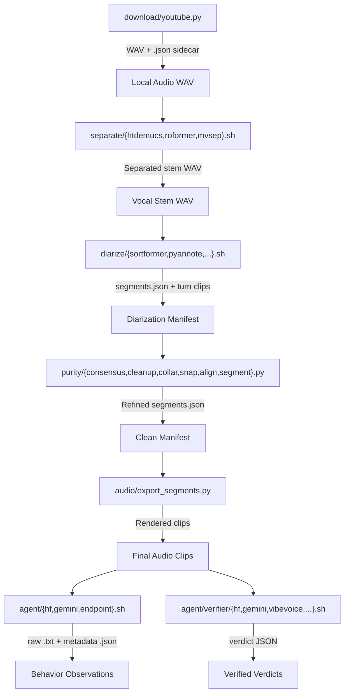

# CLI Contract (Master Gateway)

[← Docs Index](README.md) | [Data Contract Gateway →](data_contract.md) | [Command Cookbook →](../scripts/COMMANDS.md)

All operations in this repository are standalone CLI commands. There is no
monolithic pipeline class, shared in-memory audio state, or background queue.
Commands receive paths and flags and write filesystem artifacts.

## Global CLI Conventions

- **Precedence:** `--input-file` takes precedence over `--input-dir`. For single-output commands, `--output-file` takes precedence over `--output-dir` and is the exact destination.
- **Mutual Exclusion:** Providing directory input with `--output-file` is rejected.
- **Path Resolution & Audio Families:** Relative paths resolve against the caller's working directory. Default output directories are dynamic per audio family under `.data/<operation>/[<model>/]<family>/` (e.g. `.data/download/<family>/`, `.data/separate/<model>/<family>/`, `.data/diarize/<model>/<family>/`). Downloaded audio filenames follow `<id>_<title10>-<sample_rate>.wav` to anchor audio family identity across all downstream steps. Explicit `--output-dir` or `--output-file` overrides defaults.
- **Sequential & Concurrent Execution:** Most commands default to sequential execution (`--concurrency 1`, `--batch-size 1`). Gemini commands instead default to the asynchronous provider Batch API with up to 10 requests per job; `--inference-mode standard` selects the synchronous path. Other commands use these flags for multi-threaded loading, clip exports, dataset operations, or local request grouping. A model is loaded once per command invocation.
- **Concurrency & Batching Control:** All commands support `--concurrency` (worker threads) and `--batch-size` (batch chunk granularity) with default values shown in `-h` / `--help` on both `.sh` and `.py` entrypoints.
- **Configuration & Live Progress:** Every command immediately logs its complete parsed configuration to stderr upon launch and streams real-time progress updates with timestamps, stage labels, item percentages, and elapsed times.
- **Idempotency & Overwrite:** Existing outputs with matching metadata and intact hashes are skipped. Overwriting inputs in place is disallowed. Conflicting outputs require `--overwrite`.

## Command Reference Matrix

| Category | Command / Launcher | Key Arguments | Outputs |
|---|---|---|---|
| **Download** | `scripts/download/youtube.py` | `--url`, `--output-dir`, `--output-file`, `--sample-rate`, `--cookie-file` | Mono WAV (48 kHz default) + sibling `.json` |
| | `scripts/download/playlist.py` | `--url`, `--output-dir`, `--sample-rate`, `--limit` | Batch WAVs + `.json` sidecars |
| | `scripts/download/channel.py` | `--url`, `--output-dir`, `--sample-rate`, `--limit` | Batch WAVs + `.json` sidecars |
| **Separation** | `scripts/separate/htdemucs.sh` | `--input-file` / `--input-dir`, `--output-dir`, `--stem`, `--shifts`, `--overlap` | Separated WAV + sibling `.json` |
| | `scripts/separate/htdemucs_ft.sh` | `--input-file` / `--input-dir`, `--output-dir`, `--stem` | Fine-tuned Demucs separated WAV |
| | `scripts/separate/bs_roformer.sh` | `--input-file` / `--input-dir`, `--output-dir`, `--stem`, `--model` | RoFormer separated WAV |
| | `scripts/separate/mel_roformer.sh` | `--input-file` / `--input-dir`, `--output-dir`, `--stem`, `--model` | Mel-Band RoFormer separated WAV |
| | `scripts/separate/mvsep_mdx23.sh` | `--input-file` / `--input-dir`, `--output-dir`, `--stem`, `--device` | MVSEP ensemble separated WAV |
| **Diarization** | `scripts/diarize/sortformer.sh` | `--input-file` / `--input-dir`, `--output-dir` | `<stem>/segments.json` + turn WAV clips |
| | `scripts/diarize/pyannote_community1.sh` | `--input-file` / `--input-dir`, `--output-dir`, `--num-speakers` | `<stem>/segments.json` + turn WAV clips |
| | `scripts/diarize/pyannote_31.sh` | `--input-file` / `--input-dir`, `--output-dir`, `--num-speakers` | `<stem>/segments.json` + turn WAV clips |
| | `scripts/diarize/clustering.sh` | `--input-file` / `--input-dir`, `--output-dir` | NeMo Clustering segments + clips |
| | `scripts/diarize/threed_speaker.sh` | `--input-file` / `--input-dir`, `--output-dir`, `--include-overlap` | 3D-Speaker segments + clips |
| | `scripts/diarize/diarizen.sh` | `--input-file` / `--input-dir`, `--output-dir` | DiariZen segments + clips |
| **Audio Tools** | `scripts/audio/info.py` | `--input-file` / `--input-dir` | Audio metadata JSON Lines to stdout |
| | `scripts/audio/convert.py` | `--input-file` / `--input-dir`, `--sample-rate`, `--channels` | Converted WAV |
| | `scripts/audio/cut.py` | `--input-file`, `--start`, `--end`, `--output-file` | Exact time slice WAV |
| | `scripts/audio/export_segments.py` | `--input-manifest`, `--output-dir` | Rendered WAV clips matching manifest |
| | `scripts/audio/compare_waveforms.py` | `--audio1`, `--audio2`, `--output-file` | Visual waveform comparison PNG |
| | `scripts/audio/compare_spectrograms.py` | `--audio1`, `--audio2`, `--output-file` | Visual spectrogram comparison PNG |
| **Speaker Ops** | `scripts/speaker/enroll.py` | `--name`, `--clip`, `--clip-dir`, `--profiles-dir`, `--overwrite`, `--add` | `profile.json` + copied reference clips |
| | `scripts/speaker/score.sh` | `--input-manifest`, `--profile`, `--output-manifest` | Scored `segments.json` with turn similarities |
| | `scripts/speaker/filter.py` | `--input-manifest`, `--threshold`, `--min-duration-s`, `--exclude-overlap`, `--output-manifest` | Filtered `segments.json` |
| | `scripts/speaker/purity.sh` | `--input-manifest`, `--profile`, `--similarity-threshold`, `--output-manifest` | Verified `segments.json` with purity decisions |
| **Purity Stages** | `scripts/purity/consensus.py` | `--input-manifest`, `--secondary-manifest`, `--output-manifest` | Consensus `segments.json` |
| | `scripts/purity/cleanup.py` | `--input-manifest`, `--output-manifest` | Cleaned `segments.json` |
| | `scripts/purity/collar.py` | `--input-manifest`, `--output-manifest`, `--collar-s` | Collared `segments.json` |
| | `scripts/purity/snap.py` | `--input-manifest`, `--output-manifest` | Acoustic boundary-snapped `segments.json` |
| | `scripts/purity/align.sh` | `--input-manifest`, `--output-manifest`, `--words-file` | Word-locked `segments.json` |
| | `scripts/purity/segment.py` | `--input-manifest`, `--words-file`, `--output-manifest` | Duration-bounded `segments.json` |
| **Agent Exploration** | `scripts/agent/{gemini,endpoint,hf}.sh` | `--input-file` / `--input-dir`, `--output-file` / `--output-dir`, required `--prompt-file`, model/backend options | Exact unparsed model `.txt` plus sibling response metadata `.json`; Gemini defaults to `.data/agent/gemini/<model>/<reasoning>/<family>/`, other backends to `.data/agent/<backend>/<family>/` |
| **Verification** | `scripts/agent/verifier/hf.sh` | `--input-file` / `--input-dir`, `--output-file` / `--output-dir`, `--prompt-file` | Exact response `.txt` plus success/failure verdict JSON |
| | `scripts/agent/verifier/gemini.sh` | `--input-file` / `--input-dir`, `--output-file` / `--output-dir`, `--model`, `--reasoning-effort`, `--inference-mode`, `--batch-size`, `--max-tokens`, `--temperature`, `--prompt-file` | Batch-by-default Gemini response `.txt` plus verdict JSON; defaults under `.data/agent/verifier/gemini/<model>/<reasoning>/<family>/` |
| | `scripts/agent/verifier/endpoint.sh` | `--input-file` / `--input-dir`, `--output-file` / `--output-dir`, `--endpoint` | OpenAI-compatible response `.txt` plus verdict JSON |
| | `scripts/agent/verifier/unsloth.sh` | `--input-file` / `--input-dir`, `--output-file` / `--output-dir`, `--endpoint` | Unsloth response `.txt` plus verdict JSON |
| | `scripts/agent/verifier/vllm.sh` | `--input-file` / `--input-dir`, `--output-file` / `--output-dir`, `--model`, `--endpoint`, `--prompt-file` | vLLM response `.txt` plus offline/server verdict JSON |
| | `scripts/agent/verifier/moss.sh` | `--input-file` / `--input-dir`, `--output-file` / `--output-dir` | MOSS-Audio response `.txt` plus verdict JSON |
| | `scripts/agent/verifier/minicpm.sh` | `--input-file` / `--input-dir`, `--output-file` / `--output-dir` | MiniCPM-o response `.txt` plus verdict JSON |
| | `scripts/agent/verifier/kimi.sh` | `--input-file` / `--input-dir`, `--output-file` / `--output-dir` | Kimi-Audio response `.txt` plus verdict JSON |
| | `scripts/agent/verifier/vibevoice.sh` | `--input-file` / `--input-dir`, `--output-file` / `--output-dir`, `--min-secondary-speech-s` | Serialized decoded response `.txt` plus speaker-count verdict JSON |
| | `scripts/agent/verifier/evaluate_verifier.py` | `--predictions-dir`, `--reference-dir`, `--output-file` | Accuracy, defect recall, FRR, and latency JSON |
| | `scripts/agent/verifier/analyze.sh` | `--verdict-dir`, repeatable `--input-manifest` and/or `--manifest-dir`, optional `--output-dir` | `all_samples.csv`, `successful_samples.csv`, analysis JSON, and PNG plots under `<verdict-dir>/plot/` by default |
| | `scripts/agent/verifier/scaffold_experiment.py` | `--name`, `--concurrency`, `--batch-size` | Empty verifier-development workspace under `.data/agent/verifier/experiments/` |
| **Mix & Eval** | `scripts/mix/mix.py` | `--speech`, `--music`, `--smr-db`, `--seed`, `--output-dir` | Mixture, stem references, mix metadata |
| | `scripts/evaluate/separation.py` | `--input-file`, `--reference-file`, `--mixture-file`, `--output-file` | SI-SDR and SDR metrics JSON |
| | `scripts/evaluate/diarization.py` | `--input-manifest`, `--reference-manifest`, `--duration`, `--output-file` | DER, JER, Confusion metrics JSON |
| | `scripts/evaluate/plot_diarization.py`| `--input-manifest`, `--reference-manifest`, `--output-file` | Diarization Gantt timeline PNG |
| | `scripts/evaluate/plot_metrics.py` | `--metrics-file`, `--output-file` | Metrics bar plot PNG |
| **Dataset Tools**| `scripts/dataset/index.py` | `--input-dir`, `--output-manifest`, `--tag` | Snapshot dataset manifest JSON |
| | `scripts/dataset/filter.py` | `--input-manifest`, `--output-manifest`, `--min-duration`, `--max-duration`, `--tag` | Filtered dataset manifest JSON |
| | `scripts/dataset/export.py` | `--input-manifest`, `--output-file`, `--format` | Exported JSONL or CSV |
| | `scripts/dataset/bundle.py` | `--input-manifest`, `--output-file` | Packaged dataset ZIP bundle |
