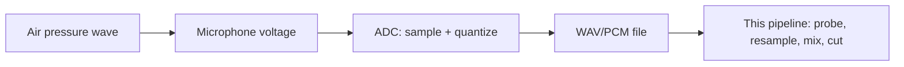
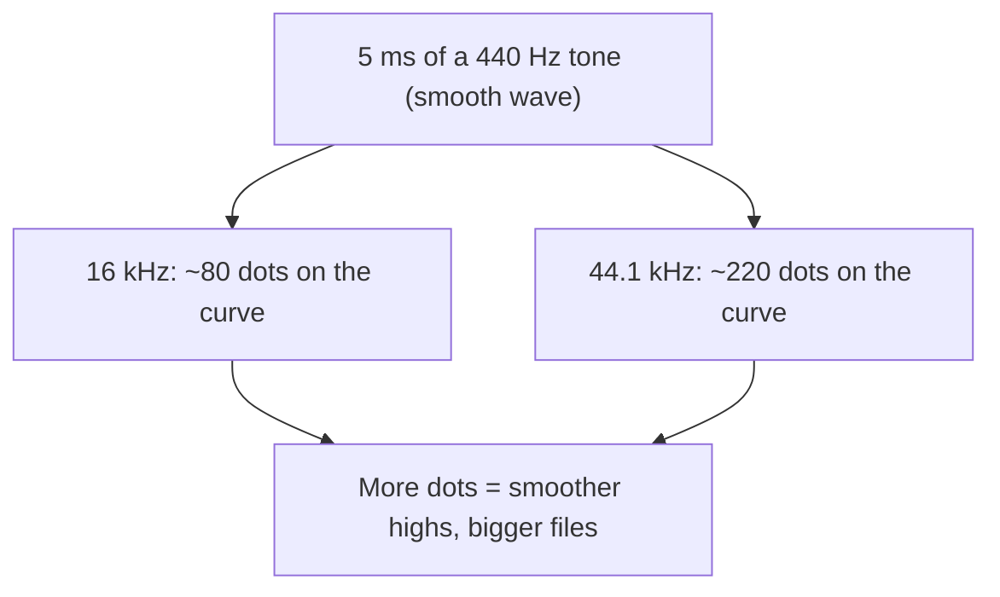
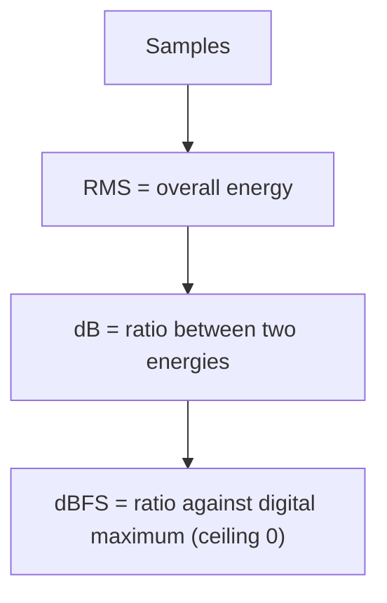
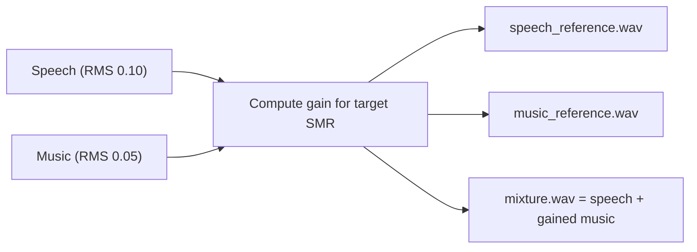
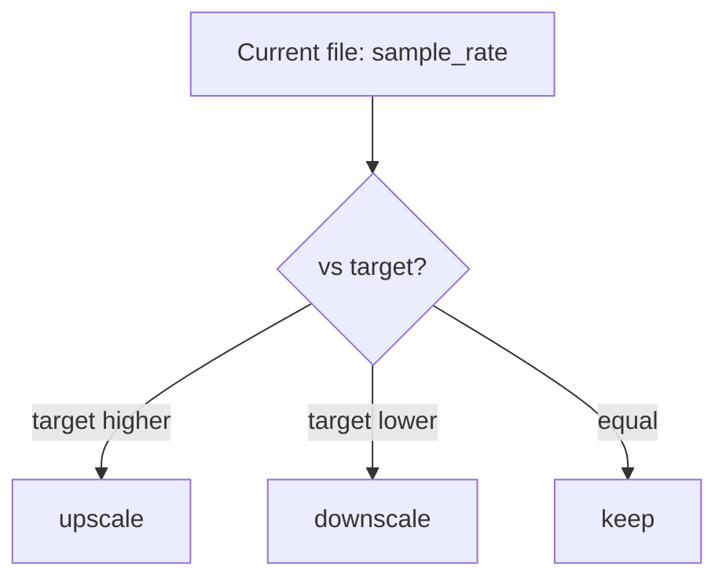
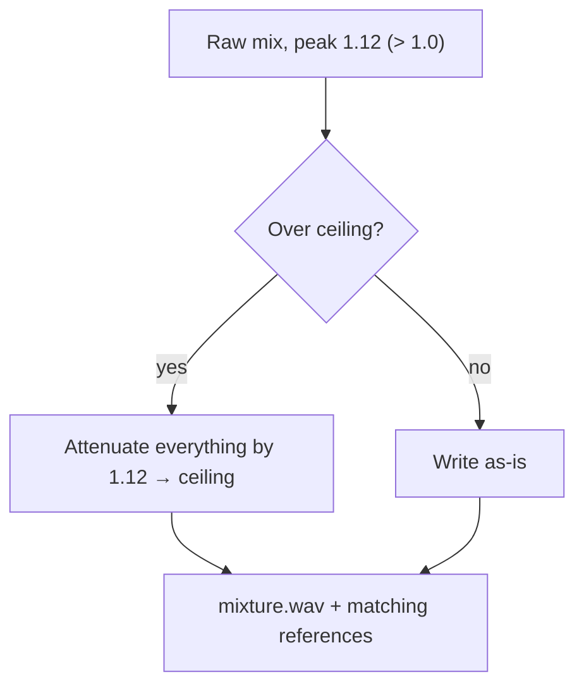

# 01. Audio Fundamentals (for speech newcomers)

[← Concepts Index](README.md) | [Main docs: 01 Audio & Ingestion](../01_audio_and_ingestion.md)

This guide builds the vocabulary every other guide assumes: what digital audio
*is*, how loudness is measured, and what happens when files move through this
pipeline.



## 1. Sampling: snapshots of a wave

A microphone produces a smooth, continuous signal. A computer stores **samples**:
amplitude measurements taken `sample_rate` times per second (Hz).

- 16,000 Hz = 16,000 snapshots/second. Enough for speech intelligibility;
  diarization models (Sortformer, CAM++) usually want this.
- 44,100 Hz = CD quality. The default target in this repo
  (`DEFAULT_SAMPLE_RATE` in `AudioClass`, `AudioMixer(sample_rate=44100)`).

**Nyquist rule (the one sentence):** to capture a frequency `f`, you must sample
faster than `2 × f`. Human hearing tops out near 20 kHz, so 44.1 kHz covers it.



**Worked example.** 10 s of mono audio at 44,100 Hz = 441,000 samples. Stored as
32-bit float that is ~1.76 MB per channel before headers. Stereo doubles it.

## 2. Channels, WAV, PCM

- **Channel:** one stream of samples. Mono = 1, stereo = 2 (left/right).
  This repo normalizes to mono on ingest (`channels=1`) but the benchmark mixer
  defaults to `channels=2` — check the caller's constructor arguments.
- **PCM:** raw numbers per sample (e.g. float in `[-1.0, 1.0]`).
- **WAV:** a container that wraps PCM plus a header (rate, channels, length).
  That is why `probe_wav()` is fast: it reads the header, not the audio.


## 3. Loudness: RMS, dB, dBFS

Sample values bounce up and down, so "loudness" uses energy averages:

- **RMS (root-mean-square):** `sqrt(mean(samples²))`. A 1 kHz tone at amplitude
  0.5 has RMS ≈ 0.354. Silence has RMS ≈ 0.
- **Decibel (dB):** a ratio on a log scale. `20·log10(RMS_a / RMS_b)`.
  +6 dB ≈ twice the amplitude. −6 dB ≈ half.
- **dBFS (dB Full Scale):** dB measured against the digital maximum (1.0).
  0 dBFS = loudest representable sample. Everything else is negative.
  −30 dBFS is very quiet — this repo's energy-valley floor
  (`energy_valley_floor_db=-30.0`) means "treat anything this quiet as a pause".



**Worked example.** Speech RMS = 0.10, music RMS = 0.05.
Ratio = 2 → `20·log10(2)` ≈ **+6 dB**: speech is 6 dB louder than music.
That number is exactly the mixer's `target_smr_db`.

## 4. SMR: the mixer's loudness contract

**SMR (Signal-to-Music Ratio)** = how much louder speech is than background
music, in dB. The mixer enforces it with RMS math (speech stays at 0 dB gain;
music is scaled):

```text
music_gain = RMS_speech / (RMS_music × 10^(target_smr_db / 20))
```

- `target_smr_db = +10`: easy test, speech dominates.
- `target_smr_db = -5`: brutal test, music buries speech.



## 5. Resampling and `resample_action`

Changing sample rate = redrawing the dots. Downsampling (48 kHz → 16 kHz)
throws away highs; upsampling (16 kHz → 44.1 kHz) interpolates — it cannot
restore lost highs.

`Audio.resample_action(target)` compares the **current file rate**
(`sample_rate`, not `native_sample_rate`) against a model's expectation:



**`native_sample_rate` vs `sample_rate`:** native = what YouTube gave us;
sample_rate = what the file on disk is now. Identity preservation means native
is remembered even after normalization.

## 6. Clipping and the peak ceiling

If mixed samples exceed ±1.0, the waveform is chopped flat: **clipping**
(harsh distortion). The mixer prevents it with a **peak ceiling**
(`peak_ceiling_dbfs=-1.0` default): if the mix peak would exceed the ceiling,
one shared attenuation gain is applied to speech, music, and mixture alike, so
the SMR stays exact while nothing clips.



## Where to go next

- File-backed identity, sidecars, ingest flow → `02_source_separation.md` in
  this folder, then `../01_audio_and_ingestion.md`.
- Loudness math in action → `../05_benchmark_and_mixing.md`.
