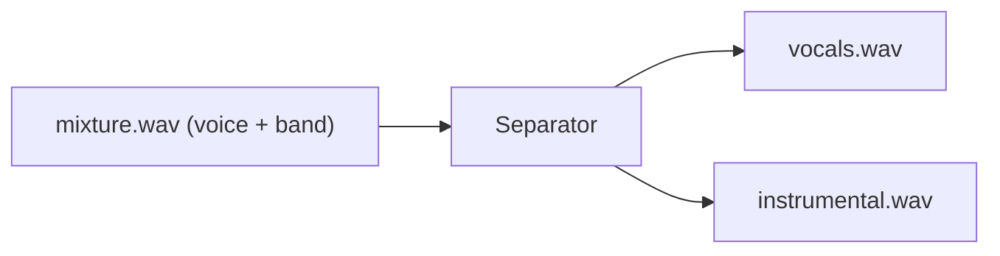
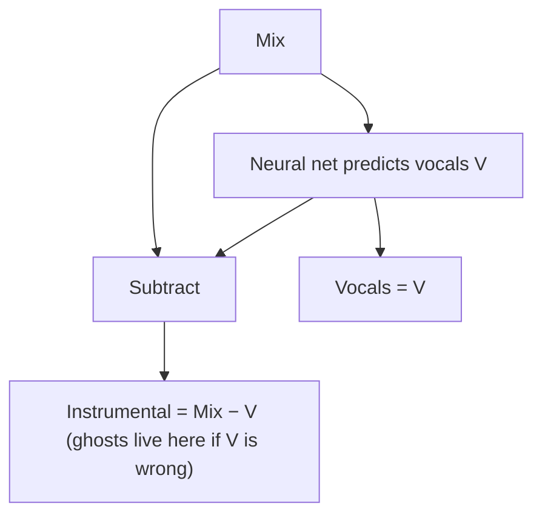
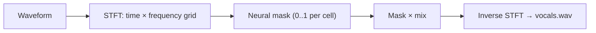
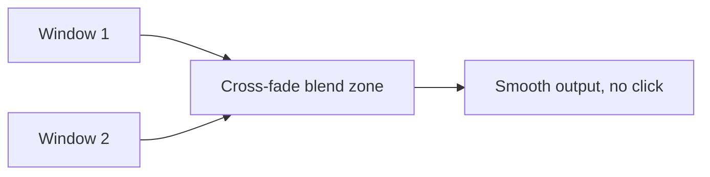
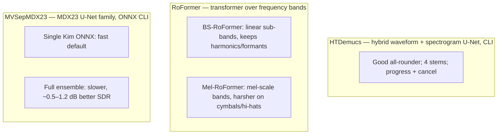
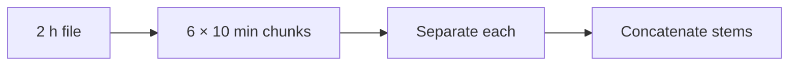
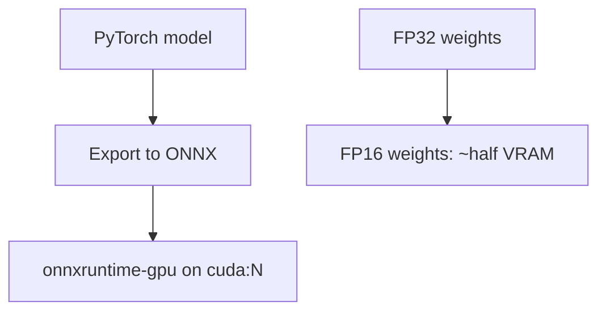

# 02. Source Separation (isolating voices from music)

[← Concepts Index](README.md) | [Main docs: 02 Source Separation](../02_source_separation.md)

**The job:** given one mixed track, produce one track that contains (mostly)
voice and one that contains (mostly) everything else.



## 1. Stems and the residual trick

A **stem** is one isolated layer: `vocals`, `drums`, `bass`, `other`, or the
catch-all `instrumental`. HTDemucs predicts four stems; the RoFormer and MDX23
backends predict vocals and derive the accompaniment by subtraction:

```text
instrumental = mix − vocals   (sample by sample)
```

That identity is exact math — which is also the warning: any vocal error
(a missed consonant, a phase shift) appears as a faint "ghost voice" in the
instrumental. See `two_stems` in `08_model_parameters_and_tradeoffs.md`.



## 2. The core trick: masks on a spectrogram

Models rarely edit the waveform directly. They:

1. Slice audio into short overlapping frames and run an FFT → **STFT**
   (a time × frequency grid; each cell = energy + phase).
2. Predict a **mask** per cell: 1 = "this cell belongs to voice", 0 = "music".
3. Multiply mask × mix, then invert back to a waveform.



**Worked example.** A cell at (2.30 s, 220 Hz, the A3 pitch of a singer)
contains voice energy 0.8 + guitar energy 0.2. The ideal vocal mask ≈ 0.8.
The model predicts 0.75 → a whisper of guitar survives in the vocal stem.

## 3. Overlap-add: why windows overlap

Inference runs on sliding windows blended with a **Hann cross-fade**. The
`overlap_large` / `overlap_small` parameters (default 0.25) control how much
windows share:



- Higher overlap (0.6): more redundant passes, fewer boundary clicks and
  transient smears; runtime grows ~`1 / (1 − overlap)`.
- Lower overlap (0.1): faster, risk of clicks at chunk borders.

## 4. The four backends in one picture



- **Demucs** looks at raw waveform and spectrogram together (hybrid), good at
  drums/bass structure.
- **RoFormer** applies self-attention *within each frequency band*, so a vocal
  harmonic can "attend" to its overtones. Band-split (linear Hz) preserves
  speech resonance; mel-band (ear-like spacing) rejects percussive bleed.
- **MDX23/Kim** are U-Nets on spectrograms; the Kim checkpoints are vocal
  specialists. `single_onnx=True` runs one; `False` averages several
  (**ensemble** = weighted mean of predictions, smoother errors).

## 5. Chunking long files

A 2-hour podcast does not fit in VRAM. `max_segment_seconds=600` slices it
into 10-minute pieces, separates each, and concatenates. Memory-safe; the
price is a theoretical splice click — which overlap-add mostly hides.



## 6. How quality is measured: SDR

**SDR (Signal-to-Distortion Ratio)** = energy of the true voice divided by
energy of everything wrong in the prediction, in dB. Higher = cleaner.
(+1 dB ensemble gain ≈ audibly less music bleed on reverby choruses; nearly
inaudible on dry speech over acoustic guitar.)

Siblings you may see in papers: **SIR** (interference from other sources only)
and **SAR** (artifacts the model itself invented: burbles, warbles).

## 7. Practical accelerators: ONNX (and FP16 in general)

- **ONNX:** a portable model format with a fast runtime (`onnxruntime-gpu`).
  MVSepMDX23 shells out to it — that is why CUDA needs that package (plus
  PyTorch CUDA available).
- **FP16 (background knowledge):** half-precision arithmetic halves VRAM and
  speeds up CUDA at a tiny quality cost. Note: the RoFormer backends in this
  repo do **not** currently enable FP16 — long files are handled by chunking
  (§5), not by precision reduction.



## Where to go next

- Knobs and trade-offs → `../08_model_parameters_and_tradeoffs.md` §1.
- Lifecycle (`load()` / `with model:`) → `10_infrastructure.md` in this folder.
- What "clean vocals" feed → `03_diarization_basics.md`.
