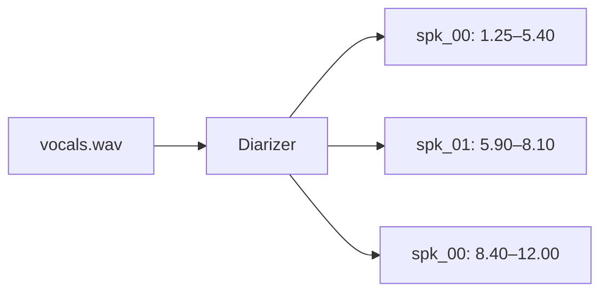
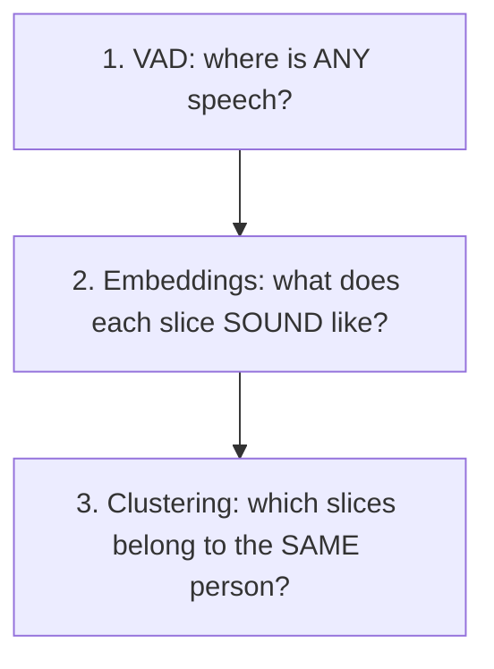
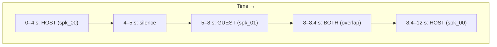
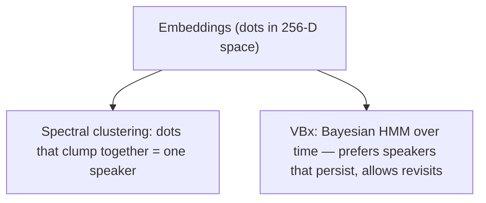
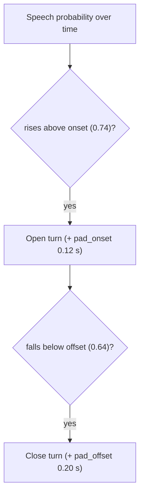
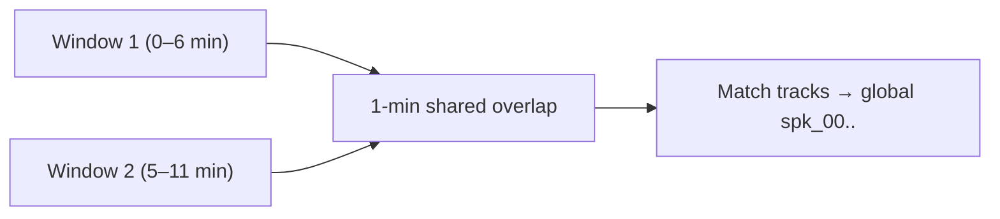
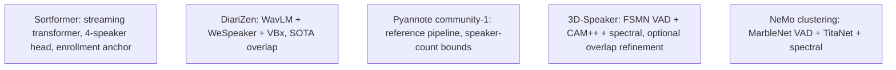

# 03. Diarization Basics ("who spoke when")

[← Concepts Index](README.md) | [Main docs: 03 Speaker Diarization](../03_speaker_diarization.md)

**The job:** turn a waveform into labelled intervals —
`spk_00: 1.25–5.40 s`, `spk_01: 5.90–8.10 s`, … — the `SpeakerTurn` list inside
`DiarizationResult`.

## 1. The classic three steps

1. **VAD (Voice Activity Detection).** A frame-level speech/no-speech gate.
   MarbleNet, FSMN-VAD, Silero-VAD are all neural VADs: small networks that
   output "speech probability" every ~10–20 ms. Hysteresis (`onset`/`offset`)
   turns the wiggly probability into clean on/off (more in §4).
2. **Speaker embeddings.** Each ~1–2 s slice becomes a fixed vector (e.g. 256
   numbers) that captures *timbre*, not words. Same person → nearby vectors.
3. **Clustering.** Group the vectors without knowing the speakers in advance.

End-to-end systems (Sortformer, DiariZen) learn steps 1–3 jointly, but the
mental model still holds.

## 2. Timeline picture

Imagine a 12 s podcast with two hosts and one interruption:

- The 8–8.4 s region has **two active speakers**: overlap-aware engines
  (DiariZen, Sortformer, 3D-Speaker with `include_overlap=True`) emit two
  turns; overlap-blind pipelines emit one and misattribute 0.4 s.
- For TTS harvesting, that 0.4 s is poison — hence the whole
  zero-contamination funnel (`04_zero_contamination_diarization.md`).

## 3. Clustering in one picture

Two algorithms appear in this repo:

- **Spectral clustering** (3D-Speaker, NeMo clustering): build a similarity
  graph between slice embeddings, cut the weakest links. Needs no speaker
  count, but needs `num_speakers`/`min/max_speakers` hints to avoid phantom
  speakers or merged hosts.
- **VBx** (DiariZen): a Variational-Bayes Hidden Markov Model. Adds time
  awareness: "speakers usually talk for seconds, then hand over". Better on
  overlap; heavier.

**Oracle-count warning.** Pinning `num_speakers=2` when a third person speaks
for 5 s forces those 5 s onto the wrong identity — a *guaranteed* confusion
error. Leave it `None` unless you truly know the cast.

## 4. From probabilities to turns: hysteresis

Neural diarizers output probabilities, not decisions. Sortformer's head emits
an 80 ms activity matrix for up to 4 speakers. Two thresholds convert it:

- `onset` high → fewer false alarms (laughter, breath), more missed soft starts.
- `offset` low → turns survive plosive closures (`-p, -t, -k`) and nasal codas.
- `pad_onset/pad_offset` deterministically rescue edge consonants at the price
  of possible neighbor bleed. The zero-contamination pipeline re-tunes these
  asymmetrically (`target_onset=0.80`, `competitor_onset=0.20` tripwire).

## 5. Enrollment: telling the model who to listen for

Two flavors exist here:

- **Pre-inference anchoring (Sortformer):** clean reference clips are embedded
  with TitaNet *before* the target file runs, seeding "global speaker 0".
  The model tracks the enrolled voice across window stitches.
- **Post-hoc filtering (SpeakerVerifier):** diarize first, then score every
  turn's cosine similarity against the enrolled centroid and keep what passes
  (see `05_speaker_embeddings.md`).

## 6. Windows and stitching (long files)

Sortformer sees ≤6 min at a time with 1-min overlap. Speaker labels are local
per window ("speaker 1" in window A may be "speaker 3" in window B), so the
overlap region is used to **stitch**: match tracks by activity intersection
(`overlap_match_threshold=0.35`) plus TitaNet similarity
(`embedding_similarity_threshold=0.70`). Longer windows = fewer seams but more
VRAM.

## 7. The five engines at a glance

Pick rule of thumb: overlap-heavy talk shows → DiariZen; known host to track →
Sortformer with enrollment; quick baseline → Pyannote.

## Where to go next

- Scoring those turns → `04_evaluation_der_jer_hungarian.md`.
- Voice fingerprints → `05_speaker_embeddings.md`.
- Purity-first harvesting → `../04_zero_contamination_diarization.md`.
