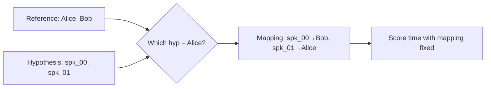
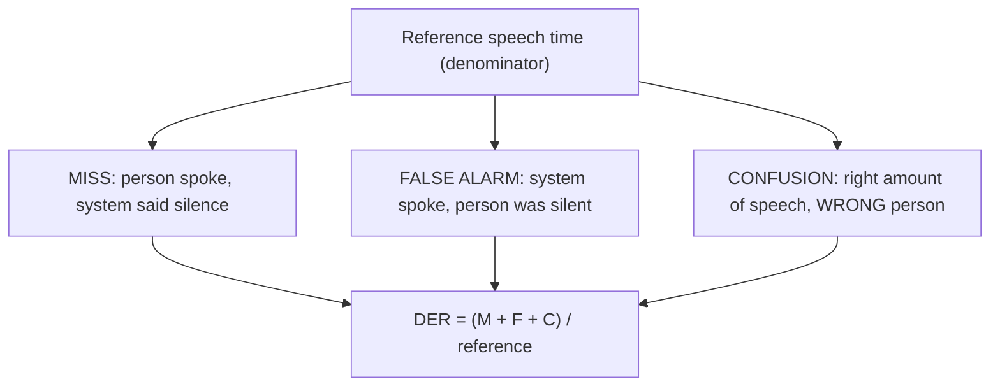
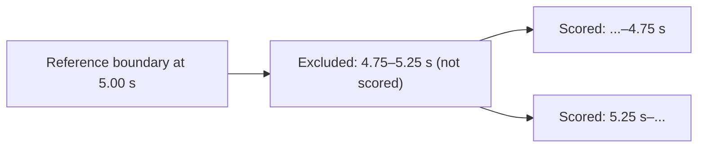
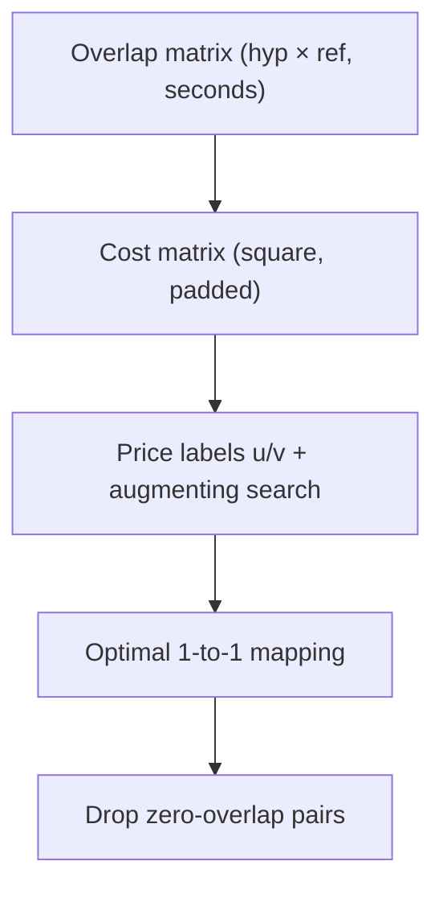
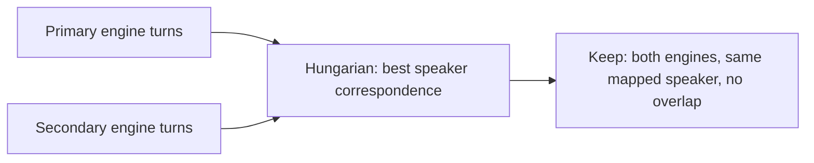

# 04. Evaluation: DER, JER, collars — and the Hungarian algorithm

[← Concepts Index](README.md) | [Main docs: 03 §4](../03_speaker_diarization.md) | [Code: `src/diarization/evaluation.py`](../../src/diarization/evaluation.py)

This is the guide for "how do we know the diarizer was right", including the
two questions you named: **Hungarian matching** and what the numbers mean.

## 1. The label problem: why matching comes first

Reference says `Alice 0–5 s`. Hypothesis says `spk_01 0–5 s`. Same speech, but
the IDs differ — diarizers invent anonymous labels. Before scoring, we must
decide *which hypothesis speaker corresponds to which real person*. That is an
**assignment problem**, solved here by the Hungarian algorithm (§4).

## 2. DER: three error buckets

**DER (Diarization Error Rate)** = (missed + false-alarm + confusion) ÷ total
reference speech time. Exact-interval (no sampling) in this repo.

**Worked example.** 100 s of reference speech. System misses 5 s, invents 3 s,
misattributes 7 s → DER = (5+3+7)/100 = **15%**.

- Miss hurts recall (TTS funnel: acceptable — discard more).
- False alarm hurts precision (TTS funnel: dangerous if it drags music in).
- Confusion is fatal for TTS (wrong voice in the clip).

**JER (Jaccard Error Rate)** = average *per-speaker* error: for each reference
person, `1 − intersection/union` of their time, then averaged. A system that
nails the 90 s host but loses the 10 s guest gets decent DER (~10%) but bad
JER (~50%+ on the guest). JER protects minority speakers.

## 3. Collars and skip-overlap: the forgiveness knobs

Human annotators disagree by ~100–250 ms on exact boundaries. A **collar**
(e.g. `collar_s=0.25`) excludes ±collar around every reference boundary from
scoring:

- `collar_s=0.0` (this repo's benchmark default): no forgiveness, strictest.
- `skip_overlap=True`: ignore regions where ≥2 reference speakers talk — fair
  when comparing against overlap-blind systems.

Published tables are only comparable when collar + overlap protocol match.
Pyannote community-1's card uses **0 s collar, overlap included**; Sortformer's
16.28 DIHARD3 number is a ≤4-speaker subset. See
`09_benchmarks_datasets.md`.

## 4. Hungarian matching: the mechanism

**Problem.** `H` hypothesis speakers × `R` reference speakers. Every pairing
`(h, r)` has a weight = seconds they overlap. Find the one-to-one mapping with
maximum total overlap.

**Why one-to-one?** Without it, two hypothesis tracks could both claim Alice
and double-count her time. The constraint forces an honest global choice.

**How the algorithm works (intuition).** This repo implements the classic
Kuhn–Munkres method (`_maximum_weight_assignment`): convert weights to costs
(`cost = max_weight − weight`, padded square with dummy zeros), then maintain
price labels (`u`, `v`) while growing an alternating matching until every row
is assigned. Complexity O(n³) — trivial for ≤4–10 speakers.

**Worked example.** Reference: Alice 0–10 s, Bob 10–20 s. Hypothesis: X covers
0–9 s + 10–12 s; Y covers 9–10 s + 12–20 s.

| pair | overlap |
|---|---|
| X–Alice | 9 s |
| X–Bob | 2 s |
| Y–Alice | 1 s |
| Y–Bob | 8 s |

Candidate mapping {X→Alice, Y→Bob} totals 17 s; {X→Bob, Y→Alice} totals 3 s.
Hungarian picks the 17 s mapping. Then: confusion = 3 s (X's 10–12 on Bob's
time mapped to Alice; Y's 9–10 on Alice's time mapped to Bob), miss/FA = 0,
DER = 3/20 = **15%**.

**Same trick, second job.** Zero-contamination Stage 2 reuses this exact
function to align *two diarizers'* speaker spaces before keeping only intervals
where both engines agree (`compute_consensus_turns`). Consensus and evaluation
are the same math applied to different pairs (hyp↔ref vs engine↔engine).

## 5. Reading this repo's output dict

`evaluate_diarization()` returns `der_pct`, `jer_pct`, `missed_speech_s`,
`false_alarm_s`, `speaker_confusion_s`, `correct_speaker_s`,
`speaker_mapping` (with per-pair `overlap_s`), `unmapped_hypothesis_speakers`,
and `per_speaker` rows (reference seconds, hypothesis seconds, intersection,
coverage %, JER %). Check `speaker_mapping` first when DER surprises you: a
wrong global mapping (common with symmetric co-hosts) looks like massive
confusion but means one swapped pair.

## Where to go next

- Fixing boundaries instead of just scoring them → `08_boundary_hygiene.md`.
- The vectors being clustered → `05_speaker_embeddings.md`.
- Benchmark tables done right → `09_benchmarks_datasets.md`.
