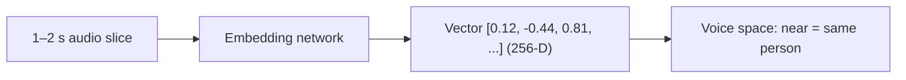
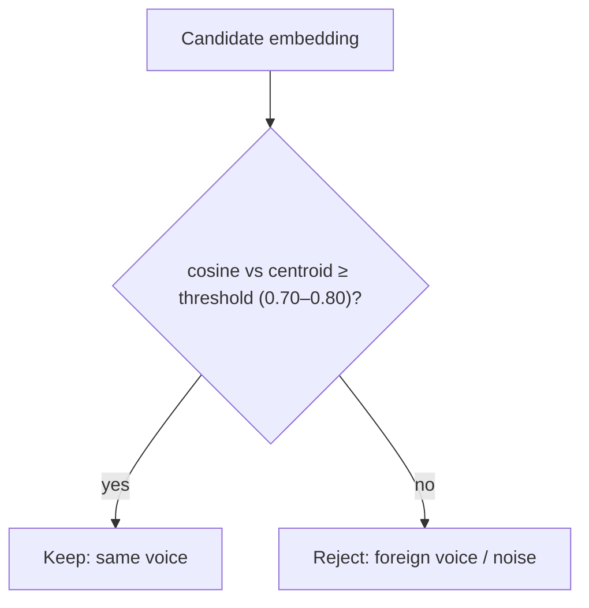
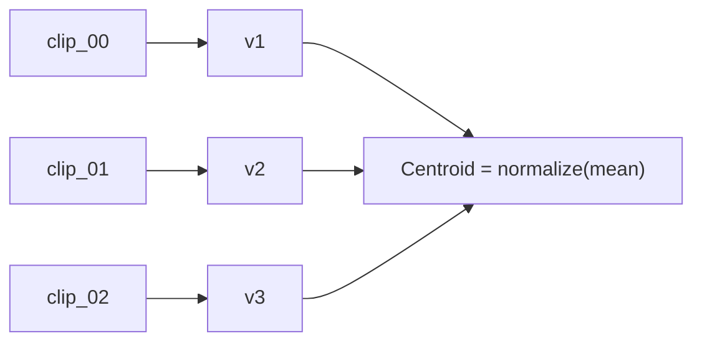
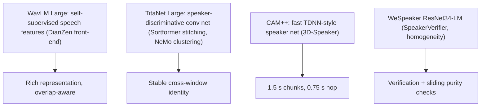
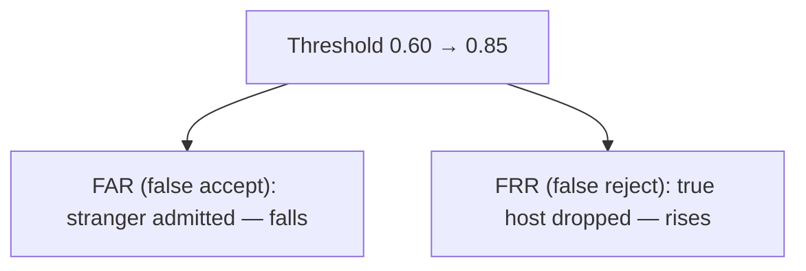
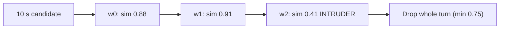

# 05. Speaker Embeddings ("voice fingerprints")

[← Concepts Index](README.md) | [Main docs: 03 §5](../03_speaker_diarization.md) | [Code: `src/diarization/SpeakerVerifier.py`](../../src/diarization/SpeakerVerifier.py)

An **embedding** is a fixed-length vector (here, 256 numbers) summarizing *how
a voice sounds* — timbre, pitch habits, resonance — while ignoring *what was
said*. Slices from the same person land near each other; different people land
far apart.



## 1. Cosine similarity: the only formula you need

Comparison uses the angle between vectors, ignoring loudness:

```text
sim(u, v) = (u·v) / (||u|| × ||v||)    range: -1 (opposite) .. +1 (identical)
```

**Worked example (2-D for intuition).** Enrolled host centroid `c = [1, 0]`.
Candidate A `[0.98, 0.20]` → sim ≈ 0.98 (keep). Candidate B `[0.2, 0.98]` →
sim ≈ 0.20 (reject). Real vectors have 256 dims, same idea.



## 2. Centroids: averaging a person

Enroll 3 clean clips → 3 vectors → **centroid** (mean, re-normalized). The
centroid is the profile; clips on disk stay the ground truth (profiles remain
model-independent because any future model re-embeds the same clips).



## 3. The four embedding networks in this repo



- **WavLM** learned by masking and predicting hidden speech units — general
  acoustic knowledge, fine-tuned into DiariZen's pipeline.
- **TitaNet / CAM++ / WeSpeaker** learned by speaker classification: same
  person must score high, different people low. Different speed/accuracy
  trade-offs; all output L2-normalized vectors so cosine is a dot product.

## 4. Thresholds: FAR vs FRR, the unavoidable trade



- `0.85`: near-identical timbre demanded. Zero leakage, but laughing /
  whispering / emotional host gets rejected.
- `0.60`: expressive range kept, but similar-pitch siblings/co-hosts leak in.
- Typical operating point here: **0.70–0.80**. TTS harvesting biases high
  (precision over recall).

Two guardrails around the threshold: `min_candidate_duration_s=1.5` (short
clips lack phonetic variety → unstable vectors, rejected as
`candidate_too_short`) and `max_overlap_duration_s=0.05` (any ≥50 ms clash
with another speaker's turn vetoes the candidate).

## 5. Sliding homogeneity: catching mid-turn handoffs

A 10 s turn can hide a 1 s intruder the diarizer missed. The homogeneity
filter slides 1.0 s windows (0.25 s hop), embeds each, and compares against
the turn's own centroid:



Any window below `min_homogeneity_similarity=0.75` kills the turn. Dense hops
catch 0.5 s intrusions; cost scales linearly with hop density.

## Where to go next

- Neural overlap judges beyond embeddings → `07_overlap_purity_models.md`.
- Boundary repair around kept turns → `08_boundary_hygiene.md`.
- Tuning numbers → `../08_model_parameters_and_tradeoffs.md` §4.
