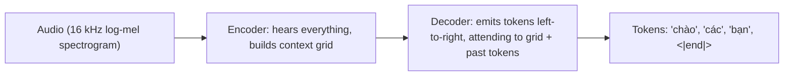
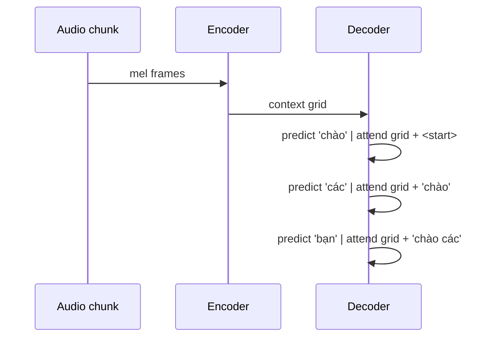
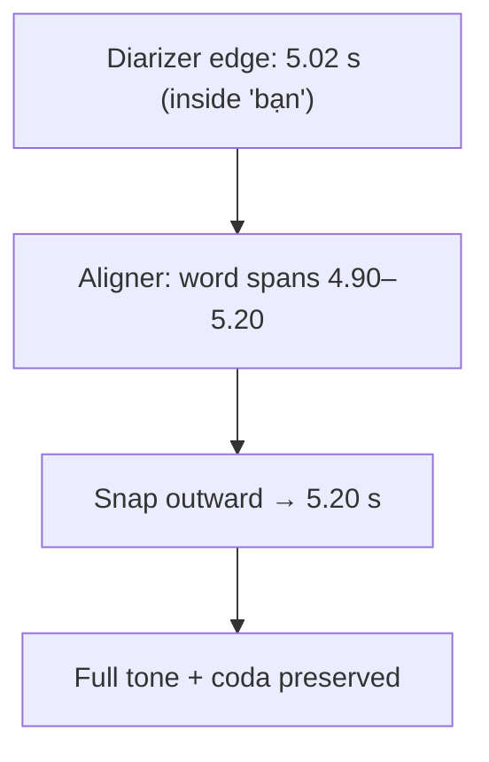
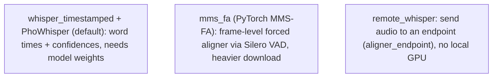
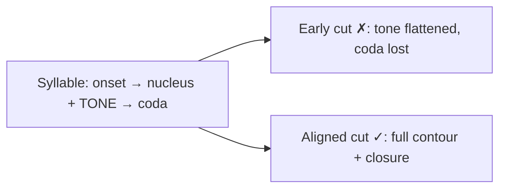

# 06. ASR & Forced Alignment (what words, exactly when)

[← Concepts Index](README.md) | [Main docs: 04 §Stage 3b](../04_zero_contamination_diarization.md) | [Code: `src/diarization/zero_contamination.py`](../../src/diarization/zero_contamination.py)

**ASR (Automatic Speech Recognition)** = audio → text. **Forced alignment** =
audio + known-or-hypothesized text → *timestamps per word/syllable*. The
zero-contamination pipeline needs the second: it snaps diarization boundaries
outward to syllable edges so cuts never slice a Vietnamese tone in half.

## 1. How modern ASR (Whisper family) works

Whisper is an **encoder-decoder transformer**:

- **Encoder** reads the whole ~30 s chunk into a rich representation.
- **Decoder** is **autoregressive**: each token is predicted from the audio
  grid *plus all previous tokens*. That memory is why it spells fluently — and
  why VibeVoice can emit *speaker* tokens from the same machinery (§see 07).
- **PhoWhisper** (`vinai/PhoWhisper-small`, the default aligner model here) is
  Whisper fine-tuned on Vietnamese: it knows tonal diacritics (`á` vs `à` vs
  `ã`), syllable structure, and local names.

## 2. Transcription vs alignment: what "alignment" means

- **Transcription:** "what was said?" → `chào các bạn` (no times).
- **Forced alignment:** "given these words, *when* was each spoken?" →
  `chào [1.60–1.95]`, `các [1.95–2.10]`, `bạn [2.10–2.45]`.

"Forced" because the text is taken as given and each word is *forced* onto the
audio timeline (via cross-attention weights or a dynamic-programming path).
`whisper_timestamped` (default `aligner_engine`) does this per word with
confidence scores; the pipeline then **snaps candidate boundaries outward** to
the nearest word edge.

**Worked example.** Diarizer proposes a turn ending at 5.02 s, mid-`bạn`
(`bạn: 4.90–5.20`). Cutting at 5.02 amputates the `-n` coda and the falling
tone. Alignment sees the word spans 4.90–5.20 → boundary moves to 5.20
(+ surrounding silence tail). Syllable saved; ≤100 ms silence admitted.

## 3. The three aligner engines

- Default path needs **Silero VAD** from Torch Hub; the module pre-trusts
  `snakers4/silero-vad` non-interactively and falls back to `vad=False` if the
  download fails (network-restricted machines still run, slightly less sharp).
- CUDA OOM during alignment clears VRAM and retries on CPU — slow but
  unblocked. `aligner_device="cpu"` skips the drama for short clips.

## 4. Why Vietnamese makes this non-optional

Vietnamese is **monosyllabic + tonal**: each syllable carries a tone contour,
and codas (`-p, -t, -k, -m, -n, -ng`) close late. Slicing 80 ms early:

- flattens `má` (mother) toward `mà` (but) — tone lives in the tail;
- drops `-k` in `các`, leaving `cá` (fish) — a different word.

That is why Stage 3 pairs alignment (snap to syllables) with the
context-aware collar (shave near handoffs, extend into silence) and energy
valley snapping (cut at acoustic zeros) — see `08_boundary_hygiene.md`.

## Where to go next

- The other Stage-3/5 judges → `08_boundary_hygiene.md`, `07_overlap_purity_models.md`.
- Config knobs (`aligner_engine/model/language/device`) → `../08_model_parameters_and_tradeoffs.md` §5.
