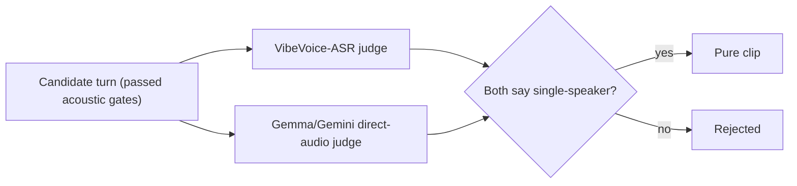
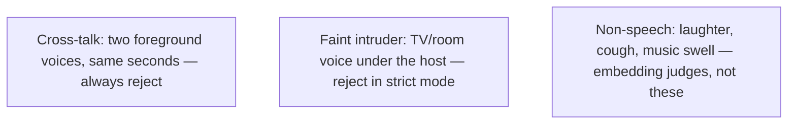
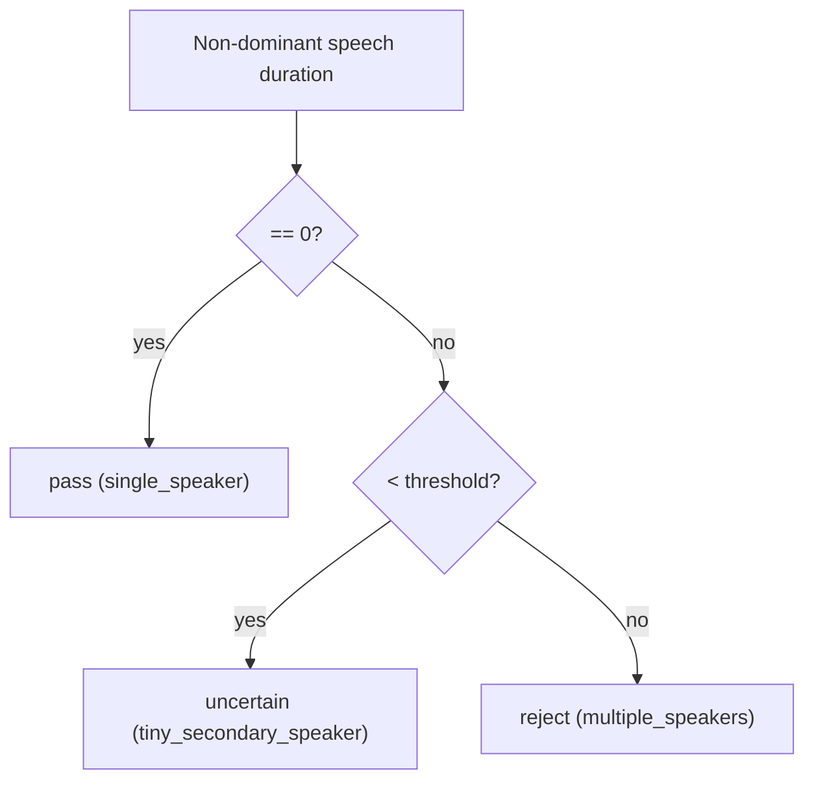
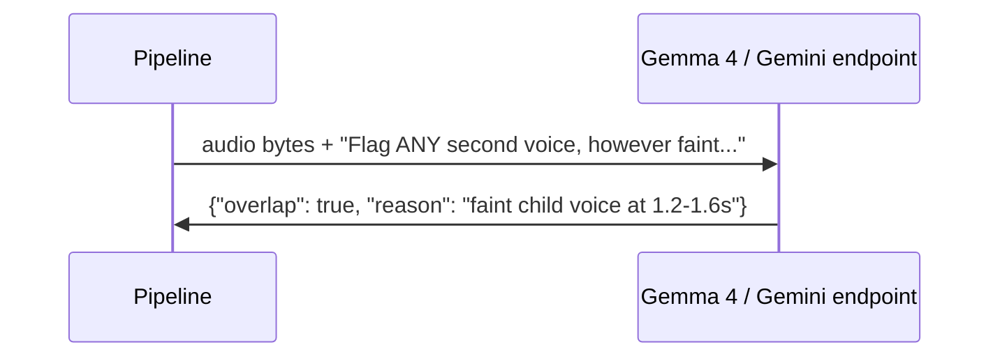

# 07. Overlap & Purity Models (is anyone else talking?)

[← Concepts Index](README.md) | [Main docs: 03 §6, 04 Stage 5](../03_speaker_diarization.md)

**Overlap** = ≥2 voices active in the same seconds. **Contamination** = overlap
inside a clip meant to be one pure voice. For TTS training even 50 ms of a
second voice teaches the voice-cloner the wrong timbre — so the funnel ends
with two *foundation-model* judges that re-listen to every surviving candidate.



## 1. What counts as overlap here



Diarizer overlap flags (`overlaps_other_speaker`) catch the obvious cases.
These two judges exist for what diarizers miss: faint background voices and
sub-second intrusions.

## 2. VibeVoice-ASR: the transcribing judge

`microsoft/VibeVoice-ASR-HF` is an autoregressive speech model like Whisper —
but its token stream includes **speaker tokens**: it narrates *who* speaks
*when* across the full clip, e.g.:

```text
[SPK0 0.00–3.20] chào các bạn ...
[SPK1 2.90–3.10] (faint) ừ ...
```

Decision rule (`min_secondary_speech_s`, default 0.25 s; pipeline Stage 5 uses
`max_secondary_speech_s=0.0` = zero tolerance):



**Worked example.** 4.0 s candidate; VibeVoice reports SPK1 for 0.30 s.
0.30 ≥ 0.25 → **reject**. With a lenient 0.60 threshold it would be
**uncertain** (human or downstream policy decides). Runs isolated in
`.venv-vibevoice` (`VibeVoicePurityWorkerVerifier`).

## 3. Gemma 4 / Gemini: the listening LLM judges

These send **raw audio + a text prompt** to a multimodal LLM (no transcript
middle-step) and demand structured JSON: `{"overlap": bool, "reason": str}`.



- **Gemma4OverlapVerifier:** OpenAI-compatible endpoint (default
  `http://localhost:8888/v1/chat/completions`, model
  `unsloth/gemma-4-12b-it-GGUF`).
- **GeminiOverlapVerifier:** Google Gemini 3.1 Pro / Flash-Lite with schema
  constrained JSON.
- **Prompt = sensitivity knob.** Strict (*"reject any faint secondary speaker,
  whisper, TV bleed"*) maximizes paranoia; lenient (*"only clear simultaneous
  foreground talk"*) tolerates room ambiance. Empirical, non-deterministic —
  same audio can flip between runs.

## 4. Failure policy: what if the judge is unreachable?

```mermaid
flowchart TD
    ERR["LLM timeout / HTTP 5xx"] --> POL{"failure_policy"}
    POL -->|fail_closed (default)| EXC["Exclude candidate (error) — data integrity first"]
    POL -->|fail_open| PASS["Keep candidate + log warning — robustness first"]
```

TTS harvesting defaults to `fail_closed`: a network glitch must never smuggle
a contaminated clip into the dataset.

## Where to go next

- Acoustic pre-filters before these judges → `05_speaker_embeddings.md`.
- Funnel order and attrition stats → `../04_zero_contamination_diarization.md`.
- Prompt/failure knobs → `../08_model_parameters_and_tradeoffs.md` §4.3.
