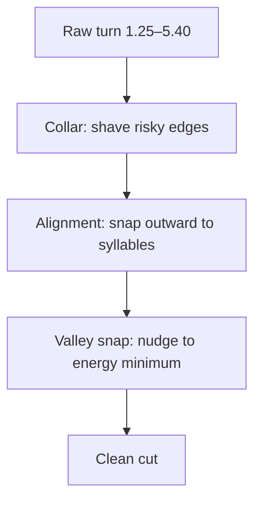
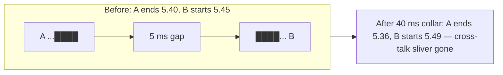
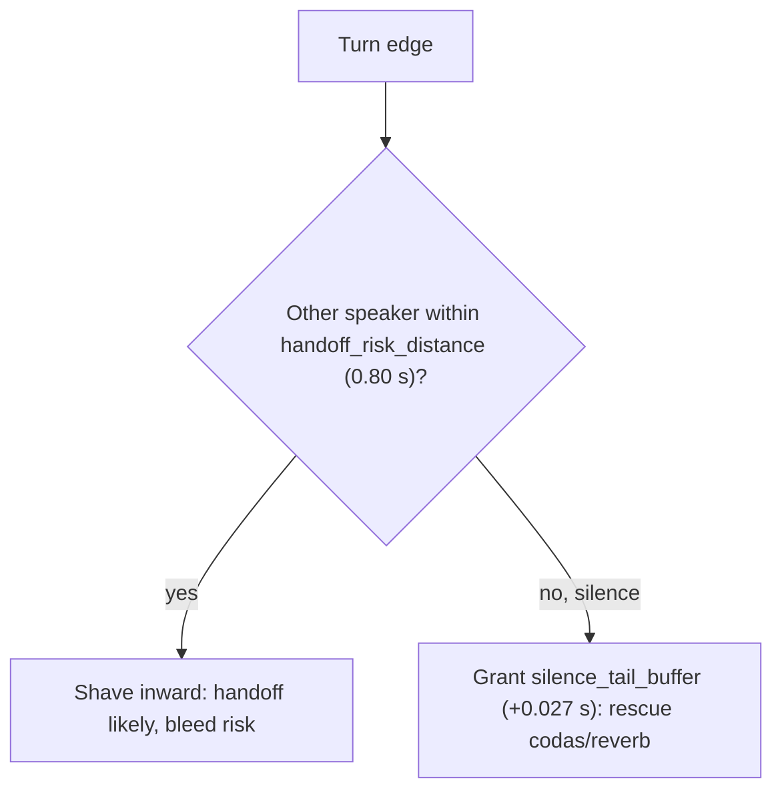
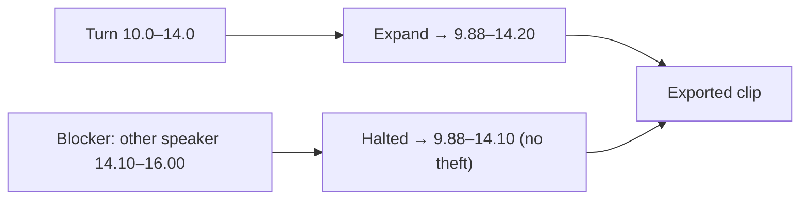
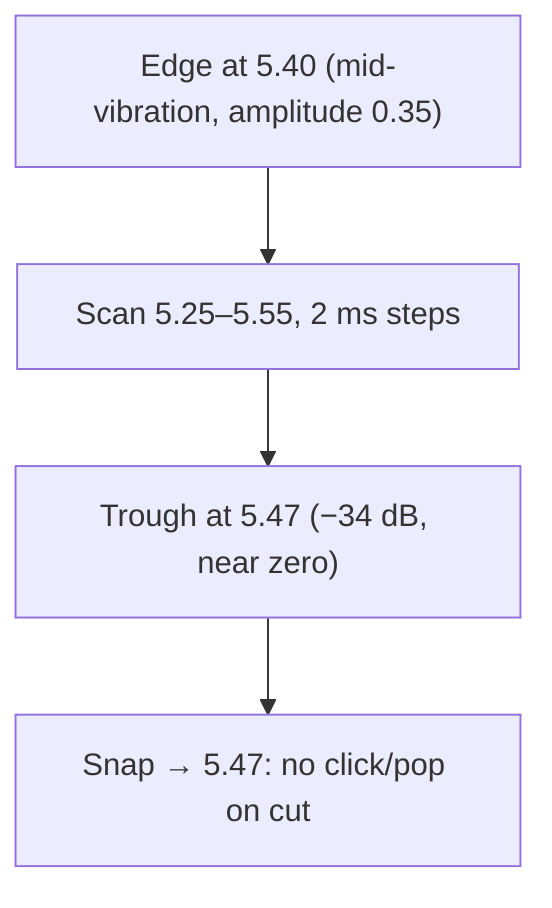
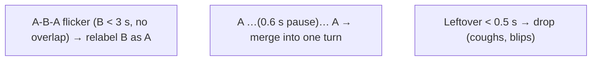

# 08. Boundary Hygiene (cutting without wounding syllables or leaking voices)

[← Concepts Index](README.md) | [Main docs: 03 §3, 04 Stage 3](../03_speaker_diarization.md)

Neural boundaries are approximate (±100–300 ms). Boundary hygiene is the set
of deterministic repairs that (a) shave risky edges near other speakers and
(b) extend or nudge edges to land on silence, syllable ends, and acoustic
zeros.

## 1. Collars: safety margins

A **collar** shaves time inward from a boundary. Two moods:

- **Evaluation collar** (scoring forgiveness, see `04_...`): *ignore* ±collar
  around reference edges when computing DER.
- **Erosion collar** (pipeline action): *delete* ±collar from the turn itself
  (`boundary_collar_s=0.35` in zero-contamination vs 0.04 in light cleanup).

## 2. Context-aware collar: shave near people, extend into silence

`apply_context_aware_collar` looks at *what surrounds* the edge:

**Worked example.** Turn ends 5.40; next speaker starts 5.70 (0.30 < 0.80) →
shave to ~5.05. Same turn ending into 3 s of silence → extend to 5.55, keeping
the `-ng` resonance. Vietnamese codas survive exactly because of the second
branch.

## 3. Pre/post-roll with blockers (cutting for export)

When slicing WAVs, `pad_and_merge_intervals` expands by `pre_roll/post_roll`
to keep natural attack/decay — but expansion **halts at blocker intervals**
(neighboring other-speaker turns) when `stop_at_other_speakers=True`:

Reverb preserved; neighbor's voice never stolen.

## 4. Energy-valley snapping: cut where the air is still

`snap_boundaries_to_acoustic_valleys` scans ±150 ms (`energy_search_window_s`)
with 2 ms hops, measuring local energy, and moves the edge to the quietest
trough below −30 dB (`energy_valley_floor_db`) — a vocal-fold closure /
zero-crossing:

Cutting at a vibration peak leaves a discontinuity the ear hears as a click;
cutting at zero is inaudible. Guaranteed local-minimum search; whether a click
*was* audible is empirical.

## 5. Jitter, merging, dropping (light cleanup)

`clean_speaker_turns` (defaults: `min_turn_duration_s=0.5`,
`merge_same_speaker_gap_s=1.0`, `boundary_collar_s=0.04`,
`jitter_max_duration_s=3.0`):

Order matters: de-jitter → trim collars → merge gaps → drop shorts. The result
is a *derived view*; raw canonical turns are never mutated.

## Where to go next

- Syllable-aware snapping → `06_asr_forced_alignment.md`.
- Parameter directions → `../08_model_parameters_and_tradeoffs.md` §3, §5.
