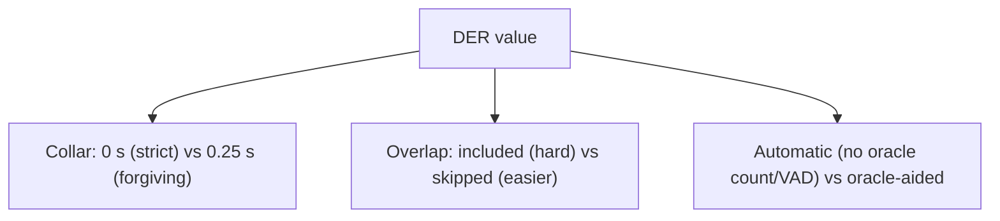
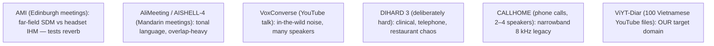
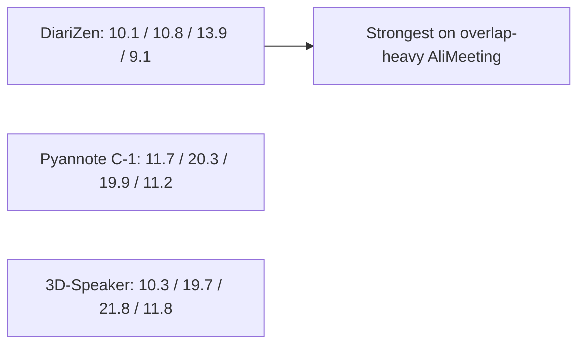
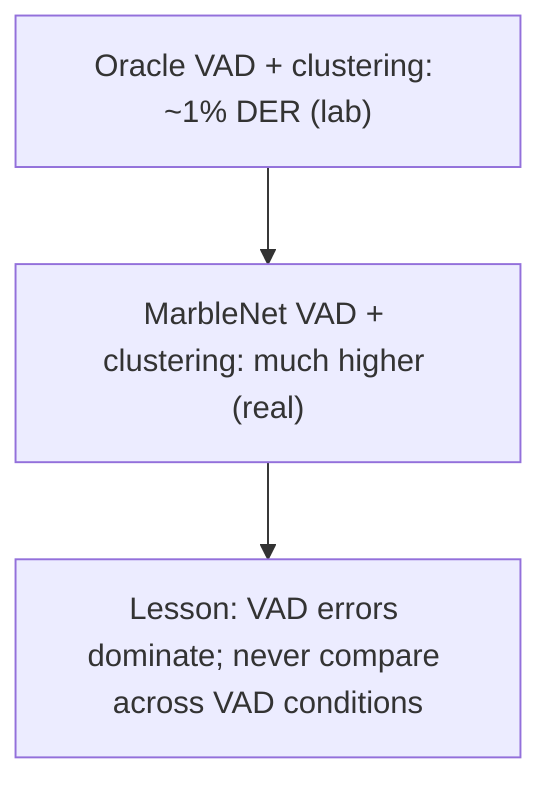

# 09. Benchmarks & Datasets (reading DER tables without fooling yourself)

[← Concepts Index](README.md) | [Main docs: benchmarks](../bench-paper-diarize.md) | [Mixing](../05_benchmark_and_mixing.md)

A DER number is meaningless without its **protocol** (collar? overlap scored?)
and its **dataset** (meeting room? YouTube? Vietnamese?). This guide teaches
both.

## 1. The protocol triple

Rule: only compare rows that share all three. Pyannote community-1's card
(0 s collar, overlap included, fully automatic) vs Sortformer's DIHARD3-Eval
≤4-speaker subset is **not** apples-to-apples — the subset restriction alone
removes the hardest files.

## 2. Dataset personalities

| Dataset | What stresses | Why it matters here |
|---|---|---|
| AMI SDM / IHM | Distant mics vs headsets | Ingest is YouTube-compressed, closer to SDM |
| AliMeeting / AISHELL-4 | Overlap + tonal speech | Closest public proxy for Vietnamese talk shows |
| VoxConverse | Wild acoustics, speaker count | Tests `max_speakers` discipline |
| DIHARD 3 | Everything adversarial | General robustness ceiling |
| CALLHOME | Telephone band | Mostly legacy; less relevant to 16–44.1 kHz YouTube |
| ViYT-Diar | Vietnamese YouTube, manual labels | The benchmark to run next — no public checkpoint has a verified number |

## 3. The three-way picture (shared protocol)

On the four common sets (lower = better), DiariZen v2 leads, 3D-Speaker and
Pyannote trade blows:

Sets: AISHELL-4 / AliMeeting / AMI SDM / VoxConverse. Full table with sources
→ `../bench-paper-diarize.md`.

## 4. Why the clustering row is blank (a lesson in oracle vs real)

NeMo publishes stellar TitaNet-clustering DER (~1% on AMI Lapel) — but with
**oracle VAD** (perfect speech boundaries handed to the clusterer). This repo
runs **MarbleNet-predicted VAD**, whose errors are the dominant term. Copying
oracle numbers into our table would be dishonest; the blank row *is* the
correct documentation.

## 5. Separation benchmarks are mixtures, not datasets

`AudioMixer` *manufactures* tests: clean speech + music at calibrated SMRs
(`[-5, 0, 5, 10]` dB) with explicitly seeded music crops (e.g. `seed=42` →
bit-exact reruns; `seed` is a required argument, no default).
Harder SMR = lower vocals SDR expected. See `01_audio_fundamentals.md` §4 for
the dB math.

## Where to go next

- Scoring mechanics → `04_evaluation_der_jer_hungarian.md`.
- Running mixes → `../05_benchmark_and_mixing.md`.
