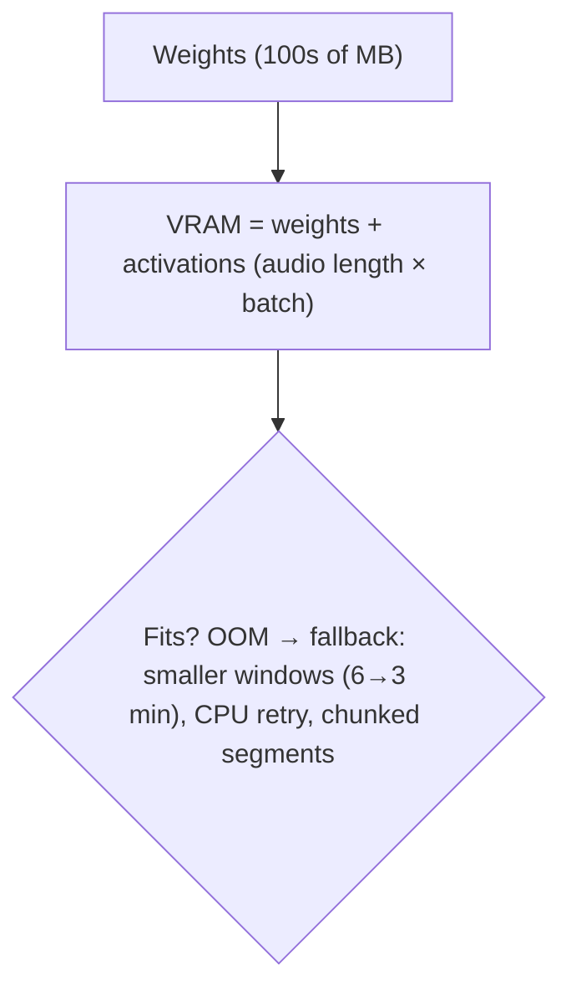
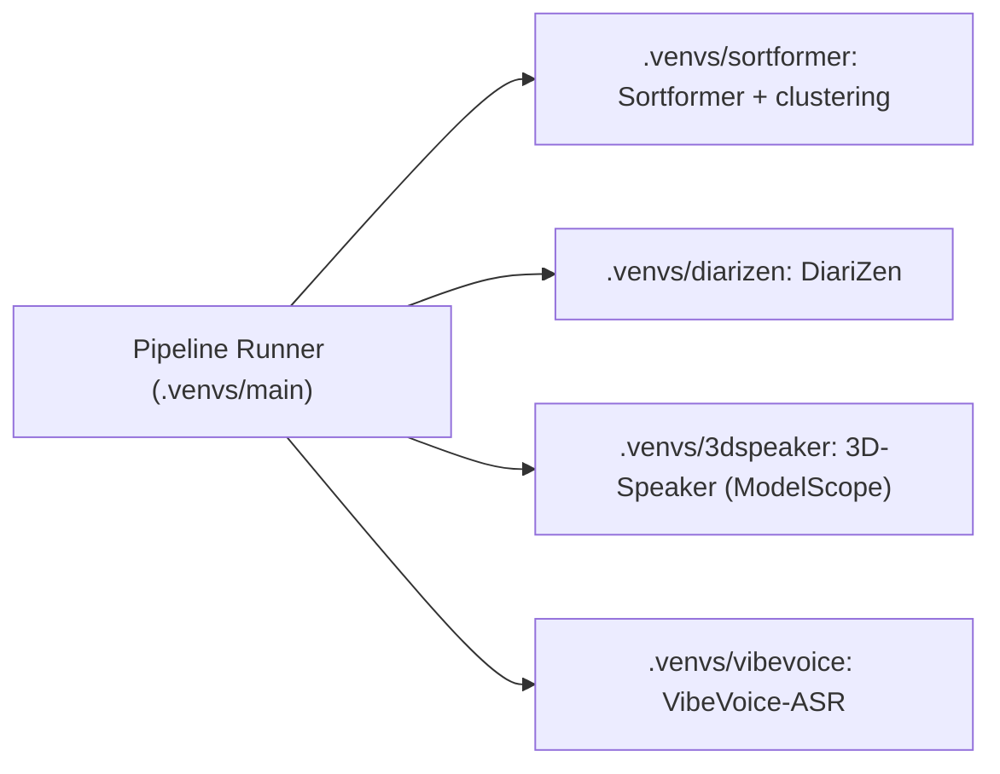
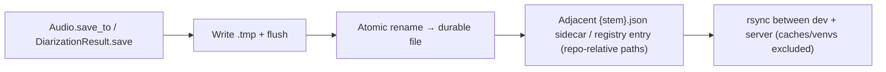

# 10. Infrastructure (models, GPUs, queues — the backstage)

[← Concepts Index](README.md) | [Main docs: 02 lifecycle](../02_source_separation.md)

Speech models are heavy (GBs of weights, GBs of VRAM). This guide explains the
machinery that keeps them from colliding.

## 1. ManagedModel: explicit load/unload

```mermaid
stateDiagram-v2
    [*] --> Unloaded: __init__ (light, no weights)
    Unloaded --> Loaded: load() / with model:
    Loaded --> Loaded: separate/diarize/score (repeat OK)
    Loaded --> Unloaded: unload() / exit with (gc + empty_cache)
```

`load()` runs `_load()` once (no-op if loaded); `unload()` runs `_unload()`
once (no-op if unloaded) — cache clearing (`gc.collect()` /
`torch.cuda.empty_cache()`) lives in the `_unload()` of backends that need it
(e.g. `SpeakerVerifier`), not in the base class. Separators' `close()`
delegates to `unload()`.
Rule: never hold two giant models on one GPU unless you measured it.

## 2. VRAM and OOM



Long-file defenses in this repo: 10-min separation chunks
(`max_segment_seconds=600`), 6-min diarization windows with 1-min overlap,
alignment CPU retry.

## 3. Worker isolation: why isolated virtualenvs?

NeMo pins Lightning/HF-Hub versions that fight DiariZen, 3D-Speaker, and
VibeVoice. Solution: one venv per quarrelsome family, spoken to via
subprocess launchers:



`CUDA_VISIBLE_DEVICES`, `HIP_VISIBLE_DEVICES`, and `ROCR_VISIBLE_DEVICES` pin each child to its GPU (`cuda:0` vs `cuda:1`), so
primary/secondary consensus engines truly run in parallel across NVIDIA and AMD ROCm architectures.
On setup, `envs/setup_worker_envs.sh` automatically reconciles any existing worker environments to match the host hardware.

## 4. Persistence that survives sync



Repo-relative paths (`.data/...`) keep both machines working; atomic renames
prevent half-written JSON on crash; sidecars rehydrate `Audio.from_file()`.

## Where to go next

- Lifecycle API → `../02_source_separation.md` §3.
- Hardware configuration → `../09_amd_gpu_compatibility.md`.
- Schemas → `../07_data_contracts.md`.
