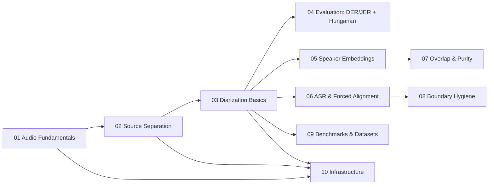

# Speech-Domain Concepts — Start Here

[← Docs Index](../README.md)

You are new to speech/audio. Read this folder in order. Each guide answers
three questions: **what is it (intuition)**, **a tiny worked example**, and
**how this repo uses it** (with a pointer into `01_`–`08_`).

## Reading order

| # | Guide | You will learn | Main docs pointer |
|---|---|---|---|
| 01 | [Audio Fundamentals](01_audio_fundamentals.md) | Sample rate, Nyquist, channels, WAV/PCM, RMS, dB/dBFS, SMR, resampling, clipping | `01_audio_and_ingestion.md` |
| 02 | [Source Separation](02_source_separation.md) | Stems, masks, STFT + overlap-add, Demucs, RoFormer, MDX, SDR, ensemble/overlap/chunking | `02_source_separation.md` |
| 03 | [Diarization Basics](03_diarization_basics.md) | VAD, segmentation, embeddings, clustering, enrollment, overlap, turns | `03_speaker_diarization.md` |
| 04 | [Evaluation: DER/JER + Hungarian](04_evaluation_der_jer_hungarian.md) | Miss/FA/confusion, DER/JER math, collar, skip-overlap, Hungarian matching with a worked example | `03_speaker_diarization.md`, `08_model_parameters_and_tradeoffs.md` |
| 05 | [Speaker Embeddings](05_speaker_embeddings.md) | Vectors, cosine similarity with numbers, centroids, WeSpeaker/TitaNet/CAM++/WavLM, thresholds, homogeneity | `03_speaker_diarization.md` |
| 06 | [ASR & Forced Alignment](06_asr_forced_alignment.md) | How Whisper works, PhoWhisper, transcription vs alignment, MMS-FA, why syllable locks matter for Vietnamese | `04_zero_contamination_diarization.md` |
| 07 | [Overlap & Purity Models](07_overlap_purity_models.md) | What contamination is, VibeVoice speaker tokens, Gemma/Gemini direct-audio checks, fail-closed vs fail-open | `03_speaker_diarization.md`, `04_zero_contamination_diarization.md` |
| 08 | [Boundary Hygiene](08_boundary_hygiene.md) | Collars, context-aware shaving, pre/post-roll blockers, energy valleys, jitter, gap merging | `03_speaker_diarization.md`, `04_zero_contamination_diarization.md` |
| 09 | [Benchmarks & Datasets](09_benchmarks_datasets.md) | How to read DER tables, collar protocol, what each dataset tests, why ViYT-Diar matters | `bench-paper-diarize.md`, `05_benchmark_and_mixing.md` |
| 10 | [Infrastructure](10_infrastructure.md) | ManagedModel, VRAM/OOM, worker venvs, per-device queues, SSE/telemetry, sidecars | `02_source_separation.md`, `06_web_applications.md`, `07_data_contracts.md` |

## How these guides stay regression-free

- They are **additive only**: `01_`–`08_`, `api_contract.md`, and
  `data_contract.md` remain the canonical API/contract references.
- Concept guides never redefine a method signature or schema; they link to it.
- Where code defaults are quoted (e.g. `AudioMixer(channels=2,
  peak_ceiling_dbfs=-1.0)`), they match the source file, not memory.
