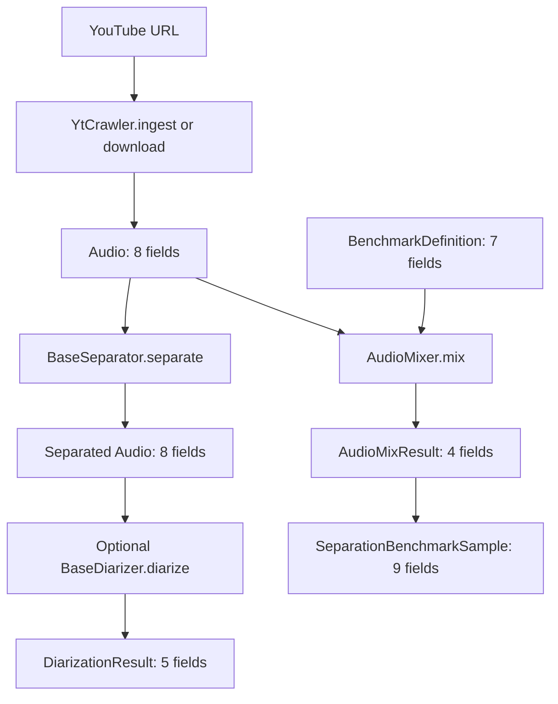

# Data contract



This document describes the object returned by each implemented pipeline step.
A **field count** means the number of declared fields on the returned class. For
nested fields such as `list[SpeakerTurn]`, the list is one field on the parent
class; the fields of the item class are documented separately.

## Important scope note

The repository does not currently contain one orchestration class that chains
all steps together. The operational flow below is inferred from the public
interfaces and from `src/notebooks/pipeline1.ipynb`:

```text
YouTube URL
    -> YtCrawler.download()/ingest()
    -> Audio
    -> BaseSeparator.separate()
    -> Audio
    -> optional BaseDiarizer.diarize()
    -> DiarizationResult
```

The separation benchmark is a related flow:

```text
BenchmarkDefinition + speech Audio + music Audio
    -> AudioMixer.mix()
    -> AudioMixResult
    -> SeparationBenchmarkSample (when assembled by a caller)
```

## 1. Ingest/download audio

### Method

- `YtCrawler.ingest(...) -> Audio`
- `YtCrawler.download(...) -> Audio`

### Return class: `src.utils.AudioClass.Audio`

**Field count: 8**

| Field | Type | Meaning |
|---|---|---|
| `path` | `Path` | Resolved path to the downloaded or referenced audio file. |
| `source_id` | `str` | Stable source identifier, normally the YouTube ID. |
| `title` | `str \| None` | Source title, when available. |
| `sample_rate` | `int \| None` | Current file sample rate in Hz. The crawler normalizes this to its configured rate (default 44,100 Hz) and probes WAV output. |
| `duration_s` | `float \| None` | Duration in seconds. |
| `channels` | `int \| None` | Number of audio channels. |
| `format` | `str` | File format/extension without the leading dot, normally `wav`. |
| `native_sample_rate` | `int \| None` | Original source rate before pipeline resampling (yt-dlp `asr` or pre-normalize WAV). Downstream models compare this and `sample_rate` with their expected rate to decide whether to upscale, downscale, or keep the file. |

The crawler returns a fully populated `Audio` instance. Its default
configuration targets WAV, 44,100 Hz, and mono, but the configured values are
the contract for a particular crawler instance. Call `audio.metadata(target_sample_rate=...)`
or `audio.resample_action(target_sample_rate)` to get the resample decision.

## 2. Load an existing audio file

### Method

- `Audio.from_file(...) -> Audio`

### Return class

`src.utils.AudioClass.Audio` — **8 fields**, exactly the same fields listed in
Step 1.

For WAV files, `sample_rate`, `duration_s`, and `channels` are probed from the
file. `native_sample_rate` defaults to that probed rate unless the caller
passes the original source rate. For non-WAV files, those values retain the
class defaults unless the caller supplies another construction path.

## 3. Source separation

### Method

- `BaseSeparator.separate(audio: Audio) -> Audio`

The following concrete implementations use this same return contract:

- `HTDemucs.separate(...)`
- `BSRoFormer.separate(...)`
- `MelRoFormer.separate(...)`
- `MVSepMDX23.separate(...)`

### Return class: `src.utils.AudioClass.Audio`

**Field count: 8**

| Field | Return behavior |
|---|---|
| `path` | Path to the normalized separated output WAV. |
| `source_id` | Preserved from the input `Audio`. |
| `title` | Preserved from the input `Audio`. |
| `sample_rate` | Probed from the separated output. |
| `duration_s` | Probed from the separated output. |
| `channels` | Probed from the separated output. |
| `format` | Set to `"wav"` by the concrete separator implementations. |
| `native_sample_rate` | Preserved from the input `Audio`. |

The model backend is not exposed as a field on the returned object. Backend
configuration remains on the separator instance (`model`, `device`, output
paths, and similar settings).

## 4. Speaker diarization

### Method

- `BaseDiarizer.diarize(audio: Audio) -> DiarizationResult`
- Implementations: `PyannoteDiarizer.diarize(...)` and `SortformerDiarizer.diarize(...)`

### Return class: `src.diarization.schemas.DiarizationResult`

**Field count: 5**

| Field | Type | Meaning |
|---|---|---|
| `schema_version` | `str` | Version of the serialized/result schema. Current value: `"1.0"`. |
| `audio_id` | `str` | The input audio's `source_id`. |
| `speakers` | `list[Speaker]` | Unique speakers found in this diarization result. |
| `turns` | `list[SpeakerTurn]` | Time intervals assigned to speakers. |
| `model` | `DiarizationModelInfo \| None` | Backend/model metadata. Both current implementations populate it. |

### Nested class: `Speaker`

**Field count: 2**

| Field | Type | Meaning |
|---|---|---|
| `speaker_id` | `str` | Result-local identifier such as `spk_00`. |
| `global_speaker_id` | `str \| None` | Optional identifier that can link this speaker across results. |

### Nested class: `SpeakerTurn`

**Field count: 4**

| Field | Type | Meaning |
|---|---|---|
| `speaker_id` | `str` | Must match a `speaker_id` declared in `DiarizationResult.speakers`. |
| `start_s` | `float` | Inclusive/start time in seconds. |
| `end_s` | `float` | End time in seconds; must be greater than `start_s`. |
| `confidence` | `float \| None` | Confidence from 0 to 1, when supplied. Pyannote and Sortformer currently return `None`. |

Sortformer keeps this schema unchanged. Its four speaker channels are local to
one inference window; overlap activity and speaker embeddings map those channels
to result-level `speaker_id` values. Consequently, `speakers` may contain more
than four records for a long recording, while any individual six-minute window
can represent at most four distinct speakers. Overlapping `SpeakerTurn` records
remain valid and are preserved.

The schema does not expose window duration, overlap, post-processing thresholds,
or speaker-similarity thresholds. Those are backend configuration rather than
schema 1.0 fields, so callers that require exact run reproducibility must persist
the `SortformerDiarizer` configuration separately.

### Nested class: `DiarizationModelInfo`

**Field count: 3**

| Field | Type | Meaning |
|---|---|---|
| `backend` | `str` | Backend name: `"pyannote"` or `"nemo-sortformer"`. |
| `model_id` | `str` | Model identifier used by the backend. Sortformer defaults to `"nvidia/diar_sortformer_4spk-v1"`. |
| `revision` | `str \| None` | Optional model revision. Sortformer records its pinned Hugging Face revision. |

## 5. Benchmark planning

### Class: `src.benchmark.separation.schemas.BenchmarkDefinition`

`BenchmarkDefinition` is currently an input/planning schema rather than the
return type of an implemented pipeline method.

**Field count: 7**

| Field | Type | Meaning |
|---|---|---|
| `sample_id` | `str` | Benchmark sample identifier. |
| `speech_path` | `str` | Path to the speech source. |
| `music_path` | `str` | Path to the music source. |
| `music_category` | `MusicCategory` | Music category for stratification. |
| `difficulty` | `Difficulty` | Planned sample difficulty. |
| `target_smr_db` | `float` | Target speech-to-music ratio in dB. |
| `seed` | `int` | Seed for deterministic mixing. |

### Enum values

These enums have no instance fields; they are constrained values:

- `MusicCategory`: `acoustic`, `orchestral`, `traditional`
- `Difficulty`: `easy`, `medium`, `hard`

## 6. Benchmark mixing

### Method

- `AudioMixer.mix(speech: Audio, music: Audio, ...) -> AudioMixResult`

### Return class: `src.benchmark.separation.schemas.AudioMixResult`

**Field count: 4**

| Field | Type | Meaning |
|---|---|---|
| `speech_reference` | `Audio` | Speech waveform after any common output gain. |
| `music_reference` | `Audio` | Cropped/looped and gain-adjusted music waveform. |
| `mixture` | `Audio` | Sum of the speech and music references. |
| `parameters` | `MixingParameters` | Parameters and realized values needed to reproduce the mix. |

Each of the three audio fields is an `Audio` object with **8 fields** as
defined in Step 1. The mixer writes three WAV files before constructing the
returned `AudioMixResult`:

- `speech_reference.wav`
- `music_reference.wav`
- `mixture.wav`

### Nested class: `MixingParameters`

**Field count: 13**

| Field | Type | Meaning |
|---|---|---|
| `target_smr_db` | `float` | Requested speech-to-music ratio in dB. |
| `sample_rate` | `int` | Mixer output sample rate. |
| `channels` | `int` | Mixer output channel count. |
| `seed` | `int` | Seed used for deterministic music selection. |
| `music_start_sample` | `int` | Starting sample selected from the music source. |
| `speech_gain_db` | `float` | Gain applied to speech before output gain. |
| `music_gain_db` | `float` | Gain applied to music before output gain. |
| `common_output_gain_db` | `float` | Gain applied to all components to stay below the peak ceiling. |
| `peak_ceiling_dbfs` | `float` | Maximum allowed peak level in dBFS. |
| `mixer_version` | `str` | Mixer implementation version. Current value: `"2"`. |
| `speech_lufs_before` | `float \| None` | Speech LUFS before mixing, currently not populated. |
| `music_lufs_before` | `float \| None` | Music LUFS before mixing, currently not populated. |
| `realized_rms_smr_db` | `float \| None` | Ratio realized by the rendered references. |

## 7. Fully assembled separation benchmark sample

### Class: `src.benchmark.separation.schemas.SeparationBenchmarkSample`

There is currently no assembly method in the repository that returns this
class. It is the intended combined record after source audio, mixed audio, and
benchmark metadata have been collected.

**Field count: 9**

| Field | Type | Meaning |
|---|---|---|
| `sample_id` | `str` | Benchmark sample identifier. |
| `speech_source` | `Audio` | Original speech input. |
| `music_source` | `Audio` | Original music input. |
| `speech_reference` | `Audio` | Rendered speech component. |
| `music_reference` | `Audio` | Rendered music component. |
| `mixture` | `Audio` | Rendered mixture. |
| `music_category` | `MusicCategory` | Music category. |
| `difficulty` | `Difficulty` | Sample difficulty. |
| `mixing` | `MixingParameters` | Reproducibility metadata for the mix. |

## Non-data-returning/helper steps

These methods are part of the implementation but do not return a contract
class:

| Method | Return shape | Notes |
|---|---|---|
| `YtCrawler.build_command(...)` | `list[str]` | Command-line arguments for `yt-dlp`. |
| `ManagedModel.load()` / `unload()` | `None` | Model/session lifecycle operations. |
| `ManagedModel.__enter__()` | `ManagedModel` | Context-manager handle, not an audio result. |
| Separator `_separate_stem(...)` methods | `Path` | Internal path to an intermediate model output. |
| Separator `_prepare_input(...)` methods | `Path` or `tuple[Path, Path]` | Internal working-file paths. |
| `Audio.save_to(...)` | `Audio` | Returns the same `Audio` object after mutating its `path`. |
| `Audio.quick_save(...)` | `Audio` | Prints destination path and returns the same `Audio` object after mutating its `path`. |
| `Audio.show_mel_spectrogram(...)` | `None` | Display/visualization side effect only. |
| `Audio.notebook_display(...)` | `None` | Interactive notebook playback side effect only. |

## Contract summary

| Step | Public return type | Top-level field count |
|---|---|---:|
| Ingest/download | `Audio` | 7 |
| Load file | `Audio` | 7 |
| Any source separator | `Audio` | 7 |
| Diarization | `DiarizationResult` | 5 |
| Benchmark definition | `BenchmarkDefinition` | 7 |
| Benchmark mixing | `AudioMixResult` | 4 |
| Fully assembled benchmark sample | `SeparationBenchmarkSample` | 9 |
