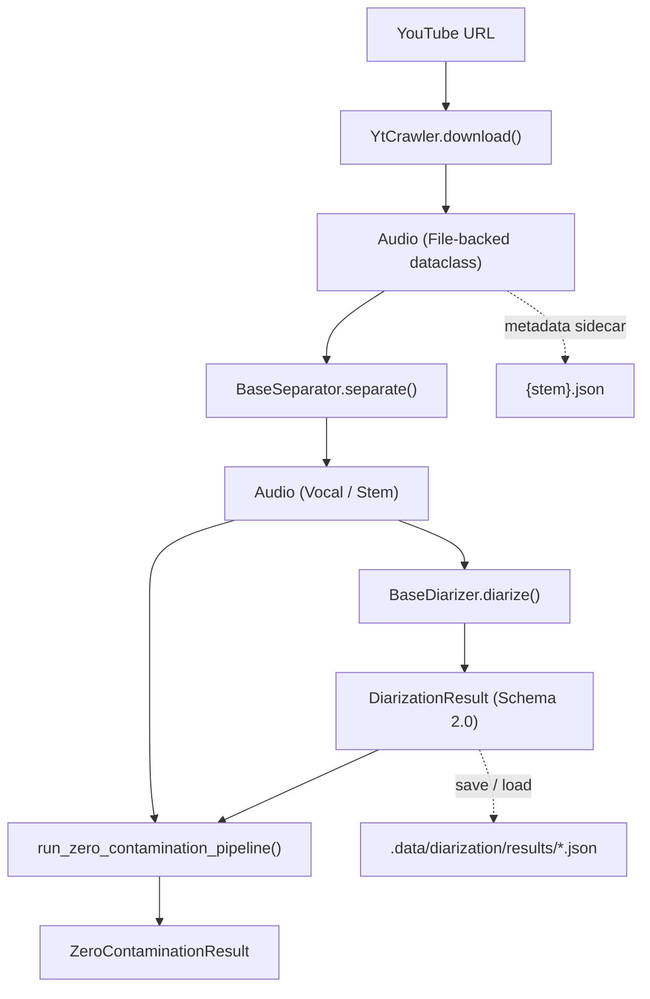

# Data Contract (Master Gateway)

[← Docs Index](README.md) | [API Contract Gateway →](api_contract.md) | [Full Schema Reference →](07_data_contracts.md)

---

This document outlines the core field-level contracts, serialized schemas, and persistence models across the pipeline. For exhaustive class definitions and JSON examples, see [**07. Data Contracts & Serialization Schemas**](07_data_contracts.md).

---

## 📑 Master Schema Index

| Schema / Class | Defined In | Primary Role |
|---|---|---|
| [**`Audio`**](01_audio_and_ingestion.md#1-the-audio-dataclass) | `src/utils/AudioClass.py` | File-backed audio representation preserving identity (`source_id`, channel metadata, sampling rates) across all derived files. |
| [**`DiarizationResult`**](07_data_contracts.md#2-diarization-schemas-schema-20) | `src/diarization/schemas.py` | Universal schema 2.0 diarization result containing `Speaker` and `SpeakerTurn` records, validation rules, and atomic persistence. |
| [**`SpeakerTurn`**](07_data_contracts.md#speakerturn) | `src/diarization/schemas.py` | Granular speech interval with `start_s`, `end_s`, `speaker_id`, confidence, and overlap evidence. |
| [**`SpeakerProfile`**](07_data_contracts.md#4-speaker-profile-schema-speakerprofile) | `src/diarization/SpeakerVerifier.py` | Globally reusable known-speaker enrollment identity anchored by reference audio clips (`profile.json` `schema_version="2.0"`, `clips` filename list). |
| [**`SpeakerPurityResult`**](07_data_contracts.md#speakerpurityresult-embedding-purity) | `src/diarization/schemas.py` | Acoustic embedding sliding-window purity verification decision. |
| [**`VibeVoicePurityResult`**](07_data_contracts.md#vibevoicepurityresult-foundation-asr-purity) | `src/diarization/VibeVoicePurityVerifier.py` | Autoregressive ASR single- vs multi-speaker verification decision. |
| [**`OverlapVerificationResult`**](07_data_contracts.md#overlapverificationresult-multimodal-llm-purity) | `src/diarization/OverlapVerifier.py` | Multimodal direct-audio overlap classification result (`overlap: bool`, `reason: str`) as a `TypedDict`. |
| [**`ZeroContaminationResult`**](04_zero_contamination_diarization.md#5-result-schema-zerocontaminationresult) | `src/diarization/zero_contamination.py` | High-precision single-speaker harvesting result with full audit trail and attrition funnel stats. |
| [**`AudioMixResult`**](05_benchmark_and_mixing.md#2-benchmark-dataclasses) | `src/benchmark/separation/schemas.py` | Benchmark mixture container pairing clean speech, background music, and calibrated mixture. |
| [**`AudioItem`**](07_data_contracts.md#7-pipeline-audioitem-schema) | `src/web_pipeline/dataset_manager.py` | Batch pipeline dataset registry record with system and custom tags. |

---

## 🏛️ Invariants & Persistence Rules

1. **File-Backed State:** Memory waveforms are never persisted across public interfaces. File paths are repository-relative (e.g. `.data/mvsep_mdx23/out/...`) to support cross-machine rsync portability.
2. **Atomic Writes:** All durable JSON files (`DiarizationResult.save()`, annotations, and sidecars) write to a temporary file before an atomic POSIX rename, preventing corruption from unexpected interruptions.
3. **Identity Preservation:** Transformations preserve `source_id`, `title`, and `native_sample_rate` from the initial ingest.
4. **Sidecar Conventions:** Companion `{stem}.json` sidecars live directly adjacent to audio files to maintain metadata persistence.
5. **Runtime Data Root:** All dynamic downloads, stems, cuts, and results are written under `.data/` (gitignored).

👉 *For full JSON schemas, property tables, and synchronization specs, see [**07. Data Contracts & Serialization Schemas**](07_data_contracts.md).*
